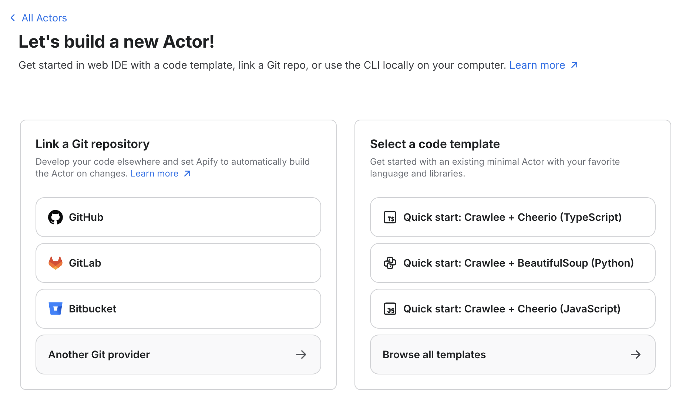
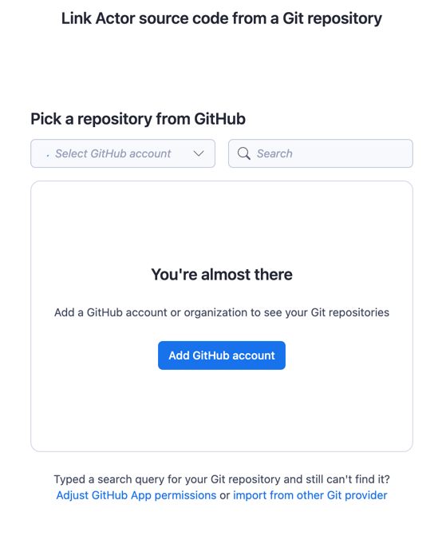
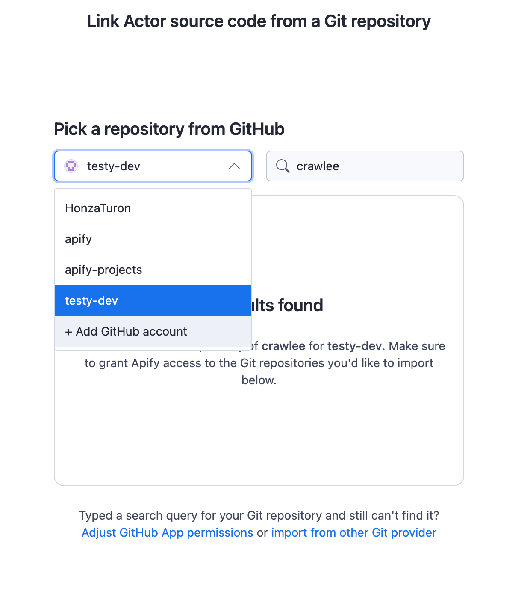
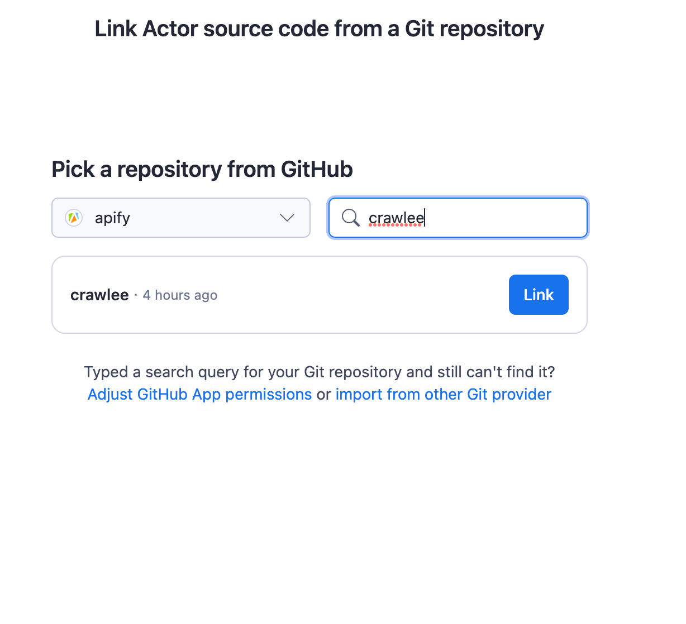

With the Apify integration for [GitHub](https://github.com/), you can create an Actor from a public or private repository, rebuild it automatically on every push, and trigger workflows in your repo when an Actor run fails, succeeds, or times out. To run automated tests and multi-branch builds with GitHub Actions, see [Continuous integration for Actors](/platform/actors/development/deployment/continuous-integration).

## Create an Actor from a GitHub repository

Follow these steps to build a new Actor from code hosted on GitHub.

### Prerequisites

To use the GitHub integration, you need:

- An [Apify account](https://console.apify.com/).
- A GitHub account with access to the repository you want to link.

### Step 1: Open the new Actor page

In [Apify Console](https://console.apify.com/actors), go to **Actors** and click **Develop new**.



### Step 2: Connect your GitHub account

Under **Link a Git repository**, click **GitHub**. Follow the prompts on github.com to authorize Apify. You can grant access to your personal account, an organization, or specific repositories.



To switch between authorized users and organizations, use the account dropdown.



### Step 3: Select a repository

Pick the repository you want to link. If you don't see it, use the **Search** field to find it by name.



Apify creates the Actor as soon as you select a repository, links its source to the repository, and uses the default branch unless you change it in the Actor's **Source** settings.

:::tip Private repositories

For private repositories, configure a [deployment key](/platform/actors/development/deployment/source-types#private-repositories) so Apify can clone the code.

:::

## Build automatically on every push

After you link an Actor to a GitHub repository, add a webhook in GitHub to trigger a new build on every push:

1. In Apify Console, open the Actor's **API** dropdown and select **API endpoints**. Copy the **Build Actor** endpoint URL. It has this format:

    ```text
    https://api.apify.com/v2/acts/YOUR-ACTOR-NAME/builds?token=YOUR-TOKEN&version=0.0&tag=latest&waitForFinish=60
    ```

    :::note API token

    Select the correct API token in the dropdown before copying the URL.

    :::

1. In the GitHub repository, go to **Settings > Webhooks > Add webhook**.
1. Paste the URL into **Payload URL**, set **Content type** to `application/json`, and save.

Every push to the repository now triggers a build of the linked Actor version.

For automated tests and multi-branch workflows (for example, separate `latest` and `beta` tags), follow the [Continuous integration for Actors](/platform/actors/development/deployment/continuous-integration) guide.

## Create a GitHub issue when an Actor run fails

Use an Apify webhook to call the GitHub REST API and open an issue in your repository whenever an Actor run finishes with the `FAILED` status. This lets you triage failures in the same place you track other work.

### Prerequisites

- An Apify Actor you can run.
- A GitHub repository where the issues are created.
- A [GitHub fine-grained personal access token](https://github.com/settings/personal-access-tokens) with **Issues: Read and write** permission scoped to the target repository.

### Step 1: Generate a GitHub personal access token

1. In GitHub, open **Settings > Developer settings > Personal access tokens > Fine-grained tokens** and click **Generate new token**.
1. Set **Repository access** to **Only select repositories** and pick the repository where you want issues to be created.
1. Under **Repository permissions**, set **Issues** to **Read and write**.
1. Generate the token and copy it. You'll paste it into the webhook headers in Step 3.

:::warning Treat the token as a secret

Anyone with this token can create issues in the selected repository. Don't commit it or share it in screenshots.

:::

### Step 2: Add a webhook on the Actor

1. In Apify Console, open the Actor and go to the **Integrations** tab.

    

1. Under **Connect with Apify**, click **HTTP webhook**.
1. Configure the webhook:
    - **Event types**: select `Run failed` (`ACTOR.RUN.FAILED`).
    - **URL**: `https://api.github.com/repos/OWNER/REPO/issues`, replacing `OWNER` and `REPO` with your repository details.

### Step 3: Set the headers and payload

In the same webhook form, configure the request that GitHub expects.

Set **Headers template** to authenticate with the personal access token and specify which GitHub API version to use:

```json
{
    "Authorization": "Bearer YOUR_GITHUB_TOKEN",
    "Accept": "application/vnd.github+json",
    "X-GitHub-Api-Version": "2022-11-28"
}
```

Enable **Interpolate variables in string fields**, then set **Payload template** so the issue title and body include the failed run details:

```json
{
    "title": "Actor run {{resource.id}} failed",
    "body": "Actor [{{resource.actId}}](https://console.apify.com/actors/{{resource.actId}}) finished with status `{{resource.status}}`.\n\nRun: https://console.apify.com/actors/{{resource.actId}}/runs/{{resource.id}}\nStarted: {{resource.startedAt}}\nFinished: {{resource.finishedAt}}\nExit code: {{resource.exitCode}}",
    "labels": ["actor-failure"]
}
```

For the full list of variables you can use, see [Webhook actions](/platform/integrations/webhooks/actions#available-variables).

### Step 4: Save and test the webhook

1. Click **Save** to add the webhook.
1. Click **Test** to send a sample payload to the GitHub API. Verify a new issue appears in the repository.
1. Trigger a real failure (for example, run the Actor with input that you know will cause a failure) and confirm an issue is created.

If the test fails, check the webhook **Dispatches** log for the response from GitHub. Common causes are an expired token, missing repository permissions, or a typo in the repository path.

## Resources

- [Source types for Actors](/platform/actors/development/deployment/source-types) - Configure the Git URL, branch, and monorepo paths.
- [Continuous integration for Actors](/platform/actors/development/deployment/continuous-integration) - Run tests and trigger builds with GitHub Actions.
- [Webhook events](/platform/integrations/webhooks/events) and [actions](/platform/integrations/webhooks/actions) - Reference for available events and the payload template.
