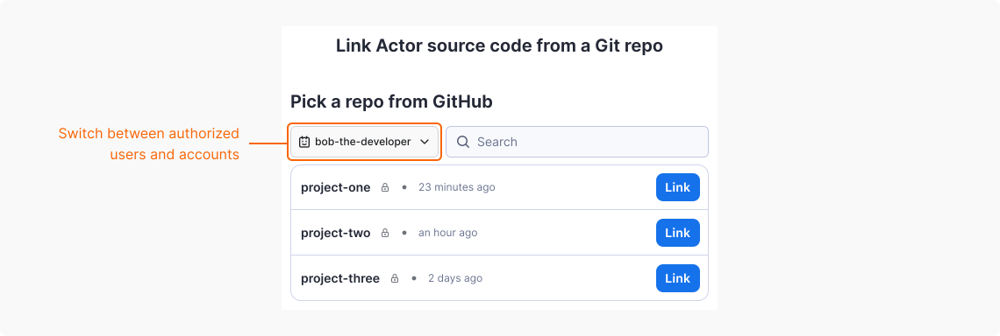
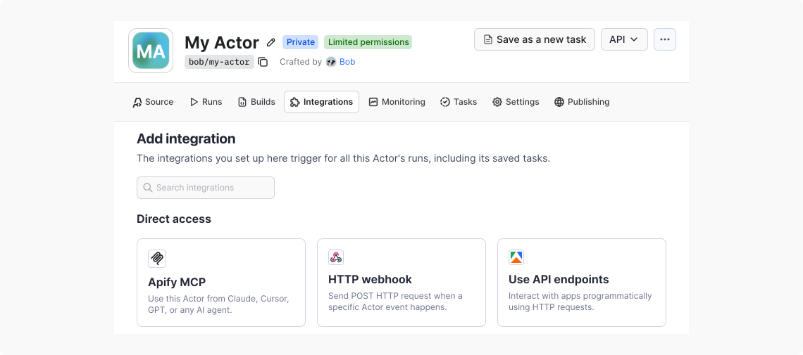

With the Apify integration for [GitHub](https://github.com/), you can create an Actor from a public or private repository, rebuild it automatically on every push, and trigger workflows in your repo when an Actor run fails, succeeds, or times out.

To run automated tests and multi-branch builds with GitHub Actions, see [Continuous integration for Actors](/actors/development/deployment/continuous-integration).

## Create an Actor from a GitHub repository

During the Actor creation process, you can either let Apify create a repository or link an existing one.

### Before you start

To use the GitHub integration, you need:

- An [Apify account](https://console.apify.com/).
- A GitHub account with access to the repository you want to link, or permission to create repositories in the target organization.

### Create a repository from a template

To create a repository from a template using Apify Console:

1. Log in to [Apify Console](https://console.apify.com/actors).
1. In the left-side panel, go to **Development** > **My Actors**.
1. Select **Develop new**, then **Get started**.
1. Choose the project type, preferred language, and an Actor template.
1. In the **Where do you want to host your code?** step, select **GitHub**. Follow the prompts on github.com to authorize Apify. You can grant access to your personal account, an organization, or specific repositories.
1. Choose the organization that owns the new repository, enter a repository name, and select **Create Actor**.

Once done, Apify creates a private GitHub repository with the boilerplate code and links the Actor's source to that repository.

### Link an existing repository

To link your new Actor with an existing GitHub repository:

1. Log in to [Apify Console](https://console.apify.com/actors).
1. In the left-side panel, go to **Development** > **My Actors**.
1. Select **Develop new**, then **Connect Git**.
1. In the **Select Git provider** step, select **GitHub**. Follow the prompts on github.com to authorize Apify. You can grant access to your personal account, an organization, or specific repositories.
1. In the **Pick a repo from GitHub** step, choose the repository:

     - To switch between authorized users and organizations, use the dropdown.
     - To find a repository by name, use the **Search** field.

    


Apify creates the Actor as soon as you select a repository, then links its source to the repository, and uses the default branch. For how to switch to a different branch, see [Git repository](/actors/development/deployment/source-types#git-repository).

:::tip Private repositories

For private repositories, configure a [deployment key](/actors/development/deployment/source-types#private-repositories) so Apify can clone the code.

:::

## Build automatically on every push

When you create an Actor from a GitHub repository, Apify registers a push webhook on the repository. As a result, every push to the repository rebuilds your Actor.

For details and configuration options, see [Automated builds](/actors/development/deployment/continuous-integration#automatic-builds).

### Trigger builds with a webhook

There are cases when you can't use automated builds, for example:

- Your repository is on GitHub Enterprise Server.
- Your organization doesn't allow the Apify GitHub App.

In such situation, to build your Actor automatically on every push, manually add a webhook in GitHub that calls the [Build Actor](/api/v2/actors-builds-post) API endpoint:

1. In Apify Console, go to the Actor you want to configure.
1. Select **API** and from the dropdown, select **API endpoints**.
1. Copy the **Build Actor** endpoint URL in the following format:

    ```text
    https://api.apify.com/v2/actors/YOUR-ACTOR-NAME/builds?token=YOUR-TOKEN&version=0.0&tag=latest&waitForFinish=60
    ```

    :::note API token

    Select the correct API token in the dropdown before copying the URL.

    :::

1. In your GitHub repository, go to **Settings > Webhooks > Add webhook**.
1. Paste the endpoint URL into **Payload URL** and set **Content type** to `application/json`.

Once you save your changes, every push to the repository triggers a build of the linked Actor version.

For automated tests and multi-branch workflows, such as separate `latest` and `beta` tags, see [Continuous integration for Actors](/actors/development/deployment/continuous-integration).

## Create a GitHub issue when an Actor run fails

Use an Apify webhook to call the GitHub REST API and open an issue in your repository whenever an Actor run finishes with the `FAILED` status. This approach lets you triage failures in the same place you track other work.

### Before you start

To automatically create issues when an Actor run fails, you need:

- An Apify Actor you can run.
- A GitHub repository where the issues are created.
- A [GitHub fine-grained personal access token](https://github.com/settings/personal-access-tokens) with **Issues: Read and write** permission scoped to the target repository.

### 1. Generate a GitHub personal access token

1. In GitHub, open **Settings > Developer settings > Personal access tokens > Fine-grained tokens** and click **Generate new token**.
1. Set **Repository access** to **Only select repositories** and pick the repository where you want issues to be created.
1. Under **Repository permissions**, set **Issues** to **Read and write**.
1. Generate the token and copy it. You'll paste it into the webhook headers in Step 3.

:::warning Treat the token as a secret

Anyone with this token can create issues in the selected repository. Don't commit it or share it in screenshots.

:::

### 2. Add a webhook on the Actor

1. In Apify Console, open the Actor and go to the **Integrations** tab.

    

1. Under **Connect with Apify**, click **HTTP webhook**.
1. Configure the webhook:
    - **Event types**: select `Run failed` (`ACTOR.RUN.FAILED`).
    - **URL**: `https://api.github.com/repos/OWNER/REPO/issues`, replacing `OWNER` and `REPO` with your repository details.

### 3. Set the headers and payload

In the same webhook form, configure the request that GitHub expects.

Set **Headers template** to authenticate with the personal access token and specify which GitHub API version to use:

```json
{
    "Authorization": "Bearer YOUR_GITHUB_TOKEN",
    "Accept": "application/vnd.github+json",
    "X-GitHub-Api-Version": "2022-11-28"
}
```

Enable **Interpolate variables in string fields**, then set **Payload template** so the issue title and body include the failed run details:

```json
{
    "title": "Actor run {{resource.id}} failed",
    "body": "Actor [{{resource.actId}}](https://console.apify.com/actors/{{resource.actId}}) finished with status `{{resource.status}}`.\n\nRun: https://console.apify.com/actors/{{resource.actId}}/runs/{{resource.id}}\nStarted: {{resource.startedAt}}\nFinished: {{resource.finishedAt}}\nExit code: {{resource.exitCode}}",
    "labels": ["actor-failure"]
}
```

For the full list of variables you can use, see [Webhook actions](/integrations/webhooks/actions#available-variables).

### 4. Save and test the webhook

1. Click **Save** to add the webhook.
1. Click **Test** to send a sample payload to the GitHub API. Verify a new issue appears in the repository.
1. Trigger a real failure (for example, run the Actor with input that you know will cause a failure) and confirm an issue is created.

If the test fails, check the webhook **Dispatches** log for the response from GitHub. Common causes are an expired token, missing repository permissions, or a typo in the repository path.

## Resources

- [Source types for Actors](/actors/development/deployment/source-types) - Configure the Git URL, branch, and monorepo paths.
- [Continuous integration for Actors](/actors/development/deployment/continuous-integration) - Run tests and trigger builds with GitHub Actions.
- [Webhook events](/integrations/webhooks/events) and [actions](/integrations/webhooks/actions) - Reference for available events and the payload template.
