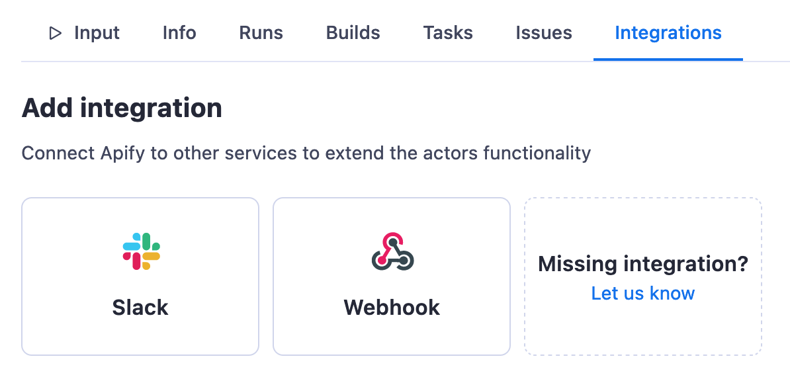
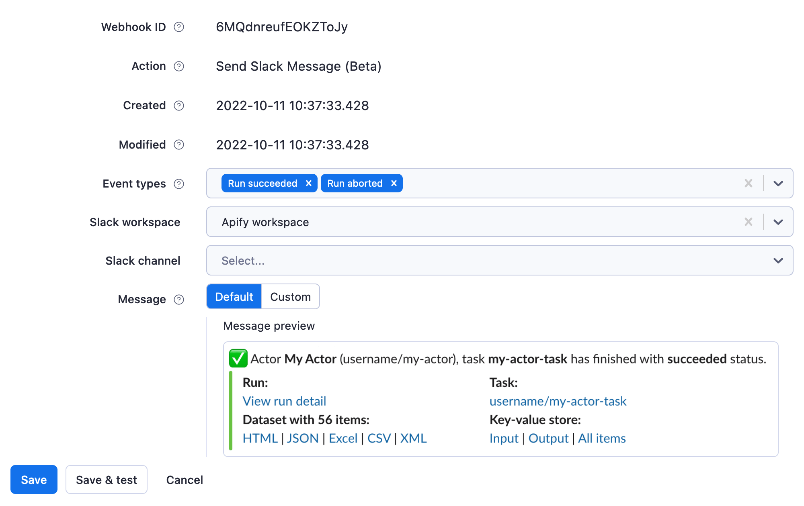
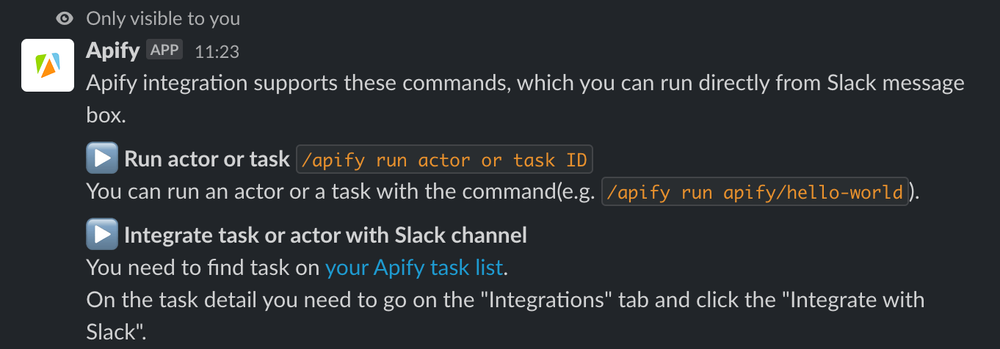

# Slack integration

**Learn how to integrate your Apify actors with Slack. This article guides you from installation through to automating your whole workflow in Slack.**

```
TODO: Looks good, maybe I’d just change the steps - it’s not a series of steps in this case, but rather 2 different tasks that you can do with slack
```

Tutorial can be found [here](https://help.apify.com/en/articles/6454058-apify-integration-for-slack).
---


[Slack](https://slack.com/) allows you to install various services in your workspace in order to automate and centralize jobs. Apify is one of these services, and it allows you to run your Apify actors, be notified about their run status, and get your results, all without opening your browser.

## Get started

To use the Apify integration for Slack, you will need:

- An [Apify account](https://console.apify.com/).
- A Slack account (and workspace).

## Step 1: Set up the Slack integration {#step-one}

You can find all integrations on an actor's or task's **Integrations** tab. For example, you can try using the [Google Shopping Scraper](https://console.apify.com/actors/aLTexEuCetoJNL9bL).

Find the Slack integration, then click the **Configure** button. You will be prompted to log in with your Slack account and select your workspace in the **Settings > Integrations** window.



Then, head back to your task to finish the setup. Select what type of events you would like to be notified of (e.g., when a run is created, when a run succeeds, when a run fails, etc.), your workspace, and the channel you want to receive the notifications in (you can set up an ad-hoc channel for this test). In the **Message** field, you can see how the notification will look, or you can craft a new custom one.



Once you are done, click the **Save** button.

## Step 2: Give the Apify integration a trial run! {#step-two}

Click the **Start** button and head to the Slack channel you selected to see your first Apify integration notifications.

## Step 3: Start your run directly from Slack {#step-three}

You can now run the same actor or task directly from Slack by typing `/apify call [actor/task name]` into the Slack message box.



When an actor doesn’t require you to fill in any input fields, you can run it by simply typing `/apify call [actor/task name]`.

You’re all set! If you have any questions or need help, feel free to reach out to us on our [Discord channel](https://discord.com/invite/jyEM2PRvMU).
