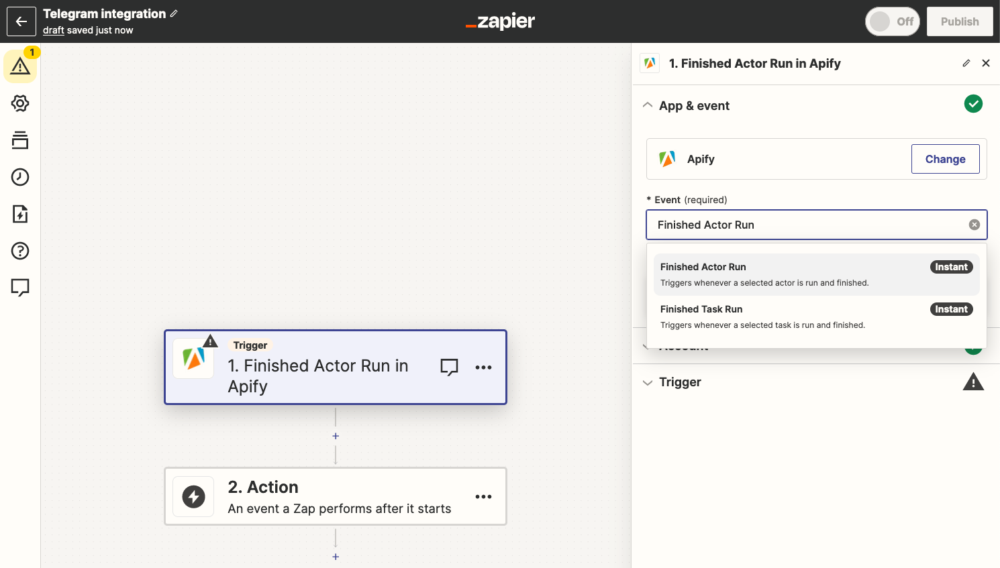
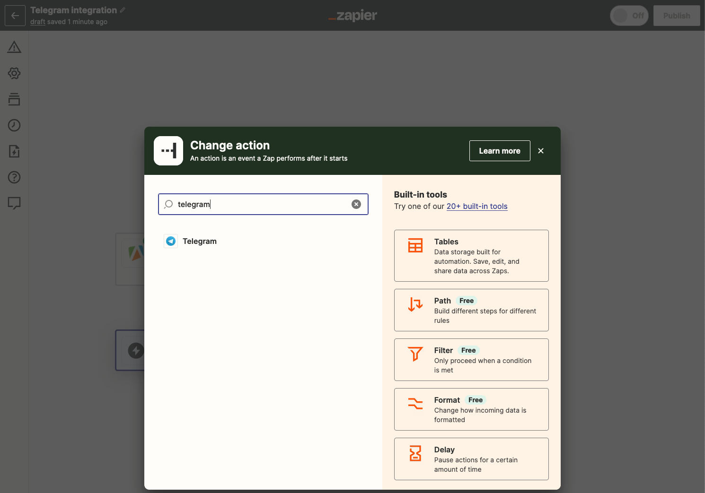
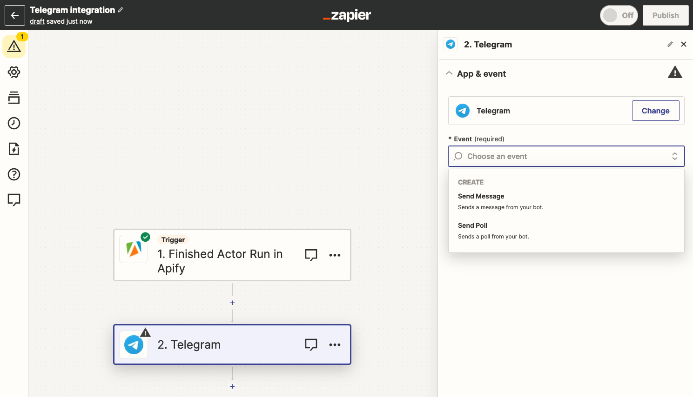
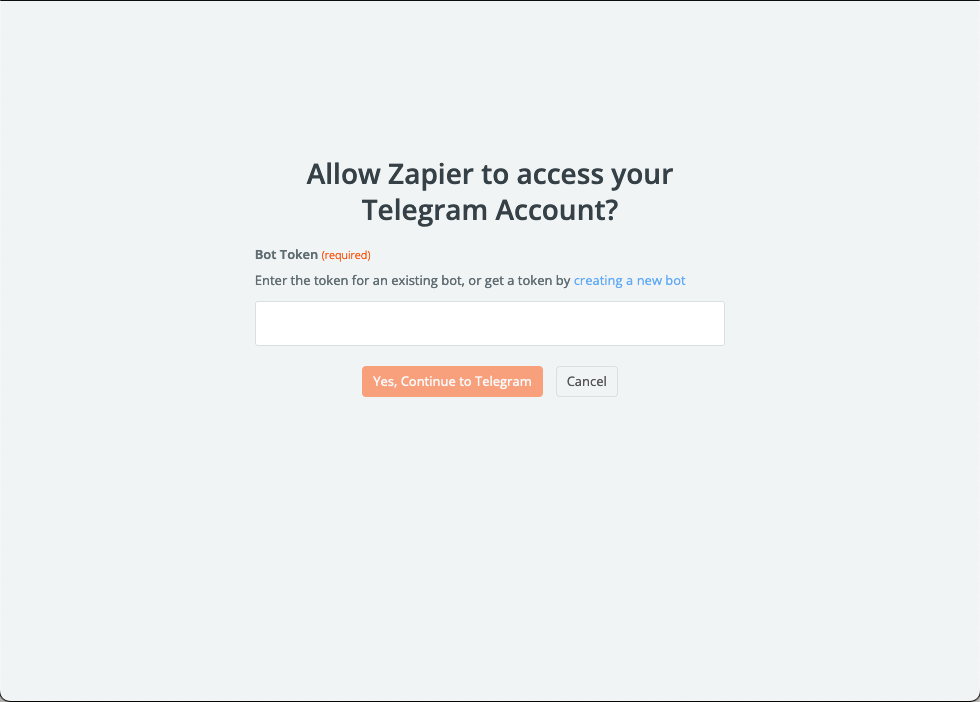
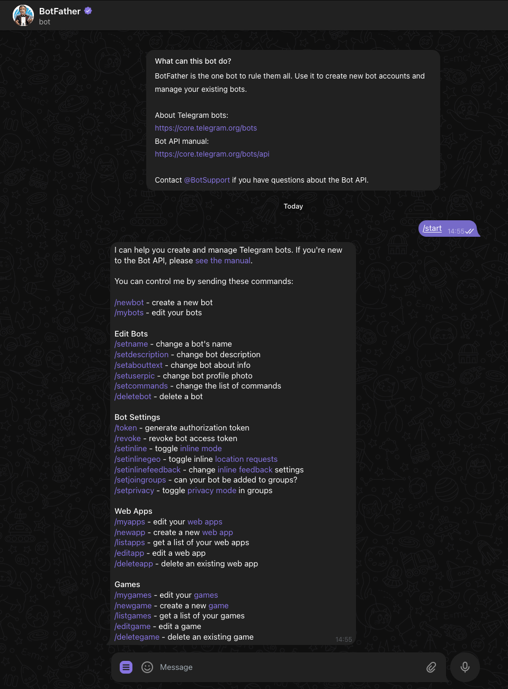
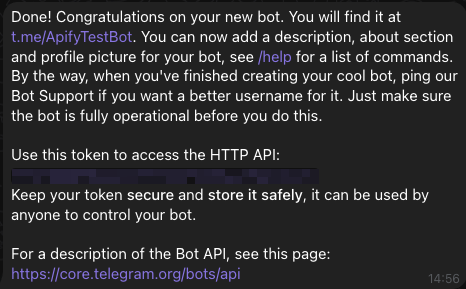
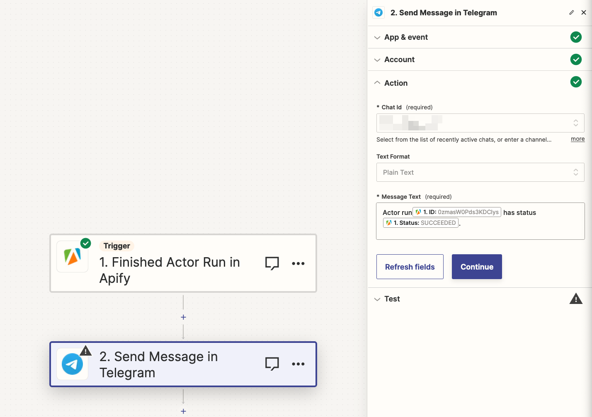

**Learn how to integrate your Apify Actors with Telegram through Zapier.**

---

With [Apify integration for Zapier](https://zapier.com/apps/apify/integrations), you can connect your Apify Actors to Slack, Trello, Google Sheets, Dropbox, Salesforce, and loads more.

Your Zapier workflows can start Apify Actors or tasks, fetch items from a dataset, set and get records from key-value stores, or find Actor or task runs.

You can use the Zapier integration to trigger a workflow whenever an Actor or a task finishes.

<iframe width="560" height="315" src="https://www.youtube.com/embed/XldEuQleq3c?si=86qbdrzWpVLoY_fr" title="YouTube video player" frameborder="0" allow="accelerometer; autoplay; clipboard-write; encrypted-media; gyroscope; picture-in-picture; web-share" allowfullscreen></iframe>

## Connect Apify with Zapier

To use the Apify integration on Zapier, you will need to:

- Have an [Apify account](https://console.apify.com/).
- Have a [Zapier account](https://zapier.com/).

### Step 1: Create Zap and find Apify on Zapier

Once you have your Zapier account ready and you are successfully logged in, you can create your first Zap.

Go to the Zaps section and find the **Create Zap** button.

In the create Zap form, you can choose whether you want to use Apify as the trigger or action for the Zap.

Click on Trigger and find Apify using the search box.

You have two possible triggers that you can choose while setting up your Telegram integration

- Finished Actor Run - triggers upon the completion of a selected Actor run.

- Finished Task Run - triggers upon the completion of a selected Actor task run.

:::info Available Actors & Tasks

Please note that only Actor runs or Actor task runs that you previously executed will be available to choose from.

:::

### Step 2: Create a connection to your Apify account

The next step is to connect your Apify account.

Click on the "Sign in" button next to the Connect to Apify title. Or you can select an account if you already have one connected.

The connection configuration options open in a new tab in your browser or in a modal window.

In connection configuration, you need to provide your Apify API Token. You can find the token in Apify Console by navigating to **Settings > Integrations**.

Copy the token and paste it into the configuration form and continue with the "Yes, Continue to Apify" button.

The connection is now created and the configuration form closed.

## Connect Telegram bot with Zapier

### Step 1: Create & connect new bot on Telegram

After setting up Apify as your trigger within Zapier, it's time to set up Telegram as the action that will occur based on the trigger.

You have two possible actions that you can choose while setting up your Telegram integration

- Send Message - sends a message from your bot when trigger activates.

- Send Poll - sends a poll from your bot when trigger activates.

After you choose your event that will be happening after trigger, you need to connect your Telegram bot that will be responsible for sending the message or sending polls.

The best way to do it's to:

1. Start conversation with Telegrams BotFather, a bot that manages bots on Telegram.

    

2. Issue the `/newbot` command in conversation with it and follow the instructions, until you get your HTTP API token.

    

### Step 2: Create action for your new Telegram bot

Once you've setup your new bot within Zapier, it's time to setup an action.

Start new conversation with your bot and copy the **Chat-Id** and input it within Zapier.

Select **Chat-Id**, **Text Format**, and a **Message Text** that suits your need for example

Once you fill all required fields, you can test your integration and if everything works hit **Publish** and you are done!
