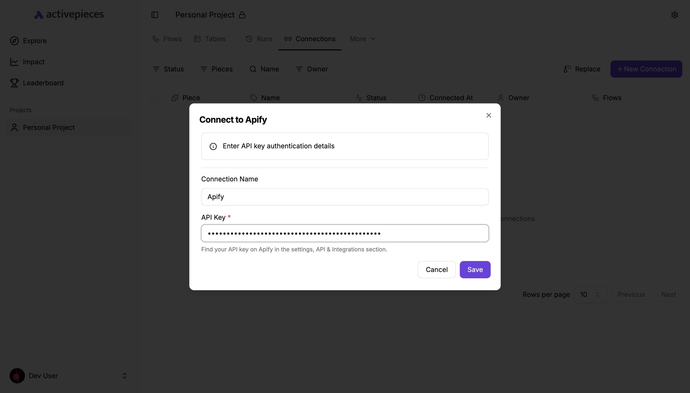
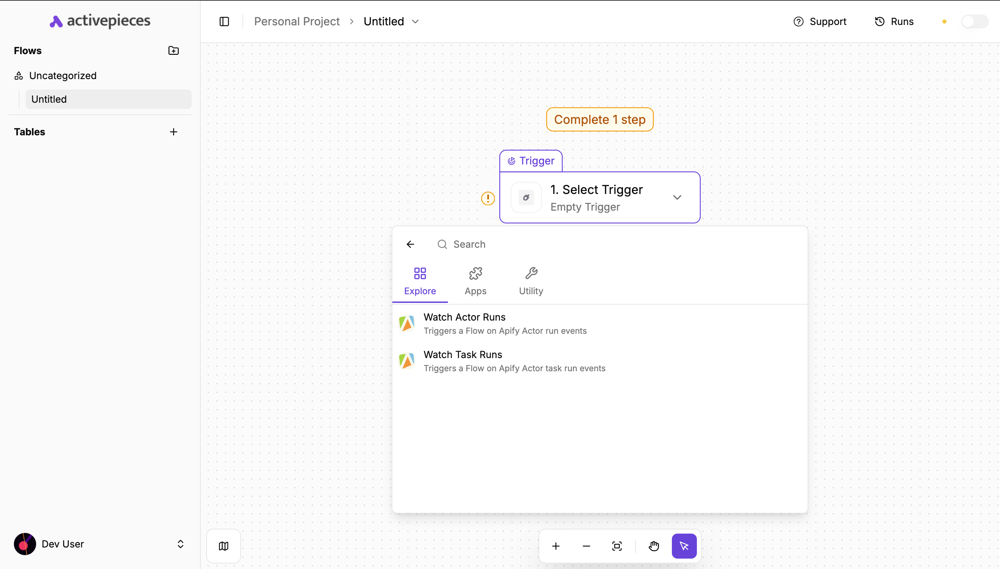
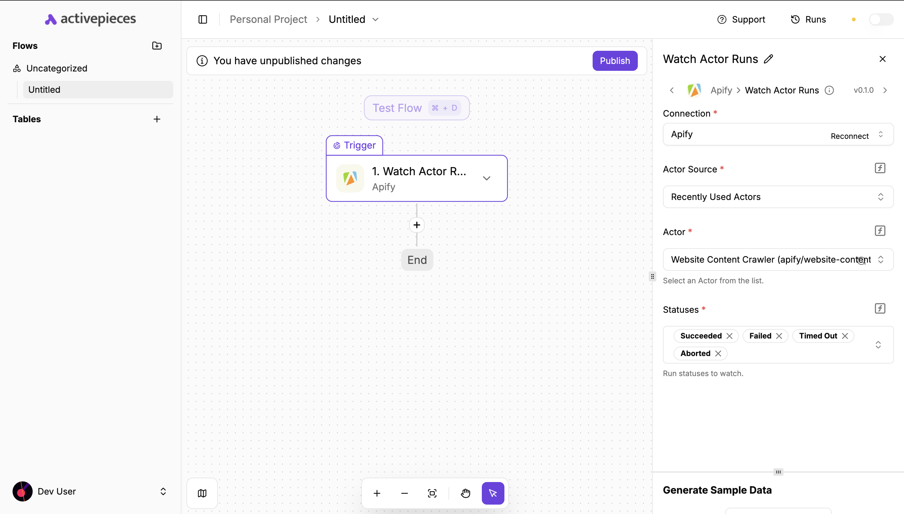
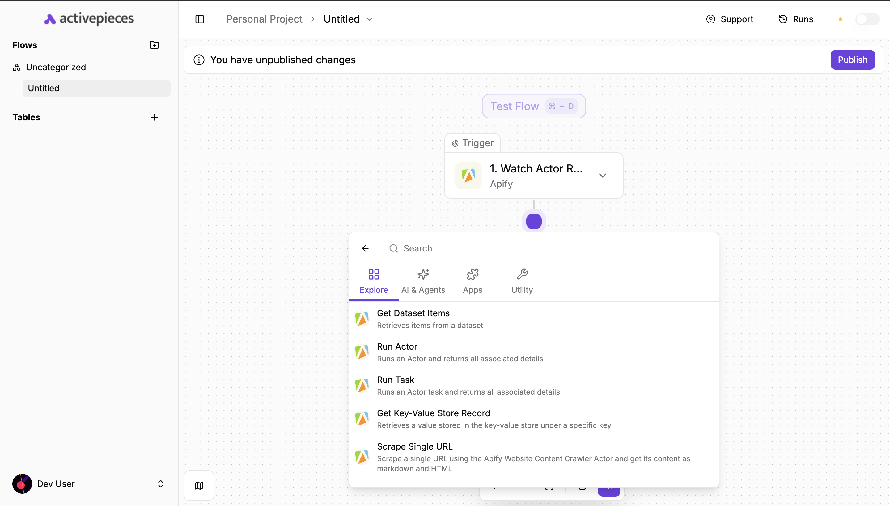
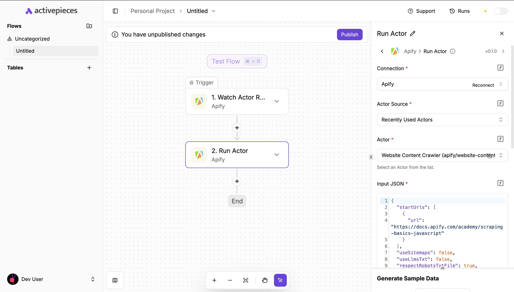

**Connect Apify Actors with Activepieces using the Apify piece to automate workflows with run events, data queries, and task actions.**

---

[Activepieces](https://www.activepieces.com) is an open-source automation platform that lets you build workflows to connect apps and automate tasks without writing code. With the Apify piece, you can connect your Apify Actors and tasks to other services, build data pipelines, and react to scraping results in real time.

This guide shows you how to integrate Apify with Activepieces to build automated workflows. You'll learn how to:

- Connect your Apify account in Activepieces
- Use triggers that react to Apify Actor and task runs
- Use actions that run Actors or tasks and read data from Apify storage

An Activepieces flow consists of three key parts:

- A _trigger_ that starts the workflow
- Optional _steps_ that transform or query data
- One or more _actions_ that execute when the flow runs

The Apify piece lets you trigger flows when an Actor or task run finishes, start Actor or task runs from any other trigger, or retrieve data from datasets and key-value stores.

## Prerequisites

Before using the Apify piece in Activepieces, you need:

- An [Apify account](https://console.apify.com/)
- An [Activepieces account](https://www.activepieces.com/) or self-hosted instance
- An Apify [API key](/platform/integrations/api#api-token) with access to the Actors, tasks, and storages you want to use

## Connect Apify with Activepieces

To connect your Apify account to Activepieces:

1. In Activepieces, open the **Connections** section.
1. Click **+ New Connection**.
1. Search for and select the Apify piece.
1. Enter your **API Key** from Apify:
   - You can find it in Apify Console under **Settings → API & Integrations**.
1. Save the connection.

## Create a flow with the Apify piece

### Create a new flow

To create a flow that starts when an Apify event occurs:

1. In Activepieces, go to your **Flows** page.
1. Click **+ New Flow**.
1. Choose a trigger:
   - To react to Apify runs, use one of the Apify triggers (described below).
   - Or start with any other trigger (e.g., webhook, schedule) and add Apify as an action later.

### Add an Apify trigger

To start a flow based on Apify activity:

1. For the first step, search for Apify in the trigger list.
1. Choose a trigger:
   - **Watch Actor Runs**
   - **Watch Task Runs**
1. Configure the trigger:
   - Select your Apify connection (API key).
   - Choose which Actor or task to watch.
   - Select which run statuses should fire the trigger (e.g., succeeded, failed, timed out).
1. Save the trigger.

When enabled, the trigger creates a webhook in your Apify account that sends events to Activepieces whenever the selected Actor or task run finishes with the specified statuses.

### Add an Apify action

To use Apify as an action in your flow:

1. Add a new step in your flow.
1. Search for and select Apify.
1. Choose an action:
   - **Run Actor**: Starts an Actor run.
   - **Run Task**: Starts an Actor task run.
   - **Get Dataset Items**: Reads items from a dataset.
   - **Get Key-Value Store Record**: Reads a record from a key-value store.
   - **Scrape Single URL**: Uses a pre-configured Website Content Crawler Actor to scrape a single page.
1. Select your Apify connection.
1. Configure the action parameters.

For example, when using **Run Actor**, you'll configure:

- **Actor source** (recent or Apify Store)
- **Actor** (the specific Actor to run)
- **Input JSON** (overrides the Actor's default input)
- Optional **Build**, **Memory**, **Timeout**, and **Wait for finish** settings

## Available triggers and actions

### Triggers

- **Watch Actor Runs** triggers a flow on Apify Actor run events. You can:
  - Choose the Actor source (recent Actors or Apify Store).
  - Select a specific Actor.
  - Choose which run statuses should start the flow (e.g., succeeded, failed, aborted, timed out).

- **Watch Task Runs** triggers a flow on Apify task run events. You can:
  - Select an Apify task.
  - Choose which run statuses should start the flow.

Both triggers create and manage Apify webhooks automatically when you enable or disable the trigger in Activepieces.

### Actions

- **Run Actor** starts a specified Actor with customizable parameters:
  - **Actor source** (recent Actors or Apify Store).
  - **Actor**
  - **Input JSON** overrides
  - **Build**, **Memory**, **Timeout**
  - **Wait for finish**:
    - If enabled, returns the run details and dataset items (if available).
    - If disabled, returns the run details immediately without waiting for completion.

- **Run Task** executes a specified Apify task with:
  - **Task**
  - **Input JSON** overrides
  - **Build**, **Memory**, **Timeout**
  - **Wait for finish** behavior similar to **Run Actor**.

- **Get Dataset Items** retrieves items from an Apify [dataset](/platform/storage/dataset):
  - Choose a dataset from your account.
  - Configure **offset** and **limit** to page through items.
  - Returns dataset items, their count, and the dataset ID.

- **Scrape Single URL** runs a Website Content Crawler Actor for a specified website and returns its content:
  - Accepts a **URL** to scrape.
  - Lets you choose a **crawler type** (e.g., Cheerio, JSDOM, Playwright variants).
  - Returns the Actor run details and the scraped items (HTML and markdown).

- **Get Key-Value Store Record** retrieves a value from an Apify [key-value store](/platform/storage/key-value-store):
  - Select a key-value store.
  - Select a record key from that store.
  - Returns the value as JSON, text, or a file reference, depending on its type.

## Troubleshooting

- Ensure your Apify API key is valid, has not expired, and has permission to access the Actors, tasks, and storages you're using.
- If a dropdown in the Apify piece is empty or disabled (Actors, tasks, datasets, stores, keys), check that your connection is configured and selected.
- When using **Input JSON** for Actors or tasks, make sure it matches the expected schema for the Actor or task.
- If a trigger does not fire:
  - Verify that the corresponding Apify webhook was created (in Apify Console).
  - Check that the run statuses you selected match the actual run status (e.g., `SUCCEEDED`, `FAILED`).

If you have any questions or need help, feel free to reach out to us through our [developer community on Discord](https://discord.com/invite/jyEM2PRvMU).
