import ThirdPartyDisclaimer from '@site/sources/_partials/_third-party-integration.mdx';

[Albato](https://albato.com/automate) is a no-code integration platform that connects over 1,000 apps through a visual automation builder. With [Apify integration for Albato](https://albato.com/apps/apify), you can use Apify Actors as triggers or actions inside your Albato workflows to scrape data, run automation jobs, and pass results to any connected app.

Your Albato workflows can start Apify Actors or tasks, fetch items from a dataset, retrieve records from key-value stores, find Actor or task runs, or send custom requests to the Apify API.

You can use the Albato integration to trigger a workflow whenever an Actor or a task finishes.

<ThirdPartyDisclaimer />

## Prerequisites

- An [Apify account](https://console.apify.com/).
- An [Albato account](https://albato.com/) (free 7-day trial available).

## Connect Apify with Albato

### Step 1: Get your Apify API token

Log in to [Apify Console](https://console.apify.com/).

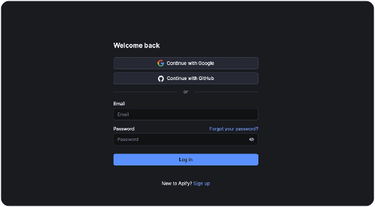

Go to **Settings > API & Integrations**.

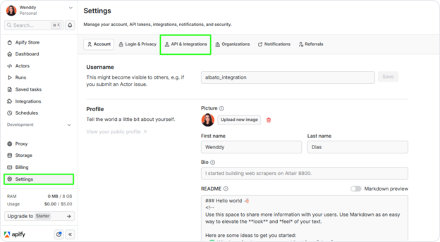

Copy your **Personal API token**.

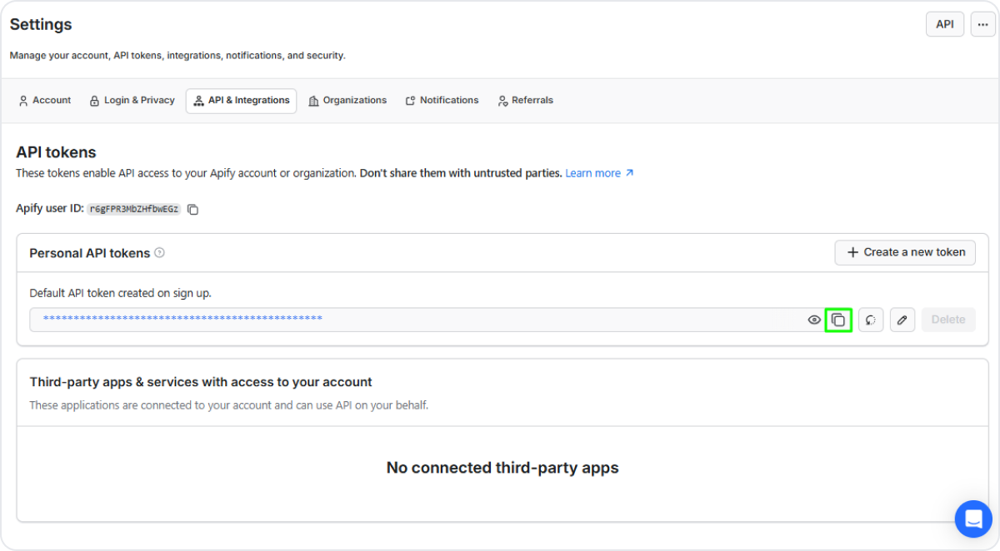

### Step 2: Create the Apify connection in Albato

Log in to [Albato](https://albato.com/app/user/auth/login?lang=en).

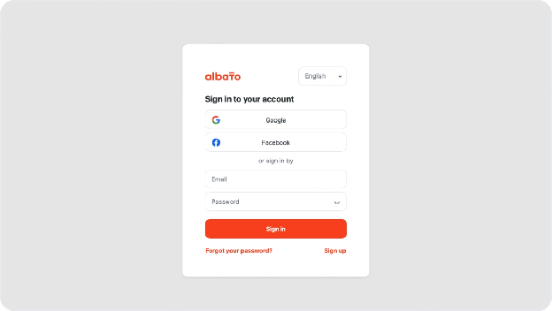

Go to **Apps** and click **Add a connection**.

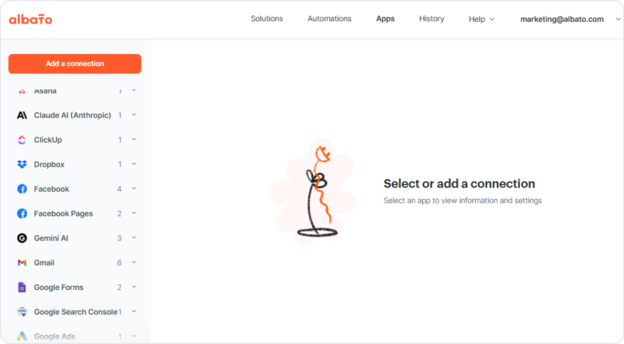

Search for **Apify**, select it, and click **Add a connection**.

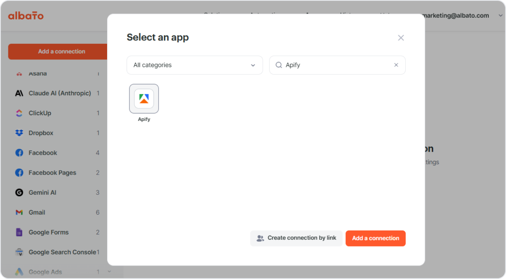

Paste the API token you copied from Apify and click **Continue**.

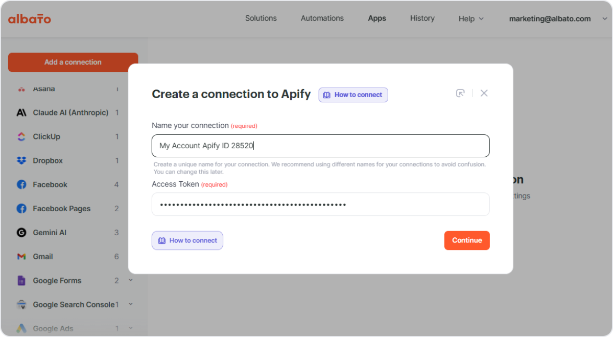

A success notification confirms the connection is active.

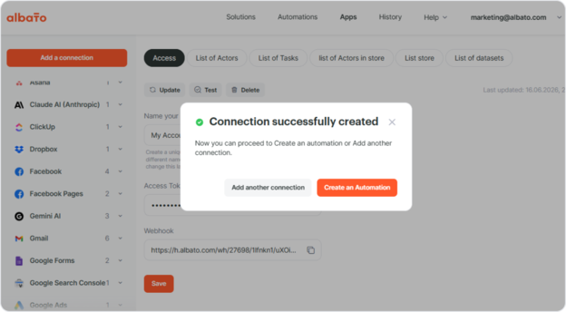

## Build a workflow with an Apify trigger

This example shows how to scrape data with an Apify Actor and automatically send the results to Google Sheets.

### Step 1: Create a new automation

In Albato, click **Create automation**. Select **Apify** as the trigger app and choose the **Finished Actor Run** trigger. This fires every time a selected Actor completes a run. Select your Apify connection and pick the Actor you want to monitor.

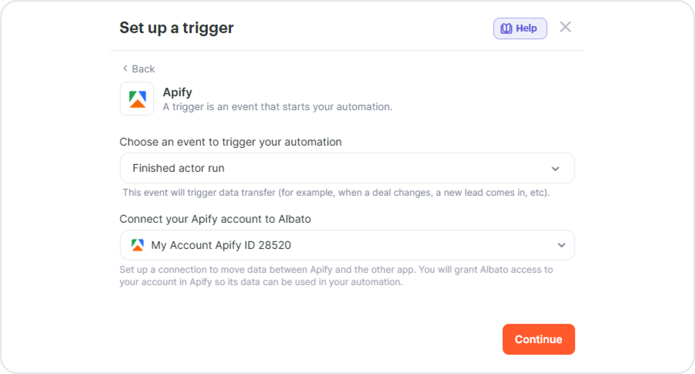

### Step 2: Add an action to retrieve the data

Click **+** to add the next step. Select **Apify** as the action app and choose the **Get dataset** action. Map the **Run ID** from the trigger output to fetch the correct dataset.

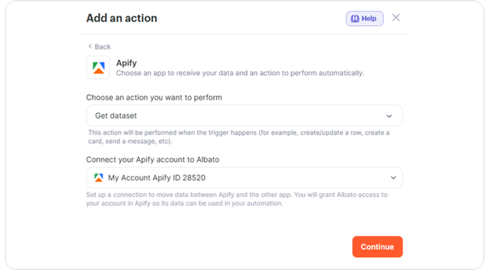

### Step 3: Send the data to Google Sheets

Click **+** to add another step. Select **Google Sheets** as the action app and choose the **Create/update a row** action. Select your spreadsheet and map the dataset fields to the corresponding columns. Click **Save** and turn on the automation.

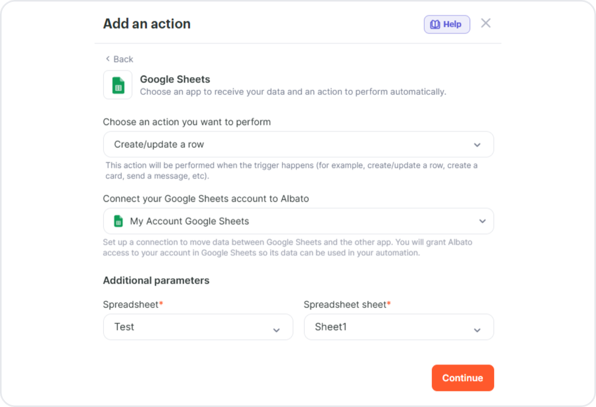

Every time the selected Actor finishes a run, Albato fetches the scraped data and adds it to your spreadsheet automatically.

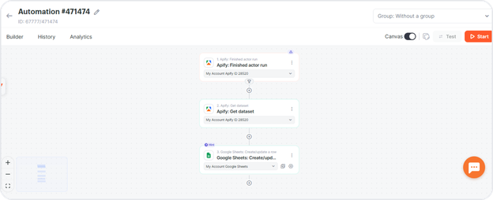

## Build a workflow with an Apify action

You can also start an Actor directly from an Albato workflow. This is useful when you want another event, such as a new CRM record or a form submission, to start a scraping job.

Create a new automation and choose any app as the trigger (for example, **HubSpot > Contact added**). Add **Apify** as the action app and select **Run Actor**. Pick the Actor you want to run and configure its input fields. Optionally, add a second Apify step with **Get dataset** to retrieve the results once the run completes.

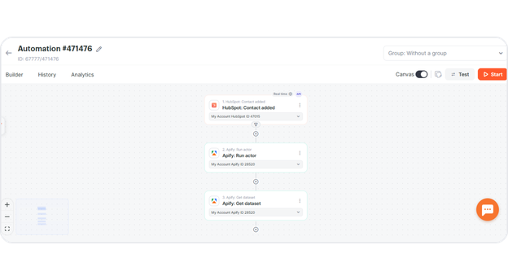

### Handling long-running Actors

Apify Actors often run for several minutes, which doesn't fit well into a single synchronous workflow step. For Actors that take longer than a few seconds to finish, use the asynchronous pattern: start the run with the **Run Actor** action, then build a separate automation that uses the **Finished Actor Run** trigger to continue processing once the run completes. This avoids blocking your workflow while the Actor is still running and is also more reliable for runs that exceed the platform's step timeout.

## Triggers

| Name | Description |
| --- | --- |
| Finished Actor run | Triggers when a selected Actor run is finished. |
| Finished task run | Triggers when a selected Actor task run is finished. |

## Actions

| Name | Description |
| --- | --- |
| Run Actor | Starts a selected Actor and returns immediately without waiting for the run to finish. To process the run output, pair this with the **Finished Actor Run** trigger or fetch results later with **Last Actor run** or **Get dataset**. See [Handling long-running Actors](#handling-long-running-actors). |
| Run task | Starts a selected Actor task and returns immediately without waiting for the run to finish. As with **Run Actor**, pair this with the **Finished task run** trigger to continue once the run completes. |
| Last Actor run | Retrieves data from the most recent Actor run. |
| Last task run | Retrieves data from the most recent Actor task run. |
| Find last Actor run | Finds the most recent Actor run. |
| Find last task run | Finds the most recent Actor task run. |
| Create Actor task | Creates a new Actor task configuration. |
| Get dataset | Retrieves items from a [dataset](/platform/storage/dataset). |
| Get key-value store record | Retrieves a value from a [key-value store](/platform/storage/key-value-store). |
| Get list of keys | Lists keys in a [key-value store](/platform/storage/key-value-store). |
| Custom API request | Sends a custom request to any Apify API endpoint. |

## Troubleshooting

### Connection fails with "invalid token"

Confirm that you copied the **Personal API token** from **Settings > API & Integrations** in Apify Console, not a different scoped token. Make sure no spaces or line breaks were added when pasting the token into Albato. If the connection still fails, generate a new token in Apify Console and recreate the connection.

### Actor or task doesn't appear in the dropdown

Albato lists Actors and tasks tied to the connected Apify account. If a recently created Actor or task isn't showing up, refresh the connection and the action configuration. To use a public Actor from [Apify Store](https://apify.com/store), open it once in Apify Console so it's added to your account.

### Workflow times out before the Actor finishes

The **Run Actor** and **Run task** actions return immediately after the run starts, but downstream steps that read the run output can time out if the Actor takes longer than Albato's step limit. Use the asynchronous pattern: start the run in one automation, then continue processing in a separate automation triggered by **Finished Actor Run**. See [Handling long-running Actors](#handling-long-running-actors).

### Dataset is empty

The **Get dataset** action requires a valid **Run ID** and a run that finished successfully with output. Verify the run in [Apify Console](https://console.apify.com/) under **Runs** to confirm it completed and produced items before fetching the dataset.

## Resources

- [Apify integration page on Albato](https://albato.com/apps/apify)
- [How to connect Apify to Albato](https://albato.com/blog/publications/how-to-connect-apify-to-albato)

If you have questions or need help, join the [Apify developer community on Discord](https://discord.com/invite/jyEM2PRvMU).
