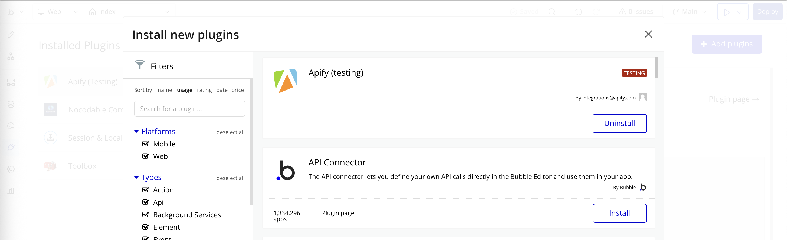
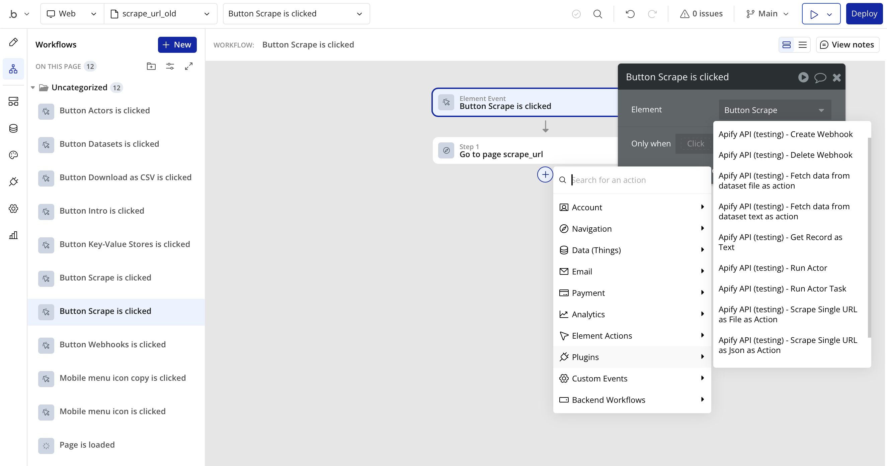
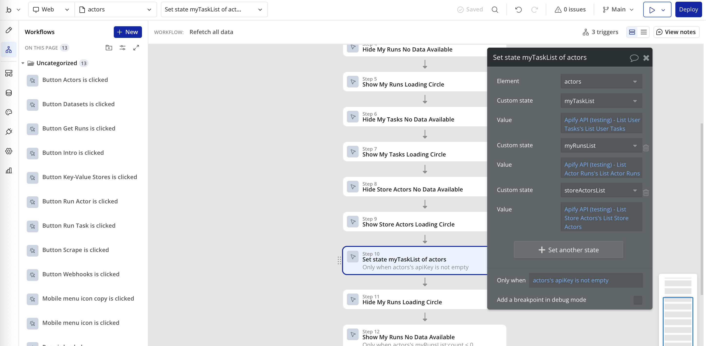
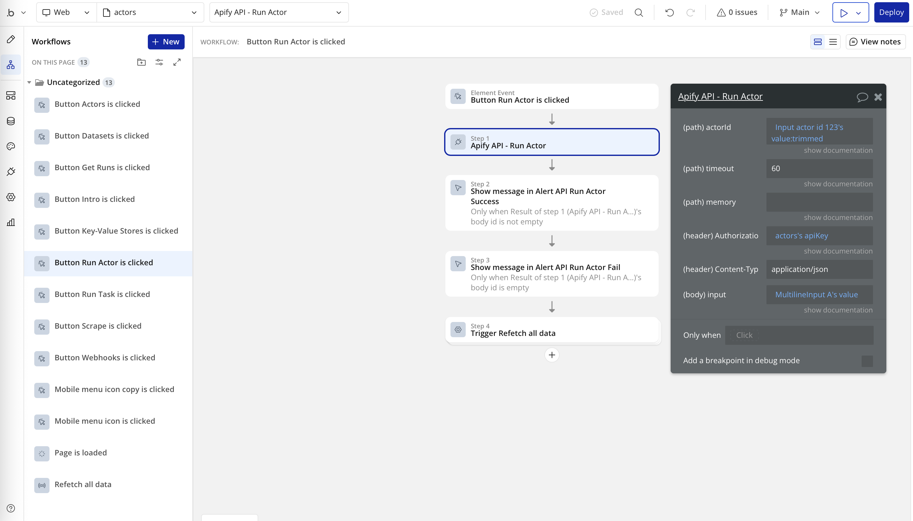

**Learn how to integrate your Apify Actors with Bubble. This article guides you from installation through to automating your workflow in Bubble.**

---

[Bubble](https://bubble.io/) is a no-code platform that allows you to build web applications without writing code. With the Apify integration for Bubble, you can easily connect your Apify Actors to your Bubble applications, enabling you to scrape data, process it, and display it in your Bubble app.

## Prerequisites

Before using the Apify integration with Bubble, you need:

- An [Apify account](https://console.apify.com/)
- A [Bubble account](https://bubble.io/)
- A Bubble application where you want to use the integration

## Get started

The Apify plugin for Bubble allows you to run Actors, fetch data from datasets, manage key-value stores, and more, all without writing any code.

## Demo Application

We've created a comprehensive demo application that showcases various use cases of the Apify plugin for Bubble. This demo app includes examples of:

- Scraping data from websites
- Running Actors and displaying results
- Managing Actor tasks
- Working with webhooks
- Interacting with key-value stores
- Listing available Actors and tasks

You can explore the demo app to see real-world implementations and get inspiration for your own projects. The demo app provides practical examples that you can adapt for your specific needs.

## Step 1: Install the Apify plugin for Bubble

To integrate Apify with your Bubble application, you first need to install the Apify plugin from the Bubble plugin marketplace.

1. Go to your Bubble application dashboard.
2. Navigate to the "Plugins" tab.
3. Click the "Add plugins" button.
4. Search for "Apify" in the plugin marketplace.
5. Click on the Apify plugin and then click "Install".

## Step 2: Use the Apify plugin

After installing the plugin, it's ready to be used in your Bubble application. Unlike some other plugins, the Apify plugin doesn't require global configuration. Instead, you'll provide your API token each time you use an Apify action in your workflow:

1. When setting up an Apify action in your workflow, you'll be prompted to enter your API token.
2. You can find your API token in the Apify Console under **Settings > Integrations**.
3. For security reasons, it's recommended to store your API token in a Bubble workflow's private field or a custom state that's not exposed to the frontend, rather than entering it directly in each action.

## Step 3: Understanding Data Calls vs. Actions

The Apify plugin for Bubble provides two types of API integrations: Data Calls and Actions. Understanding the difference is crucial for effective implementation:

### Data Calls

Data calls are used to retrieve information from Apify and display it in your Bubble application. These calls can be used as data sources for elements like repeating groups, inputs, or any component that displays data. Data calls don't modify anything - they only fetch and display information.

The Apify plugin provides the following data calls:

- **Dataset Operations**
  - Fetch Data From Dataset Text As Data
  - Fetch Data From Dataset File As Data
  - Fetch Data From Dataset Json As Data
  - List User Datasets

- **Key-Value Store Operations**
  - List Key-Value Stores
  - List Store Keys
  - Get Record As File
  - Get Record As Image File

- **Actor and Task Operations**
  - List Store Actors
  - List User Actors
  - List User Tasks
  - List Actor Runs
  - List Specific Actor Runs

- **Web Scraping**
  - Scrape Single URL As File As Data
  - Scrape Single URL As Json As Data

- **Webhook Management**
  - List Webhooks

### Actions

Actions are used to perform operations that change data or trigger processes. In Bubble, actions are used in workflows that are triggered by events like button clicks, page loads, or scheduled events.

The Apify plugin provides the following actions:

- **Dataset Operations**
  - Fetch Data From Dataset Text As Action
  - Fetch Data From Dataset File As Action

- **Key-Value Store Operations**
  - Get Record As Text

- **Actor and Task Operations**
  - Run Actor
  - Run Actor Task

- **Web Scraping**
  - Scrape Single URL As File As Action
  - Scrape Single URL As Json As Action

- **Webhook Management**
  - Create Webhook
  - Delete Webhook

## Step 4: Use Apify in your Bubble application

With the plugin installed, you can start using Apify in your Bubble application through the various data calls and actions provided. Here are some common ways to use the plugin:

- Use data calls to display scraped data in your application
- Set up workflows that trigger Apify Actors using actions
- Create automated processes that fetch and process data regularly

## Step 5: Example use cases

Here are some examples of how you can use the Apify integration in your Bubble application:

### Scraping data for your application

Use Apify Actors to scrape data from websites and then display that data in your Bubble application. For example, you could scrape product information from e-commerce sites and display it in your own marketplace.

1. Use the "Run Actor" action to trigger a scraping Actor
2. Use the "Fetch Data From Dataset Json As Data" data call to display the results in a repeating group

### Automating workflows

Set up workflows in your Bubble application that trigger Apify Actors based on certain events. For example, you could run a scraper every time a user submits a form.

1. Create a workflow triggered by a form submission
2. Add the "Run Actor Task" action to start your scraping task
3. Process the results using additional actions or workflows

### Enriching user data

Use Apify Actors to enrich your user data with additional information from external sources. For example, you could use an Actor to get social media profiles based on email addresses.

1. Create a workflow that triggers when new user data is added
2. Use the "Run Actor" action with appropriate parameters
3. Store the enriched data back in your Bubble database

## Summary of available features

### Data Calls
- Retrieve data from Apify datasets in various formats (text, file, JSON)
- List available datasets, key-value stores, actors, and tasks
- Get records from key-value stores
- List actor runs and webhooks
- Scrape web pages directly

### Actions
- Run Actors and Actor tasks
- Fetch data from datasets
- Get records from key-value stores
- Scrape web pages
- Manage webhooks

## Troubleshooting

Here are some common issues you might encounter when using the Apify plugin for Bubble:

- **Authentication errors**: Make sure your API token is correct, in this format "Bearer <api_token>", and has the necessary permissions
- **Data format issues**: When using JSON data, ensure it's properly formatted
- **Performance concerns**: For large datasets, consider pagination or filtering data on the Apify side
- **Missing Actors or tasks**: If you can't find your Actor or task in the dropdown, try running it at least once in the Apify Console
- **Timeout errors**: For actions that take longer to complete, consider using asynchronous runs

## Detailed implementation guide

For a detailed guide on how to implement specific features using the Apify plugin for Bubble, including code examples and best practices, please refer to the next section of this documentation.

If you have any questions or need help, feel free to reach out to us on our [Discord channel](https://discord.com/invite/jyEM2PRvMU).
