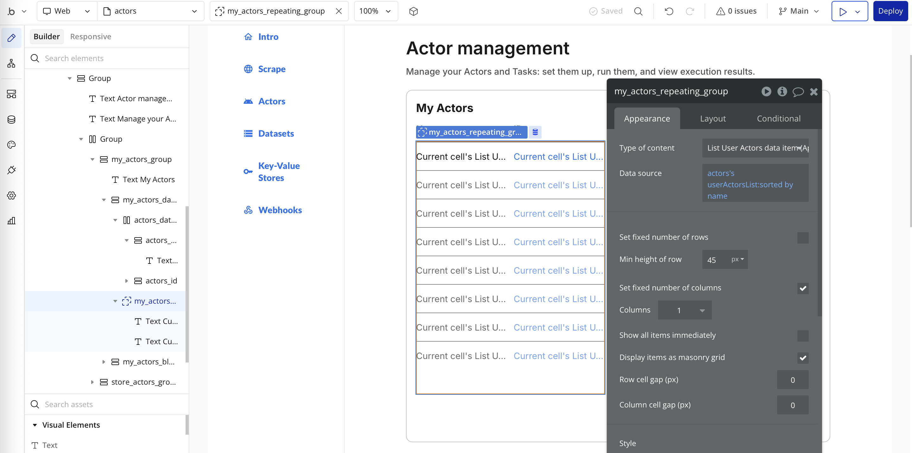

**Learn how to integrate your Apify Actors with Bubble for automated workflows and notifications.**

---
[Bubble](https://bubble.io/) is a no-code platform that allows you to build web applications without writing code. With the Apify integration for Bubble, you can easily connect your Apify Actors to your Bubble applications to automate workflows and display scraped data.

:::tip Explore the live demo
Open the demo Bubble app to see the integration end-to-end before building your own: [apify-28595.bubbleapps.io/version-test](https://apify-28595.bubbleapps.io/version-test)
:::

## Get started

To use the Apify integration for Bubble, you will need:

- An [Apify account](https://console.apify.com/)
- A [Bubble account](https://bubble.io/)
- A Bubble application where you want to use the integration

---

## Step 1: Install the Apify plugin for Bubble

To integrate Apify with your Bubble application, you first need to install the Apify plugin from the Bubble plugin marketplace.


1. Go to your Bubble application dashboard and navigate to the **Plugins** tab.
1. Click the **Add plugins** button.
1. Search for "Apify" in the plugin marketplace.
1. And then click **Install**.

## Step 2: Configure the Apify plugin

After installing the plugin, you'll need to provide your API token when setting up Apify actions.

### 2.1 Get your Apify API token

1. In Apify Console, go to **Settings > API & Integrations** and copy your API token.


### 2.2 Store the token securely in Bubble

For security, avoid hardcoding the token in action settings. Store it on the `User` data type with Privacy rules so only the current user can access their own token.

1. In Bubble, go to **Data > Data types**, open `User`.
2. Add a new field, for example `apify_api_token` (type: text).

3. Go to **Data > Privacy** and check if only the "Current User" is allowed to view their own `apify_api_token`.


### 2.3 Point Apify actions to the saved token

When configuring Apify actions in a workflow (see below), set the token field dynamically to:

- `Current User's apify_api_token`


---

## Using the integration

Once the plugin is configured, you can start building automated workflows.

### Actions vs data calls

Apify's Bubble plugin exposes two ways to interact with Apify:

- **Actions (workflow steps)**: Executed inside a Bubble workflow (both page workflows and backend workflows). Use these to trigger side effects like running an Actor or Task, creating a webhook, or writing to a store. They run during the workflow execution and can optionally wait for the result.
  - Examples: **Run Actor**, **Run Actor Task**, **Create Webhook**, **Delete Webhook**.
  - Location in Bubble: Workflow editor → Add an action → Plugins → Apify


- **Data calls (data sources)**: Used as data sources in element properties and expressions. They fetch data from Apify and return it as lists/objects that you can bind to UI (for example, a repeating group) or use inside expressions.
  - Examples: **Fetch Data From Dataset JSON As Data**, **List Actor Runs**, **Get Record As Text/Image/File** from key-value store, **List User Datasets/Actors/Tasks**.
  - Location in Bubble: In any property input where a data source is expected click "Insert dynamic data" → under "Data sources" select "Get Data from an External API" → choose the desired Apify data call.


---

### Dynamic values in inputs and data calls

Dynamic values are available across Apify plugin fields. Use Bubble's "Insert dynamic data" to bind values from your app.

- For instance you can source values from:
  - **Page/UI elements**: inputs, dropdowns, multi-selects, radio buttons, checkboxes
  - **Database Things and fields**
  - **Current User**
  - **Previous workflow steps** (e.g., Step 1's Run Actor result's `defaultDatasetId` or `runId`)
  - **Get Data from an External API**: data calls

Examples
1) Use a page input in an Action's JSON field (Input overrides):

```json
{
  "url": "Input URL's value"
}
```


2) Use a previous step's result in JSON:

```json
{
  "datasetId": "Step 1's Run Actor's defaultDatasetId"
}
```

For data calls, bind parameters the same way (for example, set `datasetId` to a dropdown's value or to Step 1's result).

:::tip
When inserting dynamic data, Bubble replaces the selected text. Place your cursor exactly where you want the expression in the JSON; avoid selecting the entire field.
:::

---

### Run Apify plugin actions from Bubble events

Create workflows that run Apify plugin actions in response to events in your Bubble app, such as button clicks or form submissions.

1. Open the **Workflow** tab and create a new workflow (for example, "When Run button is clicked").
  - Create it manually: `Workflows` → `+ New` → `An element is clicked`

   - Or you can also click `Add workflow` button:

   - Then select the correct UI button.

2. Click `Add an action` → `Plugins` → choose one of the Apify actions:
   - For example `Run Actor` (run a specific Actor by ID)
 
3. Configure the action:
   - **API token**: set to `Current User's apify_api_token` (see Step 2.3)
   - **Actor or Task**: paste an Actor ID
   - **Input overrides**: provide JSON and use dynamic expressions from page elements or things
   - **Timeout**: set in seconds (0 means no limit)

#### Where to find your IDs

Find IDs directly in Apify Console. Each resource page shows the ID in the API panel and in the page URL.

- **Actor ID**: Actor detail page → API panel or URL.
  - Example URL: `https://console.apify.com/actors/<actorId>`
  - Actor name format: owner/name (e.g., `apify/website-scraper`)
- **Task ID**: Task detail page → API panel or URL.
  - Example URL: `https://console.apify.com/actors/tasks/<taskId>`
- **Dataset ID**: Storage → Datasets → Dataset detail → API panel or URL.
  - Example URL: `https://console.apify.com/storage/datasets/<datasetId>`
  - Also available in the table in `Storage → Datasets` page
- **Key-value store ID**: Storage → Key-value stores → Store detail → API panel or URL.
  - Example URL: `https://console.apify.com/storage/key-value-stores/<storeId>`
  - Also available in the table in `Storage → Key-value stores` page
- **Run ID**: Run detail page → API panel or URL. Also returned by actions.
  - After using `Run Actor`/`Run Actor Task`, the step result contains `runId` and `defaultDatasetId`.
  - Example URL: `https://console.apify.com/actors/runs/<run_id>`
- **Webhook ID**: Actors → Actor → Integrations.
  - Example URL: `https://console.apify.com/actors/<actor_id>/integrations/<webhook_id>`

You can also discover IDs via the plugin responses and data calls (e.g., "List User Datasets", "List Actor Runs"), which return objects with `id` fields you can pass into other actions/data calls.

---

### Display Apify data in your application

Populate elements in your Bubble application with information from your Apify account or Actor run data.

There are two common approaches:

1) Show metadata (Actors, tasks, runs)

- Use data sources like **List User Tasks**, **List Actor Runs**, or **List Store Actors**.
- Bind the result to a **Repeating group**.
- Ensure `Type of content` matches the item type returned by your data source, and that `Data source` returns a list of that type.
  - In this example, the result of "List Store Actors" is saved to a page state named `actors's.userActorsList` and bound to the Repeating group.


2) List user datasets

- This example lists the current user's datasets and displays them in a repeating group.
- Add a **Repeating group** to the page.
  - Step 1 — Add data to a variable: create a custom state (for example, on the page) that will hold the list of datasets, and set it to the plugin's **List User Datasets** data call.

  - Step 2 — Set the type: in the repeating group's settings, set **Type of content** to match the dataset object your variable returns.

  - Step 3 — Bind the variable: set the repeating group's **Data source** to the variable from Step 1.

- Inside the repeating group cell, bind dataset fields (for example, `Current cell's item name`, `id`, `createdAt`).


---

### Long‑running scrapes and Bubble time limits (async pattern)

Bubble workflows have execution time limits. Long scrapes (for example, "Scrape Single URL") may time out if you wait for them. Use this asynchronous pattern.

#### Prerequisite: Enable Bubble API and construct the webhook URL

To receive webhooks from Apify, enable Bubble's public API workflows and copy your API root URL:

1. In Bubble, go to **Settings → API** and enable **This app exposes a Workflow API**.
2. Copy the **Workflow API root URL**. It looks like `https://your-app.bubbleapps.io/version-test/api/1.1/wf`.
3. Create a backend workflow named `webhook`. Its full URL will be `https://your-app.bubbleapps.io/version-test/api/1.1/wf/webhook`.
   - Example format: root `https://apify-tmp-copy.bubbleapps.io/version-test/api/1.1/wf`, workflow: `https://apify-tmp-copy.bubbleapps.io/version-test/api/1.1/wf/webhook`.

Use this URL as the Apify webhook target. Configure the webhook's authentication as needed (e.g., a shared secret or query string token) and verify it inside your Bubble workflow before processing.


1. Trigger the scrape without waiting
   - In a workflow, add **Run Actor** (or **Run Actor Task**) and set "Wait until finished" to no.
   - Actor ID: `aYG0l9s7dbB7j3gbS` (`apify/website-content-crawler`).
   - Input: copy the Actor's input from the Actor's Input page, and map `crawlerType` and `url` to values from your UI.

2. Notify Bubble when the run finishes
   - Create an Apify **Webhook** with event `ACTOR.RUN.SUCCEEDED` (or `RUN.SUCCEEDED` for a specific `runId` from Step 1).
   - Set `actorId` (or `runId` if using `RUN.SUCCEEDED`) from the Step 1 result.
   - Set `requestUrl` to your Bubble backend workflow URL, for example: `https://your-app.bubbleapps.io/version-test/api/1.1/wf/webhook`.
   - The webhook payload includes `datasetId`; you will use it later to fetch results.

3. Receive the webhook in Bubble and store the dataset ID
   - Enable backend API workflows and create a workflow (for example, `webhook`) that accepts the webhook payload.
   - Create a public data type, for example, `ScrapingResults`.
   - Add a text field, for example, `datasetId`, to store the dataset ID from the webhook.

   - Create the backend workflow (`webhook`) that Bubble exposes at `/api/1.1/wf/webhook`. The workflow name defines the API route.

   - In that workflow, create a new thing in `ScrapingResults` and set `datasetId` to the value from the webhook request.


4. Pick up the results asynchronously
   - In a (periodic) workflow, search `ScrapingResults` for the expected `datasetId`.
   - If found, fetch items via the appropriate action (for example, **Fetch Data From Dataset JSON As Action**) and then update the UI or save to your DB.
   - If not found yet, do nothing and check again later.


This approach avoids Bubble timeouts, keeps the UI responsive, and scales to larger scrapes.

---

## Example use cases

### E-commerce price monitoring

Schedule a daily workflow to run a price-scraping Actor on competitor sites. Store the results in your Bubble database, display them in a dashboard, and set up alerts for significant price changes.

### Lead generation automation

Trigger a workflow on form submission to run an Actor that enriches lead data, such as pulling company details from a domain. Save the enriched information to your database and automate follow-up actions like email campaigns.

### Content aggregation

Configure regular Actor runs to gather articles or posts from multiple sources. Use the **Fetch Data From Dataset JSON As Data** call to display the content in your app, and enable user filters by category, date, or source.

---

## Available Apify actions and data sources

The Apify plugin provides two main types of operations:

**Data calls** (usable as data sources):
- Fetch Data From Dataset Text As Data
- Fetch Data From Dataset File As Data
- Fetch Data From Dataset Json As Data
- List User Datasets
- List Key-Value Stores
- List Store Keys
- Get Record As File
- Get Record As Image File
- List Store Actors
- List User Actors
- List User Tasks
- Scrape Single URL As File As Data
- Scrape Single URL As Json As Data
- List Actor Runs
- List Specific Actor Runs
- List Webhooks

**Actions** (workflow steps):
- Fetch Data From Dataset Text As Action
- Fetch Data From Dataset File As Action
- Get Record As Text
- Scrape Single URL As File As Action
- Scrape Single URL As Json As Action
- Run Actor
- Run Actor Task
- Create Webhook
- Delete Webhook

---

## Troubleshooting
<!-- markdownlint-disable MD001 -->
#### Authentication errors

Ensure your API token is correctly set in the action (preferably as `Current User's apify_api_token`) and that it has the necessary permissions.

#### Missing Actors or tasks 

If an Actor or task doesn't appear in a dropdown, make sure you have run it at least once from the Apify Console.

#### Timeout errors

Bubble workflows have a timeout limit. For long-running Actors, consider setting **Wait until finished** = no, then process results in a separate backend workflow triggered by a webhook or scheduled event.

#### Data format issues

Check that your JSON input is valid when providing **Input overrides** and that dynamic expressions resolve to valid JSON values. Verify the structure of the dataset output when displaying it in your app.

---

If you have any questions or need help, feel free to reach out to us on our [developer community on Discord](https://discord.com/invite/jyEM2PRvMU).
