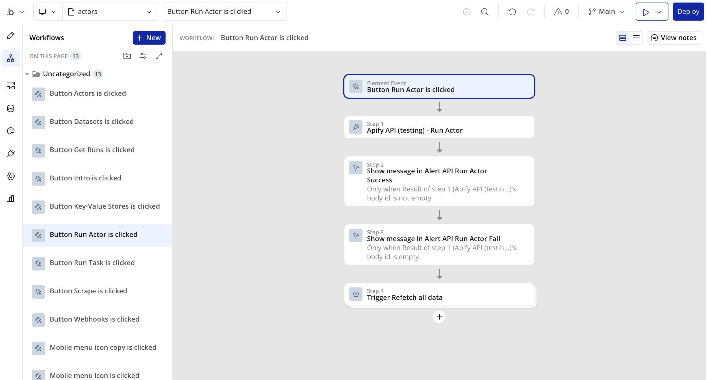
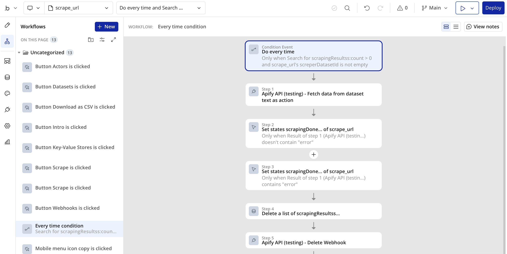

**Learn how to integrate your Apify Actors with Bubble for automated workflows and notifications.**

---

[Bubble](https://bubble.io/) is a no-code platform that allows you to build web applications without writing code. With the Apify integration for Bubble, you can easily connect your Apify Actors to your Bubble applications to automate workflows and display scraped data.

## Get started

To use the Apify integration for Bubble, you will need:

- An [Apify account](https://console.apify.com/)
- A [Bubble account](https://bubble.io/)
- A Bubble application where you want to use the integration

## Step 1: Install the Apify plugin for Bubble

To integrate Apify with your Bubble application, you first need to install the Apify plugin from the Bubble plugin marketplace.

1. Go to your Bubble application dashboard and navigate to the **Plugins** tab.
1. Click the **Add plugins** button.
1. Search for "Apify" in the plugin marketplace.
1. Click on the Apify plugin and then click **Install**.

## Step 2: Configure the Apify plugin

After installing the plugin, you'll need to provide your API token when setting up Apify actions:

1. You can find your API token in the Apify Console under **Settings > API & Integrations**.
2. For security, store your API token in your User data type with Privacy rules applied rather than entering it directly in each API call.

## Using the integration

Once the plugin is configured, you can start building automated workflows.

### Trigger Actor runs from Bubble events

Create workflows that run Apify Actors in response to events in your Bubble app, such as button clicks or form submissions. In the **Workflow** tab, set up a new workflow with your chosen trigger event. Add a new action and select **Run Actor** or **Run Actor Task** from the Apify plugin. Configure the Actor or Task, including any input data, and include follow-up actions to process the returned data.

### Display Apify data in your application

Populate elements in your Bubble application with information from your Apify account or Actor run data. Apply data sources like **List User Tasks**, **List Actor Runs**, or **List Store Actors** to repeating groups. To show actual scraped data, use **Fetch Data From Dataset Json As Data** to retrieve results from your run's dataset.

### Automate data collection workflows

Maintain fresh data in your Bubble app by setting up recurring workflows. Create a backend workflow with a schedule, such as daily runs. Incorporate the **Run Actor Task** action to trigger a pre-configured Actor for data collection. Follow this with steps to process the results, save them to your Bubble database, and update your app's display elements automatically.

## Example use cases

### E-commerce price monitoring

Schedule a daily workflow to run a price-scraping Actor on competitor sites. Store the results in your Bubble database, display them in a dashboard, and set up alerts for significant price changes.

### Lead generation automation

Trigger a workflow on form submission to run an Actor that enriches lead data, such as pulling company details from a domain. Save the enriched information to your database and automate follow-up actions like email campaigns.

### Content aggregation

Configure regular Actor runs to gather articles or posts from multiple sources. Use the **Get Dataset Items** data call to display the content in your app, and enable user filters by category, date, or source.

## Available Apify actions and data sources

The Apify plugin provides two main types of operations:

**Actions** (for workflows):
- Run Actor
- Run Actor Task
- Scrape Single URL
- Manage webhooks and data stores

**Data Sources** (for displaying information):
- Fetch data from datasets in various formats
- List Actors, tasks, and runs
- Access key-value store records

## Troubleshooting

- **Authentication errors**: Ensure your API token is in the format "Bearer <api_token>" and has necessary permissions
- **Missing Actors or tasks**: Run your Actor at least once in the Apify Console to make it appear in Bubble dropdowns
- **Timeout errors**: For long-running Actors, consider using asynchronous runs
- **Data format issues**: Ensure JSON data is properly formatted when working with datasets

If you have any questions or need help, feel free to reach out to us on our [Discord channel](https://discord.com/invite/jyEM2PRvMU).
