**Learn how to integrate Apify Actors with Camunda 8 for automated BPMN workflows.**

---

[Camunda](https://camunda.com/) is a process orchestration platform that enables you to design, automate, and optimize business workflows using BPMN. With the **Apify Connectors**, you can run Apify Actors, tasks, or retrieve datasets directly from your BPMN processes.

## Prerequisites

To use the Apify integration with Camunda, you need:

- An [Apify account](https://console.apify.com/)
- A [Camunda 8](https://camunda.com/) environment (SaaS or Self-Managed)

## Authentication

All Apify Connector operations require an **Apify API Token**.

1. Log in to [Apify Console](https://console.apify.com/).
2. Navigate to [**Settings → Integrations**](https://console.apify.com/settings/integrations).
3. Copy your **API Token**.

:::tip Security best practice

In Camunda, avoid hardcoding your token directly in the process design. Instead, use [Camunda Secrets](https://docs.camunda.io/docs/components/console/manage-clusters/manage-secrets/) (e.g., `secrets.APIFY_TOKEN`) to store your API token securely.

:::

## Outbound Connector

The **Apify Outbound Connector** allows your BPMN process to call out to Apify to invoke operations. It supports five operations: Run Actor, Run Task, Scrape single URL, Get dataset items, and Get key-value store record.

:::note

A leading `=` in a value denotes a FEEL expression. For example, `=runResult.data.id` means "evaluate the FEEL expression `runResult.data.id`".

:::

### Run Actor

Start a new execution of an Actor.

| Setting | Description |
| --------- | ------------- |
| **Operation** | Select `Run Actor` |
| **Actor** | The Actor name or ID (e.g., `apify/web-scraper` or `E2jjCZBezvAZnX8Rb`) |
| **Input Body** | *(Optional)* JSON input configuration for the run (e.g., `={ "message": "Hello from Camunda!" }`) |
| **Wait for Finish** | `true` (Synchronous) or `false` (Asynchronous) |
| **Timeout (seconds)** | *(Optional)* Maximum duration for the run |
| **Memory (MB)** | *(Optional)* Memory allocation. Dropdown: 128, 256, 512, 1024, 2048, 4096, 8192, 16384, or 32768 MB |
| **Build** | *(Optional)* Build tag to use (defaults to `latest`) |

**Wait for Finish options:**

- `true` (Synchronous): The process waits until the Actor run completes. Use for short-running tasks.
- `false` (Asynchronous): The process starts the run and immediately moves to the next step. Use for long-running scrapes or with [Intermediate Catch Events](#intermediate-catch-event).

### Run Task

Execute a saved Actor task.

| Setting | Description |
| --------- | ------------- |
| **Operation** | Select `Run task` |
| **Task** | The task name or ID (e.g., `username/my-task` or `abc123DEF456`) |
| **Input Override** | *(Optional)* JSON to override the task's saved input |
| **Wait for Finish** | `true` (Synchronous) or `false` (Asynchronous) |
| **Timeout (seconds)** | *(Optional)* Maximum duration |
| **Memory (MB)** | *(Optional)* Memory allocation. Dropdown: 128, 256, 512, 1024, 2048, 4096, 8192, 16384, or 32768 MB |
| **Build** | *(Optional)* Build tag to use (defaults to `latest`) |

### Scrape single URL

Quickly scrape a webpage using one of Apify's standard crawlers.

| Setting | Description |
| --------- | ------------- |
| **Operation** | Select `Scrape single URL` |
| **URL** | The full URL to scrape (e.g., `https://example.com`) |
| **Crawler Type** | `Cheerio` (lightweight), `JSDOM`, `Playwright Adaptive`, or `Playwright Firefox` |

### Get dataset items

Retrieve the results of an Actor run. Typically used after a Run Actor task has completed.

| Setting | Description |
| --------- | ------------- |
| **Operation** | Select `Get dataset items` |
| **Dataset** | The dataset ID. Use a variable from a previous run: `=runResult.data.defaultDatasetId` |
| **Offset** | *(Optional)* Number of items to skip from the beginning. Default: `0` |
| **Limit** | *(Optional)* Maximum number of items to return. Default: no limit |

### Get key-value store record

Fetch a specific record from a key-value store.

| Setting | Description |
| --------- | ------------- |
| **Operation** | Select `Get key-value store record` |
| **Key-Value Store** | The store ID (e.g., `=runResult.data.defaultKeyValueStoreId`) |
| **Key** | The record key to retrieve (e.g., `OUTPUT`) |

### Output mapping

Each outbound operation returns a JSON response wrapped in a `data` envelope. Use the **Result Variable** field (e.g., `runResult`) to store the full response, or use a **Result Expression** (FEEL) to extract specific fields into process variables.

For example, the following Result Expression extracts the run ID and dataset ID into separate process variables:

```text
={ runId: response.data.id, datasetId: response.data.defaultDatasetId }
```

### Error handling and retries

All outbound operations support error handling and automatic retries. These fields appear in the Modeler under the **Error handling** and **Retries** groups.

| Setting | Description |
| --------- | ------------- |
| **Error Expression** | *(Optional)* A FEEL expression to handle errors (e.g., `if error.code = "ACTOR_NOT_FOUND" then null else error`) |
| **Retries** | Number of retry attempts. Default: `3` |
| **Retry backoff** | ISO-8601 duration to wait between retries. Default: `PT0S` (no delay). Example: `PT5S` for 5 seconds |

## Inbound Connectors

Inbound connectors allow Apify to start or resume your Camunda processes via webhooks. The connector subscribes to all terminal event types at once (`SUCCEEDED`, `FAILED`, `TIMED_OUT`, `ABORTED`), and you can use the Activation Condition to filter which events trigger the connector.

All inbound connectors share these common fields:

| Setting | Description |
| --------- | ------------- |
| **Apify API Token** | Your Apify API token (see [Authentication](#authentication)) |
| **Resource Type** | `Actor` or `Task` |
| **Actor** / **Task** | The Actor or task name or ID to monitor (e.g., `apify/web-scraper` or `E2jjCZBezvAZnX8Rb`). The field label changes based on the selected Resource Type. |
| **Activation Condition** | *(Optional)* FEEL expression to filter events (e.g., `=connectorData.status = "SUCCEEDED"`). Leave empty to process all events. |
| **Result Variable** | *(Optional)* Variable name to store the webhook payload |
| **Result Expression** | *(Optional)* FEEL expression to transform the data (e.g., `={ result: connectorData }`) |

### Activation condition

The **Activation Condition** is an optional FEEL expression that acts as a gate for incoming webhook events. When set, the connector evaluates the expression against each incoming event and only triggers the process if the expression evaluates to `true`. Events that do not match are silently ignored — no process instance is created and no correlation occurs.

This is useful when you subscribe to all event types from an Actor or task but only want to react to specific outcomes.

| Expression | Effect |
| ------------ | -------- |
| *(empty)* | All events trigger the connector (default) |
| `=connectorData.status = "SUCCEEDED"` | Only successful runs trigger the connector |
| `=connectorData.status != "ABORTED"` | All events except aborted runs trigger the connector |
| `=connectorData.eventType = "ACTOR.RUN.FAILED" or connectorData.eventType = "ACTOR.RUN.TIMED_OUT"` | Only failures and timeouts trigger the connector |

:::tip

The expression has access to the full `connectorData` object described in the [Webhook payload structure](#webhook-payload-structure) section. You can filter on any field, including `status`, `eventType`, `actorId`, or `runId`. For more details on webhook dispatch events and available fields, see the Apify client docs: [JavaScript](https://docs.apify.com/api/client/js/reference/interface/WebhookDispatch) | [Python](https://docs.apify.com/api/client/python/reference/class/WebhookDispatch).

:::

### Start Event

Use the **Apify Start Event Connector** to begin a new process instance when a specific event occurs in Apify (e.g., "Run Succeeded"). This is the simplest inbound connector — each incoming webhook event creates a new top-level process instance.

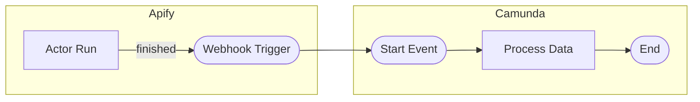

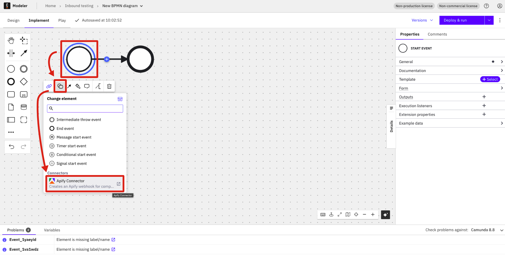

**When to use:**

- Trigger a workflow based on an external event (e.g., "Every time this daily scrape finishes, start a review process")

**Configuration:** Uses the [common inbound fields](#inbound-connectors) listed above. No additional fields are required.

### Message Start Event

Use the **Apify Message Start Event Connector** to start a process instance through message correlation. Unlike the plain Start Event, this variant uses Camunda's message correlation mechanism, which prevents duplicate instances for the same correlation key and supports starting embedded subprocesses.

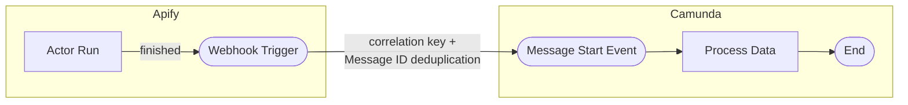

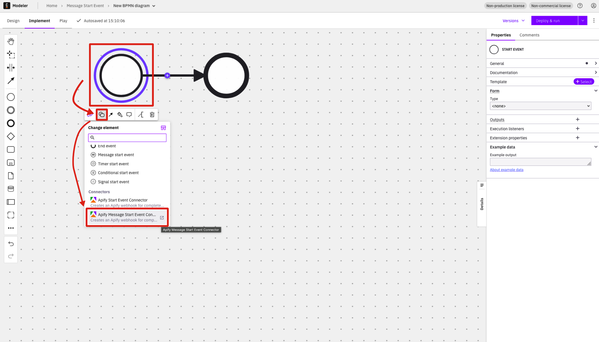

**When to use:**

- You need to prevent duplicate process instances for the same run (using correlation keys)
- You want to start an embedded subprocess from an Apify event

**Configuration:** Uses the [common inbound fields](#inbound-connectors), plus:

| Setting | Description |
| --------- | ------------- |
| **Subprocess Correlation Required** | Select `Correlation not required` (default) or `Correlation required`. When set to required, the Correlation Key fields become visible. This is needed for event-based subprocess message start events. |
| **Correlation Key (Process)** | *(Shown when correlation is required)* FEEL expression for the correlation key from process variables (e.g., `=previousEventResponse.data.id`) |
| **Correlation Key (Payload)** | *(Shown when correlation is required)* FEEL expression to extract the correlation key from the incoming webhook (e.g., `=connectorData.runId`) |
| **Message ID Expression** | *(Optional)* Expression to extract a unique ID from the webhook payload for deduplication (e.g., `=connectorData.eventData.actorRunId`). Camunda uses this ID to deduplicate messages — if a webhook with the same Message ID arrives twice, the second one is silently ignored. |
| **Message TTL** | *(Optional)* Time-to-live for the message in the broker as an ISO-8601 duration (e.g., `PT1H` for 1 hour) |

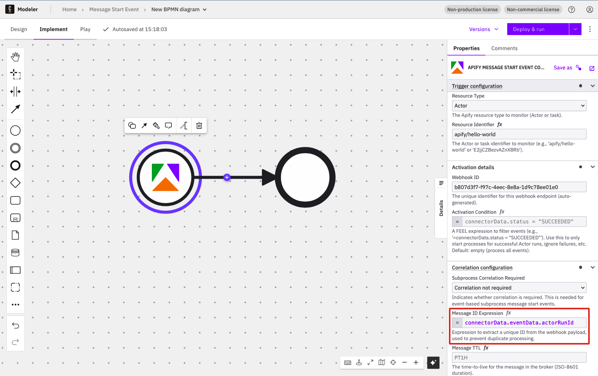

### Intermediate Catch Event

Use the **Apify Intermediate Catch Event Connector** to pause a running process and wait for a callback from Apify. The process resumes when a matching webhook arrives. This connector uses **correlation keys** to match the webhook to the correct process instance — the key from the webhook payload must exactly match a process variable.

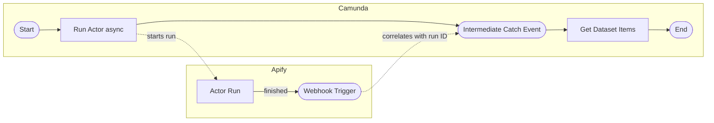

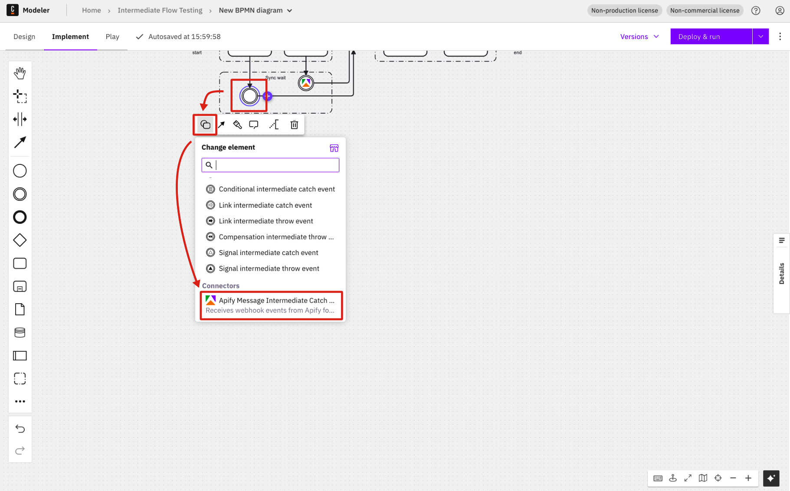

**When to use:**

- Long-running Actor (async execution) where you want to wait without blocking process engine resources
- Running tasks in parallel while waiting for a scrape to complete

**Configuration:** Uses the [common inbound fields](#inbound-connectors), plus:

| Setting | Description |
| --------- | ------------- |
| **Correlation Key (Process)** | FEEL expression for the correlation key from process variables (e.g., `=runResult.data.id`) |
| **Correlation Key (Payload)** | FEEL expression to extract the correlation key from the incoming webhook (e.g., `=connectorData.runId`) |
| **Message ID Expression** | *(Optional)* Expression to extract a unique ID from the webhook payload for deduplication |
| **Message TTL** | *(Optional)* Time-to-live for the message in the broker as an ISO-8601 duration (e.g., `PT1H`) |

To ensure the webhook resumes the correct process instance, the **Correlation Key (Process)** value must exactly match the **Correlation Key (Payload)** value extracted from the incoming webhook.

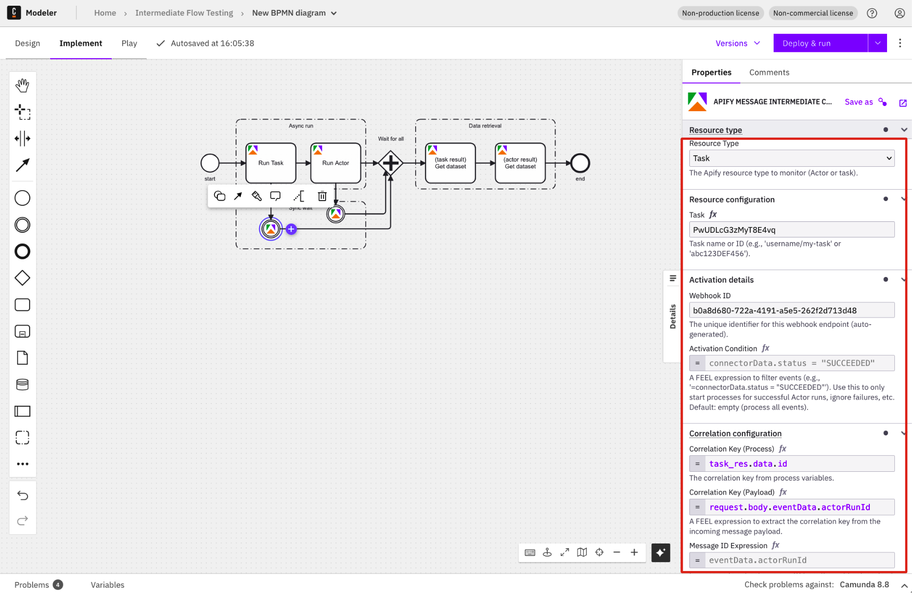

### Boundary Event

Use the **Apify Boundary Event Connector** to react to an Apify event while an activity is still running. A boundary event is attached to an activity (e.g., a user task or subprocess) and triggers when the specified webhook event arrives.

Boundary events can be **interrupting** (terminates the attached activity) or **non-interrupting** (allows the activity to continue while a parallel path runs).

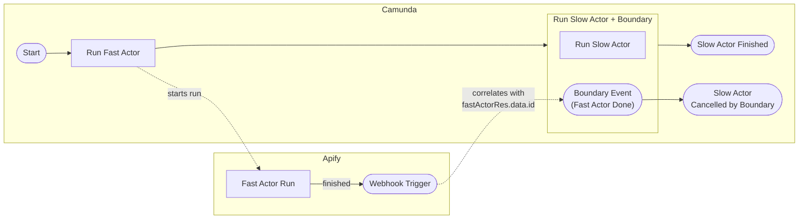

**When to use:**

- Cancel or redirect a running activity when an Apify run completes, fails, or times out
- Implement timeout/fallback logic (e.g., if a scrape fails, take an alternative path)

**Configuration:** Same as the [Intermediate Catch Event](#intermediate-catch-event) (common inbound fields plus Correlation Keys, Message ID Expression, and Message TTL). Additionally, choose whether the boundary event is **interrupting** or **non-interrupting**.

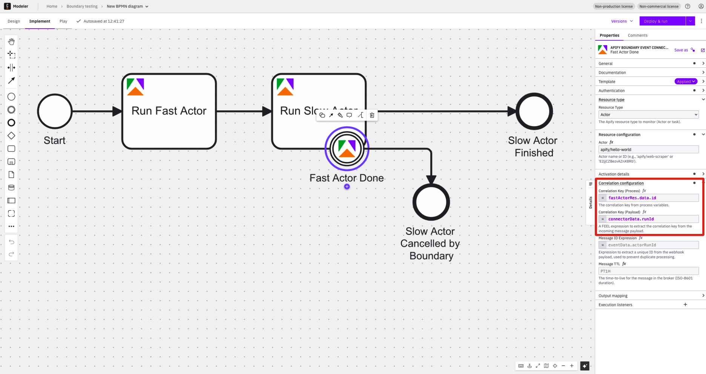

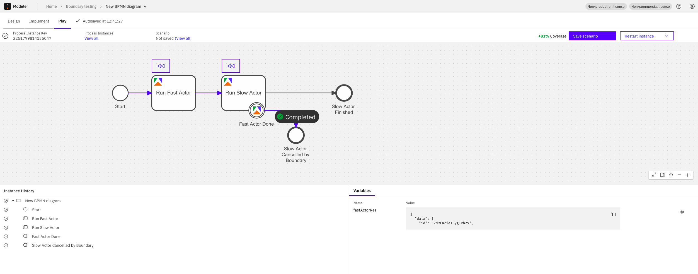

## Set up your first process

This walkthrough guides you through creating and running an outbound connector process in Camunda.

1. Create a new project in your Camunda Modeler.

    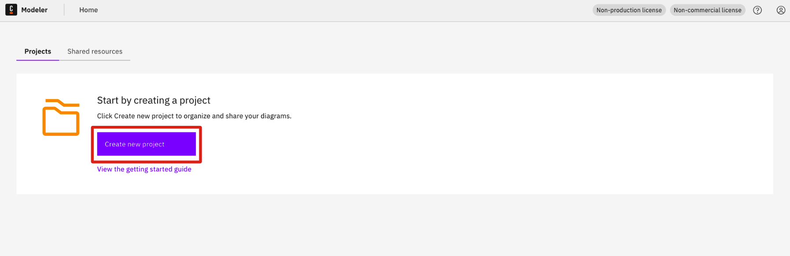

2. Upload the outbound connector template to your project.

    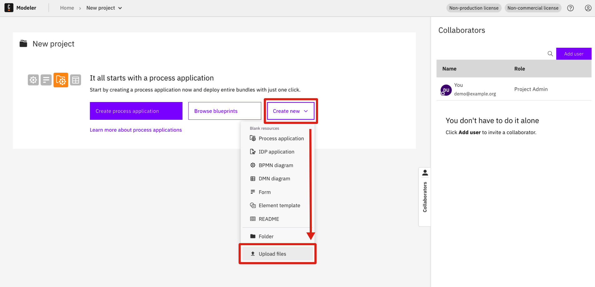

3. **Publish** the connector template to the project.

    

4. Create a new **BPMN diagram**.

    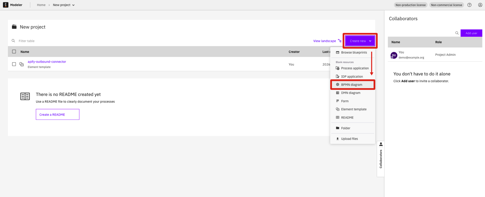

5. Design a process using the **Apify Connector** as a service task.

    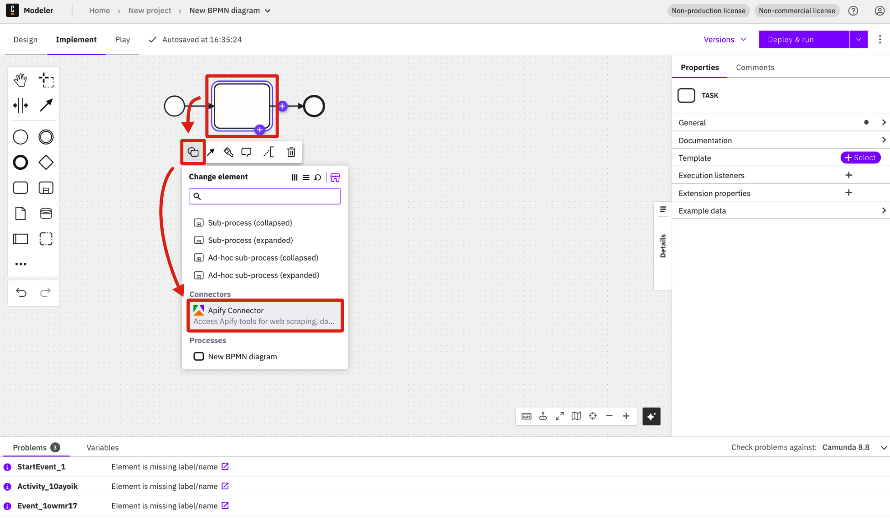

6. Set the connector input variables and run the process. For a quick smoke test, use these values:

    | Field | Value |
    | ------- | ------- |
    | **API Token** | Your Apify API token |
    | **Operation** | `Run Actor` |
    | **Actor** | `apify/hello-world` |
    | **Input Body** | *(Optional)* `={ "message": "Hello from Camunda!" }` |
    | **Wait for Finish** | `true` |

    The process should complete in approximately 30 seconds.

    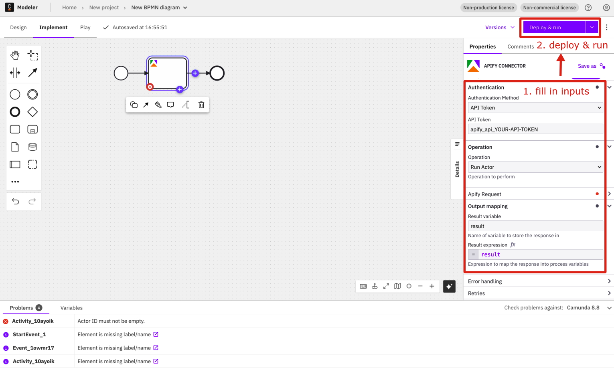

7. Find the process in **Camunda Operate**.

    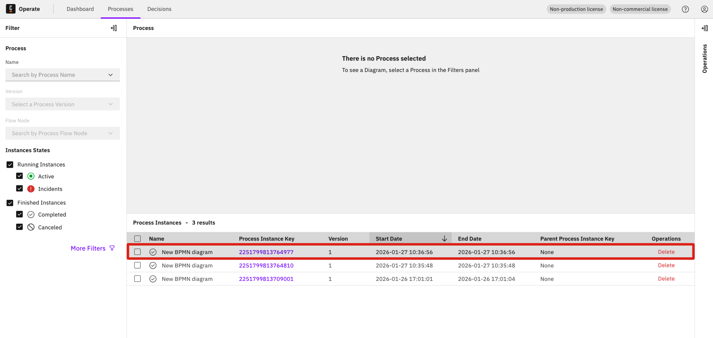

8. Verify the process result in **Camunda Operate**.

    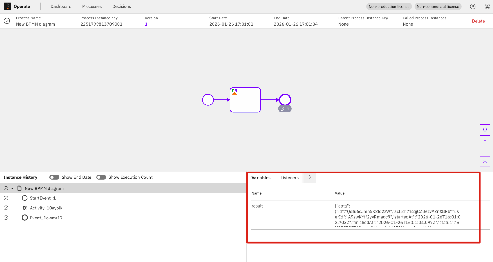

### Understand the outbound response

The **Run Actor** and **Run Task** API responses are wrapped in a `data` envelope. The key fields you will use in subsequent process steps:

| Field | Example FEEL expression | Description |
| ------- | ------------------------ | ------------- |
| `id` | `=runResult.data.id` | The run ID (used for correlation in inbound events) |
| `status` | `=runResult.data.status` | Run status (`RUNNING`, `SUCCEEDED`, `FAILED`, etc.) |
| `defaultDatasetId` | `=runResult.data.defaultDatasetId` | Dataset ID (pass to Get dataset items) |
| `defaultKeyValueStoreId` | `=runResult.data.defaultKeyValueStoreId` | Key-value store ID (pass to Get key-value store record) |

For the full response schema, see:

- [Run Actor API](https://docs.apify.com/api/v2/act-runs-post): response for Run Actor
- [Run Task API](https://docs.apify.com/api/v2/actor-task-runs-post): response for Run Task

## Deploy vs Play mode

When your process is ready, you can run it in two ways:

- **Deploy**: Creates a persistent webhook in Apify. Use this for processes with inbound start events (Start Event, Message Start Event) — deploy without running, then trigger from Apify.
- **Play**: Runs the process immediately in a sandbox with temporary webhooks. Use this for outbound flows or flows with intermediate/boundary inbound events.

| Mode | Webhooks | Best for |
| ------ | ---------- | ---------- |
| **Play mode** | Temporary (deleted after run) | Outbound flows, intermediate/boundary inbound events |
| **Deploy** (without Run) | Persistent (keep listening) | Inbound start events |
| **Deploy & Run** | Persistent | Flows starting with outbound steps (first instance runs immediately) |

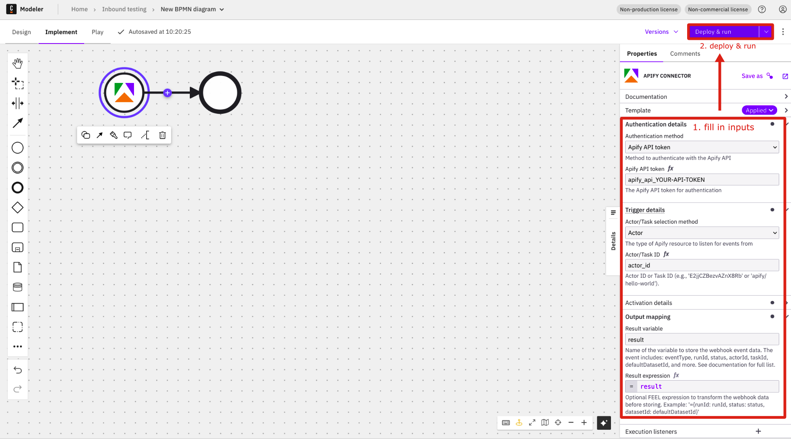

## Usage patterns

### Async execution with Parallel Gateway

This is the recommended pattern for handling long-running scrapes reliably. It prevents timeout issues and allows other tasks while waiting.

```text
                              ┌───→ [Other Tasks (Optional)] ────┐
[Start] → [Run Actor Async] → [Fork]                           [Join] → [Get Dataset] → [End]
                              └───→ [Wait for Webhook] ──────────┘
```

**Steps:**

1. **Run Actor (Async)**:
    - Select `Run Actor` or `Run task`
    - Set **Wait for Finish** to `false`
    - Save the response to a result variable (e.g., `runResult`)

2. **Parallel Gateway (Fork)**: Split the flow immediately after the run starts.

3. **Apify Intermediate Catch Event**:
    - Set **Correlation Key (Process)** to `=runResult.data.id`
    - Set **Correlation Key (Payload)** to `=connectorData.runId`

4. **Parallel Gateway (Join)**: Merge the branches. The process continues only when the webhook is received.

5. **Get dataset items**:
    - Set **Dataset** to `=runResult.data.defaultDatasetId`

### Boundary Event for runtime reactions

A [Boundary Event](https://docs.camunda.io/docs/components/modeler/bpmn/events/) attaches directly to an activity (task or subprocess) and fires when an Apify webhook arrives **while that activity is still running**. Unlike the Async Execution pattern above, the boundary event does **not** wait for the attached activity to finish — it interrupts or runs alongside it.

- **Interrupting boundary event**: Cancel a running activity when an external signal arrives (e.g., abort a long-running scrape when a validation check fails or times out).
- **Non-interrupting boundary event**: Spawn a parallel path without stopping the activity (e.g., send a progress notification while a long-running scrape continues).

**Example flow (interrupting):**

```text
                                    ┌──(Apify Boundary Event)──→ [Handle Failure] → [End]
[Start] → [Run Actor Async] → [Run Large Scrape]
                                    └──(normal completion)─────→ [Process Results] → [End]
```

If the async Actor run fails while the large scrape is still running, the boundary event interrupts the scrape and redirects the flow to a failure-handling path.

:::tip
If you need the run results (dataset, key-value store) after the Apify event, use the [Async execution with Parallel Gateway](#async-execution-with-parallel-gateway) pattern instead. The boundary event pattern is best when you want to **react** to an event (failure, timeout, status change) rather than **collect** its output.
:::

## Reference

### Finding resource IDs

You can find IDs in the [Apify Console](https://console.apify.com/):

- **Actor ID**: `https://console.apify.com/actors/<THIS_IS_THE_ID>` or see the API tab
- **Task ID**: `https://console.apify.com/actors/tasks/<THIS_IS_THE_ID>` or see the API tab
- **Dataset ID**: Found in the Storage section or run details

### Common FEEL expressions

Camunda uses FEEL (Friendly Enough Expression Language) for dynamic values. The leading `=` in each expression tells Camunda to evaluate what follows as a FEEL expression rather than a literal string.

| Expression | Use case |
| ------------ | ---------- |
| `=secrets.APIFY_TOKEN` | Accessing a secure credential |
| `=runResult.data.id` | Accessing the run ID from a response |
| `=runResult.data.defaultDatasetId` | Accessing the default dataset ID |
| `=connectorData.status` | Reading the status from inbound webhook payload |
| `=connectorData.runId` | Reading the run ID from inbound webhook payload |

### Webhook payload structure

When an Apify inbound connector is triggered, it receives a payload with event and run information.

**Top-level structure:**

- `connectorData`: Simplified object with the most important fields
- `request`: The raw webhook request including headers and body
- `connectorData.resource`: The full Actor Run object

```json title="Webhook payload example"
{
  "connectorData": {
    "eventType": "ACTOR.RUN.SUCCEEDED",
    "userId": "user1234",
    "createdAt": "2026-01-03T12:00:00.000Z",
    "runId": "efgh5678",
    "status": "SUCCEEDED",
    "actorId": "abcd1234",
    "defaultDatasetId": "d9E0f1G2h3I4j5K6",
    "eventData": {
      "actorId": "abcd1234",
      "actorRunId": "efgh5678"
    },
    "resource": {
      "id": "efgh5678",
      "status": "SUCCEEDED",
      "stats": { "..." },
      "options": { "..." },
      "usage": { "..." }
    }
  },
  "request": {
    "body": {
      "eventType": "ACTOR.RUN.SUCCEEDED",
      "resource": { "..." }
    },
    "headers": { "..." }
  }
}
```

### Event types and statuses

**Event types (`eventType`):**

- `ACTOR.RUN.CREATED`: A new Actor run has been created
- `ACTOR.RUN.SUCCEEDED`: Run finished with status `SUCCEEDED`
- `ACTOR.RUN.FAILED`: Run finished with status `FAILED`
- `ACTOR.RUN.ABORTED`: Run finished with status `ABORTED`
- `ACTOR.RUN.TIMED_OUT`: Run finished with status `TIMED-OUT`
- `ACTOR.RUN.RESURRECTED`: Run has been resurrected (moved back to `RUNNING`)

**Run statuses (`status`):**

- `SUCCEEDED`
- `FAILED`
- `ABORTED`
- `TIMED-OUT`

:::note

The event type uses an underscore (`TIMED_OUT`) while the run status uses a hyphen (`TIMED-OUT`). This is how the Apify API returns these values.

:::

## Troubleshooting

| Issue | Solution |
| ------- | ---------- |
| Webhook not triggering | Ensure you have deployed the process. For Start Events, deploying automatically creates the webhook in Apify. Check the **Integrations** tab of your Actor in Apify Console to verify the webhook exists. |
| Process stuck at Intermediate Event | Check your **Correlation Keys**. The value in the process variable must exactly match the value in the webhook payload. Use Camunda Operate to inspect variable values and compare with the `connectorData.runId` in the connector runtime logs. |
| `401 Unauthorized` | Check your API Token. Regenerate it in [Apify Console](https://console.apify.com/settings/integrations) (**Settings → Integrations**) if necessary. |

If you have any questions or need help, feel free to reach out on our [developer community on Discord](https://discord.com/invite/jyEM2PRvMU).
