**Learn how to integrate Apify Actors with Camunda 8 for automated BPMN workflows.**

---

[Camunda](https://camunda.com/) is a process orchestration platform that enables you to design, automate, and optimize business workflows using BPMN. With the [Apify Connector for Camunda](https://github.com/apify/apify-camunda-integration), you can run Apify Actors, tasks, or retrieve datasets directly from your BPMN processes, and trigger workflows when Actor runs complete.

## Get started

To use the Apify integration with Camunda, you will need:

- An [Apify account](https://console.apify.com/)
- A [Camunda 8](https://camunda.com/) environment (self-managed or SaaS)
- The [Apify Camunda Connector](https://github.com/apify/apify-camunda-integration)

## Connector types

The Apify Camunda Connector provides two types of connectors:

- **Outbound Connector** - Calls the Apify API to run Actors, tasks, or retrieve datasets from your BPMN process.
- **Inbound Connector** - Listens for webhook events from Apify to trigger or continue processes when Actor runs finish.

## Set up the Outbound Connector

The Outbound Connector allows you to call the Apify API from your BPMN process.

### Configure the connector template

1. In **Web Modeler**, create a new project or open an existing one.

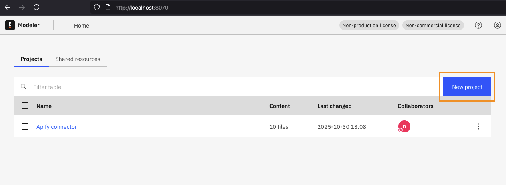

2. Upload the outbound connector template JSON from `element-templates/apify-outbound-connector.json`.

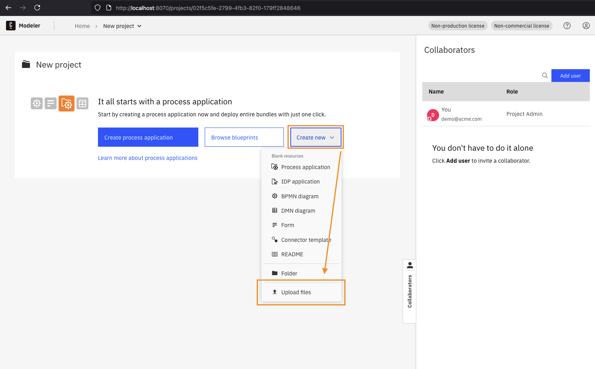

3. Click **Publish** to make the connector template available in your project.

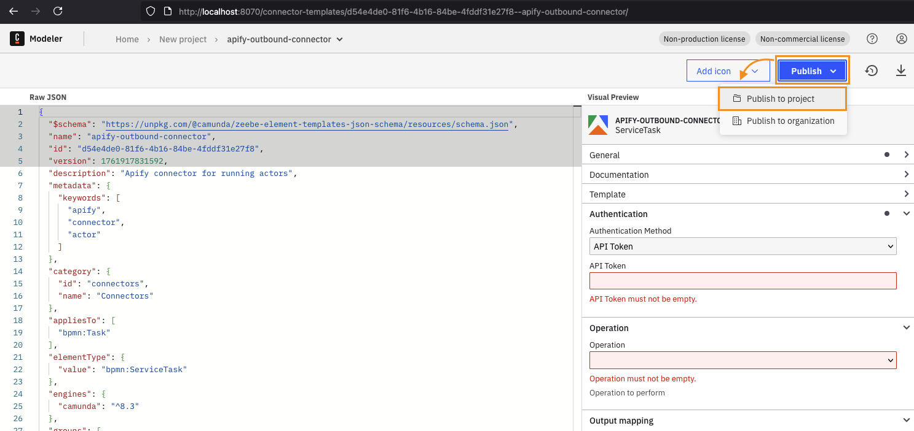

### Create a BPMN process with the connector

1. Create a new **BPMN diagram** in your project.

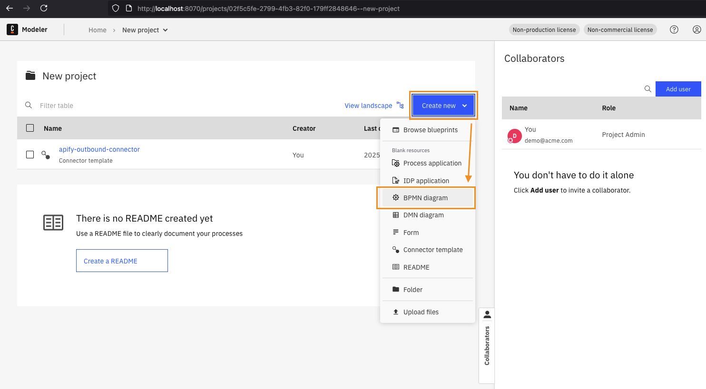

2. Add a service task and select the **Apify Connector** as the task type.

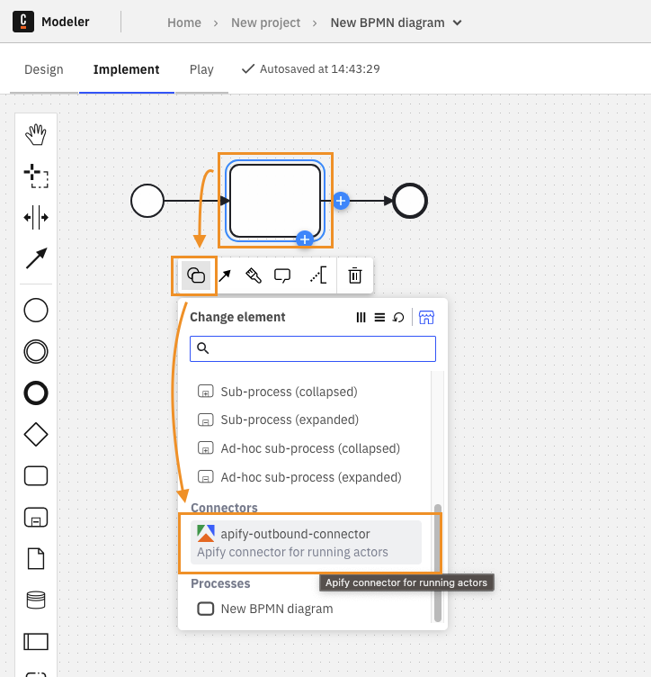

3. Configure the connector:
   - **API Token**: Your Apify API token from [Settings → Integrations](https://console.apify.com/account#/integrations)
   - **Resource ID**: The Actor or Task ID (use the ID format like `abcdef123456`, not the name with tilde)
   - **Input**: JSON input for the Actor or Task (optional)

4. Deploy and run your process.

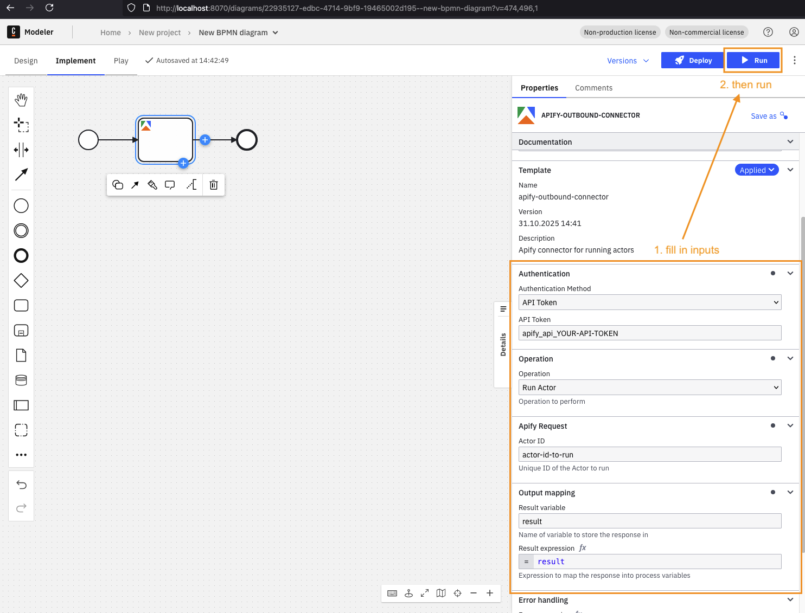

5. Monitor the run status in **Camunda Operate**.

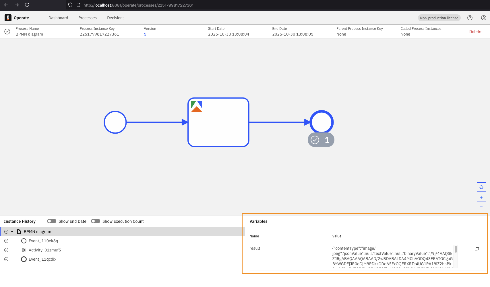

## Set up the Inbound Connector (Start Event)

The Inbound Connector listens for webhook events from Apify. When a configured event occurs (e.g., Actor run finishes), Apify sends a webhook to your connector, which triggers a new process instance in Camunda.

### Configure the connector template

1. In **Web Modeler**, upload the inbound connector templates:
   - **Start Event template**: `element-templates/apify-inbound-connector.json`
   - **Intermediate Event template**: `element-templates/apify-inbound-intermediate-connector.json`

2. Click **Publish** for both templates.

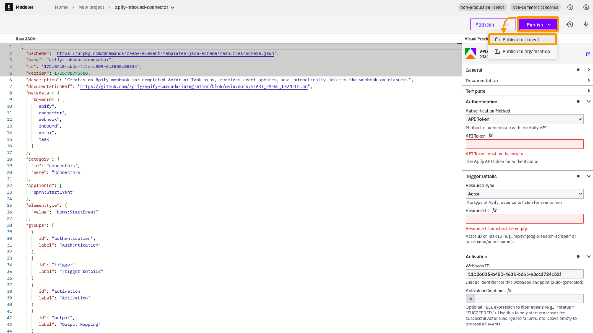

### Create a BPMN process with the Start Event

1. Create a new **BPMN diagram**.

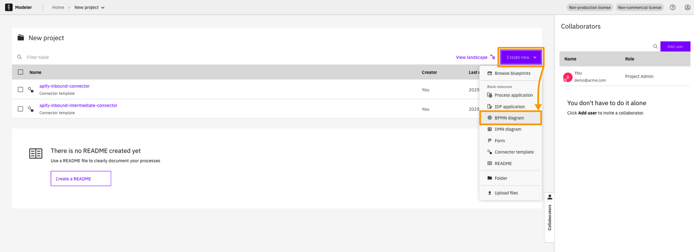

2. Design a process with an **Apify Inbound Connector** as the start event.

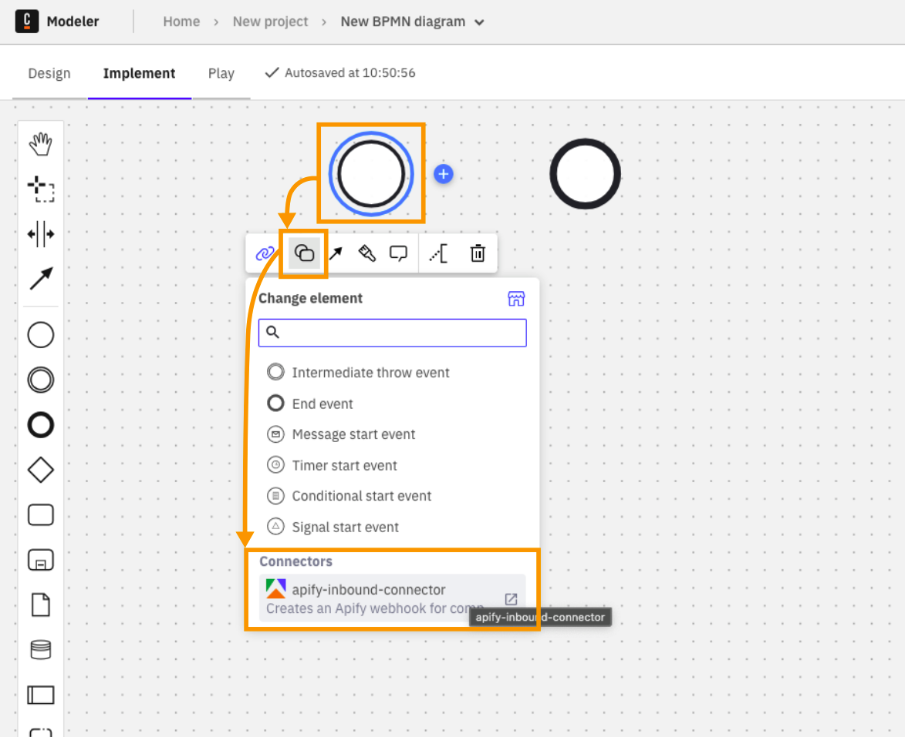

3. Configure the **Start Node**:
   - **Token**: Your Apify API token
   - **Resource ID**: The Actor or Task ID (use the ID format, not the name with tilde)
   - **Output Variable**: Variable name to store the webhook result (e.g., `webhookResult`)

4. Click **Deploy**. This automatically creates a webhook in Apify for the specified Actor or Task.

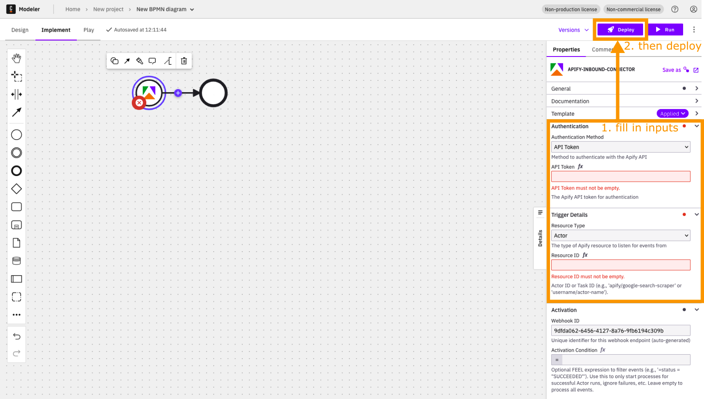

5. Verify the webhook was created by navigating to your Actor page in Apify Console and checking the **Integrations** tab.

6. Trigger the event by running the Actor on Apify.

7. Monitor the process in **Camunda Operate**. Select the **Finished** filter to see completed processes.

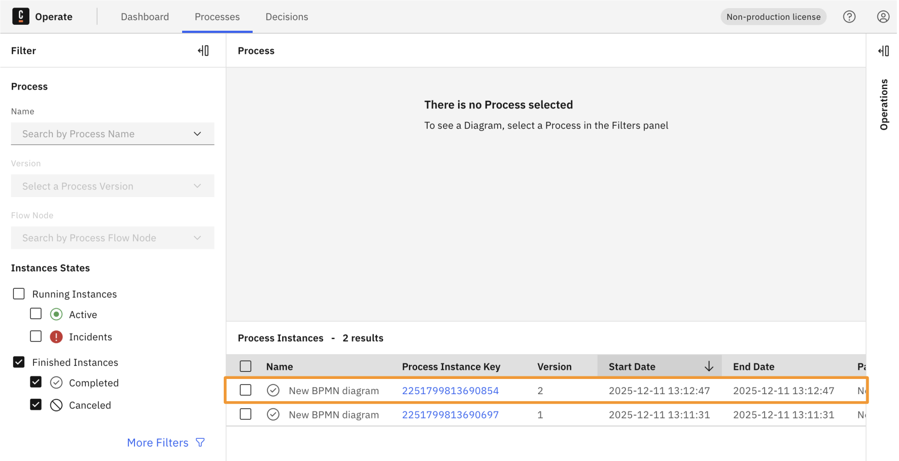

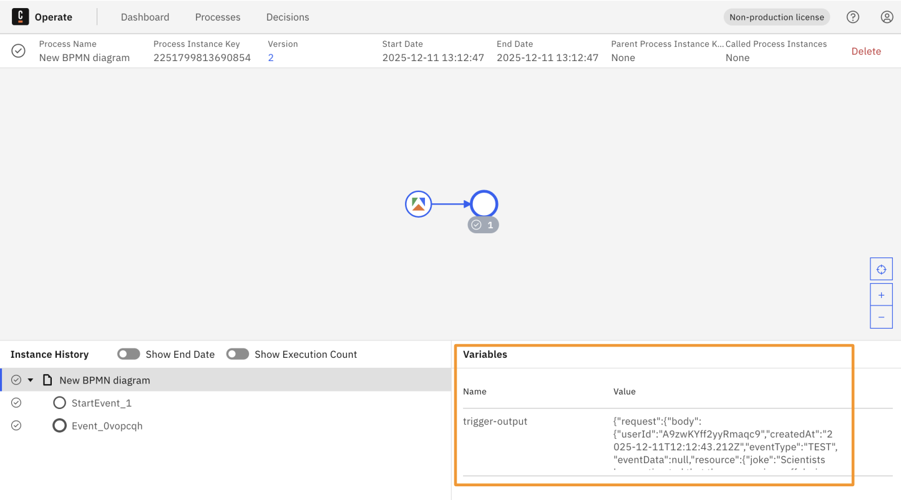

## Set up the Inbound Connector (Intermediate Event)

The Intermediate Event Connector allows you to pause a running process and wait for an Apify webhook event before continuing. This is useful for long-running Actors where you want to continue the process only when the specific run finishes.

### How correlation works

Unlike the Start Event, an Intermediate Event needs to know which specific process instance to continue. This is done via **Correlation Keys**.

Think of it as matching a ticket:
1. **Correlation key (process)**: The "ticket number" stored in your process (e.g., a `userId` or `runId` from a previous step).
2. **Correlation key (payload)**: The "ticket number" found in the incoming Apify webhook.

When they match, the process continues.

### Create a BPMN process with Start and Intermediate Events

1. Design your BPMN process with an **Apify Inbound Start Event** followed by an **Apify Inbound Intermediate Event**.

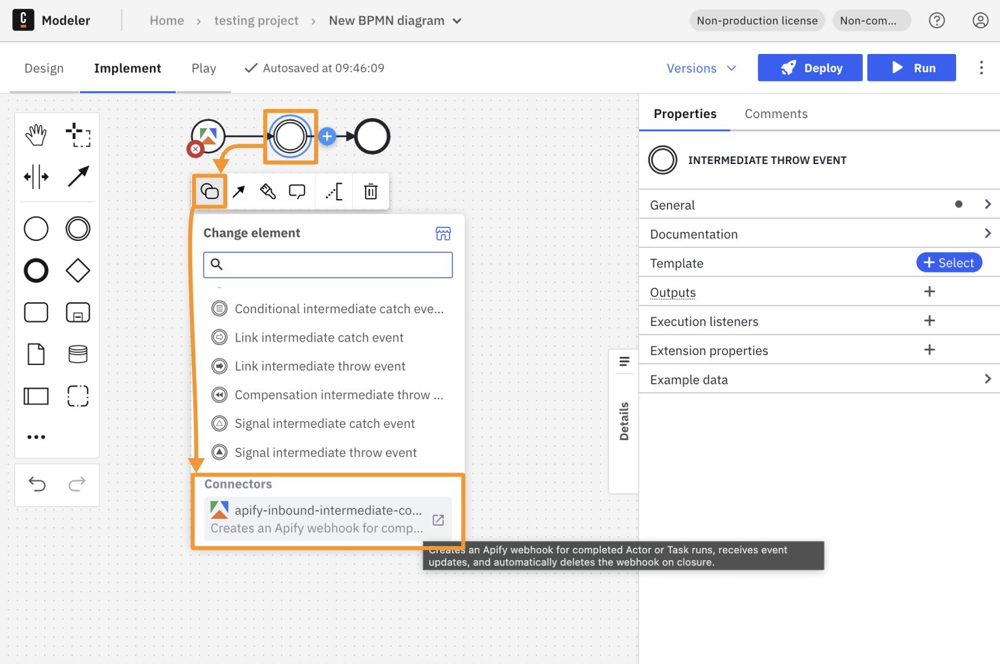

2. Configure the **Start Event**:
   - Set the **Result Variable** to `start_res`
   - This variable stores the payload data from the first webhook, including the `userId` or `runId`

3. Configure the **Intermediate Event**:
   - **Token**: Your Apify API token
   - **Resource ID**: The Actor or Task ID to wait for
   - **Correlation key (process)**: `=start_res.request.body.userId` (matches the ID stored from the start)
   - **Correlation key (payload)**: `=request.body.userId` (extracts the ID from the incoming webhook)
   - **Result Variable**: `inter_res`

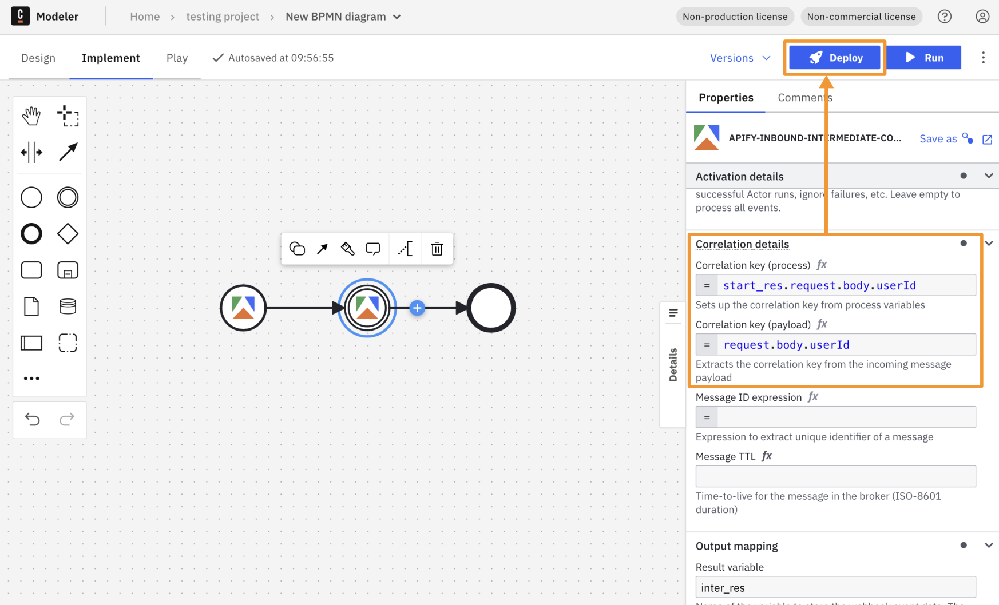

4. Deploy and run:
   - **Deploy** the process to your Camunda instance
   - **Trigger the Start Event**: Run the first Actor on Apify. The process instance will wait at the Intermediate Event.
   - **Trigger the Intermediate Event**: Run the second Actor on Apify.
   - **Match**: If the correlation keys match, the process instance finishes successfully.

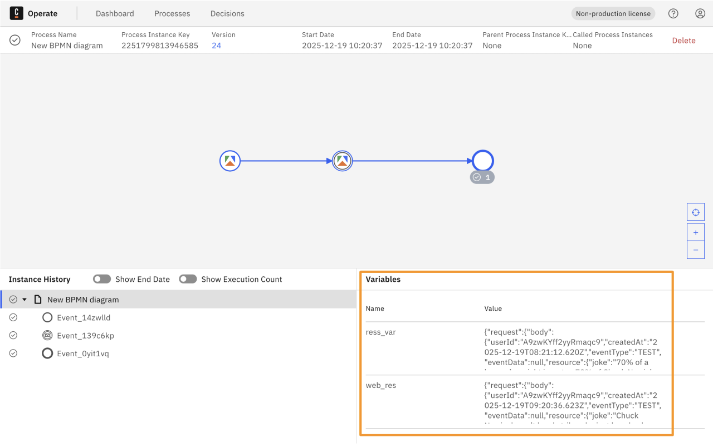

## Where to find your IDs

When configuring the connector, you'll need to provide the correct resource IDs. Here's how to find them in Apify Console:

- **Actor ID**: [Actor detail page](https://console.apify.com/actors) → API panel or URL.
  - Example URL: `https://console.apify.com/actors/<actorId>`
  - Actor name format: owner~name (e.g., `apify~website-scraper`)
- **Task ID**: [Task detail page](https://console.apify.com/actors/tasks) → API panel or URL.
  - Example URL: `https://console.apify.com/actors/tasks/<taskId>`

:::tip Use the ID, not the name

Always use the Actor or Task **ID** (e.g., `abcdef123456`), not the name with tilde (e.g., `username~actor-name`). The ID can be found in the URL or API panel of the resource detail page.

:::

## Troubleshooting

### Common issues

| Issue | Solution |
|-------|----------|
| Webhook not received | Ensure your connector's webhook URL is publicly accessible. For local development, use a tunneling service like [ngrok](https://ngrok.com/). |
| "Resource ID not found" | Use the Actor/Task **ID** (e.g., `abcdef123456`), not the name with tilde (e.g., `username~actor-name`). |
| Process not visible in Operate | Check the **Finished** filter - completed processes may not show in the default view. |
| Connector crashes on startup | Ensure the `CONNECTOR_BASE_URL` environment variable is set. |

### Cleaning up stale webhooks

During testing, you may accumulate webhooks. To start fresh:

1. Stop the Camunda stack:

```bash
docker-compose down -v
```

2. Restart the stack:

```bash
docker-compose up -d
```

:::caution Data loss

This will delete all your data including deployed processes, process instances, and webhooks. Webhooks created in Apify will remain and must be deleted manually in the Apify Console.

:::

If you have any questions or need help, feel free to reach out to us on our [developer community on Discord](https://discord.com/invite/jyEM2PRvMU).
