import ThirdPartyDisclaimer from '@site/sources/_partials/_third-party-integration.mdx';

[Camunda](https://camunda.com/) is a process orchestration platform for designing, automating, and optimizing business workflows using BPMN (Business Process Model and Notation, the visual language Camunda uses to define workflows). With the Apify Connectors, run Apify Actors and tasks, fetch datasets, and trigger or resume BPMN processes from Apify webhook events.

<ThirdPartyDisclaimer />

## Prerequisites

To use the Apify integration with Camunda, you need:

- An [Apify account](https://console.apify.com/)
- A [Camunda 8](https://camunda.com/) environment (version 8.8, 8.9, or 8.10), with a self-hosted connectors runtime to host the Apify connector code. Self-Managed and Hybrid setups are supported; pure Camunda SaaS is not (see [Installation](#installation) for why and how).

## Authentication

All Apify Connector operations require an Apify API token.

1. Log in to [Apify Console](https://console.apify.com/).
1. Navigate to [Settings → Integrations](https://console.apify.com/settings/integrations).
1. Copy your Apify API token.

:::tip Security best practice

In Camunda, avoid hardcoding your token directly in the process design. Instead, use [Camunda Secrets](https://docs.camunda.io/docs/components/console/manage-clusters/manage-secrets/) (e.g. `{{secrets.APIFY_TOKEN}}`) to store your Apify API token securely.

:::

## How it works

In Apify, an _Actor_ is a serverless program (e.g. a web scraper), and a _task_ is a saved configuration of an Actor with preset inputs.

The Apify Connectors expose two complementary integration directions:

- [Outbound steps](#outbound-connector) run inside your BPMN process and call the Apify API.
- [Inbound events](#inbound-connectors) listen for Apify webhooks and can start or resume Camunda processes.

<div style={{textAlign: 'center'}}>

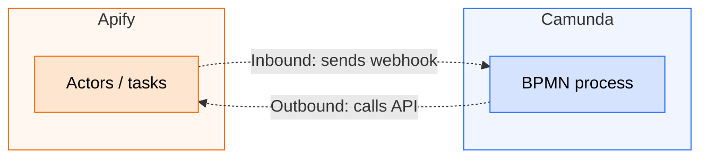
```mermaid
graph LR
    subgraph Apify
        A[Actors / tasks]
    end
    subgraph Camunda
        P[BPMN process]
    end
    A -. "Inbound: sends webhook" .-> P
    P -. "Outbound: calls API" .-> A

    classDef apify fill:#fde5d0,stroke:#f86606,color:#000
    classDef camunda fill:#d6e3ff,stroke:#246dff,color:#000
    class A apify
    class P camunda
    style Apify fill:#fff7f0,stroke:#f86606
    style Camunda fill:#f0f5ff,stroke:#246dff
```

</div>

### Where the connector runs

Camunda Connectors are Java components that execute on a **connectors runtime**. Camunda SaaS ships a managed runtime preloaded with Camunda's first-party connectors (HTTP REST, Slack, AWS, etc.), but it does not load third-party connector JARs uploaded by tenants.

The Apify Connector is a third-party JAR, so you host the connectors runtime yourself. Two deployment paths are supported:

- **Self-Managed:** you run the entire Camunda 8 stack (Zeebe, Operate, Tasklist, and the connectors runtime) on your own infrastructure.
- **Hybrid:** Zeebe and the BPMN engine run on Camunda SaaS, while you run a self-hosted connectors runtime that authenticates back to the SaaS cluster.

<div style={{textAlign: 'center'}}>

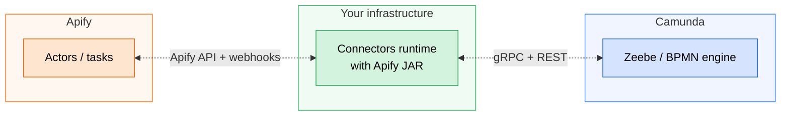
```mermaid
graph LR
    subgraph Apify
        A[Actors / tasks]
    end
    subgraph You ["Your infrastructure"]
        CR[Connectors runtime<br/>with Apify JAR]
    end
    subgraph Camunda
        Z[Zeebe / BPMN engine]
    end
    A <-. "Apify API + webhooks" .-> CR
    CR <-. "gRPC + REST" .-> Z

    classDef apify fill:#fde5d0,stroke:#f86606,color:#000
    classDef camunda fill:#d6e3ff,stroke:#246dff,color:#000
    classDef self fill:#d4f3df,stroke:#20a34e,color:#000
    class A apify
    class Z camunda
    class CR self
    style Apify fill:#fff7f0,stroke:#f86606
    style Camunda fill:#f0f5ff,stroke:#246dff
    style You fill:#f0fbf3,stroke:#20a34e
```

</div>

See [Installation](#installation) below for setup. For deeper reference, the Camunda docs cover [hosting custom connectors](https://docs.camunda.io/docs/guides/host-custom-connectors/) and [running connectors in hybrid mode](https://docs.camunda.io/docs/components/connectors/use-connectors-in-hybrid-mode/).

## Installation

Each connector release publishes two artifacts on the [GitHub Releases page](https://github.com/apify/apify-camunda-integration/releases):

| Artifact | What it is | Where it goes |
| --- | --- | --- |
| `apify-camunda-connector-<version>.jar` | The shaded connector runtime JAR (includes all dependencies) | Drop it on the Camunda connectors runtime classpath - see [Run the connectors runtime](#run-the-connectors-runtime) |
| `apify-camunda-connector-element-templates-<version>.zip` | All five element template JSONs | Upload to your Camunda **Web Modeler** project, or place into the `resources/element-templates/` directory of **Desktop Modeler** |

Pick the release whose version matches your Camunda 8 minor.

### Choose your deployment scenario

| Scenario | Supported? | Notes |
| --- | --- | --- |
| **Self-Managed** | Yes | You control the connectors runtime on your own infrastructure. |
| **Hybrid** | Yes | Zeebe runs on Camunda SaaS, while you host the connectors runtime. |
| **Pure SaaS** | No | The managed connectors runtime cannot load custom JARs. Use [Hybrid mode](https://docs.camunda.io/docs/components/connectors/use-connectors-in-hybrid-mode/) instead. |

### Run the connectors runtime

The simplest path is the official `camunda/connectors-bundle` Docker image with the Apify JAR mounted. From [Host custom connectors](https://docs.camunda.io/docs/guides/host-custom-connectors/):

```bash
docker run --rm \
  -v $PWD/apify-camunda-connector-<version>.jar:/opt/app/connector.jar \
  camunda/connectors-bundle:8.9.0
```

Substitute `<version>` with the JAR's release tag (e.g. `1.0.0`). The `camunda/connectors-bundle` tag should match your Camunda 8 minor - `8.9.0` for an 8.9 cluster, `8.8.0` for 8.8, and so on.

**Hybrid mode** (your connectors runtime attached to Camunda SaaS Zeebe): pass cluster credentials as environment variables alongside the JAR mount. Find the cluster ID, region, and client credentials in Camunda Console under your cluster's **API** tab.

```bash
docker run --rm \
  -v $PWD/apify-camunda-connector-<version>.jar:/opt/app/connector.jar \
  -e CAMUNDA_CLIENT_MODE=saas \
  -e CAMUNDA_CLIENT_CLOUD_CLUSTERID='<YOUR_CLUSTER_ID>' \
  -e CAMUNDA_CLIENT_CLOUD_REGION='<YOUR_REGION>' \
  -e CAMUNDA_CLIENT_AUTH_CLIENTID='<YOUR_CLIENT_ID>' \
  -e CAMUNDA_CLIENT_AUTH_CLIENTSECRET='<YOUR_CLIENT_SECRET>' \
  camunda/connectors-bundle:8.9.0
```

For production, bake the JAR into a custom image:

```dockerfile
FROM camunda/connectors-bundle:8.9.0
COPY apify-camunda-connector-<version>.jar /opt/app/connector.jar
```

See [Host custom connectors](https://docs.camunda.io/docs/guides/host-custom-connectors/) and [Use connectors in hybrid mode](https://docs.camunda.io/docs/components/connectors/use-connectors-in-hybrid-mode/) for the full configuration reference (scopes, alternate auth modes, Helm charts).

### Make the runtime publicly reachable

The connectors runtime must be reachable from the public internet so Apify can deliver webhook events to it.

- **Production:** expose the runtime through your ingress, reverse proxy, or load balancer with a stable HTTPS URL.
- **Local development:** use a tunneling tool like [ngrok](https://ngrok.com/) (`ngrok http <runtime-port>`) and paste the public tunnel URL into the **Camunda webhook URL** field on each inbound template.

The connector registers and removes the Apify-side webhook automatically on BPMN deploy and undeploy. See [Configure the Camunda webhook URL](#configure-the-camunda-webhook-url) below for more on this field.

## Outbound connector

The Apify Outbound Connector lets your BPMN process invoke operations on Apify. It supports the following five operations:

- [Run Actor](#run-actor)
- [Run task](#run-task)
- [Scrape single URL](#scrape-single-url)
- [Get dataset items](#get-dataset-items)
- [Get key-value store record](#get-key-value-store-record)

To learn where to find the Actor, task, or dataset IDs in Apify Console, see [Find resource IDs](#find-resource-ids).

:::note FEEL expressions

A leading `=` in a value denotes a FEEL expression. For example, `=runResult.data.id` means "evaluate the FEEL expression `runResult.data.id`".

:::

### Actions

#### Run Actor

Start a new execution of an Actor.

| Setting | Description |
| --------- | ------------- |
| **Operation** | Select `Run Actor` |
| **Actor** | The Actor name or ID (e.g. `apify/web-scraper` or `E2jjCZBezvAZnX8Rb`) |
| **Input Body** | _(Optional)_ JSON input configuration for the run (e.g. `={ "message": "Hello from Camunda!" }`) |
| **Wait for Finish** | `true` (Synchronous) or `false` (Asynchronous) |
| **Timeout (seconds)** | _(Optional)_ Maximum duration for the run |
| **Memory (MB)** | _(Optional)_ Memory allocation; one of 128, 256, 512, 1024, 2048, 4096, 8192, 16384, or 32768 MB |
| **Build** | _(Optional)_ Build tag to use (defaults to `latest`) |

Wait for Finish options:

- `true` (Synchronous): The process waits until the Actor run completes. Use for short-running tasks.
- `false` (Asynchronous): The process starts the run and immediately moves to the next step. Use for long-running scrapes or with [intermediate catch events](#intermediate-catch-event) (see [Async execution with parallel gateway](#async-execution-with-parallel-gateway) for the full pattern).

#### Run task

Execute a saved Actor task.

| Setting | Description |
| --------- | ------------- |
| **Operation** | Select `Run task` |
| **Task** | The task name or ID (e.g. `username/my-task` or `abc123DEF456`) |
| **Input Override** | _(Optional)_ JSON to override the task's saved input |
| **Wait for Finish** | `true` (Synchronous) or `false` (Asynchronous) |
| **Timeout (seconds)** | _(Optional)_ Maximum duration |
| **Memory (MB)** | _(Optional)_ Memory allocation; one of 128, 256, 512, 1024, 2048, 4096, 8192, 16384, or 32768 MB |
| **Build** | _(Optional)_ Build tag to use (defaults to `latest`) |

#### Scrape single URL

Scrape a webpage using one of Apify's standard crawlers.

| Setting | Description |
| --------- | ------------- |
| **Operation** | Select `Scrape single URL` |
| **URL** | The full URL to scrape (e.g. `https://example.com`) |
| **Crawler Type** | `Cheerio (Raw HTTP)` (lightweight), `Adaptive`, or `Firefox (Headless Browser)` |

#### Get dataset items

Retrieve the results of an Actor run. Typically used after a Run Actor task has completed; see [Async execution with parallel gateway](#async-execution-with-parallel-gateway) for the recommended end-to-end flow.

| Setting | Description |
| --------- | ------------- |
| **Operation** | Select `Get dataset items` |
| **Dataset** | The dataset ID (use a variable from a previous run, e.g. `=runResult.data.defaultDatasetId`) |
| **Offset** | _(Optional)_ Number of items to skip from the beginning (default: `0`) |
| **Limit** | _(Optional)_ Maximum number of items to return (default: no limit) |

#### Get key-value store record

Fetch a specific record from a key-value store.

| Setting | Description |
| --------- | ------------- |
| **Operation** | Select `Get key-value store record` |
| **Key-Value Store** | The store ID (e.g. `=runResult.data.defaultKeyValueStoreId`) |
| **Key** | The record key to retrieve (e.g. `OUTPUT`) |

### Output mapping

Each outbound operation returns a JSON object within a `data` envelope.

- **Result Variable**: Use this field (e.g. `runResult`) to store the entire JSON response as a process variable.
- **Result Expression**: Optionally, provide a FEEL expression to extract and map specific fields from the response to process variables.

Use this to choose the entire response object or to extract only the specific data needed for later process steps.

Example: To map the run ID and dataset ID from the response to distinct process variables, use the following Result Expression:

```text
= { runId: response.data.id, datasetId: response.data.defaultDatasetId }
```

### Errors and retries

All outbound operations support error handling and automatic retries. These fields appear in the Modeler under the **Error handling** and **Retries** groups.

| Setting | Description |
| --------- | ------------- |
| **Error Expression** | _(Optional)_ A FEEL expression to handle errors (e.g. `if error.code = "ACTOR_NOT_FOUND" then null else error`) |
| **Retries** | Number of retry attempts (default: `3`) |
| **Retry backoff** | ISO-8601 duration to wait between retries (default: `PT0S`, no delay; e.g. `PT5S` for 5 seconds) |

:::note Automatic error classification

The connector distinguishes user-input errors from transient errors automatically. Input problems (HTTP 4xx from Apify, such as an invalid Actor ID or malformed input) are surfaced as input incidents and are _not_ retried; the message states what to fix. Transient problems (HTTP 5xx, rate limiting, or network failures) are retried according to the **Retries** and **Retry backoff** settings above.

:::

## Inbound connectors

Inbound connectors enable Apify to start or resume your Camunda processes via webhooks.

- The connector receives webhooks whenever a run reaches a terminal status (`SUCCEEDED`, `FAILED`, `TIMED_OUT`, or `ABORTED`). The connector monitors all four simultaneously; use the Activation Condition to filter which events trigger your process.
- Activation Condition: Use this optional filter to specify which events should actually trigger the connector.
- Compatibility: Inbound connectors work in Self-Managed and Hybrid setups (your connectors runtime hosts the Apify code; see [Installation](#installation)).

See [Configure the Camunda webhook URL](#configure-the-camunda-webhook-url) for one-time setup instructions.
For end-to-end examples, refer to [Usage patterns](#usage-patterns).

### Configure the Camunda webhook URL

When an Actor or task run reaches a terminal status, Apify needs to know where to send (POST) the event data. The destination is your Camunda cluster's inbound webhook endpoint.

:::note Managed connectors runtime

The Camunda Connector SDK does not expose its own callback address - especially in Camunda SaaS environments, where Camunda manages the connectors runtime.

:::

To set it up:

1. Provide the base URL: In each BPMN template, fill in the **Camunda webhook URL** field with the base URL of your connector's endpoint.
1. Register the callback automatically: When you deploy the process, the connector appends `/inbound/{webhookId}` to your base URL and registers this full callback URL with Apify.

Apify then delivers terminal event webhooks to your Camunda processes through this registered URL.

<div style={{textAlign: 'center'}}>

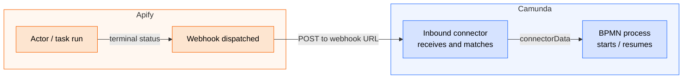
```mermaid
graph LR
    subgraph Apify
        A[Actor / task run] -->|terminal status| B[Webhook dispatched]
    end
    B -->|POST to webhook URL| C
    subgraph Camunda
        C[Inbound connector<br/>receives and matches] -->|connectorData| D[BPMN process<br/>starts / resumes]
    end

    classDef apify fill:#fde5d0,stroke:#f86606,color:#000
    classDef camunda fill:#d6e3ff,stroke:#246dff,color:#000
    class A,B apify
    class C,D camunda
    style Apify fill:#fff7f0,stroke:#f86606
    style Camunda fill:#f0f5ff,stroke:#246dff
```

</div>

#### Find the URL

The URL is the public address of _your connectors runtime_ - the one hosting the Apify JAR (see [Installation](#installation)). Apify POSTs event payloads to that URL.

**Self-Managed or Hybrid:** Use the public URL of your connectors-runtime reverse proxy or ingress (the host serving the `/inbound/*` endpoints). If you set a `contextPath` in your Helm chart or deployment config, include it in the URL. See [Use connectors in hybrid mode](https://docs.camunda.io/docs/components/connectors/use-connectors-in-hybrid-mode/) for hybrid setup details.

**Local development:** Use a tunneling tool such as [ngrok](https://ngrok.com/) (`ngrok http <runtime-port>`) to expose your local connectors runtime, then paste the public tunnel URL into the field.

:::caution Web Modeler's Webhooks tab does not apply here

The **Webhooks** tab in Camunda Web Modeler shows the URL of Camunda's SaaS-managed connectors runtime - which does not host the Apify connector code. Your self-hosted runtime does. Use your own runtime's public address in the **Camunda webhook URL** field, not the URL the Webhooks tab displays.

:::

#### Reuse the URL across BPMNs

If you build several BPMNs on the same Camunda cluster, store the base URL as a [Camunda Secret](https://docs.camunda.io/docs/components/console/manage-clusters/manage-secrets/) and reference it with `{{secrets.CAMUNDA_WEBHOOK_URL}}` in each template.

:::caution Webhook verification

The inbound endpoint does not yet cryptographically verify that incoming requests come from Apify. Protection relies on the unique webhook URL, which is not publicly discoverable. This protects against open-internet attacks but not insider threats.

Mitigations for sensitive workflows:

1. Use the [Activation Condition](#activation-condition) to filter which events trigger your process.
1. Use [correlation keys](#correlation-keys) to constrain accepted events.
1. Validate data from the webhook payload before acting on it.

For the full threat model and planned fix, see the connector's [security policy](https://github.com/apify/apify-camunda-integration/blob/main/SECURITY.md).

:::


### Correlation keys

Inbound connectors that resume an in-flight process - message start event, intermediate catch event, and boundary event - use _correlation keys_ to route incoming webhooks to the correct process instance.

A _correlation key_ is a value present in both:

- A process variable (typically: `runResult.data.id` on the process side), and
- The webhook payload (typically: `connectorData.runId` on the payload side).

The two values must match exactly. If they do not, the event is silently ignored.

:::note Start event exception

The plain start event does not require correlation; each event creates a new top-level process instance.

:::

### Common fields

All inbound connectors share these common fields:

| Setting | Description |
| --------- | ------------- |
| **Apify API token** | Your Apify API token (see [Authentication](#authentication)) |
| **Camunda webhook URL** | Base URL of your Camunda cluster's webhook endpoint (the connector appends `/inbound/{webhookId}` to register a webhook with Apify; see [Configure the Camunda webhook URL](#configure-the-camunda-webhook-url)) |
| **Resource Type** | `Actor` or `Task` |
| **Actor** / **Task** | The Actor or task name or ID to monitor (e.g. `apify/web-scraper` or `E2jjCZBezvAZnX8Rb`; the field label changes based on the selected Resource Type) |
| **Activation Condition** | _(Optional)_ FEEL expression to filter events (e.g. `=connectorData.status = "SUCCEEDED"`; leave empty to process all events) |
| **Result Variable** | _(Optional)_ Variable name to store the webhook payload |
| **Result Expression** | _(Optional)_ FEEL expression to transform the data (e.g. `={ result: connectorData }`) |

### Activation condition

The **Activation Condition** is an optional FEEL expression that filters which incoming webhook events the connector reacts to. If you set it, the connector evaluates the expression for each event:

- If the expression evaluates to `true`, the connector is triggered (starting, resuming, or interrupting a process, depending on the inbound type).
- If the expression evaluates to `false`, the event is silently ignored - no process is started or resumed, and no correlation attempt occurs.

This is especially useful if you are subscribed to all event types from an Actor or task, but only want your workflow to react to specific outcomes (for example, only when a run succeeds or fails).

| Expression | Effect |
| ------------ | -------- |
| _(empty)_ | All events trigger the connector (default) |
| `=connectorData.status = "SUCCEEDED"` | Only successful runs trigger the connector |
| `=connectorData.status != "ABORTED"` | All events except aborted runs trigger the connector |
| `=connectorData.eventType = "ACTOR.RUN.FAILED" or connectorData.eventType = "ACTOR.RUN.TIMED_OUT"` | Only failures and timeouts trigger the connector |

:::tip Available fields

The activation condition expression can access all fields of the `connectorData` object, as detailed in the [Webhook payload structure](#webhook-payload-structure). You can filter on any property, such as:

- `status`
- `eventType`
- `actorId`
- `runId`

For comprehensive details on webhook dispatch events and available fields, refer to the Apify client documentation:

- [WebhookDispatch JavaScript reference](https://docs.apify.com/api/client/js/reference/interface/WebhookDispatch)
- [WebhookDispatch Python reference](https://docs.apify.com/api/client/python/reference/class/WebhookDispatch)

:::

### Start event

Use the Apify Start Event Connector to begin a new process instance when a specific event occurs in Apify (e.g. "Run Succeeded"). This is the simplest inbound connector. Each incoming webhook event creates a new top-level process instance.

<div style={{textAlign: 'center'}}>

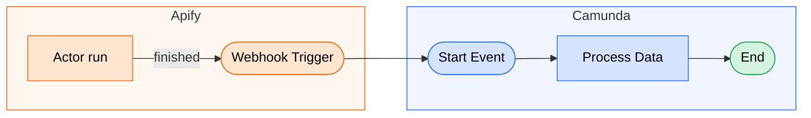
```mermaid
graph LR
    subgraph Apify
        AR[Actor run] -->|finished| A([Webhook Trigger])
    end
    subgraph Camunda
        B([Start Event]) --> C[Process Data] --> D([End])
    end
    A --> B

    classDef apify fill:#fde5d0,stroke:#f86606,color:#000
    classDef camunda fill:#d6e3ff,stroke:#246dff,color:#000
    classDef terminal fill:#d4f3df,stroke:#20a34e,color:#000
    class AR,A apify
    class B,C camunda
    class D terminal
    style Apify fill:#fff7f0,stroke:#f86606
    style Camunda fill:#f0f5ff,stroke:#246dff
```

</div>

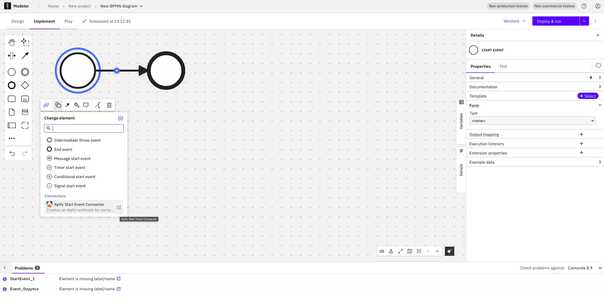

When to use:

- Trigger a workflow based on an external event (e.g. "Every time this daily scrape finishes, start a review process")

Configuration: Uses the [common inbound fields](#common-fields) listed above. No additional fields are required.

### Message start event

Use the Apify Message Start Event Connector to start a process instance through message correlation. Unlike the plain start event, this variant uses Camunda's message correlation mechanism, which prevents duplicate instances for the same correlation key and supports starting embedded subprocesses.

<div style={{textAlign: 'center'}}>

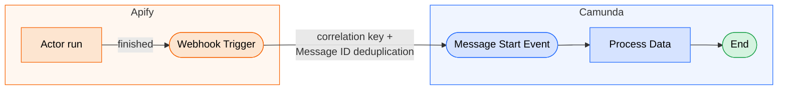
```mermaid
graph LR
    subgraph Apify
        AR[Actor run] -->|finished| W([Webhook Trigger])
    end
    subgraph Camunda
        B(["Message Start Event"])
        B --> C[Process Data]
        C --> D([End])
    end
    W -->|correlation key +<br/>Message ID deduplication| B

    classDef apify fill:#fde5d0,stroke:#f86606,color:#000
    classDef camunda fill:#d6e3ff,stroke:#246dff,color:#000
    classDef terminal fill:#d4f3df,stroke:#20a34e,color:#000
    class AR,W apify
    class B,C camunda
    class D terminal
    style Apify fill:#fff7f0,stroke:#f86606
    style Camunda fill:#f0f5ff,stroke:#246dff
```

</div>

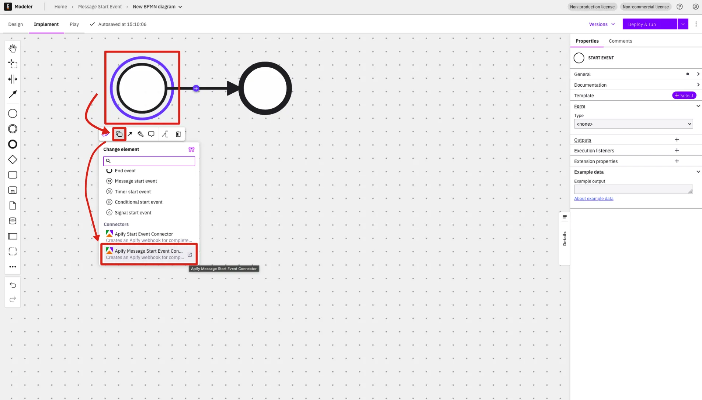

When to use:

- You need to prevent duplicate process instances for the same run (using correlation keys).
- You want to start an embedded subprocess from an Apify event.

Configuration: Uses the [common inbound fields](#common-fields), plus:

| Setting | Description |
| --------- | ------------- |
| **Subprocess Correlation Required** | Select `Correlation not required` (default) or `Correlation required` (when set to required, the Correlation Key fields become visible; needed for event-based subprocess message start events) |
| **Correlation Key (Process)** | _(Shown when correlation is required)_ FEEL expression for the correlation key from process variables (e.g. `=previousEventResponse.data.id`) |
| **Correlation Key (Payload)** | _(Shown when correlation is required)_ FEEL expression to extract the correlation key from the incoming webhook (e.g. `=connectorData.runId`) |
| **Message ID Expression** | _(Optional)_ Expression to extract a unique ID from the webhook payload for deduplication (e.g. `=connectorData.eventData.actorRunId`); Camunda uses this ID to deduplicate messages, so a webhook with the same Message ID arriving twice is silently ignored |
| **Message TTL** | _(Optional)_ Time-to-live for the message in the broker as an ISO-8601 duration (e.g. `PT1H` for 1 hour) |

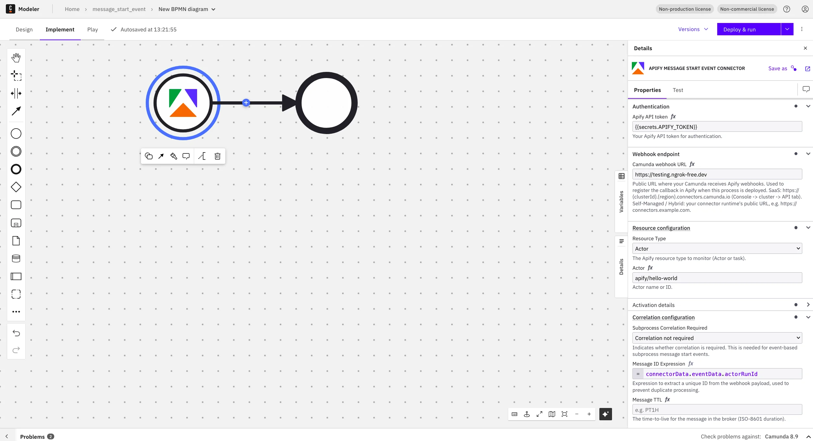

### Intermediate catch event

Use the Apify Intermediate Catch Event Connector to pause a running process and wait for a callback from Apify. The process resumes when a matching webhook arrives, routed via [correlation keys](#correlation-keys).

<div style={{textAlign: 'center'}}>

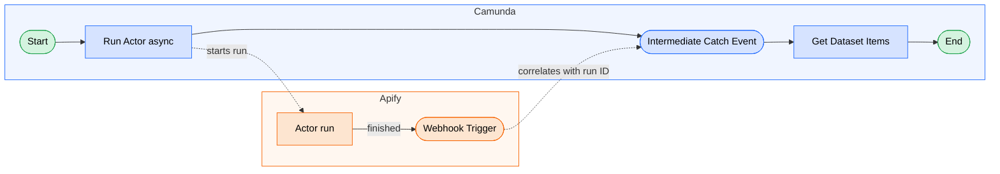
```mermaid
graph LR
    subgraph Camunda
        A([Start]) --> B[Run Actor async]
        B --> C([Intermediate Catch Event])
        C --> D[Get Dataset Items]
        D --> E([End])
    end
    subgraph Apify
        AR[Actor run] -->|finished| W([Webhook Trigger])
    end
    B -.->|starts run| AR
    W -.->|correlates with run ID| C

    classDef apify fill:#fde5d0,stroke:#f86606,color:#000
    classDef camunda fill:#d6e3ff,stroke:#246dff,color:#000
    classDef terminal fill:#d4f3df,stroke:#20a34e,color:#000
    class AR,W apify
    class B,C,D camunda
    class A,E terminal
    style Apify fill:#fff7f0,stroke:#f86606
    style Camunda fill:#f0f5ff,stroke:#246dff
```

</div>

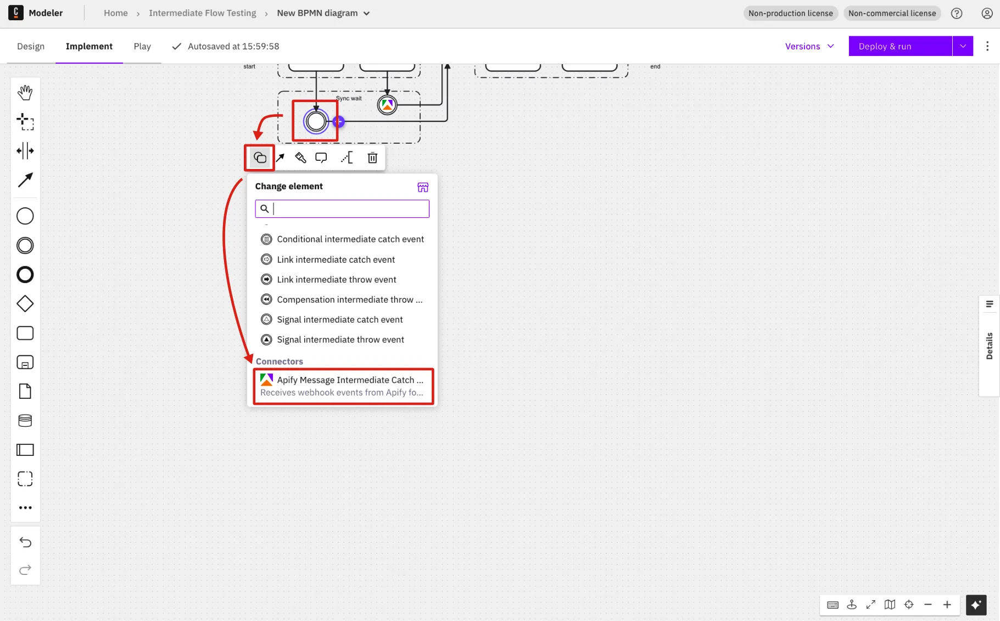

When to use:

- Long-running Actor (async execution) where you want to wait without blocking process engine resources - see [Async execution with parallel gateway](#async-execution-with-parallel-gateway) for the full implementation
- Running tasks in parallel while waiting for a scrape to complete

Configuration: Uses the [common inbound fields](#common-fields), plus:

| Setting | Description |
| --------- | ------------- |
| **Correlation Key (Process)** | FEEL expression for the correlation key from process variables (e.g. `=runResult.data.id`) |
| **Correlation Key (Payload)** | FEEL expression to extract the correlation key from the incoming webhook (e.g. `=connectorData.runId`) |
| **Message ID Expression** | _(Optional)_ Expression to extract a unique ID from the webhook payload for deduplication |
| **Message TTL** | _(Optional)_ Time-to-live for the message in the broker as an ISO-8601 duration (e.g. `PT1H`) |

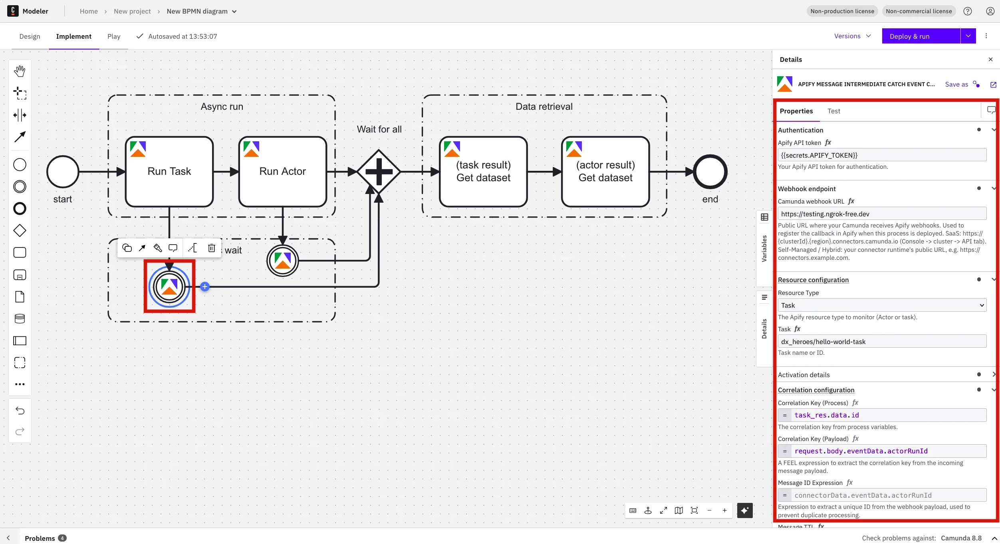

### Boundary event

The Apify Boundary Event Connector allows your Camunda process to respond to Apify events while an activity (such as a user task or subprocess) is still running.

A boundary event is _attached_ to a specific activity and fires when the configured webhook event arrives from Apify.

- Interrupting boundary event: Terminates the attached activity when triggered.
- Non-interrupting boundary event: Lets the attached activity continue, while a parallel process path is started.

Example use cases:

- React to a specific Apify run completion, failure, or timeout during a long-running task
- Implement timeout or fallback logic (e.g. take an alternative path if a scrape fails)

<div style={{textAlign: 'center'}}>

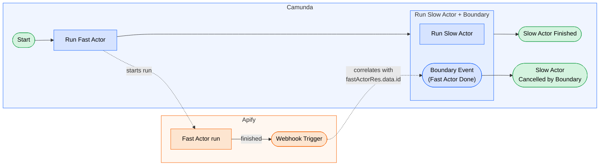
```mermaid
graph LR
    subgraph Camunda
        A([Start]) --> B[Run Fast Actor]
        B --> SA
        subgraph SA ["Run Slow Actor + Boundary"]
            C[Run Slow Actor]
            BE(["Boundary Event<br/>(Fast Actor Done)"])
        end
        SA --> E([Slow Actor Finished])
        BE --> D([Slow Actor<br/>Cancelled by Boundary])
    end
    subgraph Apify
        AR[Fast Actor run] -->|finished| W([Webhook Trigger])
    end
    B -.->|starts run| AR
    W -.->|correlates with<br/>fastActorRes.data.id| BE

    classDef apify fill:#fde5d0,stroke:#f86606,color:#000
    classDef camunda fill:#d6e3ff,stroke:#246dff,color:#000
    classDef terminal fill:#d4f3df,stroke:#20a34e,color:#000
    class AR,W apify
    class B,C,BE camunda
    class A,D,E terminal
    style Apify fill:#fff7f0,stroke:#f86606
    style Camunda fill:#f0f5ff,stroke:#246dff
    style SA fill:#e6efff,stroke:#246dff
```

</div>

When to use:

- Cancel or redirect a running activity when an Apify run completes, fails, or times out - see [Boundary event for runtime reactions](#boundary-event-for-runtime-reactions) for interrupting and non-interrupting examples
- Implement timeout or fallback logic (e.g. if a scrape fails, take an alternative path)

Configuration: Same as the [intermediate catch event](#intermediate-catch-event) (common inbound fields plus Correlation Keys, Message ID Expression, and Message TTL). Additionally, choose whether the boundary event is interrupting or non-interrupting.

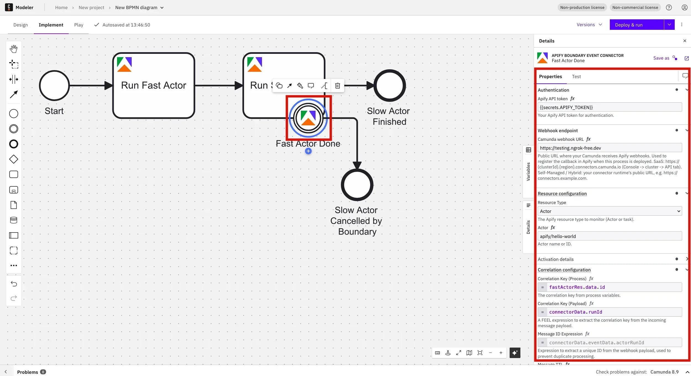

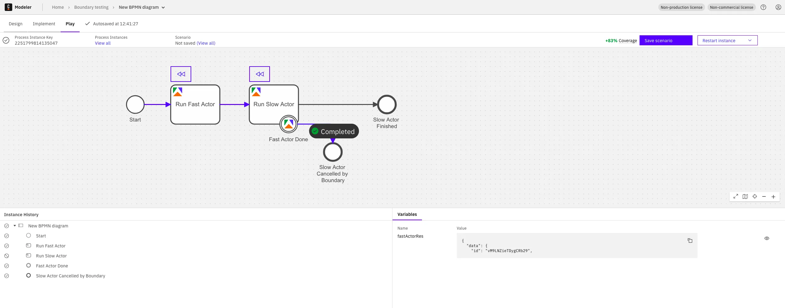

## Set up your first process

Follow this walkthrough to create and run your first outbound connector process in Camunda.

:::note Element templates

Apify Connectors are packaged as _element templates_ (JSON files defining the connector's form fields in the Modeler).

- There is no in-product catalog; instead, upload these templates once per project.
- After uploading, the connectors appear as service tasks and event types in your BPMN palette.

:::

1. Create a new project in your Camunda Modeler.

    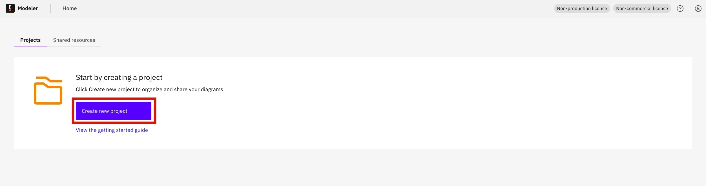

1. Upload the outbound connector template to your project.

    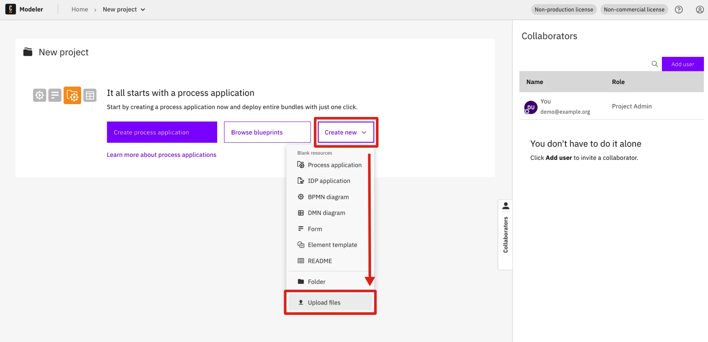

1. Publish the connector template to the project.

    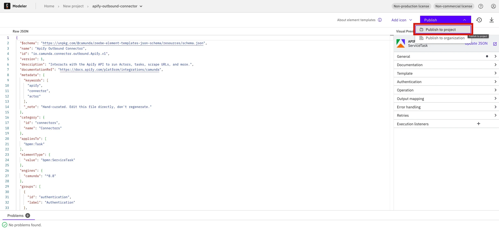

1. Create a new BPMN diagram.

    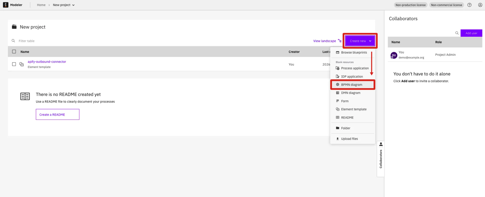

1. Design a process using the Apify Connector as a service task.

    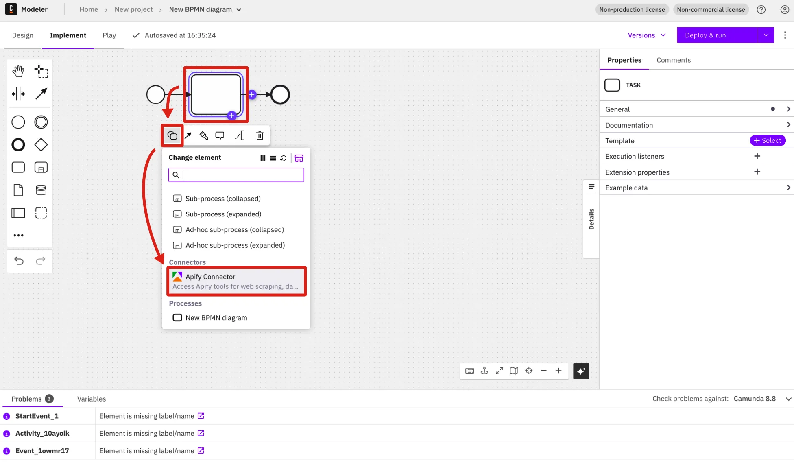

1. Set the connector input variables and run the process. For a quick smoke test, use these values:

    | Field | Value |
    | ------- | ------- |
    | **Apify API token** | Your Apify API token |
    | **Operation** | `Run Actor` |
    | **Actor** | `apify/hello-world` |
    | **Input Body** | _(Optional)_ `={ "message": "Hello from Camunda!" }` |
    | **Wait for Finish** | `true` |

    The process should complete in approximately 30 seconds.

    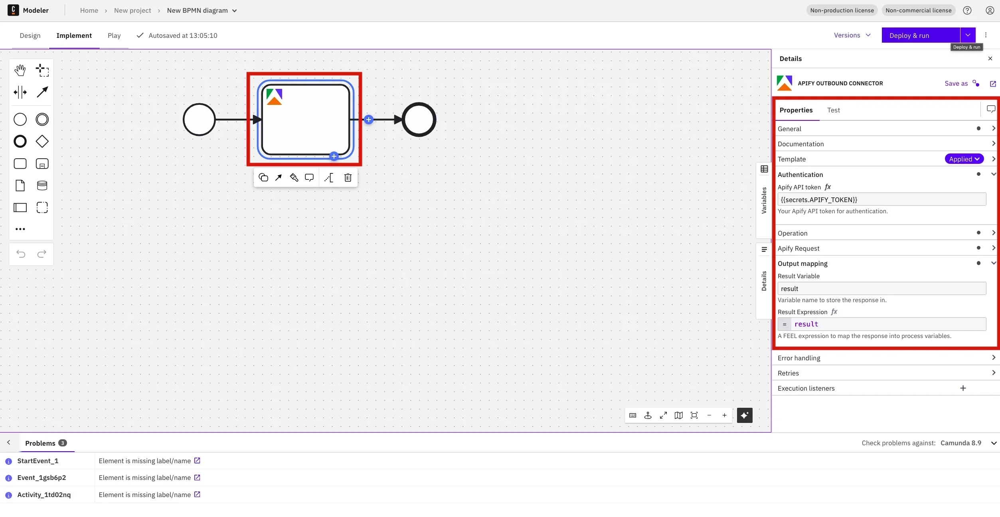

1. Find the process in Camunda Operate. By default, Operate shows only running processes - switch to the **Finished** filter to see completed instances.

    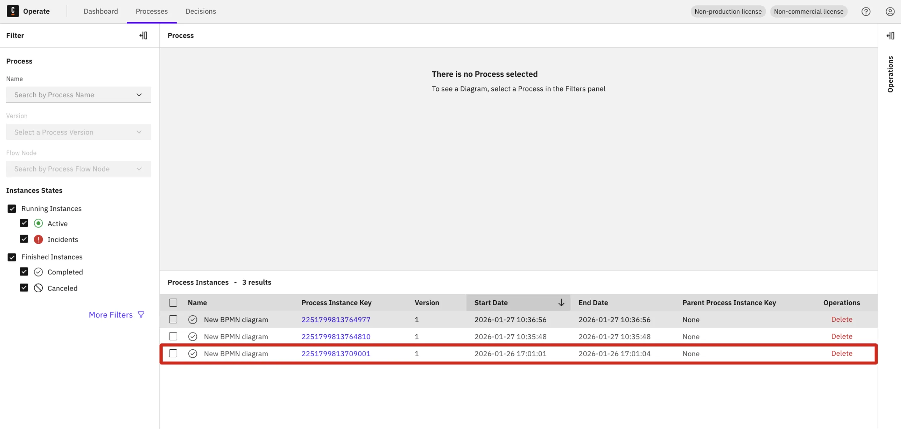

1. Verify the process result in Camunda Operate.

    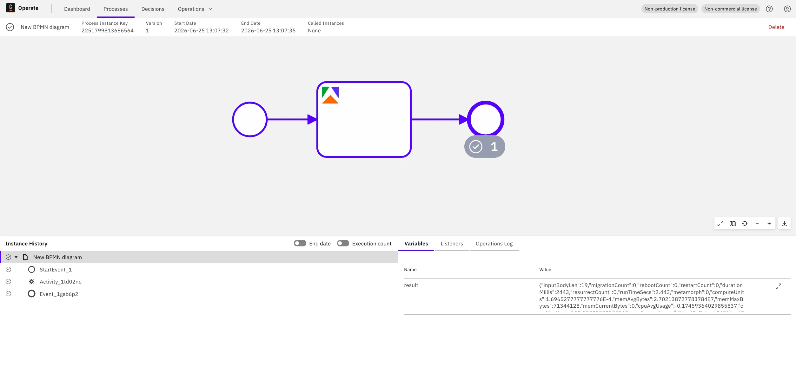

:::note Next steps

This walkthrough is a synchronous smoke test. Real workflows typically involve long-running Actors or webhook-triggered processes. See [Usage patterns](#usage-patterns) for async execution and runtime reactions.

:::

### Understand the outbound response

Key fields from the **Run Actor** and **Run task** responses that you reference in subsequent process steps:

| Field | Example FEEL expression | Description |
| ------- | ------------------------ | ------------- |
| `id` | `=runResult.data.id` | The run ID (used for correlation in inbound events) |
| `status` | `=runResult.data.status` | Run status (`RUNNING`, `SUCCEEDED`, `FAILED`, etc.) |
| `defaultDatasetId` | `=runResult.data.defaultDatasetId` | Dataset ID (pass to Get dataset items) |
| `defaultKeyValueStoreId` | `=runResult.data.defaultKeyValueStoreId` | Key-value store ID (pass to Get key-value store record) |

For the full response schema, see:

- [Run Actor API](https://docs.apify.com/api/v2/act-runs-post): response for Run Actor
- [Run task API](https://docs.apify.com/api/v2/actor-task-runs-post): response for Run task

## Deploy vs play mode

When your process is ready, you can run it in three ways:

| Mode | Webhooks | Best for |
| ------ | ---------- | ---------- |
| **Play mode** | Temporary (deleted after run) | Outbound flows, intermediate/boundary inbound events |
| **Deploy** (without Run) | Persistent (keep listening) | Inbound start events - deploy first, then trigger from Apify |
| **Deploy & Run** | Persistent | Flows starting with outbound steps (first instance runs immediately) |

See [Usage patterns](#usage-patterns) for examples of each event type in action.

:::caution Play mode skips inbound start events

**Play** and **Deploy & Run** modes start the process immediately - they do _not_ wait for an Apify webhook.

- If your flow starts with a start event or message start event, the inbound payload is _not_ received.
- Any process variable intended to be populated from the webhook (via a **Result Variable** or **Result Expression**) will be _undefined_, causing downstream FEEL expressions to fail.

For flows that start with an inbound event, use **Deploy** (without Run), then trigger the process from Apify so the webhook payload arrives and variables are set.

:::

### Run a process in play mode

In Web Modeler, switch to the **Play** tab and click **Start instance with cached data**. Inspect the path and variables in the **Instance History** and **Variables** panels. For details and saved scenarios, see [Play your process](https://docs.camunda.io/docs/components/modeler/web-modeler/play-your-process/) in the Camunda docs.

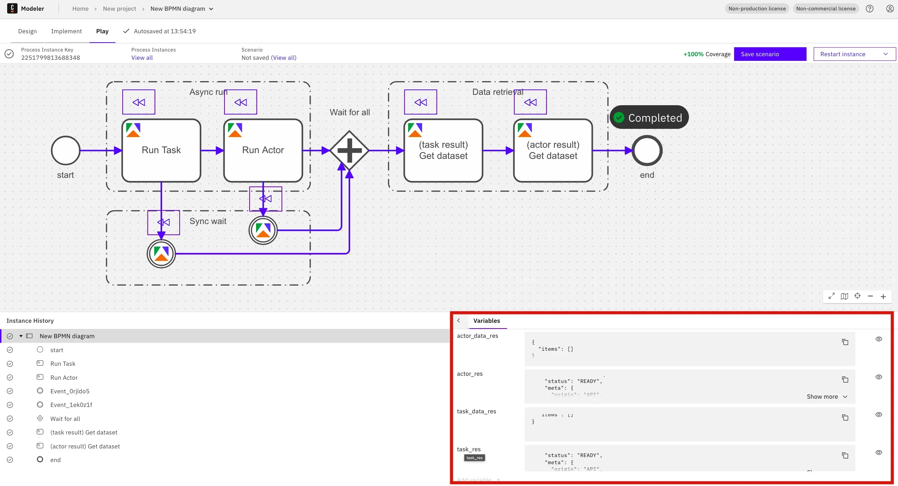

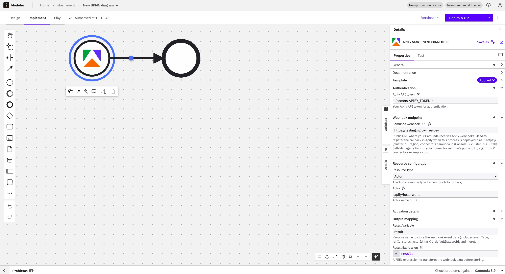

## Usage patterns

### Trigger a workflow on Actor run completion

Use a start event when an Apify run should kick off a fresh Camunda process. Each terminal event on the Actor (success, failure, abort) creates a new process instance - no correlation needed, since there is no existing process to resume.

<div style={{textAlign: 'center'}}>

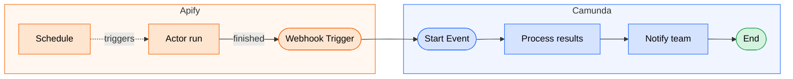
```mermaid
graph LR
    subgraph Apify
        S[Schedule] -.->|triggers| AR[Actor run]
        AR -->|finished| W([Webhook Trigger])
    end
    subgraph Camunda
        B([Start Event]) --> C[Process results]
        C --> D[Notify team]
        D --> E([End])
    end
    W --> B

    classDef apify fill:#fde5d0,stroke:#f86606,color:#000
    classDef camunda fill:#d6e3ff,stroke:#246dff,color:#000
    classDef terminal fill:#d4f3df,stroke:#20a34e,color:#000
    class S,AR,W apify
    class B,C,D camunda
    class E terminal
    style Apify fill:#fff7f0,stroke:#f86606
    style Camunda fill:#f0f5ff,stroke:#246dff
```

</div>

When to use:

- A scheduled Actor run should trigger a downstream review, ETL, or notification workflow.
- Each Apify event should produce an independent process instance (no deduplication needed).
- The Camunda process does not exist before the webhook arrives.

Steps:

1. Configure the Apify Start Event Connector:
    - Set **Resource Type** to `Actor` or `Task`
    - Set **Actor** / **Task** to the scheduled run's resource
    - Use **Activation Condition** to filter events (e.g. `=connectorData.status = "SUCCEEDED"` to react to successes only)
    - Save the payload to a result variable for use downstream (e.g. `runResult`)

1. In the process body, use `runResult.connectorData.defaultDatasetId` to fetch dataset items, post to Slack, write to a database, or hand off to other services.

:::tip Deploy, do not Play

Start event flows require a persistent webhook in Apify. Deploy the process without running it, then trigger it from Apify - see [Deploy vs play mode](#deploy-vs-play-mode).

:::

If you need deduplication (e.g. to avoid double-processing an event that fires twice), use the [message start event](#message-start-event) instead.

### Async execution with parallel gateway

This is the recommended pattern for long-running scrapes. It prevents timeout issues and allows other tasks while waiting.

<div style={{textAlign: 'center'}}>

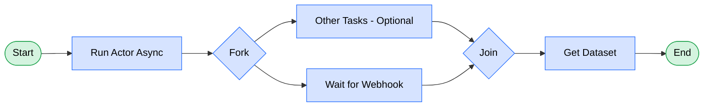
```mermaid
graph LR
    A([Start]) --> B[Run Actor Async]
    B --> C{Fork}
    C --> D[Other Tasks - Optional]
    C --> E[Wait for Webhook]
    D --> F{Join}
    E --> F
    F --> G[Get Dataset]
    G --> H([End])

    classDef camunda fill:#d6e3ff,stroke:#246dff,color:#000
    classDef terminal fill:#d4f3df,stroke:#20a34e,color:#000
    class B,C,D,E,F,G camunda
    class A,H terminal
```

</div>

Steps:

1. Run Actor (async):
    - Select `Run Actor` or `Run task`
    - Set **Wait for Finish** to `false`
    - Save the response to a result variable (e.g. `runResult`)

1. Add a parallel gateway (fork) to split the flow immediately after the run starts.

1. Configure the Apify Intermediate Catch Event:
    - Set **Correlation Key (Process)** to `=runResult.data.id`
    - Set **Correlation Key (Payload)** to `=connectorData.runId`

1. Add a parallel gateway (join) to merge the branches. The process continues only when the webhook is received.

1. Configure Get dataset items:
    - Set **Dataset** to `=runResult.data.defaultDatasetId`

### Boundary event for runtime reactions

A [boundary event](https://docs.camunda.io/docs/components/modeler/bpmn/events/) attaches directly to an activity (task or subprocess) and fires when an Apify webhook arrives while that activity is still running. Unlike the async execution pattern above, the boundary event does _not_ wait for the attached activity to finish. It interrupts or runs alongside it.

- Interrupting boundary event: Cancel a running activity when an external signal arrives (e.g. abort a long-running scrape when a validation check fails or times out).
- Non-interrupting boundary event: Spawn a parallel path without stopping the activity (e.g. send a progress notification while a long-running scrape continues).

Example flow (interrupting):

<div style={{textAlign: 'center'}}>

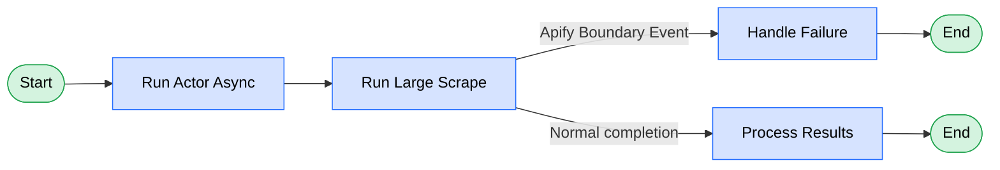
```mermaid
graph LR
    A([Start]) --> B[Run Actor Async]
    B --> C[Run Large Scrape]
    C -- Apify Boundary Event --> D[Handle Failure]
    D --> E1([End])
    C -- Normal completion --> F[Process Results]
    F --> E2([End])

    classDef camunda fill:#d6e3ff,stroke:#246dff,color:#000
    classDef terminal fill:#d4f3df,stroke:#20a34e,color:#000
    class B,C,D,F camunda
    class A,E1,E2 terminal
```

</div>

If the async Actor run fails while the large scrape is still running, the boundary event interrupts the scrape and redirects the flow to a failure-handling path.

:::tip Pattern selection

If you need the run results (dataset, key-value store) after the Apify event, use the [Async execution with parallel gateway](#async-execution-with-parallel-gateway) pattern instead. The boundary event pattern is best when you want to _react_ to an event (failure, timeout, status change) rather than _collect_ its output.

:::

## Reference

### Find Actor and task identifiers

The connector accepts multiple formats for Actor and task identifiers:

| Format | Example | Notes |
| ------ | ------- | ----- |
| Slash notation (recommended) | `apify/website-content-crawler` | Easiest to read and copy from URLs |
| Tilde notation | `apify~website-content-crawler` | Also accepted |
| Actor ID | `abcd1234` | Legacy format, still works |

#### Use slash notation

Find the Actor or task identifier in either of these locations:

- URL path: From `apify.com/compass/crawler-google-places`, use `compass/crawler-google-places`.
- Actor page: Listed under the Actor name on the Actor detail page.

#### Use Actor ID for dynamic workflows

Use the Actor ID format for dynamic workflows where the identifier comes from previous step data (for example, a run result or webhook payload).

#### Find dataset IDs

For datasets, you still need the ID. Find it in the Storage section or in run details.

### Common expressions

The connector templates accept two distinct syntaxes that look similar but are evaluated at different stages by different components: FEEL expressions and secret placeholders.

#### FEEL expressions

FEEL expressions (prefix: `=`) are evaluated by the Zeebe engine before the connector runs. The leading `=` tells the engine to parse the field as FEEL (Friendly Enough Expression Language) and resolve it to a concrete value. Use FEEL to reference process variables, filter events, or build output mappings.

| FEEL expression | Use case |
| ------------ | ---------- |
| `=runResult.data.id` | Accessing the run ID from a response |
| `=runResult.data.defaultDatasetId` | Accessing the default dataset ID |
| `=connectorData.status` | Reading the status from inbound webhook payload |
| `=connectorData.runId` | Reading the run ID from inbound webhook payload |

#### Secret placeholders

Secret placeholders (syntax: `{{secrets.NAME}}`) are not FEEL. The engine passes them through as literal strings and the connector runtime substitutes them at execution time, just before the outbound HTTP call. This keeps the secret value out of process variables, audit logs, and incident messages. Use them anywhere a credential or sensitive URL belongs - directly in plain text fields (no `=` prefix), or inside a FEEL string wrapped in quotes (e.g. `="Bearer " + "{{secrets.APIFY_TOKEN}}"`).

| Placeholder | Use case |
| ------------ | ---------- |
| `{{secrets.APIFY_TOKEN}}` | Reference a stored Apify API token |
| `{{secrets.CAMUNDA_WEBHOOK_URL}}` | Reference a stored Camunda webhook URL |

See [Manage Secrets](https://docs.camunda.io/docs/components/console/manage-clusters/manage-secrets/) for how to create and store secrets in your Camunda cluster.

### Webhook payload structure

When an Apify inbound connector is triggered, it receives a payload with event and run information.

Top-level structure:

- `connectorData`: Simplified object with the most important fields
- `request`: The raw webhook request including headers and body
- `connectorData.resource`: The full Actor run object

```json title="Webhook payload example"
{
  "connectorData": {
    "eventType": "ACTOR.RUN.SUCCEEDED",
    "userId": "user1234",
    "createdAt": "2026-01-03T12:00:00.000Z",
    "runId": "efgh5678",
    "status": "SUCCEEDED",
    "actorId": "abcd1234",
    "defaultDatasetId": "d9E0f1G2h3I4j5K6",
    "eventData": {
      "actorId": "abcd1234",
      "actorRunId": "efgh5678"
    },
    "resource": {
      "id": "efgh5678",
      "status": "SUCCEEDED",
      "stats": {},
      "options": {},
      "usage": {}
    }
  },
  "request": {
    "body": {
      "eventType": "ACTOR.RUN.SUCCEEDED",
      "resource": {}
    },
    "headers": {}
  }
}
```

### Event types and statuses

Event types (`eventType`):

- `ACTOR.RUN.CREATED`: A new Actor run has been created
- `ACTOR.RUN.SUCCEEDED`: Run finished with status `SUCCEEDED`
- `ACTOR.RUN.FAILED`: Run finished with status `FAILED`
- `ACTOR.RUN.ABORTED`: Run finished with status `ABORTED`
- `ACTOR.RUN.TIMED_OUT`: Run finished with status `TIMED-OUT`
- `ACTOR.RUN.RESURRECTED`: Run has been resurrected (moved back to `RUNNING`)

Run statuses (`status`):

- `SUCCEEDED`
- `FAILED`
- `ABORTED`
- `TIMED-OUT`

:::note Naming inconsistency

The event type uses an underscore (`TIMED_OUT`) while the run status uses a hyphen (`TIMED-OUT`). This is how the Apify API returns these values.

:::

## Troubleshooting

| Issue | Solution |
| ------- | ---------- |
| Webhook not triggering | Ensure you have deployed the process. For start events, deploying automatically creates the webhook in Apify. Check the **Integrations** tab of your Actor in Apify Console to verify the webhook exists. |
| Process not visible in Camunda Operate | Operate hides completed processes by default. Switch to the **Finished** filter to see them. |
| Process stuck at intermediate event | Check your **Correlation Keys**. The value in the process variable must exactly match the value in the webhook payload. Use Camunda Operate to inspect variable values and compare with the `connectorData.runId` in the connector runtime logs. |
| `401 Unauthorized` | Check your Apify API token. Regenerate it in [Apify Console](https://console.apify.com/settings/integrations) (**Settings → Integrations**) if necessary. |

## Next steps

- Schedule Actor runs that feed your Camunda processes - see [Schedules](/schedules)
- Trigger Camunda processes from other Apify events - see [Webhooks](/integrations/webhooks)
- Explore other workflow integrations - see [Integrations](/integrations)

If you have any questions or need help, reach out on the [Apify developer community on Discord](https://discord.com/invite/jyEM2PRvMU).
