**Connect Apify with Dify to automate workflows by running Actors, extracting structured data, and responding to Actor or task events.**

---

[Dify](https://dify.ai/) is an intuitive LLM application development platform for creating and operating AI-native apps. With the Apify integration for Dify, you can connect Apify Actors and storage to your Dify Workflows and Chatflows. You can run scrapers, extract data, and trigger workflows based on Apify events.

This guide explains how to set up authentication and incorporate the Apify plugin into your Dify applications as either a tool (action) or a trigger.

## Prerequisites

Before you begin, make sure you have:

- An [Apify account](https://console.apify.com/)
- A [Dify account](https://dify.ai/) (self‑hosted or cloud)

## Authentication

To connect your Apify account, configure the plugin using your Apify API token or OAuth.

1. In Dify, navigate to **Plugins** from the top menu.
1. Select **Install plugin → Marketplace**.
1. Find the **apify-integration** plugin and install it.
1. Return to the **Plugins** page.

### API key

1. Open the plugin window and select **Add API Key**.
1. In the pop-up menu, paste your Apify API token. You can find it in the [Apify Console](https://console.apify.com/settings/integrations).  
1. Select **Save**.


A green indicator confirms that your credentials are correct.

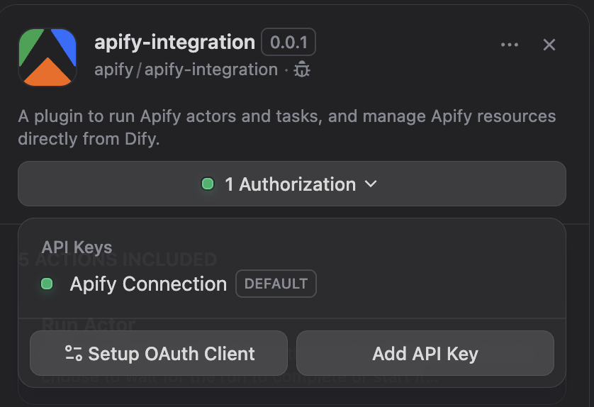

### OAuth

1. Open the plugin window and select **Add OAuth**.
1. Follow the OAuth flow to authorize Dify to access your Apify account.
1. Select **Save** to complete the connection.

With authentication set up, you can now add Apify tools to your applications.

## Use Apify Tools in a Workflow

Create a new **Workflow** application in Dify Studio and choose **Create from Blank**. Select the **+** icon on the **User Input** or **Trigger** node and choose an Apify tool to add it to your board.


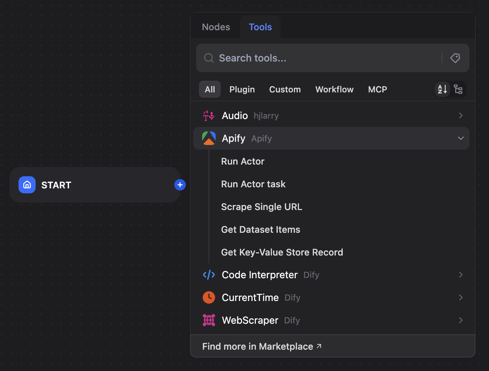

### Use Apify as an action

Actions let you perform operations like running an Actor within a workflow. For example, trigger a scraper and use its results in later steps.

#### Run an Actor  

Add the **Run Actor** tool to your workflow and configure it with the following parameters:  

- **Actor ID**: The unique ID of the Actor to run (for example, `2Mdma1N6Fd0y3QEjR` for Google Maps Scraper)  
- **JSON body for input**: The JSON input for the Actor run  
- **Wait for finish**: Select `True` to make the workflow wait for the run to complete

```json title="Example of JSON input"
{
  "language": "en",
  "locationQuery": "New York, USA",
  "maxCrawledPlacesPerSearch": 50,
  "searchStringsArray": [ "restaurant" ],
  "skipClosedPlaces": false
}
```

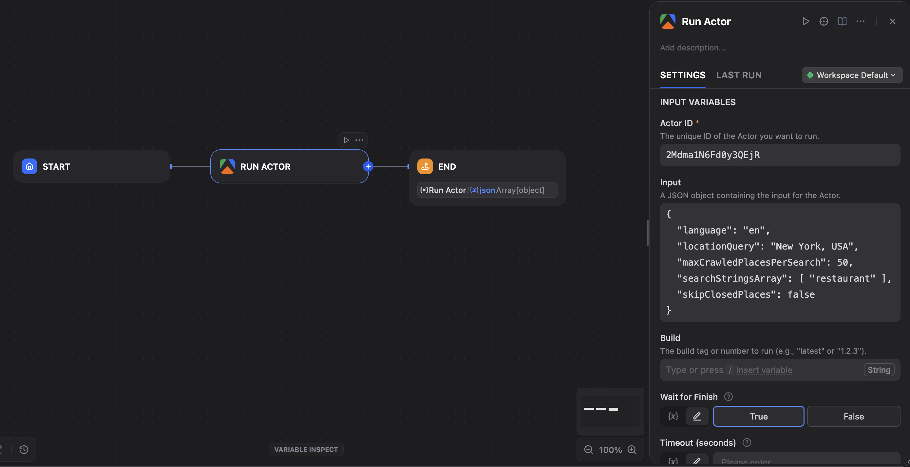  

Add an **Output** node and configure its output variable to use the result from the **Run Actor** node.  

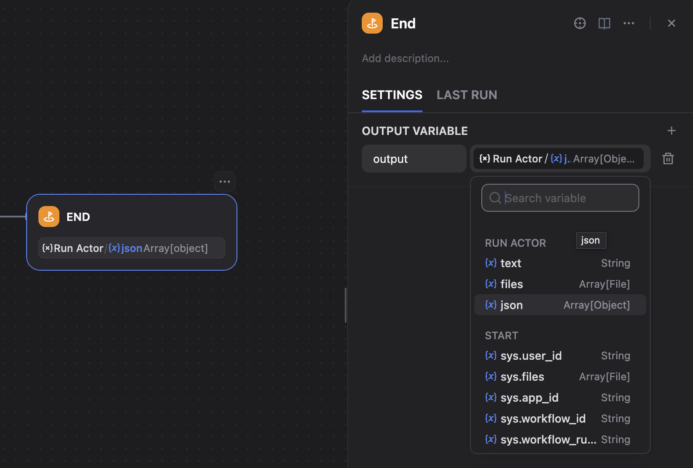  

You can now start the workflow and view the results.  

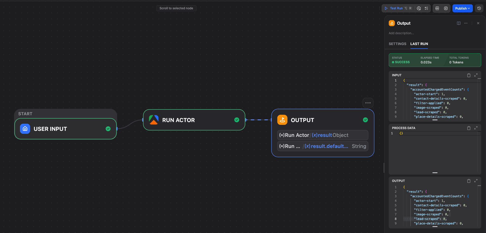  

#### Run an Actor task  

Add the **Run Actor task** tool to your workflow and enter the **Task ID** you want to execute. Add an **Output** node and map its output variable to the result from this tool.  

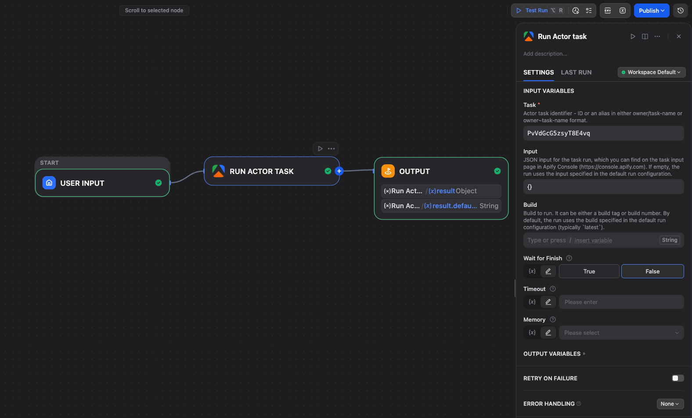  

#### Scrape Single URL  

Add the **Scrape Single URL** tool and enter the **URL** to scrape (for example, `https://docs.apify.com/`). Select the **Crawler type**, we recommend **Raw HTTP** for faster execution within Dify's timeout limits. Add an **Output** node and map its output variable to the result.  

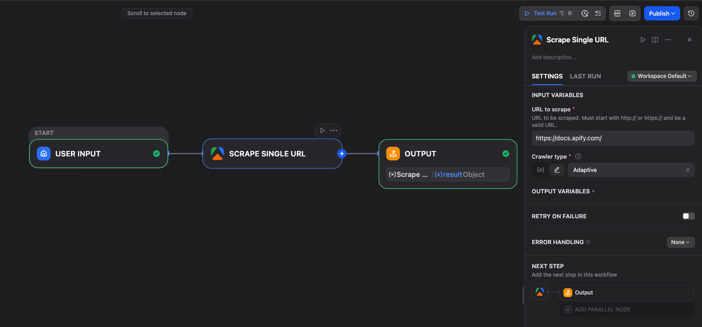  

#### Get Dataset Items

Add the **Get Dataset Items** tool and enter the **Dataset ID** to retrieve items from. You can use a variable picker to select the **Dataset ID** from a previous **Run Actor** or **Run Actor task** node. Add an **Output** node and map its output to the tool's result.  

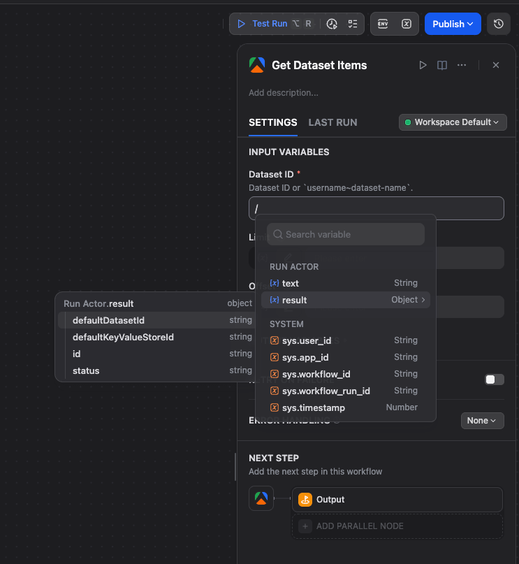
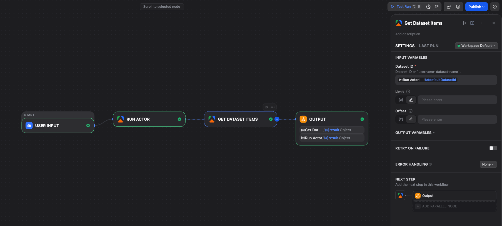

#### Get Key-Value Store

Add the **Get Key-Value Store** tool and enter the **Store ID** and **Key** for the record you want to retrieve. Add an **Output** node and map its output to the tool's result. You can also download files from the store.  

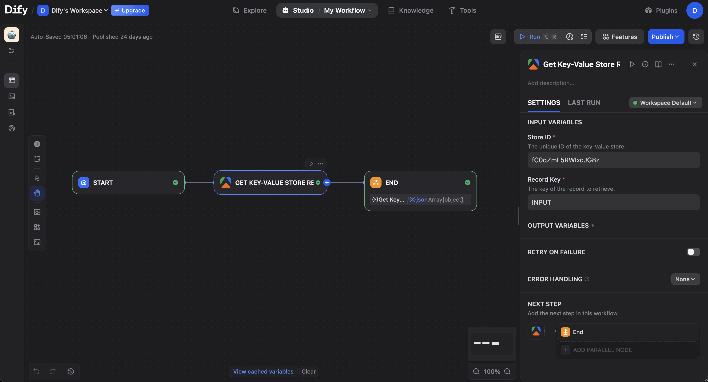
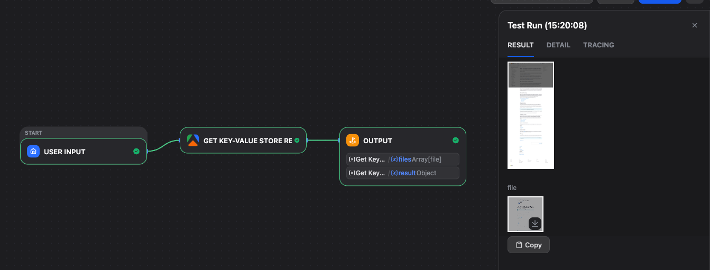

## Use Apify as a trigger

Triggers enable your Dify application to respond automatically to Apify events, such as completed Actor runs. This approach is ideal for creating event-driven automations.  

### Set up a webhook endpoint

 In Dify, navigate to **Plugins** from the top menu. Click on your plugin and lookf for **Endpoints** section. Select the **+** icon to create a new endpoint. Choose the **Workflow** or **Chatflow** application you want to trigger and give it a name. Select **Save** — Dify will generate two URLs.  


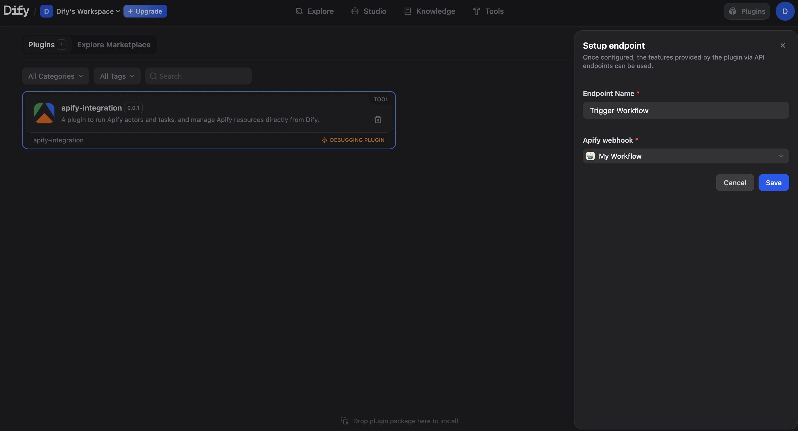  
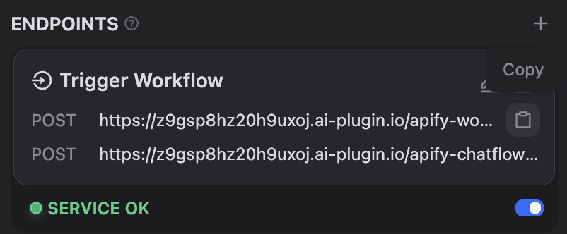  

Copy the URL that corresponds to your application type (Workflow or Chatflow).  

### Configure the webhook in Apify  

In the Apify Console, open the Actor you want to use as a trigger and go to the **Integrations** tab. Select the **HTTP webhook** option and paste the Dify endpoint URL. Under **Events**, select **Run succeeded** and save the integration.  

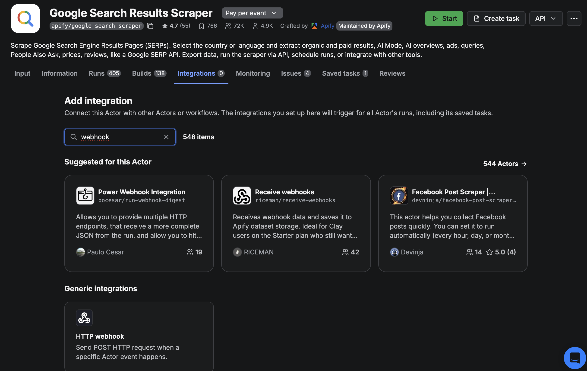  
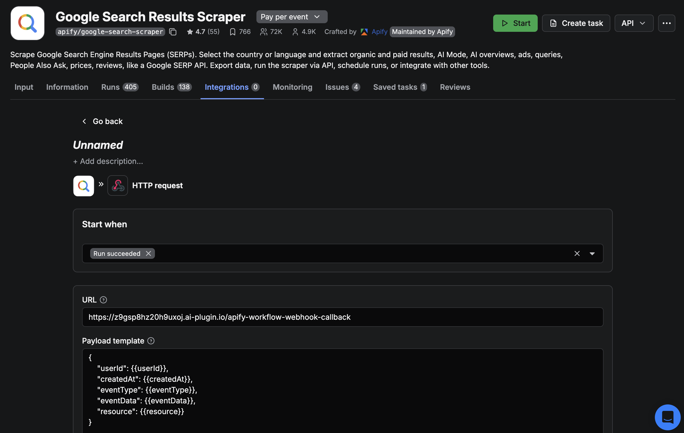  

:::caution Publishing required  

A Dify Workflow or Chatflow must be published for the webhook trigger to work. If the application is not published, the webhook will fail.  

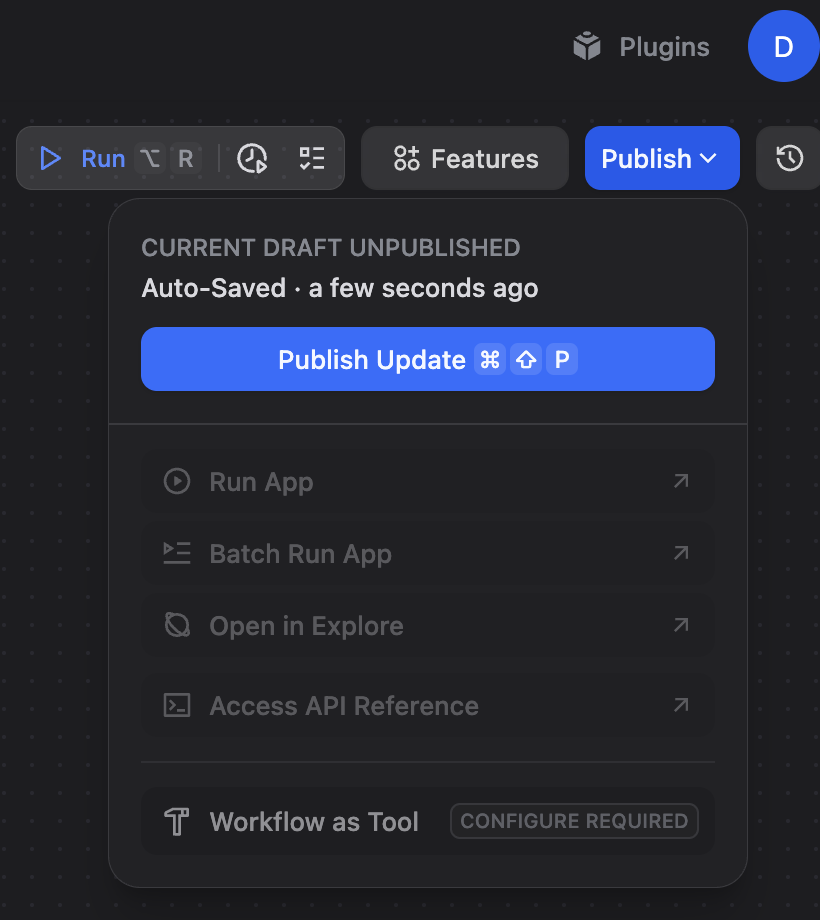  

:::  

Start the Actor in the Apify Console to trigger your workflow.  

### Trigger a Chatflow  

The setup for a Chatflow is similar to a Workflow. Select your Chatflow app instead of a Workflow and copy the Chatflow endpoint URL.  

When triggering a Chatflow, you must provide a **Payload template** in the Apify webhook settings. This template needs a `query` field to serve as the first message to the chatflow.  

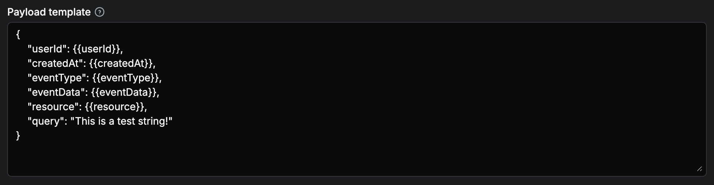  

### Access Apify Data in Dify  

When an Apify Actor run completes and triggers your Dify workflow, Apify sends a [JSON response object](https://docs.apify.com/api/v2/act-runs-post#responses) containing information about the completed run. This includes details like the run ID, Actor ID, dataset ID, and status.

#### Understanding nested data access

Dify's variable system cannot directly access nested JSON properties using dot notation like `resource.id`. Instead, you must use a flattened format where each level of nesting is represented by double underscores (`__`).

For example, if Apify sends:

```json
{
  "resource": {
    "id": "abc123",
    "defaultDatasetId": "xyz789"
  }
}
```

In Dify, you would access these values as:

- `resource__id` for the run ID
- `resource__defaultDatasetId` for the dataset ID

#### Define input variables

To use nested properties from the webhook payload in your workflow:

1. In your workflow's **Input Node** node, select **+** to add a new input variable.
1. Enter the flattened property name (e.g., `resource__defaultDatasetId`).
1. The variable is now available throughout your workflow.

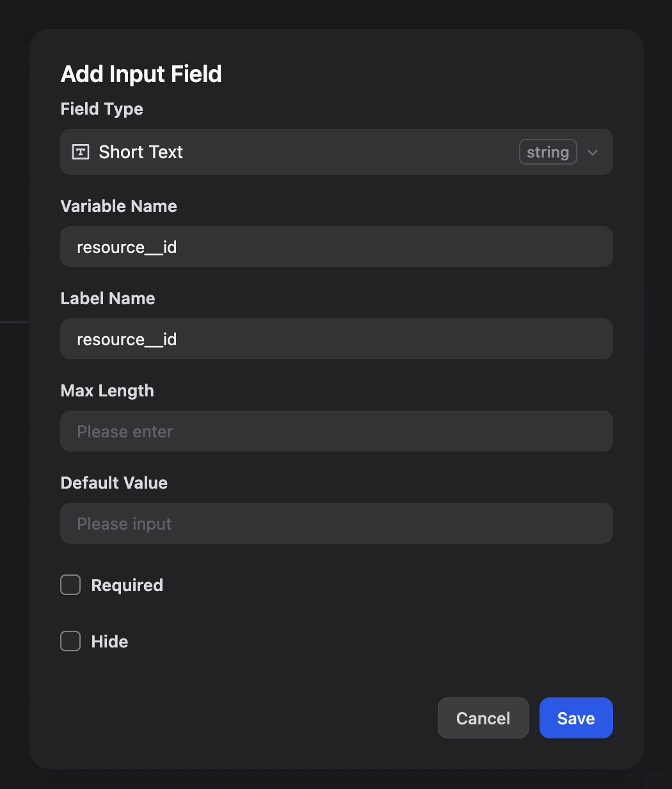  

#### Example: Download data from a completed Actor run

A common use case is automatically fetching data from a dataset after an Actor run completes. Here's how to set it up:

1. **Define the dataset ID variable**: In your workflow's Input node, add an input variable named `resource__defaultDatasetId` to capture the dataset ID from the webhook payload.
1. **Add the Get Dataset Items tool**: Add the **Get Dataset Items** Apify tool to your workflow.
1. **Use the variable**: In the **Dataset ID** field of the Get Dataset Items tool, reference your input variable (e.g., `{{resource__defaultDatasetId}}`).
1. **Process the data**: The tool retrieves all items from the dataset, which you can then process, transform, or send to other services in your workflow.

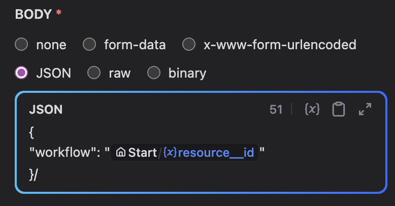  

This workflow automatically downloads and processes data whenever your Actor completes, without manual intervention.
