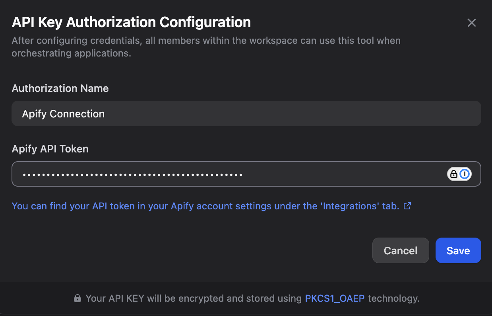
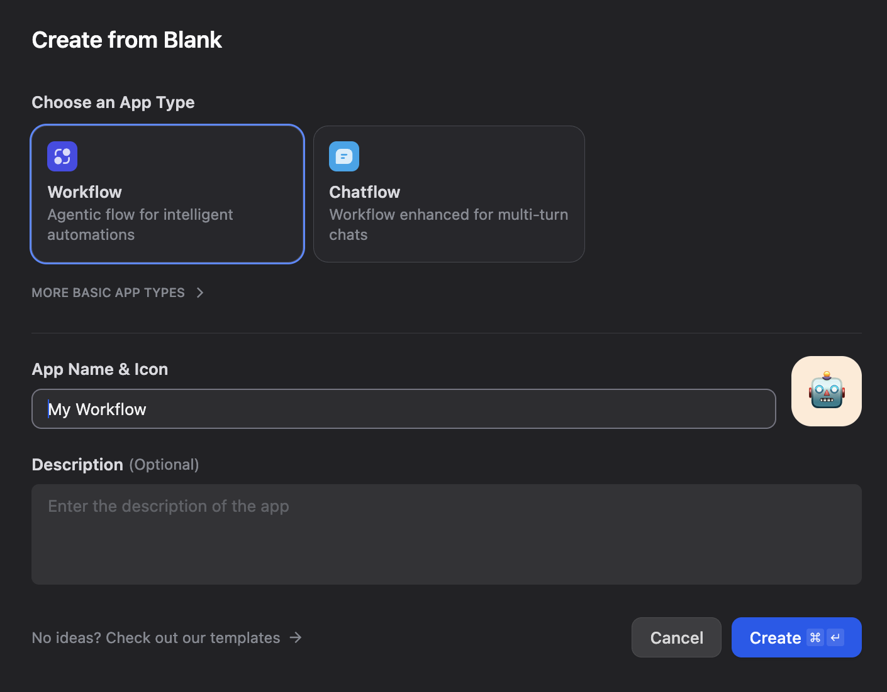
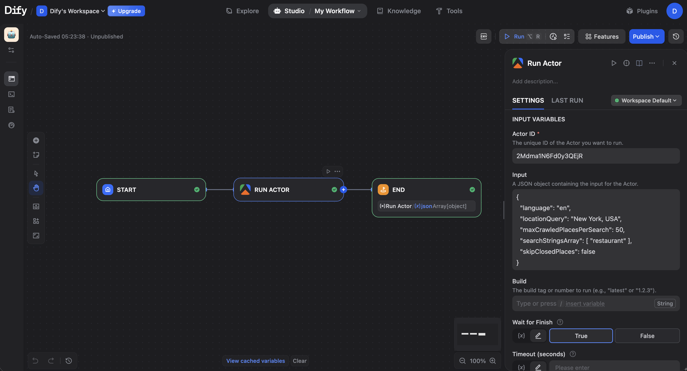
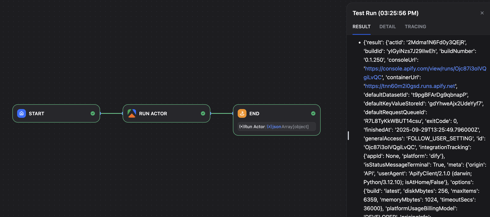
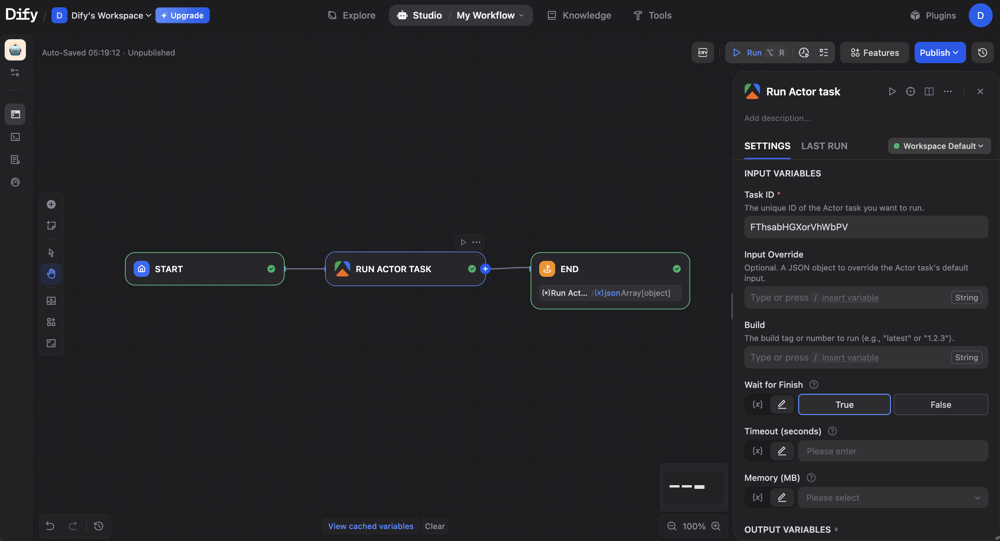
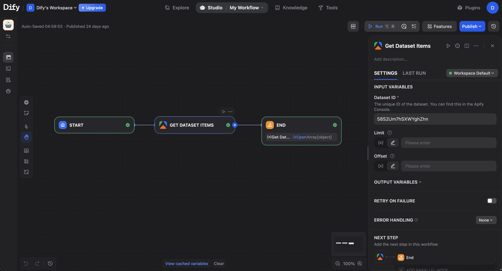

**Connect Apify with Dify to automate workflows by running Actors, extracting structured data, and responding to Actor or task events.**

---

[Dify](https://dify.ai/) is an intuitive LLM application development platform for creating and operating AI-native apps. With the Apify integration for Dify, you can connect Apify Actors and storage to your Dify Workflows and Chatflows. You can run scrapers, extract data, and trigger workflows based on Apify events.

In this guide, you'll learn how to set up authentication and incorporate the Apify plugin into your Dify applications as either a tool (action) or a trigger.

## Prerequisites

Before you begin, make sure you have:

- An [Apify account](https://console.apify.com/)
- A [Dify account](https://dify.ai/) (self‑hosted or cloud)

## Authentication

To connect your Apify account, you need to configure the plugin with your Apify API token.

1. In Dify, navigate to **Plugins** from the top menu.
2. Click on the **Install plugin → Marketplace**
3. Find the **apify-integration** plugin and install it.
4. Return back to the **Plugins** page. There will be our plugin. 
6. Open the plugin window and click on the **Add API Key**.
5. In the pop-up menu, paste your Apify API token. You can find it in the [Apify Console](https://console.apify.com/settings/integrations).
4. Click **Save**.



A green indicator light confirms that your credentials are correct.


With authentication set up, you can now add Apify tools to your applications.

## Using Apify Tools in a Workflow

Start by creating a workflow in Dify, then add Apify tools to handle tasks like running Actors or fetching data.

1. In the Dify Studio, create a new **Workflow** application.
2. Choose **Create from Blank**.
3. Click the **+** icon on the **Start** node and select an Apify tool to add it to your board.




### Use Apify as an action

Actions allow you to perform operations like running an Actor within a workflow. For instance, you could trigger a scraper and then use its results in subsequent steps.

#### Run an Actor

1. Add the **Run Actor** tool to your workflow.
2. Configure it:
    - **Actor ID**: The unique ID of the Actor to run. For example, `2Mdma1N6Fd0y3QEjR` for the Google Maps Scraper.
    - **JSON body for input**: The JSON input for the Actor run.
      ```json
      {
        "language": "en",
        "locationQuery": "New York, USA",
        "maxCrawledPlacesPerSearch": 50,
        "searchStringsArray": [ "restaurant" ],
        "skipClosedPlaces": false
      }
      ```
    - **Wait for finish**: Select `True` to make the workflow wait for the run to complete.

3. Configure an **End** node and configure its output variable to use the `json` result from the **Run Actor** node.


After that we can start the workflow and see the results.



#### Run an Actor task

1. Add the **Run Actor task** tool to your workflow.
2. Enter the **Task ID** you want to execute (e.g., `FThsabHGXorVhWbPV`).
3. Add an **End** node and map its output variable to the `json` result from this tool.




#### Scrape Single URL

1. Add the **Scrape Single URL** tool.
2. Enter the **URL** to scrape (e.g., `https://docs.apify.com/`).
3. Select the **Crawler type**. **Raw HTTP** is recommended for speed to work within Dify's timeout limits.
4. Add an **End** node and map its output variable to the `json` result.


#### Get Dataset Items

1. Add the **Get Dataset Items** tool.
2. Enter the **Dataset ID** to retrieve items from. (e.g., `58S2Um7hSXWYghZhn`)
3. Add an **End** node and map its output to the tool's `json` result.




#### Get Key-Value Store

1. Add the **Get Key-Value Store** tool.
2. Enter the **Store ID** and **Key** for the record you want to retrieve. (e.g., Store ID `fC0qZmL5RWIxoJG8z`, Record Key `INPUT`)
3. Add an **End** node and map its output to the tool's `json` result.


## Use Apify as a trigger

Triggers let your Dify application respond automatically to events in Apify, such as when an Actor run finishes. This is ideal for creating event-driven automations.

1. In your Dify app, go to **Overview** > **Endpoints**.
2. Click the **+** icon to create a new endpoint.
3. Select the **Workflow** or **Chatflow** application you want to trigger and give it a name.
4. **Save** the endpoint. Dify will generate two URLs.


5. Copy the URL that corresponds to your application type (Workflow or Chatflow).
6. In the Apify Console, open the Actor you want to use as a trigger.
7. Go to the **Integrations** tab and select the **HTTP webhook** option.
8. Paste the Dify endpoint URL.
9. Under **Events**, select **Run succeeded**.
10. **Save** the integration.


> **IMPORTANT: Publish Required**
> A Dify Workflow or Chatflow **must be published** for the webhook trigger to work. If the application is not published, the webhook will fail.
> 

To confirm that your webhook is working, you can create a simple workflow that catches the incoming data from Apify and sends it to a third-party request catcher like [Webhook.site](https://webhook.site/). This provides an easy way to inspect the data we send.


Now we can start the Actor in the Apify Console and it will trigger our workflow.


The setup for a Chatflow is nearly the same. The only differences are to select your Chatflow app instead of a Workflow and to copy the specific Chatflow endpoint URL.

> **Chatflow Trigger Requirement**
> Also, when triggering a **Chatflow**, you **must** provide a **Payload template** in the Apify webhook settings. This template needs a `query` field to serve as the first message to the chatflow.
> 

### Accessing Apify Data in Dify
When an event in Apify triggers your Dify endpoint, Apify sends a detailed nested response [JSON object](https://docs.apify.com/api/v2/act-runs-post#responses) containing information about the event. We can use this data to power our workflow.

Dify cannot directly use nested syntax like `resource.id` in its variable system. Instead, it requires you to access nested properties using a flattened format (`resource__id`), where each level of nesting is represented by a double underscore (`__`).

To work with a nested property in your workflow, you must first define it as an input variable in your workflow's Start node by clicking `+`.


We can also use that variable inside a JSON object we send and see the results.


## Troubleshooting

- Ensure your JSON inputs in fields are valid and properly formatted.

If you have any questions or need help, feel free to reach out to us on our [developer community on Discord](https://discord.com/invite/jyEM2PRvMU).
