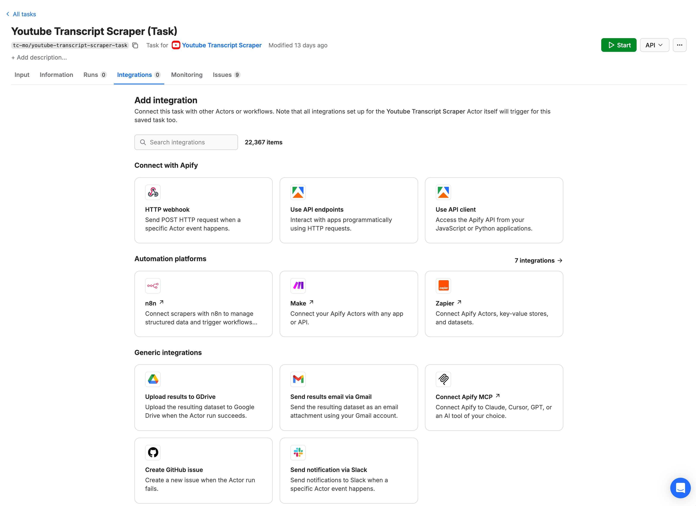
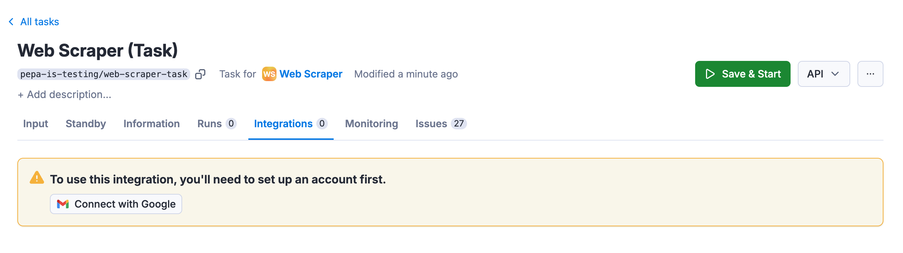
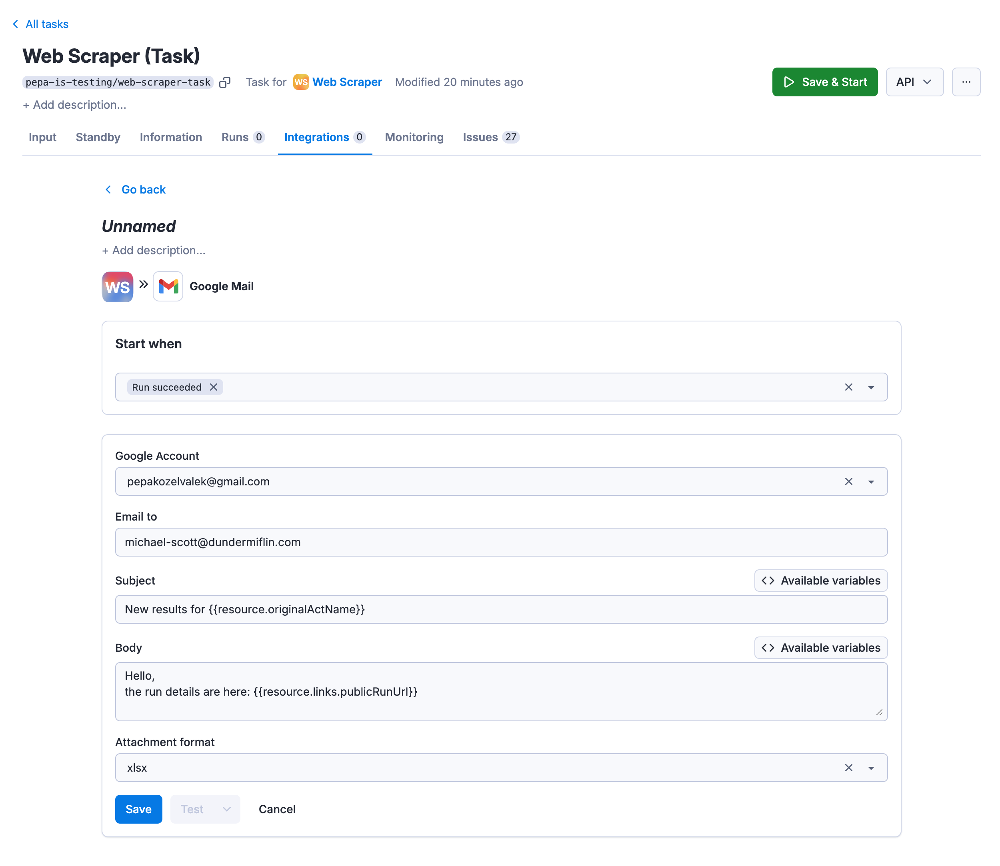
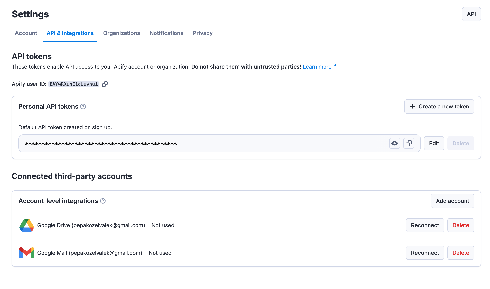

**Learn how to integrate your Apify Actors with Gmail. This article shows you how to automatically send an email with results when an Actor run succeeds.**

---

## Get started

To use the Apify integration for Gmail, you will need:

- An [Apify account](https://console.apify.com/).
- A Google account
- A saved Actor Task

## Set up Gmail integration

1. Head over to **Integrations** tab in your task and click on Send email generic integration.

    

1. Click on **Connect with Google** button and select the account with which you want to use the integration.

    

1. Set up the integration details. **Subject** and **Body** fields can make use of available variables. Dataset can be attached in several formats.
 By default, the integration is triggered by successful runs only.

    

1. Click on **Save** & enable the integration.

Once this is done, run your Actor to test whether the integration is working.

You can manage your connected accounts at **[Settings > API & Integrations](https://console.apify.com/settings/integrations)**.

