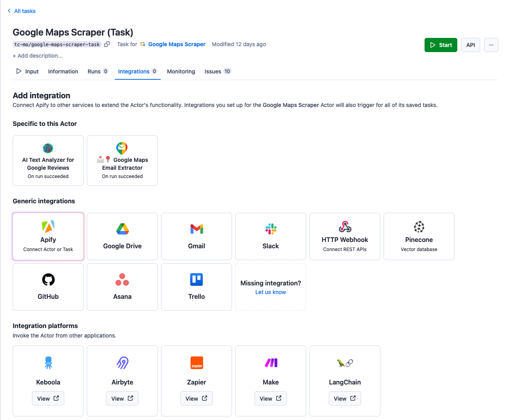
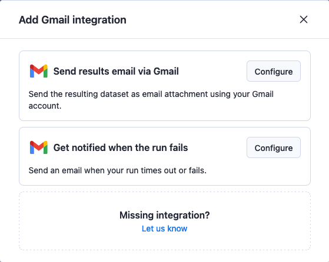
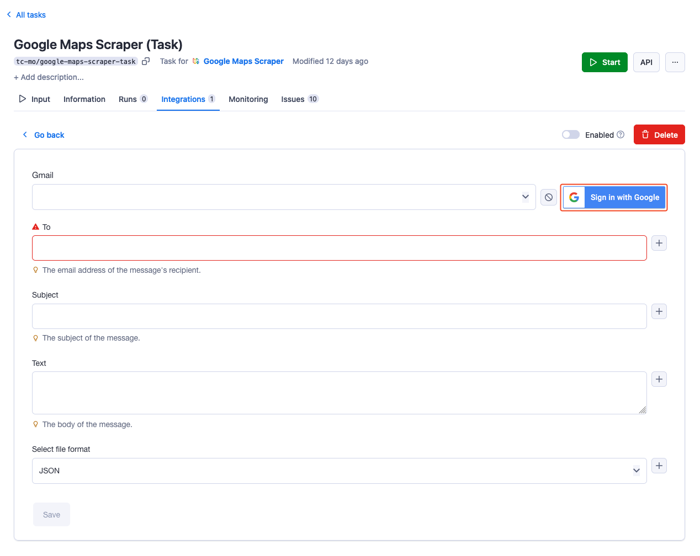
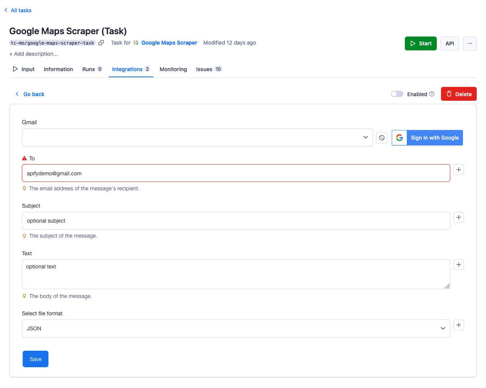
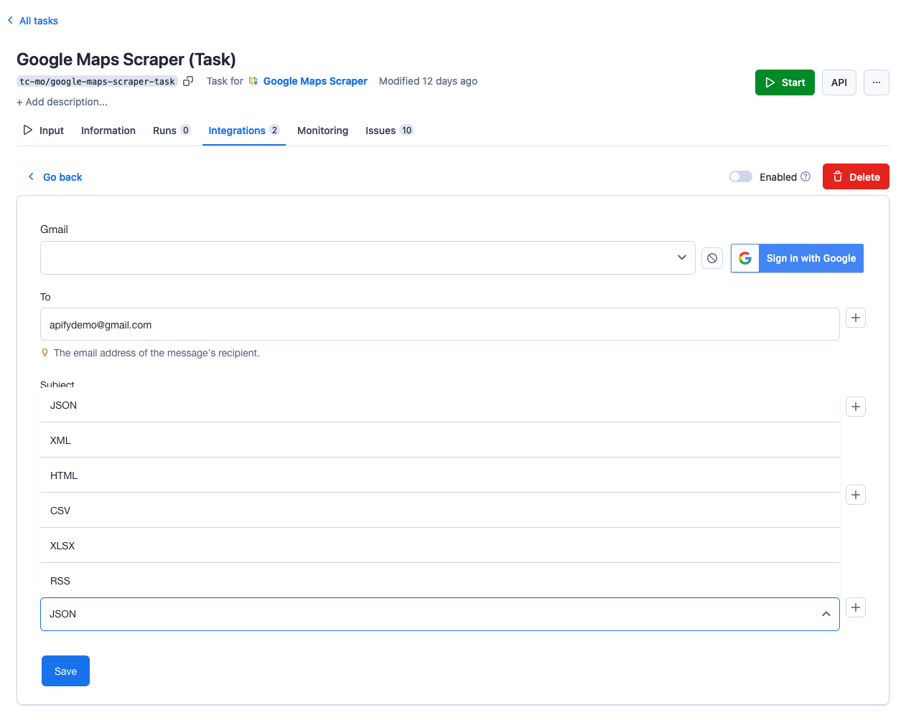
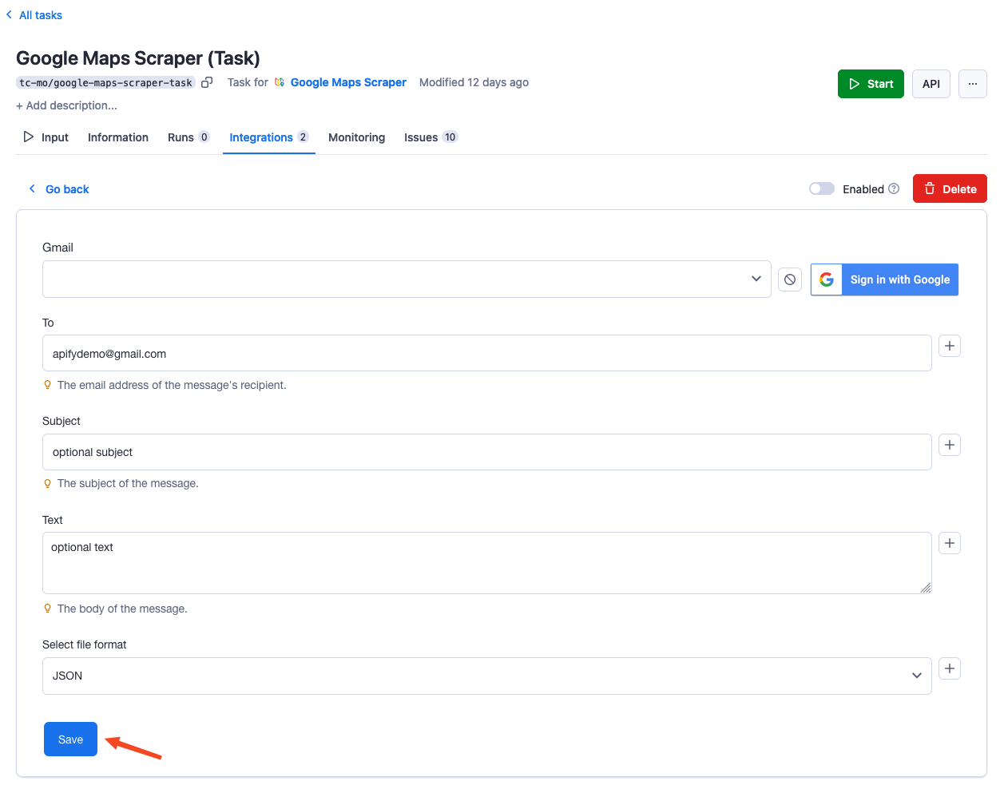

**Learn how to integrate your Apify Actors with Gmail. This article shows you how to automatically send an email with results when an Actor run succeeds.**

---

Completementary to the following guide we've created a detailed video, that will guide you through the process of setting up your Gmail integration.

<iframe width="560" height="315" src="https://www.youtube-nocookie.com/embed/BcFexrRxzdM" title="YouTube video player" frameborder="0" allow="accelerometer; autoplay; clipboard-write; encrypted-media; gyroscope; picture-in-picture; web-share" allowfullscreen></iframe>

## Get started

To use the Apify integration for Gmail, you will need:

- An [Apify account](https://console.apify.com/).
- A Google account
- A saved Actor Task

## Set up Gmail integration

1. Head over to **Integrations** tab in your task and click on Gmail integration.

    

1. In the popup window select:

    - Send results email via Gmail
    - Get notified when the run fails

    

1. Click on **Sign in with Google** button and select the account with which you want to use the integration.

    

1. After signing in you need to specify to what email account you want to send the message through the integration. Optionally you can also specify the subject and body of the email that will be sent.

    

1. Select the desired format of the attached dataset file.

    

1. Click on save & enable the integration.

    

Once this is done, run your Actor to test whether the integration is working.
