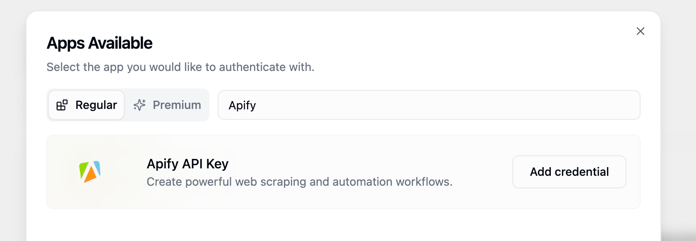
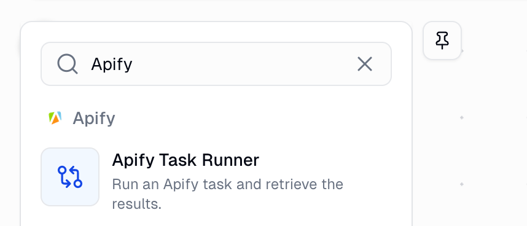
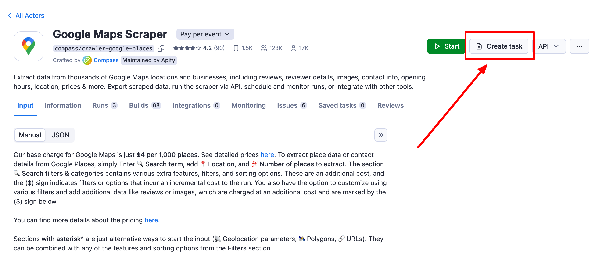
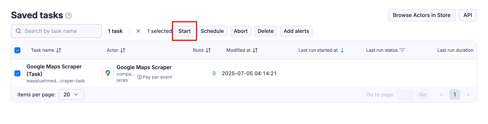
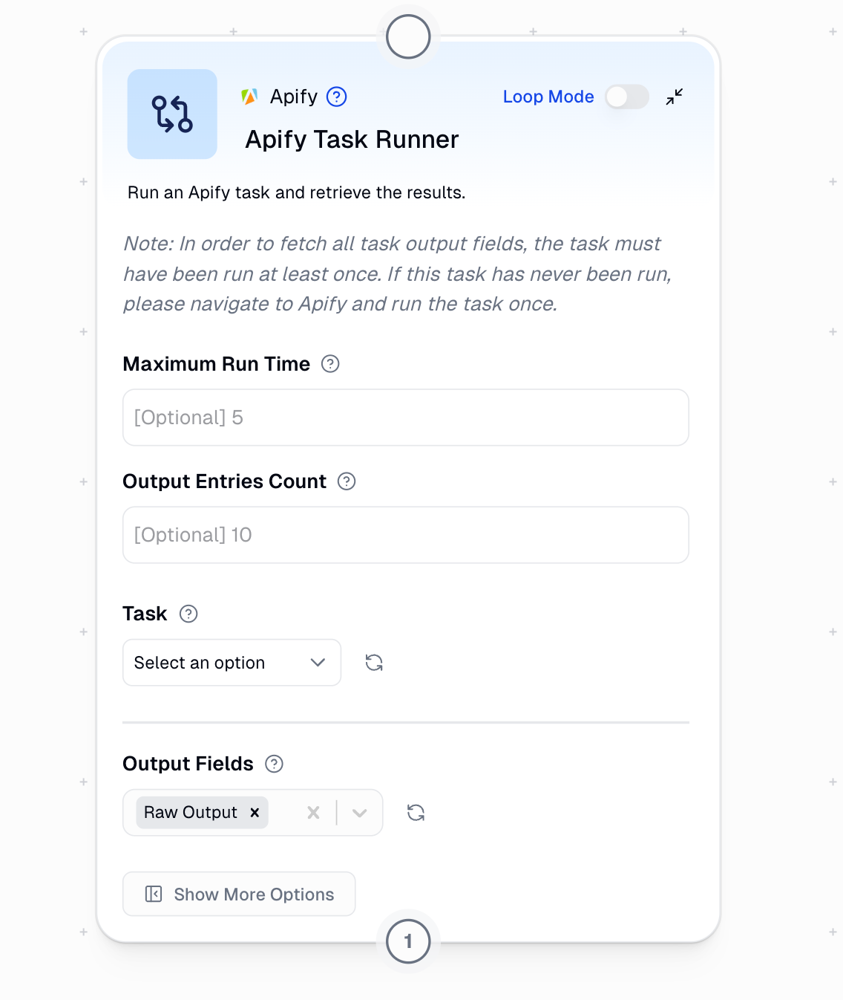
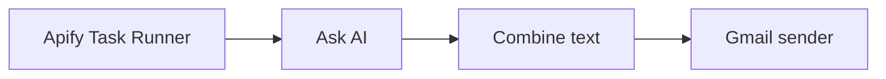

With the Gumloop Apify integration you can retrieve key data for your AI-powered workflows in a flash.

Gumloop supports two types of integrations with Apify:

- Direct integrations with Apify Actors through MCP nodes, where you can prompt the data you need (Recommended)
- General Apify integration using the Apify task runner node

## Direct integrations with Apify Actors (recommended)

Gumloop offers native nodes for popular Apify use cases that provide enhanced functionality and easier configuration.

These native nodes eliminate the complexity of managing Apify tasks while providing more powerful features for specific platforms. They are pre-configured with no need to manage Apify tasks or API keys, enhanced features like built-in data validation and formatting, better performance optimized for Gumloop, and full customizability using a prompt.

The following data sources are available natively in Gumloop:

- [Instagram](/platform/integrations/gumloop/instagram)
- [Google Maps](/platform/integrations/gumloop/maps)
- [TikTok](/platform/integrations/gumloop/tiktok)
- [YouTube](/platform/integrations/gumloop/youtube)

### Gumloop credits

Retrieving data from Apify Actors is included in your Gumloop subscription. Apify Actors natively integrated into Gumloop (YouTube, TikTok, Google Maps, Instagram) have a list of tools (data points) you can retrieve.

Each tool has a corresponding Gumloop credit cost. Each Gumloop subscription comes with a set of credits.

| Sample prompt | Tool | Credit cost per use |
| :--- | :--- | :--- |
| Retrieve profile details for an Instagram user | Get Profile Details | 5 credits/profile |
| Get videos for a specific hashtag | Get Hashtag Videos | 3 credits/video |
| Show 5 most recent reviews for a restaurant | Get Place Reviews | 3 credits/review |

## General integration (Apify task runner)

Gumloop's Apify task runner lets you run your Apify tasks directly inside Gumloop workflows. Scrape data with Apify, then process it with AI, send results via email, update spreadsheets, or connect to any of Gumloop's 100+ integrations.

Build workflows that automatically collect data from websites and deliver insights to your team through Slack, Gmail, Google Sheets, or wherever you need them.

### Connect Apify with Gumloop

To use the Apify integration in Gumloop, you need an Apify account, a Gumloop account, and at least one Apify task that has been run previously.

1. _Get your Apify API Key_

    To get started, navigate to [**Settings > Integrations**](https://console.apify.com/settings/integrations) in Apify Console and copy your API token.

    

1. _Add Apify credentials to Gumloop_

    Next, go to [**Gumloop Credentials**](https://www.gumloop.com/settings/profile/credentials) and click **Add New Credentials**. Search for Apify in the credentials list, add your Apify API key, and save the credential.

    

1. _Add Apify Task Runner node to your workflow_

   Open a new Gumloop pipeline page. Search for **Apify Task Runner** in the **Node Library**, and drag and drop the node onto your canvas.

    

1. _Create and save tasks in Apify_

   The Apify Task Runner node fetches tasks from your saved tasks in Apify Console. To create a task, navigate to [**Actors**](https://console.apify.com/actors), click on the Actor you want to use, and then click **Create a task** next to the Run button. Configure your task settings and save.

    

    :::important

    The Task Runner only displays tasks that have been saved in your Apify Console, not individual Actors.

    :::

1. _Run your tasks_

    Before tasks appear in Gumloop, they must be executed at least once in Apify. Go to your [**Saved tasks**](https://console.apify.com/actors/tasks), click on the task you want to use, and click **Start** to execute it. Wait for the task to complete.

    This step is required because Gumloop needs to understand the output structure of your task to properly configure data fields.

    

1. _Configure your Gumloop workflow_

    Configure maximum run time and output limits. Select your task from the dropdown menu. Choose the output fields you want to use. Connect the node to other workflow components.

    

## Example workflow

Here's a simple example of how to use Apify with Gumloop:

Web Scraping \+ AI Analysis \+ Email Report

The Apify task runner scrapes product prices from an e-commerce site. Ask AI analyzes price trends and identifies opportunities. Combine text formats the analysis into a readable report. Gmail Sender emails the report to stakeholders.

This workflow runs automatically and delivers actionable insights directly to your inbox.
