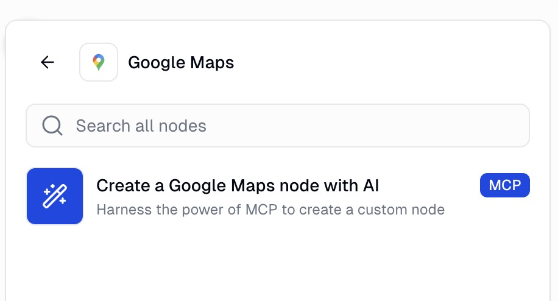
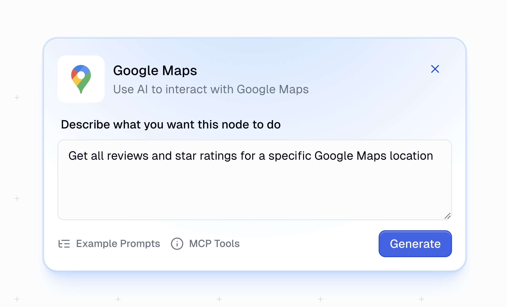
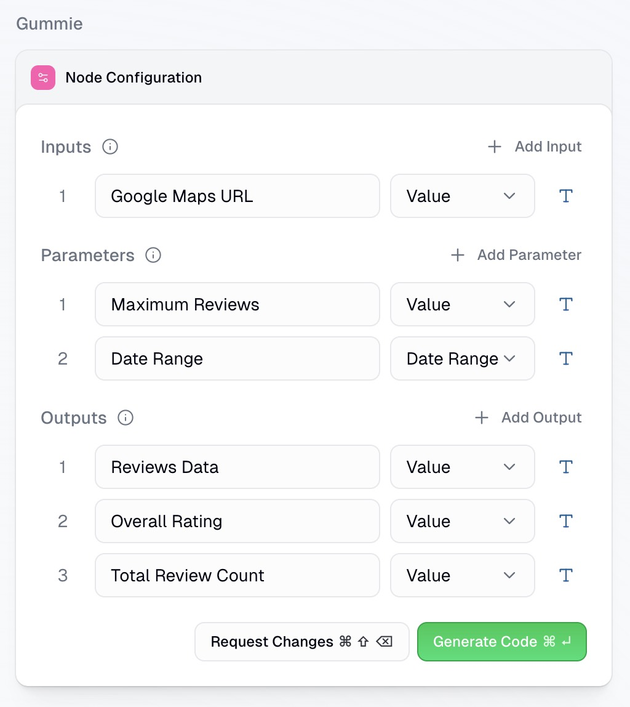
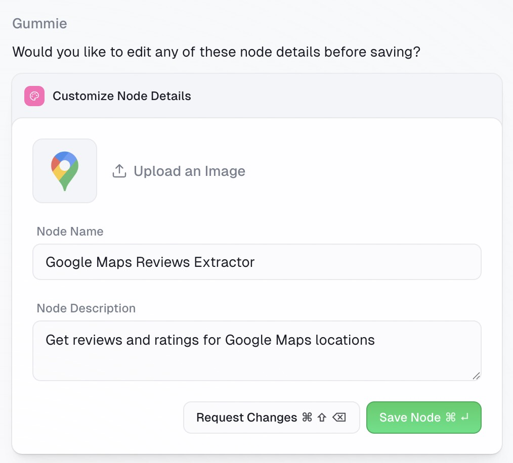

Search, extract, and enrich business data from Google Maps in Gumloop.

---

The Gumloop Google Maps integration provides a native interface for running Apify’s Google Maps scrapers directly in your workflows. No API keys or manual polling required. All you need is a Gumloop account.

Using the Gumloop Google Maps MCP node, you can simply prompt the location data you need and Gumloop will retrieve it from relevant Apify actors. From there, you can connect it to your favorite tools and AI agents to process the information.

## Available actions

You can pull the following types of place data from Google Maps using Gumloop’s Google Maps node (via Apify). Each action has a credit cost.

| Tool/Action | Description | Credit Cost |
| :---- | :---- | :---- |
| Search places | Search for places on Google Maps using location and search terms. | 3 credits per item |
| Get place details | Retrieve detailed information about a specific place using its URL or place ID. | 5 credits per item |
| Search by category | Search for places by a specific category (e.g. cafes, gyms) on Google Maps. | 3 credits per item |
| Get place reviews | Fetch reviews for specific locations, including text, rating, and reviewer info. | 3 credits per item |
| Find places in area | Return all visible places within a defined map area or bounding box. | 3 credits per item |

## Retrieve Google Maps data in Gumloop

1. _Add the Gumloop Google Maps MCP node._

    First, add the Google Maps node from the node library to your workflow canvas.

    

1. _Prompt the data you need_

    In the node's configuration panel, write a clear, specific prompt that describes the data you want to retrieve.

    

    :::tip Prompting tips

    - MCP nodes only have access to the tools listed so your prompt should be scoped to Google Maps.
    - You can mix and match different tools (e.g., search for gyms in Vancouver → get place details → pull reviews).

    :::

1. _Define inputs/outputs_

    Once you’ve entered your prompt, you will go through the AI assisted node creation process starting with defining inputs, parameters and outputs of your Google Maps node.

    Gummie (Gumloop’s AI assistant) will suggest inputs (information coming from previous steps, ie location, keyword, category), parameters (user defined choices, ie number of results or radius) and outputs (information used in future steps, ie business name, review count, ratings).

    

1. _Generate and test the node_

    With inputs, parameters and outputs defined, Gummie will generate the code to retrieve the data from the Apify Google Maps node. There is no requirement for you to review or understand the code, Gummie takes care of it.

    After the code is written, enter test values to confirm the outputs of the node and save.

    Once saved, you can access this node in any of your flows.

    

## Other integrations

- [TikTok](/platform/integrations/gumloop/tiktok)
- [Instagram](/platform/integrations/gumloop/instagram)
- [YouTube](/platform/integrations/gumloop/youtube)
