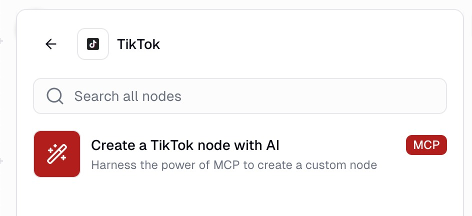
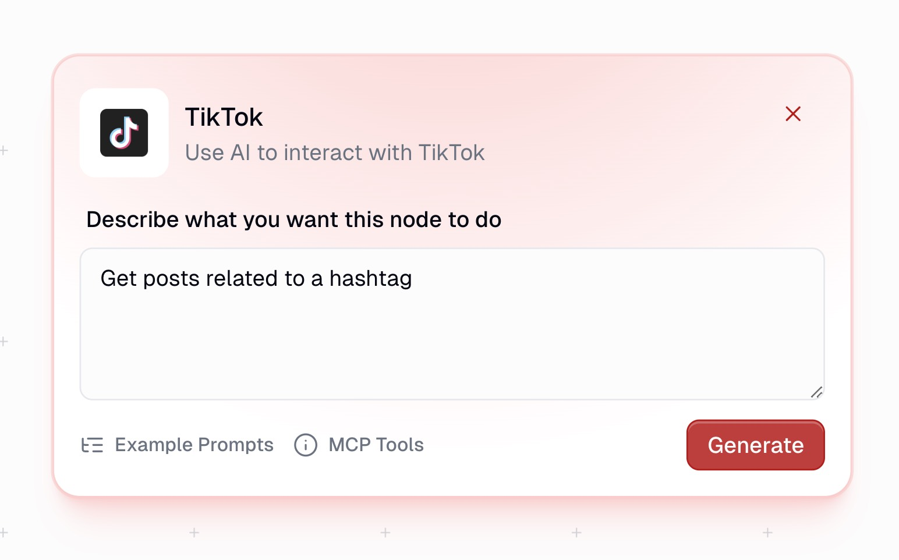
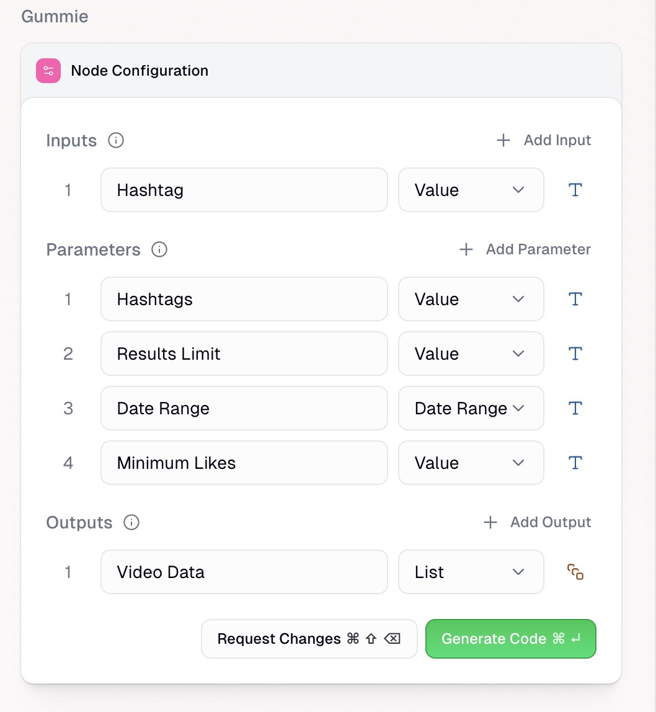
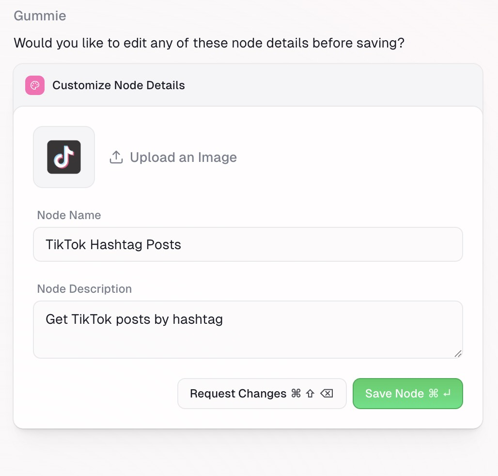

Get TikTok hashtag videos, profile videos, followers, video details, and search results in Gumloop.

---

The Gumloop TikTok integration provides a native interface for running Apify’s TikTok scrapers directly in your workflows. No API tokens or manual polling required. All you need is a Gumloop account.
Using the Gumloop TikTok MCP node, you can simply prompt the TikTok data you need and Gumloop will retrieve it from relevant Apify Actors. From there, you can connect it to your favorite tools and AI agents to process the information.

## Available actions

You can pull the following types of data from TikTok using Gumloop’s TikTok node (via Apify). Each action has a credits cost.

| Tool/Action | Description | Credit Cost |
| :---- | :---- | :---- |
| Get hashtag videos | Fetch videos from TikTok hashtags with captions, engagement metrics, play counts, and author information. | 3 credits per item |
| Get profile videos | Get videos from TikTok user profiles with video metadata, engagement stats, music info, and timestamps. | 3 credits per item |
| Get profile followers | Retrieve followers or following lists from TikTok profiles, including usernames, follower counts, and bios. | 3 credits per item |
| Get video details | Get comprehensive data on a specific TikTok video using its URL - includes engagement and video-level metrics. | 5 credits per item |
| Search videos | Search TikTok for videos and users using queries. Returns video details and user profile info. | 3 credits per item |

## Retrieve tiktok data in Gumloop

1. _Add the Gumloop TikTok MCP node_

    First, add the TikTok node from the node library to your workflow canvas.

    

1. _Prompt the data you need_

    In the node's configuration panel, write a clear, specific prompt that describes the data you want to retrieve.

    

    :::tip Prompting tips

    - MCP nodes only have access to the tools listed so your prompt should be scoped to TikTok.
    - You can mix and match different tools (e.g., search a hashtag → get profile videos → retrieve engagement data).

    :::

1. _Define inputs/outputs_

    Once you’ve entered your prompt, you will go through the AI assisted node creation process starting with defining inputs, parameters and outputs of your TikTok node.

    Gummie (Gumloop’s AI assistant) will suggest inputs (information coming from previous steps, ie search keyword, video URL), parameters (user defined choices, number of videos to retrieve) and outputs (information used in future steps, ie follower count, video engagement, music info).

    

1. _Generate and test the node_

    With inputs, parameters and outputs defined, Gummie will generate the code to retrieve the data from the Apify TikTok node. There is no requirement for you to review or understand the code, Gummie takes care of it.

    After the code is written, enter test values to confirm the outputs of the node and save.

    Once saved, you can access this node in any of your flows.

    

## Other integrations

- [Instagram](/platform/integrations/gumloop/instagram)
- [YouTube](/platform/integrations/gumloop/youtube)
- [Google Maps](/platform/integrations/gumloop/maps)
