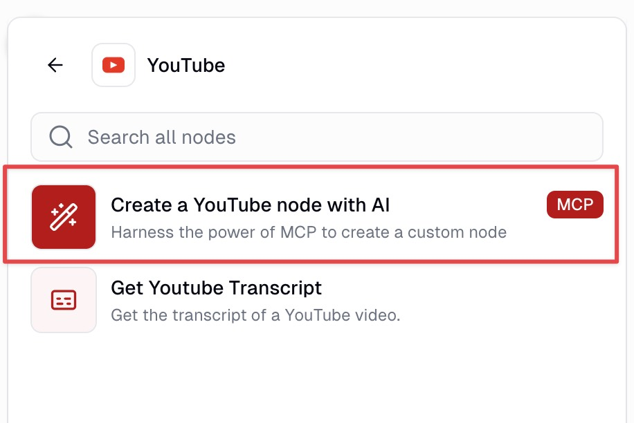
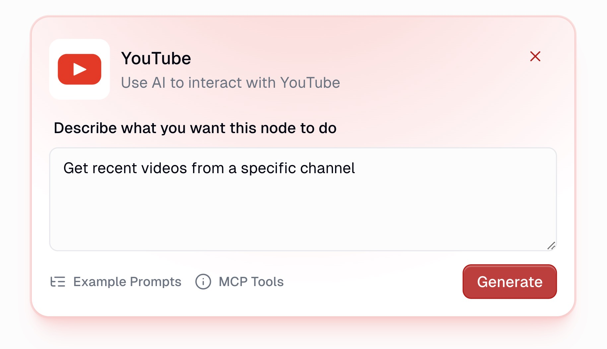
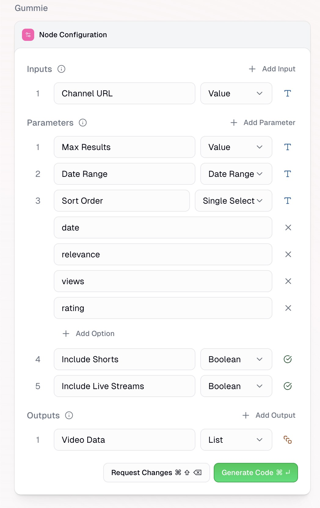
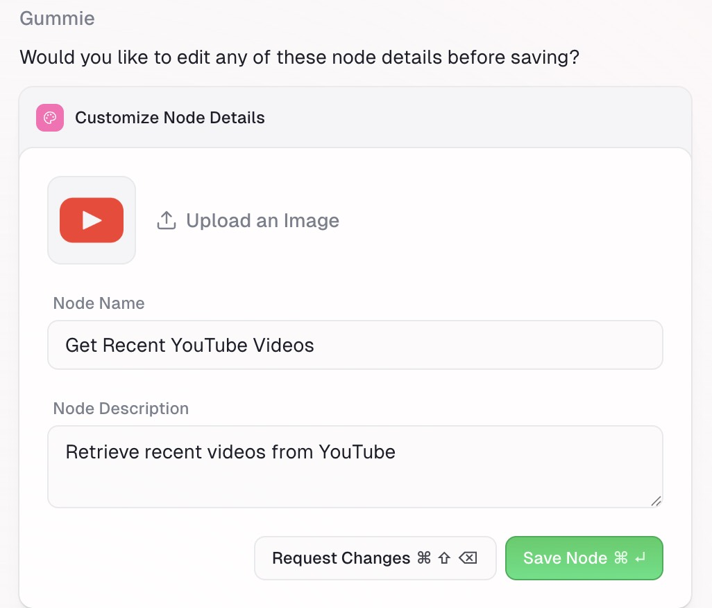

Get YouTube search results, video details, channel videos, playlists, and channel metadata in Gumloop.

---

The Gumloop YouTube integration provides a native interface for running Apify’s YouTube scrapers directly in your workflows. No API keys or manual polling required. All you need is a Gumloop account.

Using the Gumloop YouTube MCP node, you can simply prompt the YouTube data you need and Gumloop will retrieve it from relevant Apify actors. From there, you can connect it to your favorite tools and AI agents to process the information.

## Available actions

You can pull the following types of data from YouTube using Gumloop’s YouTube node (via Apify). Each action has a credit cost:

| Tool/Action | Description | Credit Cost |
| :---- | :---- | :---- |
| Search videos | Search YouTube by keywords and get video results with filtering, metadata, and content info. | 3 credit per item |
| Get video details | Retrieve detailed stats and content info for specific videos via URL or ID. | 4 credit per item |
| Get channel videos | Get videos from a specific YouTube channel with full metadata and context. | 3 credit per item |
| Get playlist videos | Fetch videos from a YouTube playlist with metadata and playlist details. | 3 credit per item |
| Get channel details | Get channel metadata including subscriber count, total videos, description, and more. | 5 credit per item |

## Retrieve YouTube data in Gumloop

1. _Add the Gumloop YouTube MCP node_

    First, add the YouTube node from the node library to your workflow canvas.

    

1. _Prompt the data you need_

    In the node's configuration panel, write a clear, specific prompt that describes the data you want to retrieve.

    

    :::tip Prompting tips

    - MCP nodes only have access to the tools listed so your prompt should be scoped to YouTube.
    - You can mix and match different tools (e.g., search for videos → get video details → extract channel info).

    :::

1. _Define the inputs and outputs_

    Once you’ve entered your prompt, you will go through the AI assisted node creation process starting with defining inputs, parameters and outputs of your YouTube node.

    Gummie (Gumloop’s AI assistant) will suggest inputs (information coming from previous steps, ie search terms, video URLs), parameters (user defined choices, ie number of videos to retrieve) and outputs (information used in future steps, title, view count, channel name).

    

1. _Generate and test the node_

    With inputs, parameters and outputs defined, Gummie will generate the code to retrieve the data from the Apify YouTube node. There is no requirement for you to review or understand the code, Gummie takes care of it.

    After the code is written, enter test values to confirm the outputs of the node and save.

    Once saved, you can access this node in any of your flows.

    

## Other integrations

- [TikTok](/platform/integrations/gumloop/tiktok)
- [Instagram](/platform/integrations/gumloop/instagram)
- [Google Maps](/platform/integrations/gumloop/maps)

