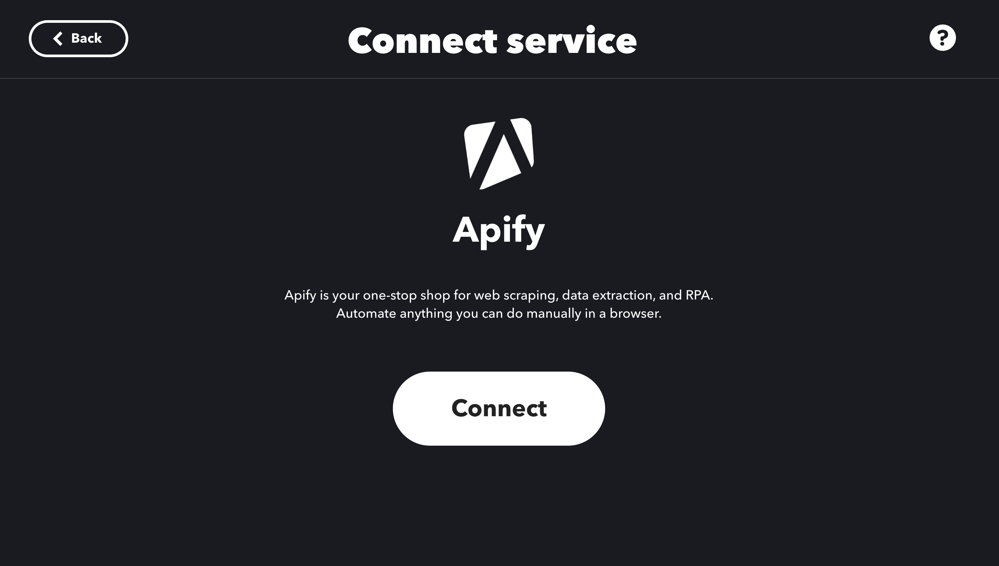
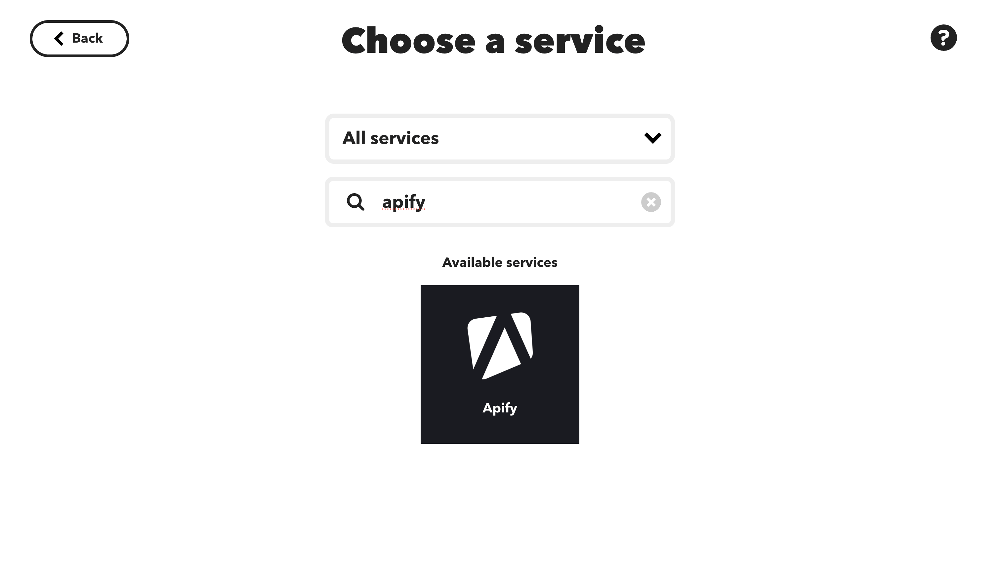
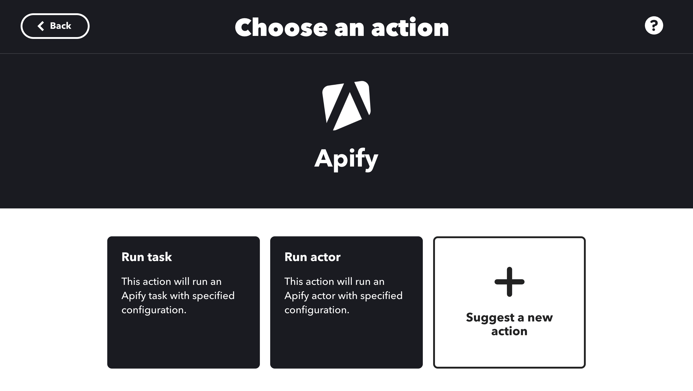
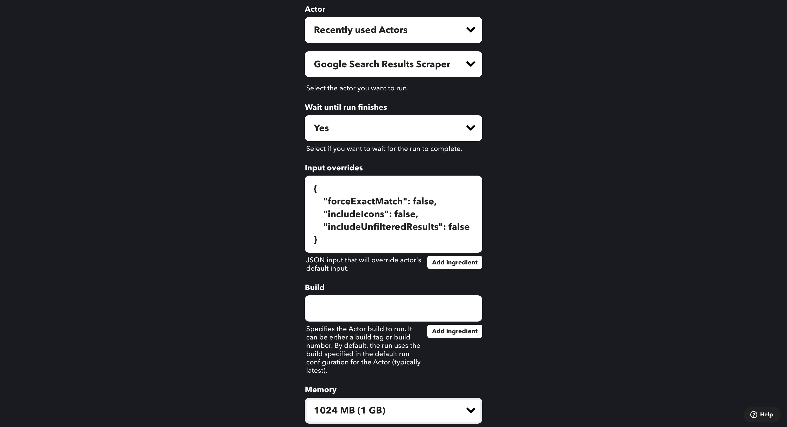
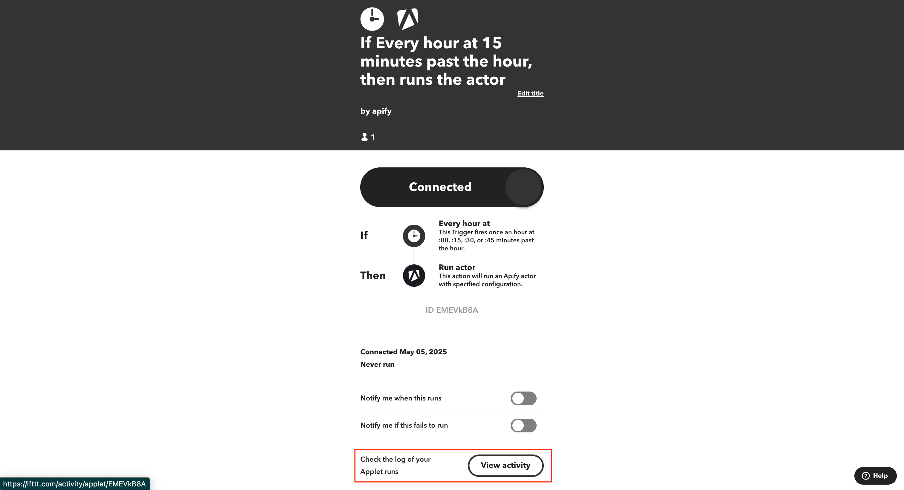
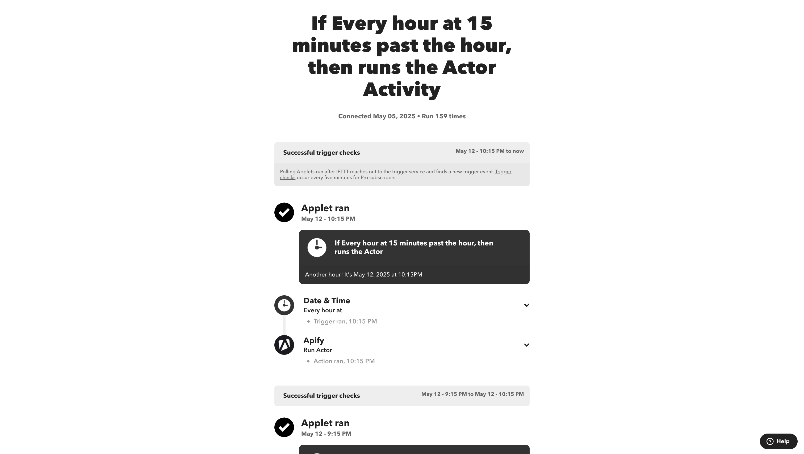

**Connect Apify Actors with IFTTT to automate workflows using Actor run events, data queries, and task actions.**

---

[IFTTT](https://ifttt.com) is a service that helps you create automated workflows called Applets. With the [Apify integration for IFTTT](https://ifttt.com/apify), you can connect your Apify Actors to hundreds of services like Twitter, Gmail, Google Sheets, Slack, and more.

This guide shows you how to integrate Apify Actors with IFTTT to build automated workflows. You'll learn how to create IFTTT Applets that can be triggered by Apify events or that can execute Apify tasks.

An IFTTT Applet consists of three key parts:

- A _trigger_ that starts the workflow
- Optional _queries_ that retrieve data
- One or more _actions_ that execute when the Applet runs

The Apify integration lets you trigger workflows when an Actor or task run finishes, start Actor or task runs from other triggers, or retrieve data from datasets and key-value stores.

## Prerequisites

Before using the Apify integration with IFTTT, you need:

- An [Apify account](https://console.apify.com/)
- An [IFTTT account](https://ifttt.com/)

## Connect Apify with IFTTT

To connect your Apify account to IFTTT:

1. Visit the [Apify service page](https://ifttt.com/apify) on IFTTT.
2. Click the **Connect** button.
3. When redirected to the Apify login page, sign in to your Apify account.

## Create an Applet with Apify

### Create an Applet

To create an Applet that starts when Apify event occurs:

1. Go to the [Explore](https://ifttt.com/explore) section on IFTTT.
1. Click the **Create** button.
1. In the **If this** section, click **Add**.
1. Search for and select **Apify** in the service list.

 

1. Select a trigger from the available options:

- **Actor Run Finished**: Triggers when a selected Actor run completes
- **Task Run Finished**: Triggers when a selected Actor task run completes

 

1. Configure the trigger by selecting the specific Actor or task.
1. Click **Create trigger** to continue.

In case you didn't connect to the Apify account, you will be prompted to do so when you select a trigger.

### Set up an Apify Action

To use Apify as an action in your Applet:

1. In the **Then That** section of your Applet, click **Add**.
1. Search for and select **Apify**.
1. Choose an action:

- **Run Actor**: Starts an Actor run
- **Run Task**: Starts an Actor Task run

 

1. Select the Actor or task you want to use from the dropdown menu.

 :::note

 IFTTT displays up to 50 recent items in a dropdown. If your Actor or task isn't visible, try using it at least once via API or in the Apify Console to make it appear in the list.

 :::

 

1. Configure the action parameters:

   | Parameter | Description | Example Values |
   |-----------|-------------|----------------|
   | **Wait until run finishes** | Defines how the Actor should be executed. | `yes`, `no` |
   | **Input overrides** | JSON input that overrides the Actor's default input. | `{"key": "value"}` |
   | **Build** | Specifies the Actor build to run. Can be a build tag or build number. See [Builds](/platform/actors/running/runs-and-builds#builds) for more information. | `0.2.10`, `version-0` |
   | **Memory** | Memory limit for the run in megabytes. See [Memory](/platform/actors/running/usage-and-resources#memory) for more information. | `256` |

1. Click **Create action** to finish setting up the action.

 

1. Give your Applet a name and click **Finish** to save it.

## Monitor your Applet

To check if your Applet is working properly:

1. Go to your Applet's detail page.
1. Clicke the **View activity** button to see the execution history.

 

## Available triggers, actions, and queries

### Triggers

- **Actor Run Finished**: Activates when a selected Actor run completes
- **Task Run Finished**: Activates when a selected Actor task run completes

### Actions

- **Run Actor**: Starts a specified Actor with customizable parameters
- **Run Task**: Executes a specified Actor task

### Queries

- **Get Dataset Items**: Retrieves items from a [dataset](/platform/storage/dataset)
- **Scrape Single URL**: Runs a scraper for a specified website and returns its content
- **Get Key-Value Store Record**: Retrieves a value from a [key-value store](/platform/storage/key-value-store)

## Troubleshooting

- Ensure your JSON inputs in the "Input overrides" field are valid and properly formatted.
- If an Applet fails to trigger, check your Apify API token permissions.

If you have any questions or need help, feel free to reach out to us on our [developer community on Discord](https://discord.com/invite/jyEM2PRvMU).
