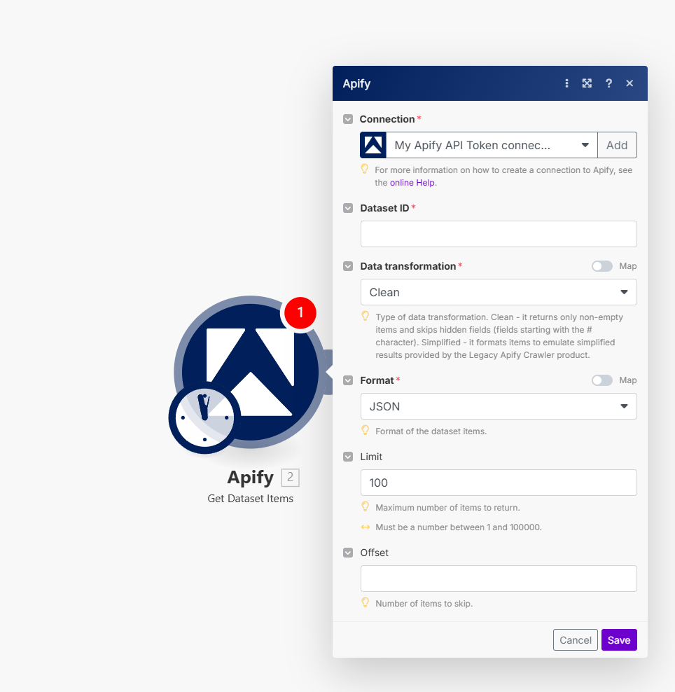

**Learn how to integrate your Apify Actors with Make.**

---

[Make](https://www.make.com/) *(formerly Integromat)* allows you to create scenarios where you can integrate various services (modules) to automate and centralize jobs. Apify has its own module you can use to run Apify Actors, get notified about run statuses, and receive Actor results directly in your Make scenario.

## Connect Apify to Make {#connect-apify-to-make}

To use the Apify integration on Make, you will need:

- An [Apify account](https://console.apify.com/).
- A Make account (and a [scenario](https://www.make.com/en/help/scenarios/creating-a-scenario)).

### Add the Apify module to scenario

Add the Apify module to your scenario. You can find this module by searching for "Apify" in the module search bar.

Next, select one of the available options under Triggers, Actions and Searches, then click on the Apify module to open its configuration window.

### Create a connection to Apify

In the Connection configuration window, you will need to provide your Apify API token.

You can find the token in the Apify Console by navigating to **[Settings > API & Integrations](https://console.apify.com/settings/integrations)**.

Finally, copy your API token to the Make module and save it to create a connection.

Congratulations! You have successfully connected the Apify app and can now use it in your scenarios.

## Run an Actor or task with Output

We have two methods to run an Actor or task and retrieve its data in Make.com, depending on your needs and the complexity of the Actor:

- **Synchronous run using the action module**
- **Asynchronous run using the trigger module**

:::info
Make.com imposes a hard timeout of 5 minutes for synchronous runs. If the Actor or task takes longer than 5 minutes to complete, the data will not be fully returned.
If you anticipate that the Actor run will exceed 5 minutes, use the asynchronous method with a trigger module instead.
:::

The primary difference between the two methods is that the synchronous run waits for the Actor or task to finish and retrieves its output using the "Get Dataset Items" module. By contrast, the asynchronous run watches for the run of an Actor or task (which could have been triggered from another scenario, manually from Apify console or elsewhere) and gets its output once it finishes.

### Synchronous run using the action module

In this example, we will demonstrate how to run an Actor synchronously and export the output to Google Sheets.
The same principle applies to module that runs a task.

#### Step 1: Add the Apify "Run an Actor" Module

First, ensure that you have [connected your Apify account to Make.com](#create-a-connection-to-apify).
Next, add the Apify module called "Run an Actor" to your scenario and configure it.

For this example, we will use the "Google Maps Review Scraper" Actor.
Make sure to set the "Run synchronously" option to "Yes," so the module waits for the Actor to finish run.

#### Step 2: Add the Apify "Get Dataset Items" module

In the next step, add the "Get Dataset Items" module to your scenario, which is responsible for retrieving the output data from the Actor run.

In the "Dataset ID" field, provide the default dataset ID from the Actor run.
You can find this dataset ID in the variables generated by the previous "Run an Actor" module. If the variables do not appear, run the scenario first, then check again.

#### Step 3: Add the Google Sheets "Create Spreadsheet Rows" module

Finally, add the Google Sheets "Bulk Add Rows" module to your scenario. This module will automatically create new rows in a Google Sheets file to store the Actor's output.

In the "Spreadsheet ID" field, provide the ID of the target Google Sheets file, which you can find in its URL. Configure the column range (e.g., "A-Z") and map the data retrieved from the "Get Dataset Items" module to the row values.

You’re all set! Once the scenario is started, it will run the Actor synchronously and export its output to your Google Sheets file.

### Asynchronous run using the trigger module

In this example, we will demonstrate how to run an Actor asynchronously and export its output to Google Sheets.
Before starting, decide where you want to initiate the Actor run. You can do this manually via the Apify console, on a schedule, or from a separate Make.com scenario.

#### Step 1: Add the Apify "Watch Actor Runs" Module

First, ensure that you have [connected your Apify account to Make.com](#create-a-connection-to-apify).
Next, add the Apify module called "Watch Actor Runs" to your scenario. This module will set up a webhook to listen for the finished runs of the selected Actor.

For this example, we will use the "Google Maps Review Scraper" Actor.

#### Step 2: Add the Apify "Get Dataset Items" module

Add the "Get Dataset Items" module to your scenario to retrieve the output of the Actor run.

In the "Dataset ID" field, provide the default dataset ID from the Actor run. You can find the dataset ID in the variables generated by the "Watch Actor Runs" module.

#### Step 3: Add the Google Sheets "Create Spreadsheet Rows" module

Finally, add the Google Sheets "Bulk Add Rows" module to your scenario, which will create new rows in the specified Google Sheets file to store the Actor's output.

In the "Spreadsheet ID" field, enter the ID of the target Google Sheets file, which you can find in its URL. Configure the column range (e.g., "A-Z") and map the data retrieved from the "Get Dataset Items" module to the row values.

That’s it! Once the Actor run is complete, its data will be exported to the Google Sheets file.
You can initiate the Actor run via the Apify console, a scheduler, or from another Make.com scenario.

## Available modules and triggers

### Triggers

- **Watch Actor Runs:** Triggers when a selected Actor run is finished.
- **Watch Task Runs:** Triggers when a selected task run is finished.

### Actions

- **Run a Task:** Runs a selected Actor task.
- **Run an Actor:** Runs a selected Actor.
- **Scrape Single URL:** Runs a scraper for the website and returns its content as text, markdown and HTML.
- **Make an API Call:** Makes an arbitrary authorized API call.

### Searches

- **Get Dataset Items:** Retrieves items from a [dataset](/platform/storage/dataset).
