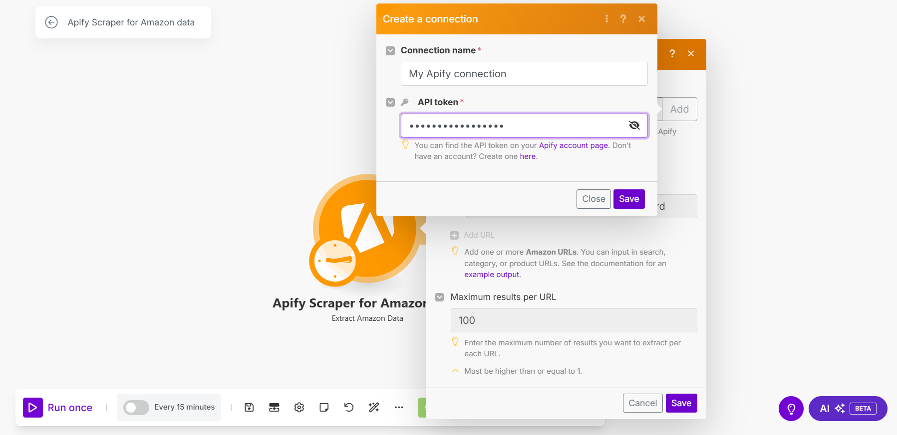

## Apify Scraper for Amazon Data

The Amazon Scraper module from [Apify](https://apify.com) allows you to extract product, search, or category data from Amazon.

To use the module, you need an [Apify account](https://console.apify.com) and an [API token](https://docs.apify.com/platform/integrations/api#api-token), which you can find in the Apify Console under **Settings > Integrations**. After connecting, you can automate data extraction and incorporate the results into your workflows.

## Connect Apify Scraper for Amazon Data modules to Make

1. Create an account at [Apify](https://console.apify.com/). You can sign up using your email, Gmail, or GitHub account.

    

1. To connect your Apify account to Make, you can use an OAuth connection (recommended) or an Apify API token. To get the Apify API token, navigate to **[Settings > API & Integrations](https://console.apify.com/settings/integrations)** in the Apify Console.

    

1. Find your token under **Personal API tokens** section. You can also create a new API token with multiple customizable permissions by clicking on **+ Create a new token**.
1. Click the **Copy** icon next to your API token to copy it to your clipboard. Then, return to your Make scenario interface.

    

1. In Make, click **Add** to open the **Create a connection** dialog of the chosen Apify Scraper module.
1. In the **API token** field, paste the API token you copied from Apify. Provide a clear **Connection name**, and click **Save**.

    

Once connected, you can build workflows to automate Amazon data extraction and integrate results into your applications.

## Apify Scraper for Amazon Data module

After connecting the app, you can use the Search module as a native scraper to extract public Amazon data. Here’s what you get:

### Extract  Amazon data

Get data via [Apify's Amazon Scraper](https://apify.com/junglee/free-amazon-product-scraper). Fill in the URLs of products, searches, or categories you want to gather information about.

For Amazon URLs, you can extract:

- _Product title_
- _Amazon ASIN number_
- _Brand name_
- _Number of reviews_
- _Image_
- _Description_
- _Price value and currency_

```json title="Example"
[
    {
    "title": "Logitech M185 Wireless Mouse, 2.4GHz with USB Mini Receiver, 12-Month Battery Life, 1000 DPI Optical Tracking, Ambidextrous PC/Mac/Laptop - Swift Grey",
    "asin": "B004YAVF8I",
    "brand": "Logitech",
    "stars": 4.5,
    "reviewsCount": 37418,
    "thumbnailImage": "https://m.media-amazon.com/images/I/5181UFuvoBL.__AC_SX300_SY300_QL70_FMwebp_.jpg",
    "breadCrumbs": "Electronics›Computers & Accessories›Computer Accessories & Peripherals›Keyboards, Mice & Accessories›Mice",
    "description": "Logitech Wireless Mouse M185. A simple, reliable mouse with plug-and-play wireless, a 1-year battery life and 3-year limited hardware warranty.(Battery life may vary based on user and computing conditions.) System Requirements: Windows Vista Windows 7 Windows 8 Windows 10|Mac OS X 10.5 or later|Chrome OS|Linux kernel 2.6+|USB port",
    "price": {
    "value": 13.97,
    "currency": "$"
    },
    "url": "https://www.amazon.com/dp/B004YAVF8I"
    },
    {
    "title": "Logitech MX Master 3S - Wireless Performance Mouse with Ultra-fast Scrolling, Ergo, 8K DPI, Track on Glass, Quiet Clicks, USB-C, Bluetooth, Windows, Linux, Chrome - Graphite",
    "asin": "B09HM94VDS",
    "brand": "Logitech",
    "stars": 4.5,
    "reviewsCount": 9333,
    "thumbnailImage": "https://m.media-amazon.com/images/I/41+eEANAv3L._AC_SY300_SX300_.jpg",
    "breadCrumbs": "Electronics›Computers & Accessories›Computer Accessories & Peripherals›Keyboards, Mice & Accessories›Mice",
    "description": "Logitech MX Master 3S Performance Wireless Mouse Introducing Logitech MX Master 3S – an iconic mouse remastered. Now with Quiet Clicks(2) and 8K DPI any-surface tracking for more feel and performance than ever before. Product details: Weight: 4.97 oz (141 g) Dimensions: 2 x 3.3 x 4.9 in (51 x 84.3 x 124.9 mm) Compatible with Windows, macOS, Linux, Chrome OS, iPadOS, Android operating systems (8) Rechargeable Li-Po (500 mAh) battery Sensor technology: Darkfield high precision Buttons: 7 buttons (Left/Right-click, Back/Forward, App-Switch, Wheel mode-shift, Middle click), Scroll Wheel, Thumbwheel, Gesture button Wireless operating distance: 33 ft (10 m) (9)Footnotes: (1) 4 mm minimum glass thickness (2) Compared to MX Master 3, MX Master 3S has 90% less Sound Power Level left and right click, measured at 1m (3) Compared to regular Logitech mouse without an electromagnetic scroll wheel (4) Compared to Logitech Master 2S mouse with Logitech Options installed and Smooth scrolling enabled (5) Requires Logi Options+ software, available for Windows and macOS (6) Not compatible with Logitech Unifying technology (7) Battery life may vary based on user and computing conditions. (8) Device basic functions will be supported without software for operating systems other than Windows and macOS (9) Wireless range may vary depending on operating environment and computer setup",
    "price": {
    "value": 89.99,
    "currency": "$"
    },
    "url": "https://www.amazon.com/dp/B09HM94VDS"
    },
    {
    "title": "Apple Magic Mouse - White Multi-Touch Surface ",
    "asin": "B0DL72PK1P",
    "brand": "Apple",
    "stars": 4.6,
    "reviewsCount": 18594,
    "thumbnailImage": "",
    "breadCrumbs": "",
    "description": null,
    "price": {
    "value": 78.99,
    "currency": "$"
    },
    "url": "https://www.amazon.com/dp/B0DL72PK1P"
    }
]
```

```json title="Search data sample"
[
    {
        "title": "Logitech MK270 Wireless Keyboard And Mouse Combo For Windows, 2.4 GHz Wireless, Compact Mouse, 8 Multimedia And Shortcut Keys, For PC, Laptop - Black",
        "asin": "B079JLY5M5",
        "brand": "Logitech",
        "stars": 4.5,
        "reviewsCount": 107637,
        "thumbnailImage": "https://m.media-amazon.com/images/I/61gSpxZTZZL.__AC_SX300_SY300_QL70_ML2_.jpg",
        "breadCrumbs": "Electronics›Computers & Accessories›Computer Accessories & Peripherals›Keyboards, Mice & Accessories›Keyboard & Mouse Combos",
        "description": "The stylish Logitech MK270 Wireless Keyboard and Mouse Combo is perfect for the home office or workplace. Ditch the touchpad for this full size keyboard and mouse. Easily connect using Logitech's plug and forget receiver—just plug it into the USB port, and you're ready to work. There's no lengthy installation procedure to slow you down. When you're on the move, the receiver stores comfortably inside the mouse. Both the keyboard and mouse included in the MK270 combo use wireless 2.4GHz connectivity to provide seamless, interruption free use. Use the keyboard within a 10 m range without keyboard lag. Work for longer with the MK270's long battery life. The keyboard can be used for up to 24 months, and the mouse for 12 months, without replacing batteries. The Logitech MK270 keyboard includes 8 hotkeys that are programmable to your most used applications to boost your productivity.",
        "price": {
            "value": 21.98,
            "currency": "$"
        },
        "url": "https://www.amazon.com/dp/B079JLY5M5"
    },
    {
        "title": "Wireless Keyboard and Mouse Combo - Round Keycaps, Full-Size Retro Typewriter Keyboard with Detachable Wrist Rest, Sleep Mode & Tilt Legs, 2.4GHz Cordless Connection for Mac/Windows/PC (Hot Pink)",
        "asin": "B0CQJV4BW3",
        "brand": "SABLUTE",
        "stars": 4.3,
        "reviewsCount": 928,
        "thumbnailImage": "https://m.media-amazon.com/images/I/61NOammUF2L.__AC_SY300_SX300_QL70_FMwebp_.jpg",
        "breadCrumbs": "Electronics›Computers & Accessories›Computer Accessories & Peripherals›Keyboards, Mice & Accessories›Keyboard & Mouse Combos",
        "description": null,
        "price": {
            "value": 39.99,
            "currency": "$"
        },
        "url": "https://www.amazon.com/dp/B0CQJV4BW3"
    },
    {
        "title": "Redragon S101 Gaming Keyboard, M601 Mouse, RGB Backlit Gaming Keyboard, Programmable Backlit Gaming Mouse, Value Combo Set [New Version]",
        "asin": "B00NLZUM36",
        "brand": "Redragon",
        "stars": 4.6,
        "reviewsCount": 46346,
        "thumbnailImage": "https://m.media-amazon.com/images/I/71QDJHG1PqL.__AC_SX300_SY300_QL70_FMwebp_.jpg",
        "breadCrumbs": "Video Games›PC›Accessories›Gaming Keyboards",
        "description": null,
        "price": {
            "value": 39.99,
            "currency": "$"
        },
        "url": "https://www.amazon.com/dp/B00NLZUM36"
    }
]
```

```json title="Product data sample"
[
    {
        "title": "Amazon Basics Wired Keyboard, Full-Sized, QWERTY Layout, Black",
        "asin": "B07WJ5D3H4",
        "brand": "Amazon Basics",
        "stars": 4.5,
        "reviewsCount": 7606,
        "thumbnailImage": "https://m.media-amazon.com/images/I/71ehwfAM4-L.__AC_SY300_SX300_QL70_FMwebp_.jpg",
        "breadCrumbs": "Electronics›Computers & Accessories›Computer Accessories & Peripherals›Keyboards, Mice & Accessories›Keyboards",
        "description": "Product DescriptionFeaturing a standard US QWERTY layout, the keyboard provides comfort and familiarity, while the sleek black design complements any tech setup or decor seamlessly. This wired keyboard and mouse set is great for those seeking a wired keyboard and mouse for home or office use. The mouse and keyboard combo offers a practical plug-and-play solution, compatible with multiple versions of Windows, including 2000, XP, Vista, 7, 8, and 10/11.From the ManufacturerAmazon Basics",
        "price": {
            "value": 18.04,
            "currency": "$"
        },
        "url": "https://www.amazon.com/dp/B07WJ5D3H4"
    }
]
```

```json title="Category data sample"
[
    {
        "title": "Logitech M185 Wireless Mouse, 2.4GHz with USB Mini Receiver, 12-Month Battery Life, 1000 DPI Optical Tracking, Ambidextrous PC/Mac/Laptop - Swift Grey",
        "asin": "B004YAVF8I",
        "brand": "Logitech",
        "stars": 4.5,
        "reviewsCount": 37418,
        "thumbnailImage": "https://m.media-amazon.com/images/I/5181UFuvoBL.__AC_SX300_SY300_QL70_FMwebp_.jpg",
        "breadCrumbs": "Electronics›Computers & Accessories›Computer Accessories & Peripherals›Keyboards, Mice & Accessories›Mice",
        "description": "Logitech Wireless Mouse M185. A simple, reliable mouse with plug-and-play wireless, a 1-year battery life and 3-year limited hardware warranty.(Battery life may vary based on user and computing conditions.) System Requirements: Windows Vista Windows 7 Windows 8 Windows 10|Mac OS X 10.5 or later|Chrome OS|Linux kernel 2.6+|USB port",
        "price": {
            "value": 13.97,
            "currency": "$"
        },
        "url": "https://www.amazon.com/dp/B004YAVF8I"
    },
    {
        "title": "Logitech MX Master 3S - Wireless Performance Mouse with Ultra-fast Scrolling, Ergo, 8K DPI, Track on Glass, Quiet Clicks, USB-C, Bluetooth, Windows, Linux, Chrome - Graphite",
        "asin": "B09HM94VDS",
        "brand": "Logitech",
        "stars": 4.5,
        "reviewsCount": 9333,
        "thumbnailImage": "https://m.media-amazon.com/images/I/41+eEANAv3L._AC_SY300_SX300_.jpg",
        "breadCrumbs": "Electronics›Computers & Accessories›Computer Accessories & Peripherals›Keyboards, Mice & Accessories›Mice",
        "description": "Logitech MX Master 3S Performance Wireless Mouse Introducing Logitech MX Master 3S – an iconic mouse remastered. Now with Quiet Clicks(2) and 8K DPI any-surface tracking for more feel and performance than ever before. Product details: Weight: 4.97 oz (141 g) Dimensions: 2 x 3.3 x 4.9 in (51 x 84.3 x 124.9 mm) Compatible with Windows, macOS, Linux, Chrome OS, iPadOS, Android operating systems (8) Rechargeable Li-Po (500 mAh) battery Sensor technology: Darkfield high precision Buttons: 7 buttons (Left/Right-click, Back/Forward, App-Switch, Wheel mode-shift, Middle click), Scroll Wheel, Thumbwheel, Gesture button Wireless operating distance: 33 ft (10 m) (9)Footnotes: (1) 4 mm minimum glass thickness (2) Compared to MX Master 3, MX Master 3S has 90% less Sound Power Level left and right click, measured at 1m (3) Compared to regular Logitech mouse without an electromagnetic scroll wheel (4) Compared to Logitech Master 2S mouse with Logitech Options installed and Smooth scrolling enabled (5) Requires Logi Options+ software, available for Windows and macOS (6) Not compatible with Logitech Unifying technology (7) Battery life may vary based on user and computing conditions. (8) Device basic functions will be supported without software for operating systems other than Windows and macOS (9) Wireless range may vary depending on operating environment and computer setup",
        "price": {
            "value": 89.99,
            "currency": "$"
        },
        "url": "https://www.amazon.com/dp/B09HM94VDS"
    },
    {
        "title": "Apple Magic Mouse - White Multi-Touch Surface ",
        "asin": "B0DL72PK1P",
        "brand": "Apple",
        "stars": 4.6,
        "reviewsCount": 18594,
        "thumbnailImage": "https://m.media-amazon.com/images/I/41U6Q0T5toL.__AC_SY445_SX342_QL70_FMwebp_.jpg",
        "breadCrumbs": "",
        "description": null,
        "price": {
            "value": 78.99,
            "currency": "$"
        },
        "url": "https://www.amazon.com/dp/B0DL72PK1P"
    }
]
```

## Other scrapers available

There are other native Make Apps powered by Apify. You can check out Apify Scraper for:

- [Instagram Data](/platform/integrations/make/instagram)
- [TikTok Data](/platform/integrations/make/tiktok)
- [Google Search](/platform/integrations/make/search)
- [Google Maps Emails Data](/platform/integrations/make/maps)
- [YouTube Data](/platform/integrations/make/youtube)
- [AI crawling](/platform/integrations/make/ai-crawling)


And more! Because you can access any of our 4,500+ scrapers on Apify Store by using the [general Apify connections](https://www.make.com/en/integrations/apify).
