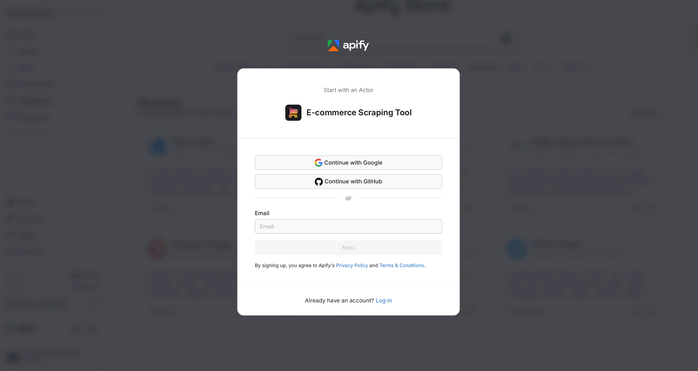
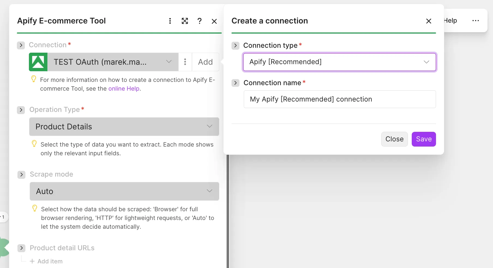
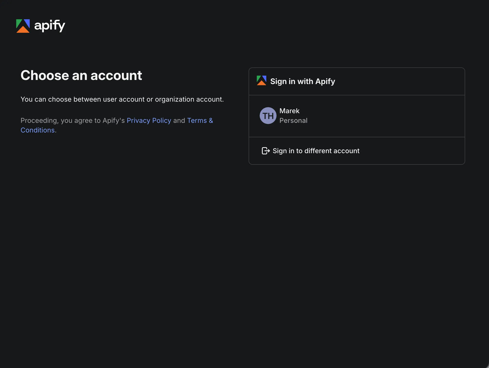
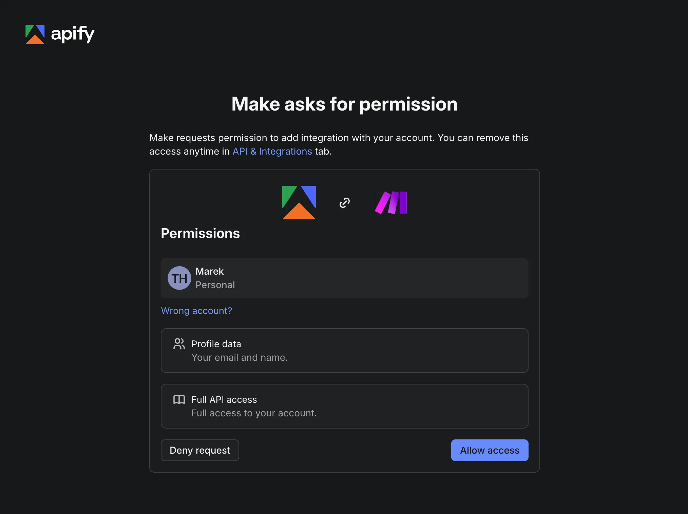
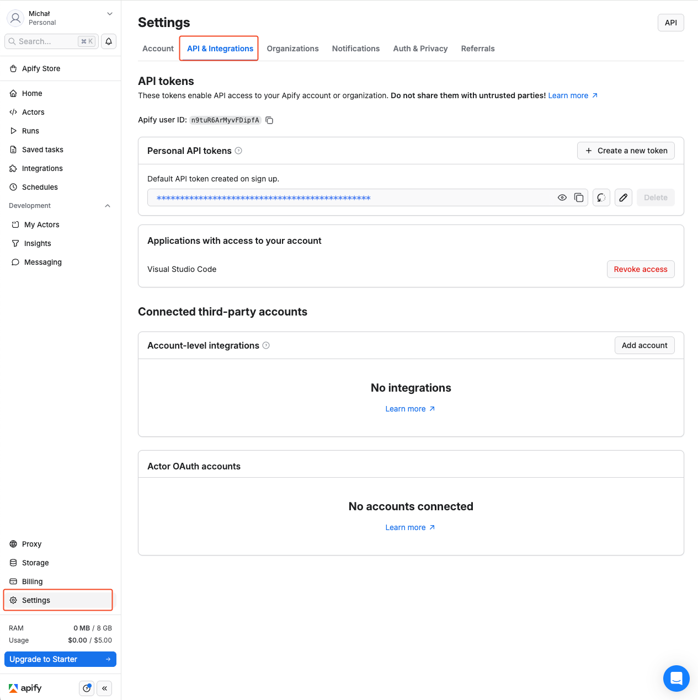
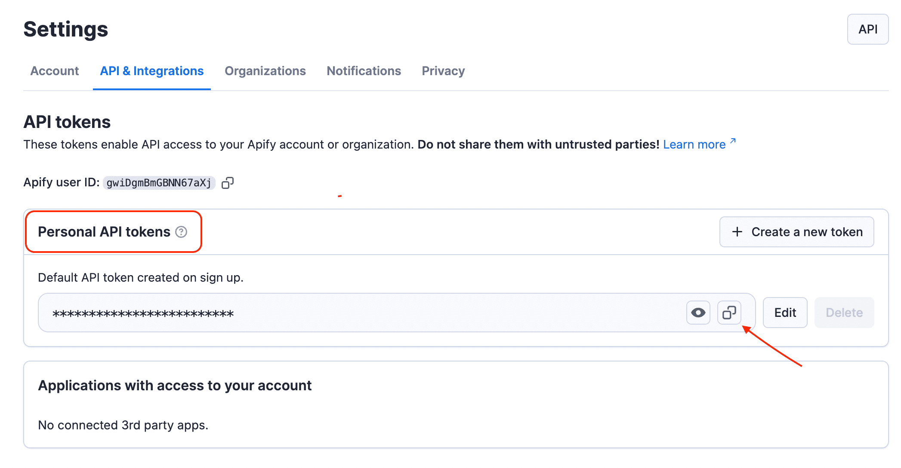
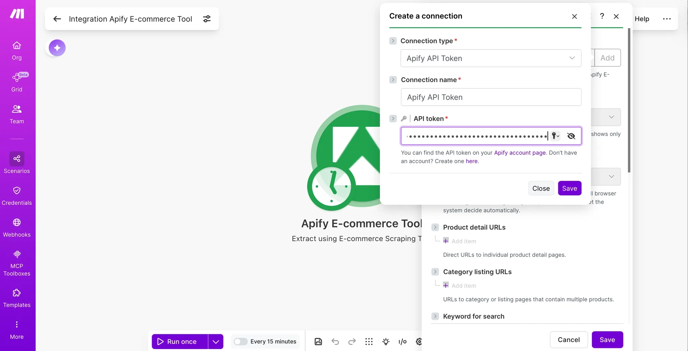
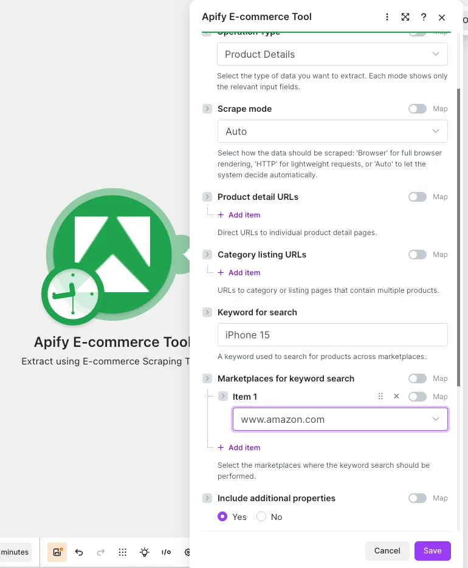
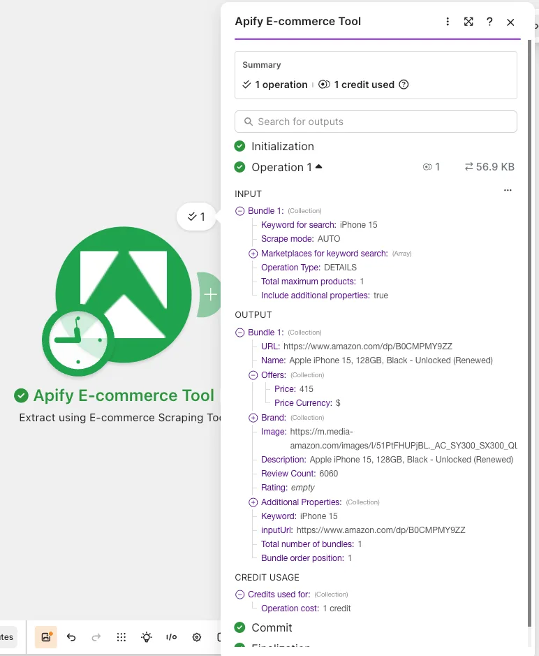

import ThirdPartyDisclaimer from '@site/sources/_partials/_third-party-integration.mdx';

Use the Apify E-commerce Scraping Tool module in [Make](https://www.make.com/) to extract product, review, seller, and influencer-storefront data from hundreds of retail sites and marketplaces.

<ThirdPartyDisclaimer />

## Apify E-commerce Scraping Tool

The E-commerce Scraping Tool from [Apify](https://apify.com/) lets you extract product, review, seller, and influencer-storefront data from hundreds of retail sites and marketplaces, including Amazon, eBay, Best Buy, Home Depot, IKEA, Alibaba, Allegro, Alza, Idealo, Costco, Coles, and Ashley Furniture, plus delivery platforms like Instacart and DoorDash. You can pass direct product or category URLs, run keyword searches across multiple marketplaces in one go, or pull localized results from Google Shopping.

A single module, **Extract using E-commerce Scraping Tool**, powers six operation modes, each exposing only the input fields relevant to it. Every mode is powered by the [E-commerce Scraping Tool](https://console.apify.com/actors/2APbAvDfNDOWXbkWf) Actor and can be combined freely inside one Make scenario.

| Mode | What it returns |
| --- | --- |
| **Product Details** | Product data (title, price, brand, images, rating, variants, etc.) from detail pages, category listings, or a keyword search. Can include an AI-generated summary. |
| **Reviews** | Customer reviews for products, from detail/listing URLs or a keyword search, with sorting options. |
| **Sellers** | Seller / store profile data, including reputation and contact details, from seller profile URLs. |
| **Search Engine** | Product, review, or seller results pulled from Google Shopping-style results, localized by country/region/city. |
| **Food Delivery** | Products and reviews from food-delivery marketplaces (Instacart, DoorDash), localized by delivery address. |
| **Influencer storefronts** | Posts and (optionally) the products featured by influencers, from influencer storefront URLs. |

To use this module, you need an [Apify account](https://console.apify.com/sign-up) and either an OAuth connection (recommended) or an [API token](https://docs.apify.com/platform/integrations/api#api-token). Running the Actor consumes Apify platform usage on your account. Once connected, you can pipe results straight into pricing dashboards, repricing tools, CRMs, sheets, or any other system in your Make scenario.

## Connect Apify E-commerce Scraping Tool

First, create an account at [console.apify.com](https://console.apify.com/). You can sign up using your email, Gmail, or GitHub account.



To connect your Apify account to Make, use an OAuth connection (recommended) or an Apify API token.

### Connect with OAuth

1. In Make, add the **Extract using E-commerce Scraping Tool** module and click **Add** to open the **Create a connection** dialog. Open the **Connection type** dropdown, select the OAuth option, name the connection, and click **Save**.

    

1. A sign-in popup opens. Choose the Apify account to connect, either a personal or an organization account.

    

1. Review the permissions Make requests, your profile data and full API access, then click **Allow access**. The popup closes and the connection is ready to use.

    

### Connect with an API token

1. In Apify Console, open the **Settings > API & Integrations** tab at [console.apify.com/settings/integrations](https://console.apify.com/settings/integrations).

    

1. Find your token under **Personal API tokens**, or create a new token with customizable permissions by clicking **+ Create a new token**. Copy the token and go back to Make.

    

1. In Make, click **Add** to open the **Create a connection** dialog, select the **Apify API Token** connection type, paste the token into the **API token** field, name your connection, and click **Save**.

    

Once connected, you can build workflows to automate e-commerce data extraction (competitor price tracking, catalog comparisons, review mining, seller analysis) and pipe the results into your applications.

## Module: Extract using E-commerce Scraping Tool

This is a *search* module: it returns one bundle per item it collects (product, review, seller, etc.). When a run produces many items, the module outputs many bundles that the scenario iterates over automatically.

### How it works

1. The module starts an Actor run with your input.
1. It polls the run until it finishes (this can take from seconds to several minutes depending on how much data you request).
1. It reads the run's dataset and outputs each item as a bundle.

If the run does not finish successfully, the module returns an error with the run's status message so you can adjust your input and try again.

:::info Synchronous run timeout

This module runs the Actor *synchronously*: the scenario step waits for the run to finish before continuing. Make imposes a hard timeout on synchronous operations, and the limit varies based on your Make plan. If the Actor run takes longer than that timeout, the data will not be fully returned.

To keep runs fast and within the timeout, use the per-mode **maximum results** fields to cap how much data each run collects. For very large extractions, split the work across multiple scenario runs.

:::

:::tip Provide a data source

Each mode needs at least one data source: a URL, keyword, or profile URL. A mode with no source has nothing to work with.

:::

## Operation modes

Select an **Operation Type** first; the input fields below appear based on your choice. Each mode lists its input fields, the data it extracts, and a shortened sample of its output.

The samples show the fields the Make module exposes with labels for mapping. Each bundle also carries Make's iterator fields `__IMTLENGTH__` (total number of items in the run) and `__IMTINDEX__` (the item's 1-based position). In **Product Details** and **Reviews** modes, enabling **Include additional properties** nests extra source-specific fields (availability, identifiers, ratings breakdown, media, and similar) under `additionalProperties`. The keys under `additionalProperties` depend on the marketplace the item comes from, so they vary from site to site. The other modes return all fields at the top level.

### Product Details

Pull rich product data in product mode. You can feed the module direct **product detail URLs**, **category/listing URLs**, or a **keyword + a list of marketplaces** to search across (Amazon, eBay, Best Buy, IKEA, Allegro, Alza, Idealo, and many more). You can also pick a scrape mode (`Auto`, `Browser`, or `HTTP`) and cap the total number of products.

| Field | Description |
| --- | --- |
| **Mode** | How pages are loaded: `Auto` (default, lets the tool decide), `Browser` (full page rendering), or `HTTP` (lightweight requests). |
| **Product detail URLs** | Direct URLs to individual product pages. |
| **Category listing URLs** | URLs to category/listing pages containing multiple products. |
| **Keyword for search** | Keyword to find products across marketplaces. |
| **Marketplaces for keyword search** | Marketplaces to run the keyword search on (loaded dynamically). |
| **Include additional properties** | Include extra fields in the response (default: on). |
| **AI summary data points** | Data point(s) to send to AI for summarization. |
| **AI summary custom prompt** | Custom instructions for the AI summary. Leave blank to use Apify's default prompt. |
| **Total maximum products** | Cap on the number of products collected during the run. |

For each product, the module returns these top-level fields:

- *Identity*: `name`, `brand` (with `slogan`), `url`, and `image`.
- *Pricing*: an `offers` object with `price` and `priceCurrency`.
- *Description*: a `description` string.
- *Reviews summary*: `rating` and `reviewCount`.
- *Context*: the `keyword` that surfaced the product (for keyword searches) and the `inputUrl` the run started from.

When **Include additional properties** is on, the module nests source-specific fields under `additionalProperties`. The exact set varies by marketplace and can include availability (`inStock`, `inStockText`), identifiers (`asin`, `originalAsin`), rating detail (`stars`, `starsBreakdown`), `breadCrumbs`, media (`galleryThumbnails`, `highResolutionImages`), `features`, key/value `attributes` and `productOverview`, `variantAsins` and `variantDetails`, `seller`, `bestsellerRanks`, `priceRange`, and an `aiReviewsSummary`. When you set AI summary data points, the module can also return an AI-generated summary of the chosen fields (see [AI summary](#ai-summary-product-details-mode) below).

```json title="Product Details bundle (shortened)"
[
    {
        "url": "https://www.example.com/product/abc-123",
        "name": "Example Product",
        "offers": {
            "price": 199.00,
            "priceCurrency": "$"
        },
        "brand": {
            "slogan": "example"
        },
        "image": "https://www.example.com/images/abc-123.jpg",
        "description": "example",
        "reviewCount": 12345,
        "rating": 12345,
        "additionalProperties": {
            "asin": "abc-123",
            "originalAsin": "abc-123",
            "inStock": true,
            "inStockText": "example"
        },
        "keyword": "example",
        "inputUrl": "https://www.example.com/product/abc-123",
        "__IMTLENGTH__": 1,
        "__IMTINDEX__": 1
    }
]
```

#### AI summary (Product Details mode)

In **Product Details** mode you can have Apify generate an AI summary of the collected data:

- **AI summary data points**: pick which fields to feed into the AI (the available list is loaded dynamically from the Actor).
- **AI summary custom prompt**: optionally tell the AI exactly how to process those data points. If left blank, Apify's default prompt is used.

The result is returned in the `aiSummary` output field.

### Reviews

Mine customer reviews in review mode. You can pass **review detail URLs**, **review listing URLs**, or a **keyword + list of marketplaces** to search. Choose how reviews are sorted and set a cap on the total number of reviews.

| Field | Description |
| --- | --- |
| **Review detail URLs** | Product detail pages to read reviews from. |
| **Review listing URLs** | Listing pages from which to collect all reviews. |
| **Keyword for search** | Keyword to find product reviews across marketplaces. |
| **Marketplaces for keyword search** | Marketplaces to run the review keyword search on. |
| **Review sort type** | `Most recent` (default), `Most relevant`, `Most helpful`, `Highest rated`, or `Lowest rated`. |
| **Include additional review properties** | Include extra fields in the response (default: on). |
| **Total maximum reviews** | Cap on the number of reviews collected during the run. |

For each review, the module returns these top-level fields:

- *Review content*: `reviewBody` (the review text) and `name` (the review title).
- *Rating*: a `reviewRating` object with `ratingValue`, `bestRating`, and `worstRating`.
- *Reviewer*: `author` (name or username).
- *Timestamp*: `datePublished`.
- *Product association*: `productUrl` and the `inputUrl` the run started from.

When **Include additional review properties** is on, the module nests extra fields under `additionalProperties`. The keys depend on the marketplace, for example `recommended`, feedback counts, and `badges` on some sites, or `location`, `badge`, and `reviewId` on others.

:::note Marketplace differences

Some sort options and extended review properties depend on the marketplace. If a marketplace doesn't support the requested sort, the tool falls back to the default sort. Review-heavy sites may require residential proxies and browser rendering, which are billed as flat per-product add-ons in the [Actor's pricing model](https://apify.com/apify/e-commerce-scraping-tool/pricing).

:::

```json title="Reviews bundle (shortened)"
[
    {
        "productUrl": "https://www.example.com/product/abc-123",
        "author": "example",
        "datePublished": "2026-01-01",
        "reviewBody": "example",
        "name": "example",
        "reviewRating": {
            "bestRating": null,
            "ratingValue": 12345,
            "worstRating": null
        },
        "additionalProperties": {
            "badge": "example",
            "location": "example",
            "reviewId": 12345
        },
        "inputUrl": "https://www.example.com/product/abc-123",
        "__IMTLENGTH__": 1,
        "__IMTINDEX__": 1
    }
]
```

### Sellers

Map the vendor side of a marketplace in seller mode. Provide one or more **seller profile URLs** (Amazon storefronts, eBay seller pages, Alibaba supplier pages, etc.) and set a cap on the number of sellers.

| Field | Description |
| --- | --- |
| **Seller profile URLs** | Seller profile / store page URLs to read. |
| **Total maximum sellers** | Cap on the number of sellers collected during the run. |

For each seller, the module returns these top-level fields:

- *Identity*: `name` and storefront `url`.
- *Reputation*: an `aggregateRating` object with `ratingValue` and `ratingCount`.
- *Contact*: `sellerEmail` and `sellerPhone` where the marketplace exposes them (often empty).
- *Location*: an `address` object with `addressCountry` and `addressLocality`.
- *Ownership*: a `parentOrganization` object (`name`, `url`, `additionalName`) where available.
- *Context*: the `inputUrl` the run started from.

```json title="Sellers bundle (shortened)"
[
    {
        "url": "https://www.example.com/seller/abc-123",
        "name": "example",
        "parentOrganization": {
            "name": null,
            "url": null,
            "additionalName": null
        },
        "address": {
            "addressCountry": "US",
            "addressLocality": "example"
        },
        "aggregateRating": {
            "ratingCount": 12345,
            "ratingValue": "example"
        },
        "sellerEmail": "",
        "sellerPhone": null,
        "inputUrl": "https://www.example.com/seller/abc-123",
        "__IMTLENGTH__": 1,
        "__IMTINDEX__": 1
    }
]
```

### Search Engine

Discover products across the web with Google Shopping-style results. Provide one keyword per line (up to 50), pick the data type, and localize results with country, city, and region (e.g. `us` + `New York`, or `de` + `Bavaria`).

| Field | Description |
| --- | --- |
| **Keyword search** | Search term(s) used to find products, one keyword per line (up to 50). |
| **Mode** | `Google Listing` (default), `Products`, `Reviews`, or `Sellers`. |
| **Country codes** | Country/region for the search context; affects currency, shipping, and availability (default: United States). |
| **City** | City to localize results (e.g. "New York"). |
| **Region** | Region/state to localize results (e.g. "California"). |
| **Include additional properties** | Include extra fields in the products response (default: on). |
| **Maximum products per page** | Cap on products collected from a single results page. |
| **Maximum sellers per product** | Cap on sellers collected per product (when looking at sellers). |
| **Total maximum search engine results** | Overall cap on items (products/sellers/reviews) in this mode. |

For each search result, the module returns these top-level fields:

- *Identity*: `name`, `image`, `brand` (with `slogan`), `description`, and the `googleURL` for the result.
- *Offers*: an `offers` array, one entry per seller, each with `seller`, `url`, `price`, `priceCurrency`, `rating`, `extras` (labels such as shipping and return notes), and a `ranking`.
- *Rating summary*: `rating` and `reviewCount`.
- *Context*: the `keyword` searched and the `inputUrl` the run started from.

```json title="Search Engine bundle (shortened)"
[
    {
        "googleURL": "https://www.example.com/search?q=example",
        "name": "Example Product",
        "offers": [
            {
                "seller": "example",
                "url": "https://www.example.com/product/abc-123",
                "price": "12345",
                "priceCurrency": "$",
                "rating": 12345,
                "extras": [
                    "example"
                ],
                "ranking": 1
            }
        ],
        "brand": {
            "slogan": null
        },
        "description": null,
        "image": "https://www.example.com/images/abc-123.jpg",
        "reviewCount": 12345,
        "rating": 12345,
        "keyword": "example",
        "inputUrl": "https://www.example.com/search?q=example",
        "__IMTLENGTH__": 1,
        "__IMTINDEX__": 1
    }
]
```

### Food Delivery

Pull localized data from food and grocery delivery platforms (currently Instacart and DoorDash) in delivery mode. Provide a **delivery address** (city, ZIP, or full address) plus either **delivery product URLs**, **delivery listing URLs**, or a **keyword + marketplaces** combination.

| Field | Description |
| --- | --- |
| **Keyword for search** | Keyword to find delivery products across selected delivery marketplaces. |
| **Marketplaces for keyword search** | Delivery marketplaces to search (loaded dynamically). |
| **Delivery product detail URLs** | Direct links to individual delivery product pages. |
| **Delivery listing URLs** | Delivery category/listing pages; products on them are processed automatically. |
| **Delivery address or location** | City, ZIP, or full address used to localize availability and results. |
| **Include extended delivery review data** | Include reviews in the output (default: off). |
| **Total maximum results** | Overall cap on delivery products/reviews collected. |

For each delivery product, the module returns these top-level fields:

- *Identity*: `name`, `url`, `brand` (with `slogan`), and `image`.
- *Pricing*: an `offers` object with `price` and `currency`.
- *Description*: a `description` string.
- *Context*: the `keyword` searched.

When **Include extended delivery review data** is on, the module adds review records to the output.

```json title="Food Delivery bundle (shortened)"
[
    {
        "url": "https://www.example.com/delivery/product/abc-123",
        "name": "Example Product",
        "offers": {
            "price": 12345,
            "currency": "USD"
        },
        "brand": {
            "slogan": null
        },
        "description": "example",
        "image": "https://www.example.com/images/abc-123.jpg",
        "keyword": "example",
        "__IMTLENGTH__": 1,
        "__IMTINDEX__": 1
    }
]
```

### Influencer storefronts

Map the social-commerce side of e-commerce by looking at influencer storefront pages (such as Amazon Influencer storefronts) in influencer mode. Provide one or more **influencer URLs** and optionally also pull the promoted products inside each post.

| Field | Description |
| --- | --- |
| **Influencer URLs** | Influencer storefront page URLs to read. |
| **Include products from influencer posts** | Also collect the products featured in the influencer's posts (default: off). |
| **Total maximum influencer results** | Cap on the number of influencer posts/items collected. |

For each influencer post, the module returns these top-level fields:

- *Source*: `influencerUrl` (the storefront) and the `inputUrl` the run started from.
- *Post*: `url`, `type` (such as `LIST`), `postId`, and `image`.
- *Engagement*: `likes` where available.
- *Products*: `itemsCount`, the number of products tagged in the post. When **Include products from influencer posts** is on, the module also collects those products.

```json title="Influencer storefronts bundle (shortened)"
[
    {
        "influencerUrl": "https://www.example.com/shop/abc-123",
        "url": "https://www.example.com/shop/abc-123/list/abc-123",
        "image": "https://www.example.com/images/abc-123.jpg",
        "type": "LIST",
        "postId": "abc-123",
        "likes": 12345,
        "itemsCount": 12345,
        "inputUrl": "https://www.example.com/shop/abc-123",
        "__IMTLENGTH__": 1,
        "__IMTINDEX__": 1
    }
]
```

## Example scenario: Extract products to Google Sheets

This example runs the Actor in **Product Details** mode and writes each product to a spreadsheet.

### Step 1: Add the "Extract using E-commerce Scraping Tool" module

Add the module to your scenario as the first step. Choose the **Product Details** operation type and provide a data source (for example, one or more **Product detail URLs** or a **Keyword for search**). Set **Total maximum products** to keep the run within your Make plan's synchronous timeout.



### Step 2: Add the Google Sheets "Add a Row" module

Add the Google Sheets **Add a Row** (or **Bulk Add Rows**) module after the Extract module. Map product fields from the module output (such as `name`, `offers: price`, `url`, and `rating`) into your spreadsheet columns.

### Step 3: Run the scenario

Run the scenario. The Extract module outputs one bundle per product, and Google Sheets adds a row for each.



## Tips and best practices

- *Provide a data source.* Each mode needs at least one URL, keyword, or profile URL.
- *Mind the synchronous timeout.* The module waits for the run to finish; use the per-mode "maximum results" fields to keep runs fast and within your Make plan's limit.
- *Usage is billed to your Apify account.* Larger limits mean more platform usage.
- *Marketplace and AI data-point lists are dynamic.* They're fetched from the Actor, so the available options reflect what the Actor currently supports.
- *Sorting may fall back.* If a marketplace doesn't support the chosen review sort, the tool uses its default order.

## Other scrapers available

There are other native Make apps powered by Apify. Check out Apify for:

- Instagram Data
- TikTok Data
- YouTube Data
- Facebook Data
- Google Search Data
- Google Maps Emails Data
- Amazon Data

And more! You can access any of the 30,000+ Actors on Apify Store by using the [general Apify connections on Make](https://www.make.com/en/integrations/apify).
