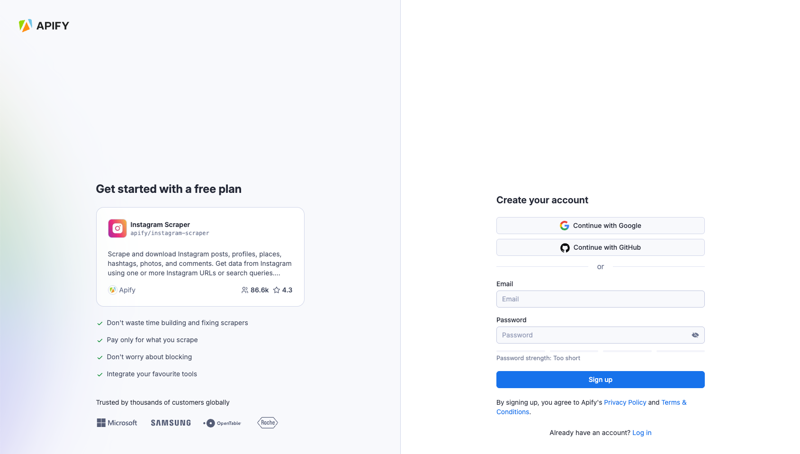
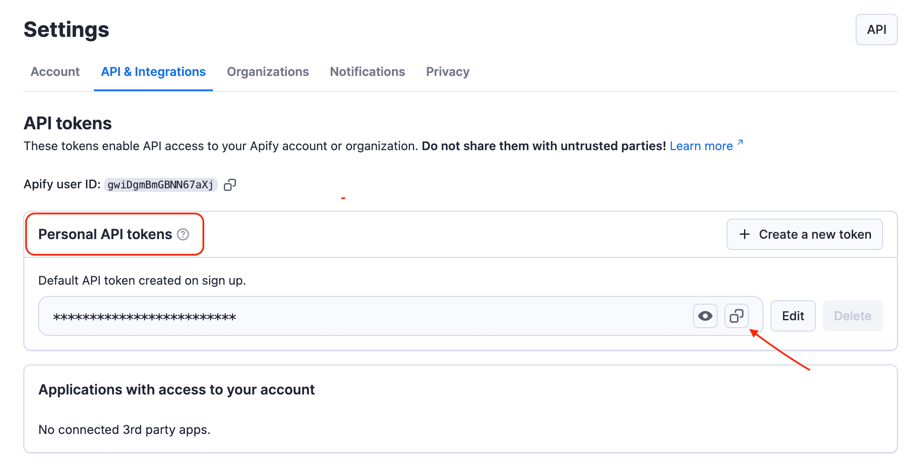
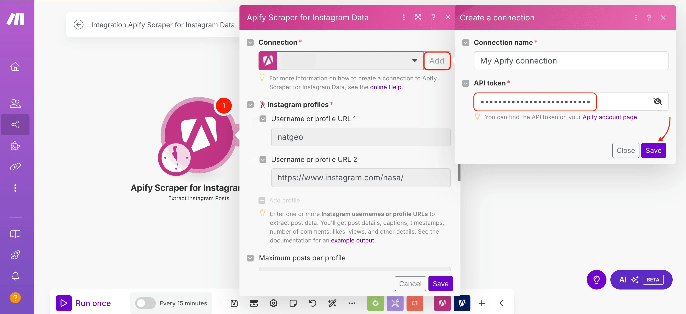

**Learn about Instagram scraper modules. Extract posts, comments, and profile data.**

---

## Apify Scraper for Instagram Data

The Instagram Scraper modules from [Apify](https://apify.com) allow you to extract posts, comments, and profile data from Instagram.

To use these modules, you need an [Apify account](https://console.apify.com) and an [API token](https://docs.apify.com/platform/integrations/api#api-token). You can find your token in the [Apify Console](https://console.apify.com/) under **Settings > Integrations**. After connecting, you can automate data extraction and incorporate the results into your workflows.

## Connect Apify Scraper for Instagram Data modules to Make

1. Create an account at [Apify](https://console.apify.com/). You can sign up using your email, Gmail, or GitHub account.

    

1. To connect your Apify account with Make, you need to get the Apify API token. In the Apify Console, navigate to **[Settings > API & Integrations](https://console.apify.com/settings/integrations)**.

    

1. Find your token under **Personal API tokens** section. You can also create a new API token with multiple customizable permissions by clicking on **+ Create a new token**.
1. Click the **Copy** icon next to your API token to copy it to your clipboard. Then, return to your Make scenario interface.


    

1. In Make, click **Add** to open the **Create a connection** dialog of the chosen Apify Scraper module.
1. In the **API token** field, paste the API token you copied from Apify. Provide a clear **Connection name**, and click **Save**.

    

Once connected, you can build workflows to automate Instagram data extraction and integrate results into your applications.

## Apify Scraper for Instagram Data modules

After connecting, you can use one of the three existing Search modules as native scrapers to extract public data from Instagram.

### Extract Instagram profiles

Get profile details via [Apify's Instagram Profiles Scraper](https://apify.com/apify/instagram-profile-scraper). All you need to set up is usernames or URLs you want to extract data from.

For each Instagram profile, you will extract:

- _Basic profile details_: username, full name, biography, and profile URL.
- _Account status_: verification status, whether the account is private or public, and if it's a business account.
- _Follower and engagement metrics_: number of followers and accounts followed.
- _Profile pictures_: standard and HD profile picture URLs.
- _External links_: website URL (if provided).
- _Content information_: number of IGTV videos and highlight reels.
- _Related profiles_: suggested accounts, including their username, full name, profile picture URL, and verification status.

Profile data, shortened sample:

```json
[
    {
        "fullName": "NASA",
        "profilePicUrl": "https://scontent-atl3-2.cdninstagram.com/v/t51.2885-19/29090066_159271188110124_1152068159029641216_n.jpg?stp=dst-jpg_e0_s150x150_tt6&_nc_ht=scontent-atl3-2.cdninstagram.com&_nc_cat=1&_nc_oc=Q6cZ2AHA8W2z8Q8c-m6E-NgP2su5m59iPYiKVnQlhOBQsfJhVbSzs1AMZMECpvJPB_LanuQ&_nc_ohc=1vXGhkEoh-oQ7kNvgErK0o3&_nc_gid=f2687478a00141a1b759031727c45f9c&edm=AOQ1c0wBAAAA&ccb=7-5&oh=00_AYBBdI58EkpbDvplnxGKsqMUNzd7IYS1GzG-F3fb493okg&oe=67B983E9&_nc_sid=8b3546",
        "username": "nasa",
        "postsCount": 4381,
        "followersCount": 96718778,
        "followsCount": 81,
        "private": false,
        "verified": true,
        "isBusinessAccount": true,
        "biography": "🚀 🌎  Exploring the universe and our home planet. Verification: nasa.gov/socialmedia"
    },
    {
        "fullName": "National Geographic",
        "profilePicUrl": "https://scontent-lga3-3.cdninstagram.com/v/t51.2885-19/476424694_3911047592506753_8995392926225146489_n.jpg?stp=dst-jpg_e0_s150x150_tt6&_nc_ht=scontent-lga3-3.cdninstagram.com&_nc_cat=1&_nc_oc=Q6cZ2AHN-FkuOj4TjoJuFvCdSEHSAA2nPN9hSjUK1b1phJY5bDOJjsQVtvzHguB7UvZVA78&_nc_ohc=Nw5ra__Z3vEQ7kNvgG9nmDU&_nc_gid=dfd92e92eeda46f99367b1eaa093ff3a&edm=AOQ1c0wBAAAA&ccb=7-5&oh=00_AYDUu2rnJb1CKhHODZr7GGg142G24F_Sxb0cVh7gRqUn1g&oe=67B97B88&_nc_sid=8b3546",
        "username": "natgeo",
        "postsCount": 30103,
        "followersCount": 279573878,
        "followsCount": 167,
        "private": false,
        "verified": true,
        "isBusinessAccount": true,
        "biography": "Inspiring the explorer in everyone 🌎"
    }
]
```

### Extract Instagram comments

Retrieve comments from posts by calling [Apify's Instagram Comments Scraper](https://apify.com/apify/instagram-comment-scraper).  To set up this module, you will need to add Instagram posts or reels to extract the comments from, the desired number of comments, and optionally, the order of comments, and replies.

For each Instagram post, you will extract:

- _Comment details_: comment text, timestamp, and number of likes.
- _Commenter profile_: username, full name, profile picture URL, and account status (private or public).
- _Engagement data_: number of replies and whether the commenter is verified.
- _Post association_: URL of the Instagram post the comment belongs to.
- _Replies (if any)_: nested replies under the main comment.

:::note Free plan limitatios

Features like _replies_ and _newest comments first_ are limited for users on Apify's Free Plan. To access the newest comment sorting or more than 20 replies per comment, consider upgrading to a [paid subscription](https://apify.com/pricing).

:::

Comment data, shortened sample:

```json
[
    {
        "text": "So beautiful 🥲🥹✨",
        "timestamp": "2024-10-24T10:16:00.000Z",
        "ownerUsername": "im_sanaz3",
        "ownerProfilePicUrl": "https://scontent-ber1-1.cdninstagram.com/v/t51.2885-19/475976048_1321670355521757_8632924050781709835_n.jpg?stp=dst-jpg_e0_s150x150_tt6&_nc_ht=scontent-ber1-1.cdninstagram.com&_nc_cat=109&_nc_oc=Q6cZ2AHRZYgJDKz3fcI9QKX0mLmjyXeZOpQxGcUhRqH71pVWJMe0YOr2d7BqTu5-kLCdJsU&_nc_ohc=Z8izKMKm5QAQ7kNvgGSfNLs&_nc_gid=f12dbe88e285431d800ffc93637264f1&edm=AId3EpQBAAAA&ccb=7-5&oh=00_AYAacAhAy2-oAy8D-_z_MP_2sI59yqf9t5tdz5uvrlH3NA&oe=67B9A2A2&_nc_sid=f5838a",
        "postUrl": "https://www.instagram.com/p/DBea8-8Jn2z/"
    },
        "text": "So something gonna hit earth? Since we see stories all over internet. Please give us the details 😂",
        "timestamp": "2025-02-11T19:01:03.000Z",
        "ownerUsername": "isabellain_",
        "ownerProfilePicUrl": "https://scontent-ber1-1.cdninstagram.com/v/t51.2885-19/477089999_1404980843702640_3169514283121086597_n.jpg?stp=dst-jpg_e0_s150x150_tt6&_nc_ht=scontent-ber1-1.cdninstagram.com&_nc_cat=100&_nc_oc=Q6cZ2AHRZYgJDKz3fcI9QKX0mLmjyXeZOpQxGcUhRqH71pVWJMe0YOr2d7BqTu5-kLCdJsU&_nc_ohc=f3WerXJOT3IQ7kNvgGSWaW3&_nc_gid=f12dbe88e285431d800ffc93637264f1&edm=AId3EpQBAAAA&ccb=7-5&oh=00_AYAXqkREDSM9YNfa14dKLPp8uuHQgwAIb_zKvYA4W_I_Pg&oe=67B98B5E&_nc_sid=f5838a",
        "postUrl": "https://www.instagram.com/p/DBea8-8Jn2z/"
    },
    {
        "text": "Please archive ALL of your articles and research  with and about women making history with NASA before you remove the data from your websites.  And while you’re at it, remove the word men and stick to just names, fair is fair and there won’t be any sex called out in any of your articles.",
        "timestamp": "2025-02-11T15:40:44.000Z",
        "ownerUsername": "hippiesoulmo",
        "ownerProfilePicUrl": "https://scontent-ber1-1.cdninstagram.com/v/t51.2885-19/471553535_3637106739845033_7912985502669751019_n.jpg?stp=dst-jpg_e0_s150x150_tt6&_nc_ht=scontent-ber1-1.cdninstagram.com&_nc_cat=105&_nc_oc=Q6cZ2AHRZYgJDKz3fcI9QKX0mLmjyXeZOpQxGcUhRqH71pVWJMe0YOr2d7BqTu5-kLCdJsU&_nc_ohc=2NKox-3InPkQ7kNvgHMdSEH&_nc_gid=f12dbe88e285431d800ffc93637264f1&edm=AId3EpQBAAAA&ccb=7-5&oh=00_AYD1tLwbEVW58ey9hxlvkO6nFKVr-VmIgzbZFPnF3mL83w&oe=67B9942E&_nc_sid=f5838a",
        "postUrl": "https://www.instagram.com/p/DBea8-8Jn2z/"
    }
 ]
```

### Extract Instagram posts

Gather post data with [Apify's Instagram Post Scraper](https://apify.com/apify/instagram-post-scraper). To set up this module, you will need to add Instagram usernames to extract the post from, the desired number of posts, and the timeframe of the posts.

For each Instagram post, you will extract:

- _Post details_: post URL, content type (image, video, carousel), shortcode, post ID, and timestamp.
- _Text content_: caption, hashtags, and mentions.
- _Engagement metrics_: number of likes and comments, including a few latest comments.
- _Media details_: image dimensions (height and width), display URL, and alternative text (if available).
- _User information_: owner’s username, full name (if available), and user ID.
- _Additional data_: tagged users, child posts (for carousel posts), and location details (if available).

Post data, shortened sample:

```json
[
    {
        "caption": "A supernova glowing in the dark 🌟⁣\n ⁣\nWhen supernova remnant SN 1006 first appeared in the sky in 1006 C.E., it was far brighter than Venus and visible during the daytime for weeks. From that moment on, it occupied the hearts of astronomers all over the world; it has been studied from the ground and from space many times.⁣\n ⁣\nIn this image, visible, radio, and X-ray data combine to give us that blue (and red) view of the remnant’s full shell – the debris field that was created when a white dwarf star exploded and sent material hurtling into space.⁣\n ⁣\nScientists believe SN 1006 is a Type Ia supernova. This class of supernova is caused when a white dwarf never lets another star go: either it pulls too much mass from a companion star and explodes, or it merges with another white dwarf and explodes. Understanding Type Ia supernovas is especially important because astronomers use observations of these explosions in distant galaxies as mileposts to mark the expansion of the universe.⁣\n ⁣\nImage description: This supernova remnant looks like a bubble filled with blue and red clouds of dust and gas, floating amid a million stars. These stars are visible all around the bubble and even can be seen peeking through it.⁣\n ⁣\nCredit: NASA, ESA, and Z. Levay (STScI)⁣\n ⁣\n#NASA #Supernova #Stars #IVE #Astronomy #Hubble #Chandra #Clouds #아이브 #SupernovaLove #DavidGuetta",
        "ownerFullName": "NASA",
        "ownerUsername": "nasa",
        "url": "https://www.instagram.com/p/DCHmqs1NoaJ/",
        "commentsCount": 3565,
        "firstComment": "🔥🙌❤️👏",
        "likesCount": 1214485,
        "timestamp": "2024-11-08T17:30:07.000Z"
    },
    {
        "caption": "Take a deep breath...\n\nX-ray images from our Chandra X-ray Observatory helped astronomers confirm that most of the oxygen in the universe is synthesized in massive stars. So, everybody say \"thank you\" to supernova remnants (SNRs) like this one, which has enough oxygen for thousands of solar systems.\n\nSupernova remnants are, naturally, the remains of exploded stars. They're extremely important for understanding our galaxy. If it weren't for SNRs, there would be no Earth, no plants, animals, or people. This is because all the elements heavier than iron were made in a supernova explosion, so the only reason we find these elements on Earth or in our solar system — or any other extrasolar planetary system — is because those elements were formed during a supernova.\n\n@nasachandraxray's data is represented in this image by blue and purple, while optical data from @nasahubble and the Very Large Telescope in Chile are in red and green.\n\nImage description: The darkness of space is almost covered by the array of objects in this image. Stars of different sizes are strewn about, while a blue and red bubble of gas is at the center. An area of pink and green covers the bottom-right corner.\n\nCredit: X-ray (NASA/CXC/ESO/F.Vogt et al); Optical (ESO/VLT/MUSE), Optical (NASA/STScI)\n\n#NASA #Supernova #Space #Universe #Astronomy #Astrophotography #Telescope #Xray",
        "ownerFullName": "NASA",
        "ownerUsername": "nasa",
        "url": "https://www.instagram.com/p/DBKBByizDHZ/",
        "commentsCount": 2050,
        "firstComment": "👍",
        "likesCount": 1020495,
        "timestamp": "2024-10-15T19:27:29.000Z"
    },
    {
        "caption": "It’s giving rainbows and unicorns, like a middle school binder 🦄🌈 ⁣⁣\n⁣⁣\nMeet NGC 602, a young star cluster in the Small Magellanic Cloud (one of our satellite galaxies), where astronomers using @NASAWebb have found candidates for the first brown dwarfs outside of our galaxy.  This star cluster has a similar environment to the kinds of star-forming regions that would have existed in the early universe—with very low amounts of elements heavier than hydrogen and helium. It’s drastically different from our own solar neighborhood and close enough to study in detail. ⁣⁣\n ⁣⁣\nBrown dwarfs are… not quite stars, but also not quite gas giant planets either. Typically they range from about 13 to 75 Jupiter masses. They are sometimes free-floating and not gravitationally bound to a star, like a planet would be. But they do share some characteristics with exoplanets, like storm patterns and atmospheric composition. ⁣⁣\n\n@NASAHubble showed us that NGC 602 harbors some very young low-mass stars; Webb is showing us how significant and extensive objects like brown dwarfs are in this cluster. Scientists are excited to better be able to understand how they form, particularly in an environment similar to the harsh conditions of the early universe.⁣⁣\n ⁣⁣\nRead more at the link in @ESAWebb’s bio. ⁣⁣\n ⁣⁣\nImage description: A two image swipe-through of a star cluster is shown inside a large nebula of many-coloured gas and dust. The material forms dark ridges and peaks of gas and dust surrounding the cluster, lit on the inner side, while layers of diffuse, translucent clouds blanket over them. Around and within the gas, a huge number of distant galaxies can be seen, some quite large, as well as a few stars nearer to us which are very large and bright.⁣⁣\n ⁣⁣\nImage Credit: ESA/Webb, NASA & CSA, P. Zeidler, E. Sabbi, A. Nota, M. Zamani (ESA/Webb)⁣⁣\n ⁣⁣\n#JWST #Webb #JamesWebbSpaceTelescope #NGC602 #browndwarf #space #NASA #ESA",
        "ownerFullName": "NASA",
        "ownerUsername": "nasa",
        "url": "https://www.instagram.com/p/DBea8-8Jn2z/",
        "commentsCount": 3356,
        "firstComment": "🔥🌍",
        "likesCount": 1092162,
        "timestamp": "2024-10-23T17:38:49.000Z"
    }
]
```

## Other scrapers available

There are other native Make Apps powered by Apify. You can check out Apify Scraper for:

- TikTok Data
- YouTube Data
- Facebook Data
- Google Search Data
- Google Maps Emails Data
- Amazon Data

And more! Because you can access any of our 4,500+ scrapers on Apify Store by using the [general Apify connections](https://www.make.com/en/integrations/apify).
