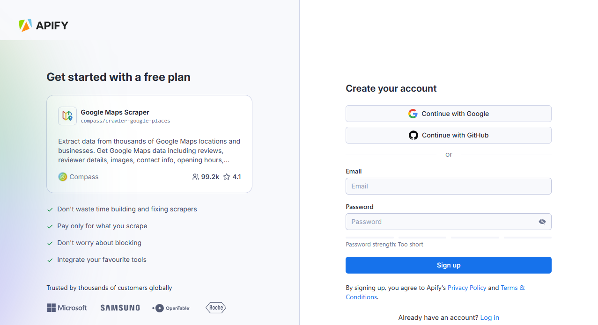

## Apify Scraper for Google Maps Leads

The Google Maps Leads Scraper modules from [apify.com](http://apify.com/) allow you to extract valuable business lead data from Google Maps, including contact information, email addresses, social media profiles, business websites, phone numbers, and detailed location data. Perfect for sales teams, marketers, and business developers looking to build targeted lead lists, marketers or other commercial teams looking to data mine reviews or assess sentiment analysis wide geographies.

To use these modules, you need an [Apify account](https://console.apify.com/sign-up) and an [API token](https://docs.apify.com/platform/integrations/api#api-token), which you can find under **Settings > Integrations** in Apify Console. After connecting, you can automate lead generation at scale and incorporate the results into your sales and marketing workflows.

For more details, follow the tutorial below.

## Connect Apify Scraper for Google Maps Leads

1. Create an account at [Apify](https://console.apify.com/). You can sign up using your email, Gmail, or GitHub account.

    

1. To connect your Apify account to Make, you can use an OAuth connection (recommended) or an Apify API token. To get the Apify API token, navigate to **[Settings > API & Integrations](https://console.apify.com/settings/integrations)** in the Apify Console.

    

1. Find your token under **Personal API tokens** section. You can also create a new API token with multiple customizable permissions by clicking on **+ Create a new token**.
1. Click the **Copy** icon next to your API token to copy it to your clipboard. Then, return to your Make scenario interface.

    

1. In Make, click **Add** to open the **Create a connection** dialog of the chosen Apify Scraper module.
1. In the **API token** field, paste the API token you copied from Apify. Provide a clear **Connection name**, and click **Save**.

    

Once connected, you can build workflows to automate Google Maps extraction and integrate results into your applications.

## Apify Scraper for Google Maps modules

After connecting the app, you can use one of the four existing Search modules as native scrapers to extract Google Maps Data.

### Search with Categories

The Search with Categories module is a component of the Google Maps Leads Scraper that allows you to discover and extract business leads by filtering places based on both search terms and categories.

#### Key Features

- _Category-Based Filtering_: Filter businesses using Google Maps' extensive category system with over 4,000 available options
- _Location Targeting_: Define your target market using simple location queries (city + country format)
- _Customizable Result Limit_: Control exactly how many leads to extract per search term or category
- _Language Selection_: View business information in your preferred language
- _Quality Filters_: Focus on high-quality leads by setting minimum star ratings
- _Website Availability Filter_: Target only businesses with (or without) websites
- _Exact Name Matching_: Find businesses with exact or partial name matches
- _Operational Status Filter_: Exclude temporarily or permanently closed businesses

#### How It Works

The module allows you to combine category filtering with location parameters to discover relevant business leads, data mine reviews, or extract relevant Google Maps information. You can use categories alone or with specific search terms to create precisely targeted lead lists.

Categories can be general (e.g., "restaurant") which includes all variations like "Asian restaurant" or "family restaurant," or they can be specific (e.g., "restaurant terrace"). Using broader categories with a few specific search terms typically yields the best results without excluding potentially valuable leads.

- _Business identification_: name, category, place ID for unique identification.
- _Full contact details_: phone number, website URL, email addresses (with email enrichment).
- _Complete address information_: street, city, state, postal code, country for direct mail campaigns.
- _Geographic data_: precise coordinates, neighborhood, plus codes for territory planning.
- _Business quality indicators_: ratings, number of reviews, price level to qualify leads.
- _Operational insights_: opening hours, popular times, serviceability to better target outreach.
- _Competitive intelligence_: nearby businesses, related places.
- _Additional lead qualification data (optional)_: customer reviews, business photos, social media profiles.

```json title="Business lead data, shortened sample"
{
  "searchString": "Restaurant in Staten Island",
  "rank": 3,
  "title": "Kim's Island",
  "placeId": "ChIJJaKM4pyKwokRCZ8XaBNj_Gw",
  "categoryName": "Chinese restaurant",
  "price": "$10–20",
  "rating": 4.6,
  "reviewsCount": 182,
  "featuredInLists": ["Best Chinese Food", "Top Rated Restaurants"],
  
  // Complete address information for targeted outreach
  "address": "175 Main St, Staten Island, NY 10307",
  "neighborhood": "Tottenville",
  "street": "175 Main St",
  "city": "Staten Island",
  "postalCode": "10307",
  "state": "New York",
  "countryCode": "US",
  "plusCode": "GQ62+8M Staten Island, New York",
  
  // Multiple contact channels
  "website": "http://kimsislandsi.com/",
  "phone": "(718) 356-5168",
  "phoneUnformatted": "+17183565168",
  "email": "info@kimsislandsi.com", // From website enrichment
  
  // Business qualification data
  "yearsInBusiness": 12,
  "claimThisBusiness": false, // Verified listing
  "popular": true,
  "temporarilyClosed": false,
  
  // Precise location for territory planning
  "location": {
    "lat": 40.5107736,
    "lng": -74.2482624
  },
  
  // Operational insights for scheduling outreach
  "openingHours": {
    "Monday": "11:00 AM - 10:00 PM",
    "Tuesday": "11:00 AM - 10:00 PM",
    "Wednesday": "11:00 AM - 10:00 PM",
    "Thursday": "11:00 AM - 10:00 PM",
    "Friday": "11:00 AM - 11:00 PM",
    "Saturday": "11:00 AM - 11:00 PM",
    "Sunday": "12:00 PM - 9:30 PM"
  }
}
```

### Search with Search Terms Module

The Search Terms module is a component of the Google Maps Leads Scraper designed to discover and extract business leads by using specific search queries, similar to how you'd search on Google Maps directly.

#### Key Features

- _Keyword-Based Discovery_: Find businesses using the same search terms you'd enter in Google Maps
- _Location Targeting_: Define your target market using simple location queries (city + country format)
- _Customizable Result Limit_: Control exactly how many leads to extract per search term
- _Language Selection_: View business information in your preferred language
- _Quality Filters_: Focus on high-quality leads by setting minimum star ratings
- _Website Availability Filter_: Target only businesses with (or without) websites
- _Exact Name Matching_: Find businesses with exact or partial name matches
- _Operational Status Filter_: Exclude temporarily or permanently closed businesses

#### How It Works

This module allows you to enter search terms that match what you would typically type into the Google Maps search bar. You can search for general business types (like "coffee shop"), specific services ("dog grooming"), or product offerings ("organic produce").

The search results can be further refined using optional category filters, which help ensure you're capturing precisely the type of businesses you're targeting. For maximum efficiency, you can combine broader search terms with strategic category filters to capture the most relevant leads without excluding valuable prospects.

### Advanced and Custom Search Module - Google Maps Leads Scraper

The Advanced and Custom Search module is the most powerful component of the Google Maps Leads Scraper, designed for sophisticated lead generation campaigns that require precise geographic targeting and advanced search capabilities. This module gives you complete control over your lead discovery process with multiple location definition methods and advanced filtering options.

#### Key Features

- _Multiple Location Definition Methods_: Define target areas using free-text location queries, country/state/city selections, postal codes, or custom polygon coordinates
- _Custom Geographic Targeting_: Draw precise search areas using longitude/latitude coordinates for highly targeted campaigns
- _Direct URL Importing_: Extract leads from specific Google Maps search URLs, CID links, or shortened map links
- _Keyword-Based Discovery_: Find businesses using search terms, just like in Google Maps
- _Category Filtering_: Further refine results with optional category filters
- _Comprehensive Lead Filtering_: Apply multiple quality filters simultaneously for precise lead targeting

#### How It Works

This module provides the most flexible options for defining where and how to search for business leads:

### Geographic Targeting Options

- _Simple Location Query_: Use natural language location inputs like "New York, USA"
- _Structured Location Components_: Build precise locations using country, state, city, or county parameters
- _Postal Code Targeting_: Target specific postal/ZIP code areas for direct mail campaigns
- _Custom Polygon Areas_: Define exact geographic boundaries using coordinate pairs for ultra-precise targeting

### Search and Filter Capabilities

- _Keyword-Based Search_: Discover businesses using industry, service, or product terms
- _Category-Based Filtering_: Apply Google's category system to refine results
- _Quality Filters_: Target businesses with specific ratings, website presence, and operational status

```json title="Advances output data, shortened sample"
{
  "searchString": "coffee shop",
  "rank": 9,
  "searchPageUrl": "https://www.google.com/maps/search/coffee%20shop/@40.748508724216016,-74.0186770781978,17z?hl=en",
  "searchPageLoadedUrl": "https://www.google.com/maps/search/coffee%20shop/@40.748508724216016,-74.0186770781978,17z?hl=en",
  "isAdvertisement": false,
  "title": "Bluestone Lane Chelsea Piers Café",
  "price": "$20–30",
  "categoryName": "Coffee shop",
  
  // Address and location data
  "address": "62 Chelsea Piers Pier 62, New York, NY 10011",
  "neighborhood": "Manhattan",
  "street": "62 Chelsea Piers Pier 62",
  "city": "New York",
  "postalCode": "10011",
  "state": "New York",
  "countryCode": "US",
  "location": {
    "lat": 40.7485378,
    "lng": -74.0087457
  },
  "plusCode": "GQ62+8M Staten Island, New York",
  
  // Contact information
  "website": "https://bluestonelane.com/?y_source=1_MjMwNjk1NDAtNzE1LWxvY2F0aW9uLndlYnNpdGU%3D",
  "phone": "(718) 374-6858",
  "phoneUnformatted": "+17183746858",
  
  // Rating and reviews
  "totalScore": 4.3,
  "reviewsCount": 425,
  "imagesCount": 659,
  
  // Business identifiers
  "claimThisBusiness": false,
  "permanentlyClosed": false,
  "temporarilyClosed": false,
  "placeId": "ChIJDTUgz1dZwokRtsQ97Tbf0cA",
  "categories": ["Coffee shop", "Cafe"],
  "fid": "0x89c25957cf20350d:0xc0d1df36ed3dc4b6",
  "cid": "13894131752416167094",
  
  // Operating hours
  "openingHours": [
    {"day": "Monday", "hours": "7 AM to 6 PM"},
    {"day": "Tuesday", "hours": "7 AM to 6 PM"},
    {"day": "Wednesday", "hours": "7 AM to 6 PM"},
    {"day": "Thursday", "hours": "7 AM to 6 PM"},
    {"day": "Friday", "hours": "7 AM to 6 PM"},
    {"day": "Saturday", "hours": "7 AM to 6 PM"},
    {"day": "Sunday", "hours": "7 AM to 6 PM"}
  ],
  
  // Business attributes and amenities
  "additionalInfo": {
    "Service options": [
      {"Outdoor seating": true},
      {"Curbside pickup": true},
      {"No-contact delivery": true},
      {"Delivery": true},
      {"Onsite services": true},
      {"Takeout": true},
      {"Dine-in": true}
    ],
    "Highlights": [
      {"Great coffee": true},
      {"Great tea selection": true},
      {"Live music": true},
      {"Live performances": true},
      {"Rooftop seating": true}
    ],
    "Popular for": [
      {"Breakfast": true},
      {"Lunch": true},
      {"Solo dining": true},
      {"Good for working on laptop": true}
    ],
    "Accessibility": [
      {"Wheelchair accessible entrance": true},
      {"Wheelchair accessible parking lot": true},
      {"Wheelchair accessible restroom": true},
      {"Wheelchair accessible seating": true}
    ],
    "Offerings": [
      {"Coffee": true},
      {"Comfort food": true},
      {"Organic dishes": true},
      {"Prepared foods": true},
      {"Quick bite": true},
      {"Small plates": true},
      {"Vegetarian options": true}
    ],
    "Dining options": [
      {"Breakfast": true},
      {"Brunch": true},
      {"Lunch": true},
      {"Catering": true},
      {"Dessert": true},
      {"Seating": true}
    ],
    "Amenities": [
      {"Restroom": true},
      {"Wi-Fi": true},
      {"Free Wi-Fi": true}
    ],
    "Atmosphere": [
      {"Casual": true},
      {"Cozy": true},
      {"Trendy": true}
    ],
    "Crowd": [
      {"Family-friendly": true},
      {"LGBTQ+ friendly": true},
      {"Transgender safespace": true}
    ],
    "Planning": [
      {"Accepts reservations": true}
    ],
    "Payments": [
      {"Credit cards": true},
      {"Debit cards": true},
      {"NFC mobile payments": true}
    ],
    "Children": [
      {"Good for kids": true},
      {"High chairs": true}
    ]
  },
  
  // Image and metadata
  "imageUrl": "https://lh3.googleusercontent.com/p/AF1QipMl6-SnuqYEeE3mD54M0q5D5nysRUZQj1BB0g8=w408-h272-k-no",
  "kgmid": "/g/11ph8zh6sg",
  "url": "https://www.google.com/maps/search/?api=1&query=Bluestone%20Lane%20Chelsea%20Piers%20Caf%C3%A9&query_place_id=ChIJDTUgz1dZwokRtsQ97Tbf0cA",
  "scrapedAt": "2025-04-22T14:23:34.961Z"
}
```

## Best Practices

1. _Choose the right location method_ for your campaign:
    - Free-text location queries for quick, general area targeting
    - Country/State/City combinations for administrative boundary targeting
    - Postal codes for direct mail campaign areas
    - Custom polygons for precise neighborhood or business district targeting
2. _Layer search parameters effectively_:
    - Start with broader geographic targeting
    - Apply search terms to identify relevant business types
    - Use category filters to further refine results
    - Apply quality filters (ratings, website presence) as the final step
3. _Consider URL-based extraction_ for specific scenarios:
    - When you have existing Google Maps searches with desired filters
    - For capturing specific business types Google has already grouped
    - When working with curated Google Maps lists
4. _Optimize polygon definitions_ for complex areas:
    - Use 4-8 coordinate pairs for most areas
    - Ensure coordinates form a closed shape
    - Test with smaller areas before scaling to large regions

## Advanced Features

- _Multi-Location Campaigns_: Configure separate runs for each territory and combine results
- _Direct Place ID Targeting_: Extract data from specific businesses using place IDs
- _Custom Boundary Definitions_: Use longitude/latitude coordinates to define precise areas like neighborhoods, business districts, or sales territories
- _URL Parameter Extraction_: Capture lead data from complex Google Maps search URLs with multiple parameters

## Important Notes

- Different location methods should not be combined (use either free-text location OR country/state/city parameters)
- Custom polygon areas take precedence over other location methods when defined
- Always verify location coverage before running large-scale extractions
- Direct URL imports are limited to approximately 300 results per URL
- For complex geographic areas, breaking into multiple targeted searches yields better results

There are other native Make Apps powered by Apify. You can check out Apify Scraper for:

- [Instagram Data](/platform/integrations/make/instagram)
- [TikTok](/platform/integrations/make/tiktok)
- [Google Search](/platform/integrations/make/search)
- [YouTube Data](/platform/integrations/make/youtube)
- [AI crawling](/platform/integrations/make/ai-crawling)
- [Amazon](/platform/integrations/make/amazon)

And more! Because you can access any of our 4,500+ scrapers on Apify Store by using the [general Apify connections](https://www.make.com/en/integrations/apify).
