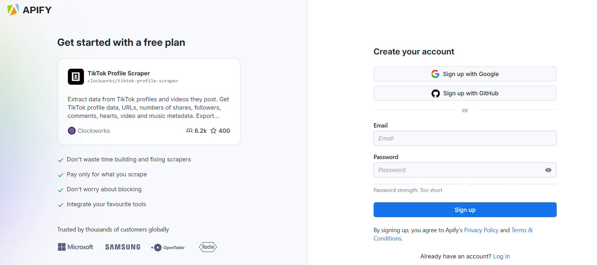
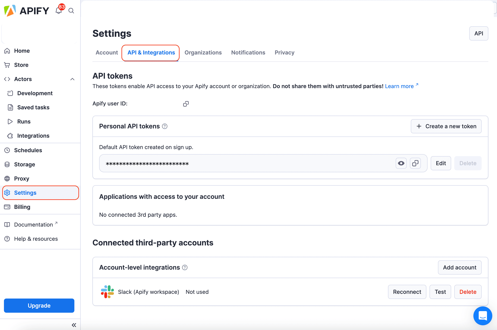
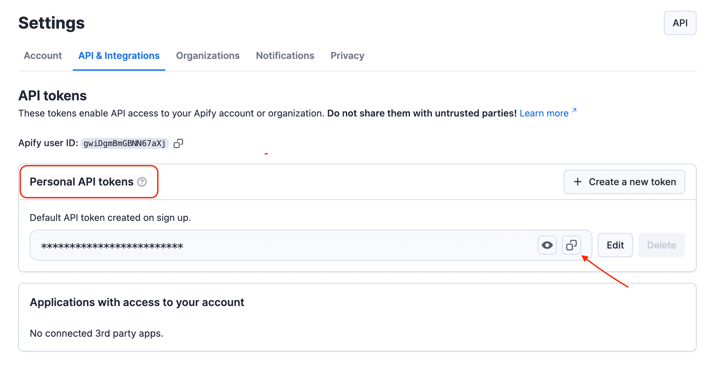
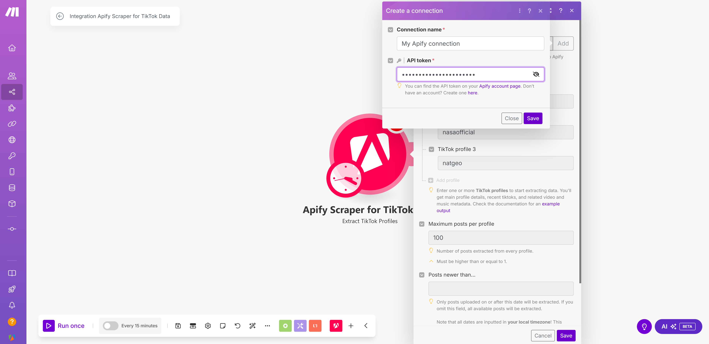

## Apify Scraper for TikTok Data

The TikTok Scraper modules from [Apify](https://apify.com) allow you to extract hashtag, comments, and profile data from TikTok.

To use these modules, you need an [Apify account](https://console.apify.com) and an [API token](https://docs.apify.com/platform/integrations/api#api-token). You can find your token in the [Apify Console](https://console.apify.com/) under **Settings > Integrations**. After connecting, you can automate data extraction and incorporate the results into your workflows.

## Connect Apify Scraper for TikTok Data modules to Make

1. To get started, create an account at [console.apify.com](https://console.apify.com/). You can sign up using your email, Gmail, or GitHub account.

    

1. To connect your Apify account with Make, you need to get the **API token** from your Apify account. Go to **[Settings > API & Integrations](https://console.apify.com/settings/integrations)** tab to find API tokens.

    

1. Find your token under **Personal API tokens**. You can also create a new API token with multiple customizable permissions by clicking on **+ Create a new token**.
1. To establish a connection, **copy the API token** and go back to Make.

    

1. In Make, click **Add** to open the **Create a connection** dialog of the chosen Apify Scraper module.
1. In the **API token** field, paste the value copied in step 4, name your Connection, and click **Save**.

    

Once connected, you can build workflows to automate TikTok data extraction and integrate results into your applications.

## Apify Scraper for TikTok Data modules

After connecting the app, you can use one of the three existing Search modules as native scrapers to extract public TikTok data:

### Extract TikTok profiles

Get profile details via [Apify's TikTok Profile Scraper](https://apify.com/clockworks/tiktok-profile-scraper). To use this module, fill in the profile names you want to gather information about.

For each TikTok profile, you will extract:

- _Basic profile details_: name, nickname, bio, ID,  and profile URL.
- _Account status_: whether the account is verified or not, and if it's a business and seller account.
- _Follower and engagement metrics_: number of followers and accounts followed.
- _Profile avatar_: avatar URLs.
- _Content information_: number of videos, fans, hearts, friends, and likes.

Profile data, shortened sample:

```json
[
    {
         "authorMeta": {
            "id": "6987048613642159109",
            "name": "nasaofficial",
            "profileUrl": "https://www.tiktok.com/@nasaofficial",
            "nickName": "NASA",
            "verified": false,
            "signature": "National Aeronautics Space Association",
            "bioLink": null,
            "originalAvatarUrl": "https://p16-sign-va.tiktokcdn.com/tos-maliva-avt-0068/6f0cf6a7e7d410e3a624f0af8fa4d314~tplv-tiktokx-cropcenter:720:720.jpeg?dr=10399&nonce=84125&refresh_token=05118aa7a7b44a43f792d1a09d7bfecf&x-expires=1740060000&x-signature=NKl%2Fc2Ma6bNAhN2pHpCRWflSejQ%3D&idc=no1a&ps=13740610&shcp=81f88b70&shp=a5d48078&t=4d5b0474",
            "avatar": "https://p16-sign-va.tiktokcdn.com/tos-maliva-avt-0068/6f0cf6a7e7d410e3a624f0af8fa4d314~tplv-tiktokx-cropcenter:720:720.jpeg?dr=10399&nonce=84125&refresh_token=05118aa7a7b44a43f792d1a09d7bfecf&x-expires=1740060000&x-signature=NKl%2Fc2Ma6bNAhN2pHpCRWflSejQ%3D&idc=no1a&ps=13740610&shcp=81f88b70&shp=a5d48078&t=4d5b0474",
            "commerceUserInfo": {
                "commerceUser": true,
                "category": "Education & Training",
                "categoryButton": false
            },
            "privateAccount": false,
            "region": "US",
            "roomId": "",
            "ttSeller": false,
            "following": 4,
            "friends": 0,
            "fans": 2049,
            "heart": 135,
            "video": 0,
            "digg": 0
        },
        "input": "https://www.tiktok.com/@nasaofficial",
    }
]
```

### Extract TikTok comments

Retrieve comments from videos by calling [Apify's TikTok Comments Scraper](https://apify.com/clockworks/tiktok-comments-scraper).  To set up this module, you will need to add TikTok video URLs to extract the comments from, the desired number of comments, and optionally, the maximum number of replies per comment.

For each TikTok video, you will extract:

- _Comment details_: comment text, timestamp, and number of likes.
- _Commenter profile_: username, ID, and avatar URL.
- _Engagement data_: number of replies.
- _Post association_: URL of the TikTok video the comment belongs to.

Comment data, shortened sample:

```json
[
    {
        "text": "Free lunches??!!!",
        "diggCount": 1,
        "replyCommentTotal": 1,
        "createTimeISO": "2024-02-21T16:10:50.000Z",
        "uniqueId": "abdmohimnhareth99",
        "videoWebUrl": "https://www.tiktok.com/@apifyoffice/video/7338085038258457889",
        "uid": "7114813797776491525",
        "cid": "7338088354673640225",
        "avatarThumbnail": "https://p77-sign-va.tiktokcdn.com/tos-maliva-avt-0068/e678ece1460eac51f1c4ed95db9a8e31~tplv-tiktokx-cropcenter:100:100.jpg?dr=10399&nonce=21560&refresh_token=3d45927e8ec8daaf4c27956e2fdaa849&x-expires=1739973600&x-signature=aFYfAqAMHdHdad9pNzOgThjcgds%3D&idc=no1a&ps=13740610&shcp=ff37627b&shp=30310797&t=4d5b0474"
    },
    {
        "text": "Every day🤭",
        "diggCount": 0,
        "replyCommentTotal": null,
        "createTimeISO": "2024-02-21T16:24:09.000Z",
        "uniqueId": "apifyoffice",
        "videoWebUrl": "https://www.tiktok.com/@apifyoffice/video/7338085038258457889",
        "uid": "7095709566285480965",
        "cid": "7338091744464978720",
        "avatarThumbnail": "https://p16-sign-useast2a.tiktokcdn.com/tos-useast2a-avt-0068-euttp/2c511269b14f70cca0c11c3285ddc668~tplv-tiktokx-cropcenter:100:100.jpg?dr=10399&nonce=11659&refresh_token=c2a577eebaa68fc73aac11e9b99fefcb&x-expires=1739973600&x-signature=LUTudhynytGwrfL9MKFHKO8v7EA%3D&idc=no1a&ps=13740610&shcp=ff37627b&shp=30310797&t=4d5b0474"
    },
 ]
```

### Extract TikTok hashtags

Gather post data with [Apify's TikTok Hashtag Scraper](https://apify.com/clockworks/tiktok-hashtag-scraper). To set up this module, you will need to add the TikTok hashtags from which you want to extract videos and the desired number of videos per hashtag.

For each TikTok hashtag, you will extract:

- _All TikToks posted with chosen hashtags_: caption, video URL, number of plays, hearts, comments, shares, country of creation, timestamp, paid status, video and music metadata.
- _Basic creator info from TikToks posted with chosen hashtags_: name, ID, avatar, bio, account status, total followers/following numbers, given/received likes count, etc.
- _Total number of views for a chosen hashtag_

Hashtag data, shortened sample:

```json
[
    {
        "videoMeta.coverUrl": "https://p77-sign-va.tiktokcdn.com/obj/tos-maliva-p-0068/1824f891fd0e48e7bf46513f27383e20_1727638068?lk3s=b59d6b55&x-expires=1740060000&x-signature=PNotHaeJ5nqiyt6zbbZqi4RljzA%3D&shp=b59d6b55&shcp=-",
        "text": "y como es tu hijo?🥰#trendslab #CapCut #hijo #bebe #capcutamor #amordemivida #parati ",
        "diggCount": 56500,
        "shareCount": 5968,
        "playCount": 5500000,
        "commentCount": 0,
        "videoMeta.duration": 9,
        "isAd": false,
        "isMuted": false,
        "hashtags": [
            {
                "id": "1662966768289798",
                "name": "trendslab",
                "title": "",
                "cover": ""
            },
            {
                "id": "1663935709411330",
                "name": "capcut",
                "title": "CapCut is a new, easy-to-use video editing tool designed for mobile platforms. CapCut provides users with a wide range of video editing functions, filters, audio &amp; visual effects, video templates, while keeping it free of charge and ads-free. Everyone can be a creator by using CapCut.  \n\nStart creating your cool videos today: \nhttps://capcut.onelink.me/XKqI/228cad85",
                "cover": ""
            },
]
```

## Other scrapers available

There are other native Make Apps powered by Apify. You can check out Apify Scraper for:

- Instagram Data
- YouTube Data
- Facebook Data
- Google Search Data
- Google Maps Emails Data
- Amazon Data

And more! Because you can access any of our 3,000+ scrapers on Apify Store by using the [general Apify connections](https://www.make.com/en/integrations/apify).
