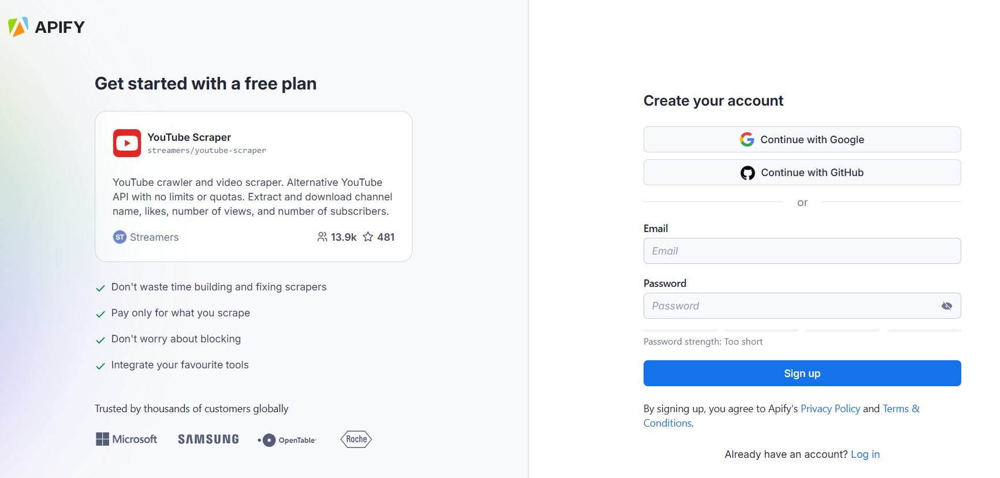
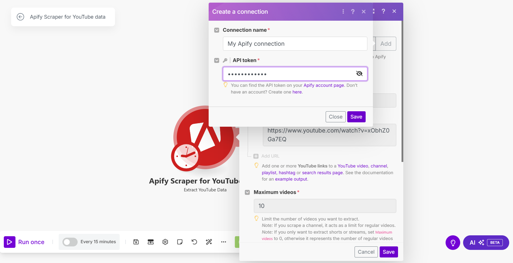

## Apify Scraper for YouTube Data

The YouTube Scraper module from [apify.com](https://apify.com) allows you to extract channel, video, streams, shorts, and search data from YouTube.

To use this module, you need an [Apify account](https://console.apify.com) and an [API token](https://docs.apify.com/platform/integrations/api#api-token), which you can find in the Apify Console under **Settings > Integrations**. After connecting, you can automate data extraction and incorporate the results into your workflows.

For more details, follow the tutorial below.

## Connect Apify Scraper for YouTube Data modules to Make

1. Create an account at [Apify](https://console.apify.com/). You can sign up using your email, Gmail, or GitHub account.

    

1. To connect your Apify account with Make, you need to get the Apify API token. In the Apify Console, navigate to **[Settings > API & Integrations](https://console.apify.com/settings/integrations)**.

    

1. Find your token under **Personal API tokens** section. You can also create a new API token with multiple customizable permissions by clicking on **+ Create a new token**.
1. Click the **Copy** icon next to your API token to copy it to your clipboard. Then, return to your Make scenario interface.

    

1. In Make, click **Add** to open the **Create a connection** dialog of the chosen Apify Scraper module.
1. In the **API token** field, paste the API token you copied from Apify. Provide a clear **Connection name**, and click **Save**.

    

Once connected, you can build workflows to automate YouTube data extraction and integrate results into your applications.

## Apify Scraper for YouTube Data module

After connecting the app, you can use the Search module as a native scraper to extract public YouTube data. Here’s what you get:

### Extract YouTube data

Get data via [Apify's YouTube Scraper](https://apify.com/streamers/youtube-scraper). To do so, simply fill in the URLs of videos, streams, shorts, searches, or channels you want to gather information about.

For YouTube URLs, you can extract:

- _Basic channel details_: name, number of subscribers, total videos, location, social media links
- _Video and search details_: author name, number of likes, comments, views, title, URL, subtitles, duration, release date

```json title="Channel data sample"
{
  "id": "HV6OlMPn5sI",
  "title": "Raimu - The Spirit Within 🍃 [lofi hip hop/relaxing beats]",
  "duration": "29:54",
  "channelName": "Lofi Girl",
  "channelUrl": "https://www.youtube.com/channel/UCSJ4gkVC6NrvII8umztf0Ow",
  "date": "10 months ago",
  "url": "https://www.youtube.com/watch?v=HV6OlMPn5sI",
  "viewCount": 410458,
  "fromYTUrl": "https://www.youtube.com/@LofiGirl/videos",
  "channelDescription": "\"That girl studying by the window non-stop\"\n\n🎧 | Listen on Spotify, Apple music and more\n→   https://bit.ly/lofigirl-playlists\n\n💬 | Join the Lofi Girl community \n→   https://bit.ly/lofigirl-discord\n→   https://bit.ly/lofigirl-reddit\n\n🌎 | Lofi Girl on all social media\n→   https://bit.ly/lofigirl-sociaI",
  "channelDescriptionLinks": [
    {
        "text": "Discord",
        "url": "https://discord.com/invite/hUKvJnw"
    },
    {
        "text": "Tiktok",
        "url": "https://www.tiktok.com/@lofigirl/"
    },
    {
        "text": "Instagram",
        "url": "https://www.instagram.com/lofigirl/"
    },
    {
        "text": "Twitter",
        "url": "https://twitter.com/lofigirl"
    },
    {
        "text": "Spotify",
        "url": "https://open.spotify.com/playlist/0vvXsWCC9xrXsKd4FyS8kM"
    },
    {
        "text": "Apple music",
        "url": "https://music.apple.com/fr/playlist/lofi-hip-hop-music-beats-to-relax-study-to/pl.u-2aoq8mqiGo7J6A0"
    },
    {
        "text": "Merch",
        "url": "https://lofigirlshop.com/"
    }
  ],
  "channelJoinedDate": "Mar 18, 2015",
  "channelLocation": "France",
  "channelTotalVideos": 409,
  "channelTotalViews": "1,710,167,563",
  "numberOfSubscribers": 13100000,
  "isMonetized": true,
  "inputChannelUrl": "https://www.youtube.com/@LofiGirl/about"
}
```

```json title="Video data sample"
{
  "title": "Stromae - Santé (Live From The Tonight Show Starring Jimmy Fallon)",
  "id": "CW7gfrTlr0Y",
  "url": "https://www.youtube.com/watch?v=CW7gfrTlr0Y",
  "thumbnailUrl": "https://i.ytimg.com/vi/CW7gfrTlr0Y/maxresdefault.jpg",
  "viewCount": 35582192,
  "date": "2021-12-21",
  "likes": 512238,
  "location": null,
  "channelName": "StromaeVEVO",
  "channelUrl": "http://www.youtube.com/@StromaeVEVO",
  "numberOfSubscribers": 6930000,
  "duration": "00:03:17",
  "commentsCount": 14,
  "text": "Stromae - Santé (Live From The Tonight Show Starring Jimmy Fallon on NBC)\nListen to \"La solassitude\" here: https://stromae.lnk.to/la-solassitude\nOrder my new album \"Multitude\" here: https://stromae.lnk.to/multitudeID\n--\nhttps://www.stromae.com/fr/\nhttps://www.tiktok.com/@stromae\nhttps://www.facebook.com/stromae\nhttps://www.instagram.com/stromae\nhttps://twitter.com/stromae\n   / @stromae  \n--\nMosaert\nPaul Van Haver (Stromae) : creative direction\nCoralie Barbier : creative direction and fashion design\nLuc Van Haver : creative direction\nGaëlle Birenbaum : communication & project manager\nEvence Guinet-Dannonay : executive assistant\nGaëlle Cools : content & community manager\nRoxane Hauzeur : textile product manager\nDiego Mitrugno : office manager\n\nPartizan\nProducer : Auguste Bas\nLine Producer : Zélie Deletrain \nProduction coordinator : Lou Bardou-Jacquet \nProduction assistant : Hugo Dao\nProduction assistant : Adrien Bossa\nProduction assistant : Basile Jan\n\nDirector : Julien Soulier \n1st assistant director : Mathieu Perez \n2nd assistant director : Leila Gentet \n\nDirector of Photography : Kaname Onoyama \n1st assistant operator : Micaela albanese\n2nd assistant operator : Florian Rey \nDoP Mantee : Zhaopeng Zhong\nMaking of : Adryen Barreyat\n\nHead Gaffer : Sophie Delorme \nElectrician : Sacha Brauman\nElectrician: Tom Devianne\nLighting designer : Aurélien Dayot\nPrelight electrician : Emmanuel Malherbe\n\nHead Grip : Dioclès Desrieux \nBest Boy grip : Eloi Perrin \nPrelight Grip : Vladimir Duranovic \n\nLocation manager : Léo Rodriguez \nLocation manager assistant : Grégoire Décatoire \nLocation manager assistant : Mathieu Barazer \n\nStylist : Sandra Gonzalez \nStylist assistant : Sarah Bernard\n\nMake Up and Hair Artist : Camille Roche \nMake up Artist : Carla Lange \nMake Up and Hair Artist : Victoria Pinto \n\nSound Engineer : Lionel Capouillez \nBackliner : Nicolas Fradet \n\nProduction Designer : Penelope Hemon \n\nChoreographer : Marion Motin \nChoreographer assistant : Jeanne Michel \n\nPost production : Royal Post\nPost-Production Director : Cindy Durand Paucsik\nEditor : Marco Novoa\nEditor assistant : Térence Nury \nGrader : Vincent Amor\nVFX Supervisor : Julien Laudicina\nGraphic designer : Quentin Mesureux \nGraphic designer : Lucas Ponçon \nFilm Lab Assistant : Hadrian Kalmbach\n\nMusicians:\nFlorian Rossi \nManoli Avgoustinatos\nSimon Schoovaerts \nYoshi Masuda \n\nDancers: \nJuliana Casas\nLydie Alberto \nRobinson Cassarino\nYohann Hebi daher\nChris Fargeot \nAudrey Hurtis \nElodie Hilsum\nDaya jones \nThéophile Bensusan \nBrandon Masele \nJean Michel Premier \nKevin Bago\nAchraf Bouzefour\nPauline Journe \nCaroline Bouquet \nManon Bouquet\nAshley Biscette \nJocelyn Laurent \nOumrata Konan\nKylian Toto\nEnzo Lesne \nSalomon Mpondo-Dicka\nSandrine Monar \nKarl-Ruben Noel\n\n#Stromae #Sante #JimmyFallon",
  "descriptionLinks": [
    {
      "url": "https://stromae.lnk.to/la-solassitude",
      "text": "https://stromae.lnk.to/la-solassitude"
    },
    {
      "url": "https://stromae.lnk.to/multitudeID",
      "text": "https://stromae.lnk.to/multitudeID"
    },
    {
      "url": "https://www.stromae.com/fr/",
      "text": "https://www.stromae.com/fr/"
    },
    {
      "url": "https://www.tiktok.com/@stromae",
      "text": "https://www.tiktok.com/@stromae"
    },
    {
      "url": "https://www.facebook.com/stromae",
      "text": "https://www.facebook.com/stromae"
    },
    {
      "url": "https://www.instagram.com/stromae",
      "text": "https://www.instagram.com/stromae"
    },
    {
      "url": "https://twitter.com/stromae",
      "text": "https://twitter.com/stromae"
    },
    {
      "url": "https://www.youtube.com/channel/UCXF0YCBWewAj3RytJUAivGA",
      "text": "   / @stromae  "
    },
    {
      "url": "https://www.youtube.com/hashtag/stromae",
      "text": "#Stromae"
    },
    {
      "url": "https://www.youtube.com/hashtag/sante",
      "text": "#Sante"
    },
    {
      "url": "https://www.youtube.com/hashtag/jimmyfallon",
      "text": "#JimmyFallon"
    }
  ],
  "subtitles": null,
  "comments": null,
  "isMonetized": true,
  "commentsTurnedOff": false
}
```

```json title="Search results data sample"
{
  "id": "CwRMBKk8St0",
  "title": "LET'S ARGUE: Beyoncé Fails the Bechdel Test!",
  "duration": "13:48",
  "channelName": "fantano",
  "channelUrl": "https://www.youtube.com/@fantano",
  "date": "5 years ago",
  "url": "https://www.youtube.com/watch?v=CwRMBKk8St0",
  "viewCount": 635379,
  "fromYTUrl": "https://www.youtube.com/results?search_query=bechdel+test"
},
{
  "id": "k86TWcdjQuM",
  "title": "This scene is the anti-Bechdel test",
  "duration": "1:00",
  "channelName": "Newbie Star Trek",
  "channelUrl": "https://www.youtube.com/@NewbieStarTrek",
  "date": "2 months ago",
  "url": "https://www.youtube.com/shorts/k86TWcdjQuM",
  "viewCount": 6907,
  "fromYTUrl": "https://www.youtube.com/results?search_query=bechdel+test"
},
{
  "id": "vKlakrW50QU",
  "title": "Inside Job passes the bechdel test",
  "duration": "0:15",
  "channelName": "Random Daydreamer",
  "channelUrl": "https://www.youtube.com/@randomdaydreamer9970",
  "date": "1 year ago",
  "url": "https://www.youtube.com/watch?v=vKlakrW50QU",
  "viewCount": 121824,
  "fromYTUrl": "https://www.youtube.com/results?search_query=bechdel+test"
},
{
  "id": "mL5hgNu4y3A",
  "title": "Jessica Chastain Describes the Importance of the 'Bechdel Test'",
  "duration": "3:05",
  "channelName": "theoffcamerashow",
  "channelUrl": "https://www.youtube.com/@theoffcamerashow",
  "date": "2 years ago",
  "url": "https://www.youtube.com/watch?v=mL5hgNu4y3A",
  "viewCount": 24145,
  "fromYTUrl": "https://www.youtube.com/results?search_query=bechdel+test"
}
```

## Other scrapers available

There are other native Make Apps powered by Apify. You can check out Apify Scraper for:

- [Instagram Data](/platform/integrations/make/instagram)
- [TikTok Data](/platform/integrations/make/tiktok)
- [Google Maps Emails Data](/platform/integrations/make/maps)
- [AI crawling](/platform/integrations/make/ai-crawling)
- [Amazon](/platform/integrations/make/amazon)

And more! Because you can access any of our 4,500+ scrapers on Apify Store by using the [general Apify connections](https://www.make.com/en/integrations/apify).
