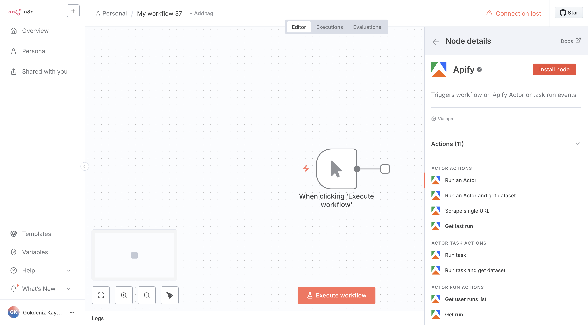
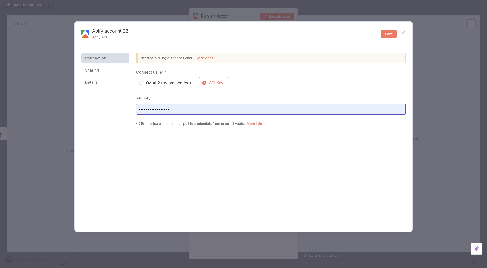
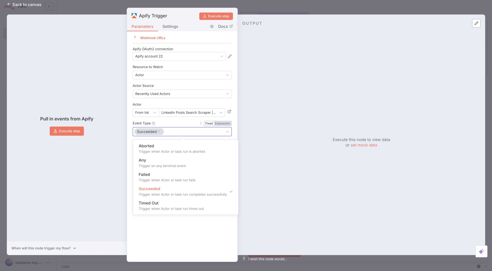
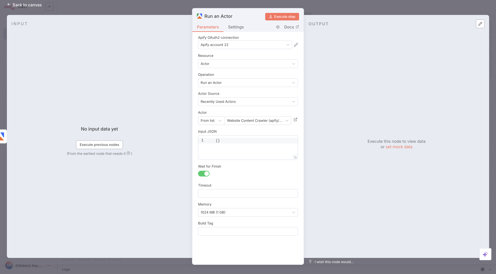
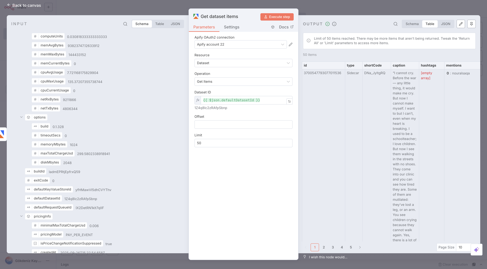
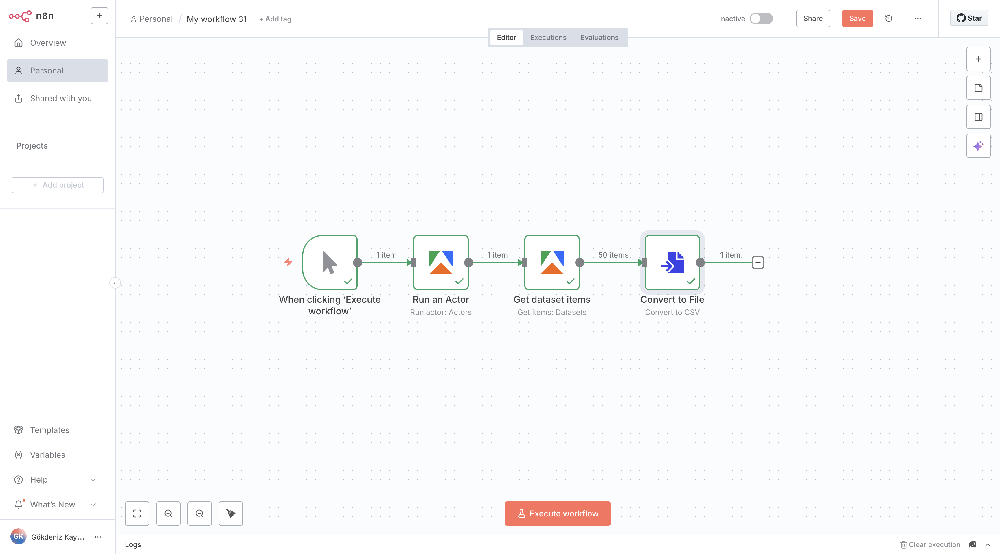

**Connect Apify with n8n to automate workflows by running Actors, extracting structured data, and responding to Actor or task events.**

---

[n8n](https://n8n.io/) is an open source fair-code licensed tool for workflow automation. With the [Apify integration for n8n](https://github.com/apify/n8n-nodes-apify), you can connect Apify Actors and storage to hundreds of services, so you can run scrapers, extract data, and trigger workflows based on Actor or task events.

This guide shows you how to install the Apify node, configure credentials, and use the available operations and triggers in your n8n workflows.

## Prerequisites

Before you begin, make sure you have:

* An [Apify account](https://console.apify.com/)
* An [n8n instance](https://docs.n8n.io/getting-started/) (self‑hosted or cloud)

## Install the Apify Node (self-hosted)

You can install the Apify community node directly from the n8n Editor UI:

1. Open your n8n instance
2. Go to **Settings > Community Nodes**
3. Select **Install**
4. Enter the npm package name: `@apify/n8n-nodes-apify` to install the latest version. To install a specific [version](https://www.npmjs.com/package/@apify/n8n-nodes-apify?activeTab=versions) enter e.g `@apify/n8n-nodes-apify@0.4.4`
5. Agree to the [risks](https://docs.n8n.io/integrations/community-nodes/risks/) of using community nodes and select **Install**
6. The node is now available to use in your workflows

## Install the Apify Node (n8n Cloud)

If you’re using n8n Cloud, installing community nodes is even simpler:

1. Go to the **Canvas** and open the **nodes panel**
2. Search for **Apify** in the community node registry
3. Click **Install node** to add the Apify node to your instance

:::note

  On n8n cloud users can choose not to show verified community nodes. Instance owners can toggle this in the Cloud Admin Panel. To install the Apify node, make sure the installation of verified community nodes is enabled.

:::

## Authentication

The Apify node supports two authentication methods:

### API Key (cloud & self-hosted instance)

1. In the n8n Editor UI, click on **Create Credential**
2. Search for Apify API and click **Continue**
3. Enter your Apify API token. You can find the API token in the [console](https://console.apify.com/settings/integrations)
4. Click **Save**

  

### OAuth2 (cloud instance only)

1. In n8n Cloud, click on **Create Credential**
2. Search for Apify OAuth2 API and click **Continue**
3. Click **Connect my account** and authorize with your Apify account
4. n8n will retrieve and store OAuth2 tokens automatically

  
  
  :::note

  On n8n Cloud, you're free to authenticate the Apify node either with your Apify API key or via OAuth2. If you prefer simplicity, you can use API Key.

  :::

## Create a Workflow with the Apify Node

1. Create a new workflow in n8n
2. Click **Add Node**, search for **Apify**, and select it
3. Select the desired **Resource** and **Operation**
4. In the node's **Credentials** dropdown, choose the Apify credential you configured earlier. If you haven't configured any credentials, you can do so in this step. The process will be the same
5. You can now use Apify node as a trigger or action

## Use Apify node as trigger

1. Create a new workflow
2. Click **Add Node**, search for **Apify**, and select it
3. Select **On new Apify Event** trigger
4. Configure it:

* **Actor or Actor task**: select the Actor or task to listen for terminal events
* **Event Type**: the status of the Actor or task run that should trigger the workflow

1. Add subsequent nodes (e.g., HTTP Request, Google Sheets) to process or store the output
2. Save and execute the workflow

## Use Apify node as an action

1. Create a new workflow
2. Click **Add Node**, search for **Apify**, and select it
3. Select any operation. In this example we will use **Run Actor**
4. Configure it:

* **Custom input**: JSON input for the Actor run, which you can find on the Actor input page in Apify Console. See [Inputs](/platform/actors/running/input-and-output#input) for more information. If empty, the run uses the input specified in the default run configuration
* **Timeout**: Timeout for the Actor run in seconds. Zero value means there is no timeout
* **Memory**: Amount of memory allocated for the Actor run, in megabytes
* **Build Tag**: Specifies the Actor build tag to run. By default, the run uses the build specified in the default run configuration for the Actor (typically `latest`)
* **Wait for finish**: Whether to wait for the run to finish before continuing. If true, the node will wait for the run to complete (successfully or not) before moving to the next node

1. Add another Apify operation called **Get Dataset Items**.

* Set Dataset ID parameter as **defaultDatasetId** value received from the previous **Run Actor** node. This will give you the output of the Actor run

1. Add any subsequent nodes (e.g. Google Sheets) to process or store the output
2. Save and execute the workflow

## Available Operations

### Actors

* **Run Actor**: Starts a specified Actor with customizable parameters
* **Scrape Single URL**: Runs a scraper for a specified website and returns its content
* **Get Last Run**: Retrieve metadata for the most recent run of an Actor

### Actor Tasks

* **Run Task**: Executes a specified Actor task

### Actor Runs

* **Get User Runs List**: Retrieve a list of all runs for a user
* **Get Run**: Retrieve detailed information for a specific run ID
* **Get Runs**: Retrieve all runs for a specific Actor

### Datasets

* **Get Items**: Retrieves items from a [dataset](/platform/storage/dataset)

### Key-Value Stores

* **Get Record**:  Retrieves a value from a [key-value store](/platform/storage/key-value-store)

### Triggers

Automatically start an n8n workflow when an Actor or task run finishes:

* **Actor Run Finished**: Activates when a selected Actor run completes
* **Task Run Finished**: Activates when a selected Actor task run completes

## Resources

* [n8n Community Nodes Documentation](https://docs.n8n.io/integrations/community-nodes/)
* [Apify API Documentation](https://docs.apify.com)
* [n8n Documentation](https://docs.n8n.io)

## Troubleshooting

* **Authentication errors**: Verify your API token or OAuth2 settings in **Credentials**.
* **Operation failures**: Check input parameters, JSON syntax, and resource IDs in your Apify account.

Feel free to explore other resources and contribute to the integration on [GitHub](https://github.com/apify/n8n-nodes-apify).
