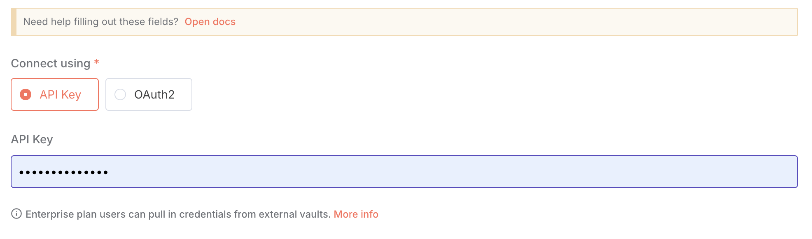

## Prerequisites

Before you begin, make sure you have:

- An [Apify account](https://console.apify.com/)
- An [n8n instance](https://docs.n8n.io/getting-started/) (self‑hosted or cloud)

## Apify Scraper for AI Crawling

Apify Scraper for AI Crawling from [Apify](https://apify.com/) lets you extract text content from websites to feed AI models, LLM applications, vector databases, or Retrieval Augmented Generation (RAG) pipelines. It supports rich formatting using Markdown, cleans the HTML of irrelevant elements, downloads linked files, and integrates with AI ecosystems like LangChain, LlamaIndex, and other LLM frameworks.

To use these modules, you need an [Apify account](https://console.apify.com) and an [API token](https://docs.apify.com/platform/integrations/api#api-token). You can find your token in the [Apify Console](https://console.apify.com/) under **Settings > Integrations**. After connecting, you can automate content extraction at scale and incorporate the results into your AI workflows.

## Install the Apify Node (self-hosted)

If you're running a self-hosted n8n instance, you can install the Apify community node directly from the editor. This process adds the node to your available tools, enabling Apify operations in workflows.

1. Open your n8n instance.
1. Go to **Settings > Community Nodes**.
1. Select **Install**.
1. Enter the npm package name: `@apify/n8n-nodes-apify-content-crawler`  (for latest version). To install a specific [version](https://www.npmjs.com/package/@apify/n8n-nodes-apify-content-crawler?activeTab=versions) enter e.g `@apify/n8n-nodes-apify-content-crawler@0.0.1`.
1. Agree to the [risks](https://docs.n8n.io/integrations/community-nodes/risks/) of using community nodes and select **Install**.
1. You can now use the node in your workflows.


## Connect Apify Scraper for AI Crawling (self-hosted)

1. Create an account at [Apify](https://console.apify.com/). You can sign up using your email, Gmail, or GitHub account.

    

1. To connect your Apify account to n8n, you can use an OAuth connection (recommended) or an Apify API token. To get the Apify API token, navigate to **[Settings > API & Integrations](https://console.apify.com/settings/integrations)** in the Apify Console.

    

1. Find your token under **Personal API tokens** section. You can also create a new API token with multiple customizable permissions by clicking on **+ Create a new token**.
1. Click the **Copy** icon next to your API token to copy it to your clipboard. Then, return to your n8n workflow interface.

    

1. In n8n, click **Create new credential** of the chosen Apify Scraper module.
1. In the **API key** field, paste the API token you copied from Apify and click **Save**.



Once connected, you can build workflows to automate website extraction and integrate results into your AI applications.

## Apify Scraper for Website Content modules

After connecting the app, you can use one of the two modules as native scrapers to extract website content.

### Standard Settings Module

The Standard Settings module is a streamlined component of the Website Content Crawler that allows you to quickly extract content from websites using optimized default settings. This module is perfect for extracting content from blogs, documentation sites, knowledge bases, or any text-rich website to feed into AI models.

#### How it works

The crawler starts with one or more **Start URLs** you provide, typically the top-level URL of a documentation site, blog, or knowledge base. It then:

- Crawls these start URLs
- Finds links to other pages on the site
- Recursively crawls those pages as long as their URL is under the start URL
- Respects URL patterns for inclusion/exclusion
- Automatically skips duplicate pages with the same canonical URL
- Provides various settings to customize crawling behavior (crawler type, max pages, depth, concurrency, etc.)

Once a web page is loaded, the Actor processes its HTML to ensure quality content extraction:

- Waits for dynamic content to load if using a headless browser
- Can scroll to a certain height to ensure all page content is loaded
- Can expand clickable elements to reveal hidden content
- Removes DOM nodes matching specific CSS selectors (like navigation, headers, footers)
- Optionally keeps only content matching specific CSS selectors
- Removes cookie warnings using browser extensions
- Transforms the page using the selected HTML transformer to extract the main content

#### Output data

For each crawled web page, you'll receive:

- _Page metadata_: URL, title, description, canonical URL
- _Cleaned text content_: The main article content with irrelevant elements removed
- _Markdown formatting_: Structured content with headers, lists, links, and other formatting preserved
- _Crawl information_: Loaded URL, referrer URL, timestamp, HTTP status
- _Optional file downloads_: PDFs, DOCs, and other linked documents

```json title="Sample output (shortened)"
{
  "url": "https://docs.apify.com/academy/web-scraping-for-beginners",
  "crawl": {
    "loadedUrl": "https://docs.apify.com/academy/web-scraping-for-beginners",
    "loadedTime": "2025-04-22T14:33:20.514Z",
    "referrerUrl": "https://docs.apify.com/academy",
    "depth": 1,
    "httpStatusCode": 200
  },
  "metadata": {
    "canonicalUrl": "https://docs.apify.com/academy/web-scraping-for-beginners",
    "title": "Web scraping for beginners | Apify Documentation",
    "description": "Learn the basics of web scraping with a step-by-step tutorial and practical exercises.",
    "languageCode": "en",
    "markdown": "# Web scraping for beginners\n\nWelcome to our comprehensive web scraping tutorial for beginners. This guide will take you through the fundamentals of extracting data from websites, with practical examples and exercises.\n\n## What is web scraping?\n\nWeb scraping is the process of extracting data from websites. It involves making HTTP requests to web servers, downloading HTML pages, and parsing them to extract the desired information.\n\n## Why learn web scraping?\n\n- **Data collection**: Gather information for research, analysis, or business intelligence\n- **Automation**: Save time by automating repetitive data collection tasks\n- **Integration**: Connect web data with your applications or databases\n- **Monitoring**: Track changes on websites automatically\n\n## Getting started\n\nTo begin web scraping, you'll need to understand the basics of HTML, CSS selectors, and HTTP. This tutorial will guide you through these concepts step by step.\n\n...",
    "text": "Web scraping for beginners\n\nWelcome to our comprehensive web scraping tutorial for beginners. This guide will take you through the fundamentals of extracting data from websites, with practical examples and exercises.\n\nWhat is web scraping?\n\nWeb scraping is the process of extracting data from websites. It involves making HTTP requests to web servers, downloading HTML pages, and parsing them to extract the desired information.\n\nWhy learn web scraping?\n\n- Data collection: Gather information for research, analysis, or business intelligence\n- Automation: Save time by automating repetitive data collection tasks\n- Integration: Connect web data with your applications or databases\n- Monitoring: Track changes on websites automatically\n\nGetting started\n\nTo begin web scraping, you'll need to understand the basics of HTML, CSS selectors, and HTTP. This tutorial will guide you through these concepts step by step.\n\n..."
  }
}
```

### Advanced Settings Module

The Advanced Settings module provides complete control over the content extraction process, allowing you to fine-tune every aspect of the crawling and transformation pipeline. This module is ideal for complex websites, JavaScript-heavy applications, or when you need precise control over content extraction.

#### Key features

- _Multiple Crawler Options_: Choose between headless browsers (Playwright) or faster HTTP clients (Cheerio)
- _Custom Content Selection_: Specify exactly which elements to keep or remove
- _Advanced Navigation Control_: Set crawling depth, scope, and URL patterns
- _Dynamic Content Handling_: Wait for JavaScript-rendered content to load
- _Interactive Element Support_: Click expandable sections to reveal hidden content
- _Multiple Output Formats_: Save content as Markdown, HTML, or plain text
- _Proxy Configuration_: Use proxies to handle geo-restrictions or avoid IP blocks
- _Content Transformation Options_: Multiple algorithms for optimal content extraction

#### How it works

The Advanced Settings module provides granular control over the entire crawling process:

1. _Crawler Selection_: Choose from Playwright (Firefox/Chrome), or Cheerio based on website complexity
2. _URL Management_: Define precise scoping with include/exclude URL patterns
3. _DOM Manipulation_: Control which HTML elements to keep or remove
4. _Content Transformation_: Apply specialized algorithms for content extraction
5. _Output Formatting_: Select from multiple formats for AI model compatibility

#### Configuration options

Advanced Settings offers numerous configuration options, including:

- _Crawler Type_: Select the rendering engine (browser or HTTP client)
- _Content Extraction Algorithm_: Choose from multiple HTML transformers
- _Element Selectors_: Specify which elements to keep, remove, or click
- _URL Patterns_: Define URL inclusion/exclusion patterns with glob syntax
- _Crawling Parameters_: Set concurrency, depth, timeouts, and retries
- _Proxy Configuration_: Configure proxy settings for robust crawling
- _Output Options_: Select content formats and storage options

#### Output data

In addition to the standard output fields, Advanced Settings provides:

- _Multiple Format Options_: Content in Markdown, HTML, or plain text
- _Debug Information_: Detailed extraction diagnostics and snapshots
- _HTML Transformations_: Results from different content extraction algorithms
- _File Storage Options_: Flexible storage for HTML, screenshots, or downloaded files

You can access any of our 6,000+ scrapers on Apify Store by using the [general Apify app](https://n8n.io/integrations/apify).

