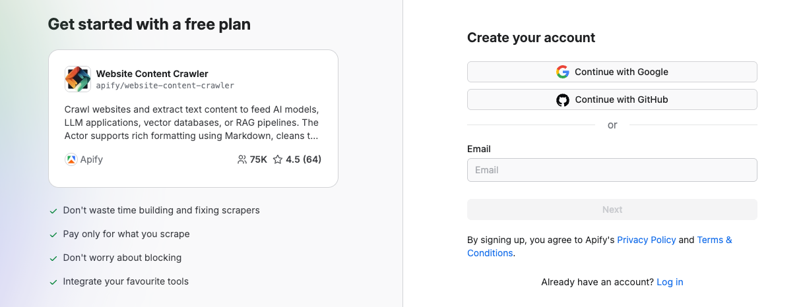
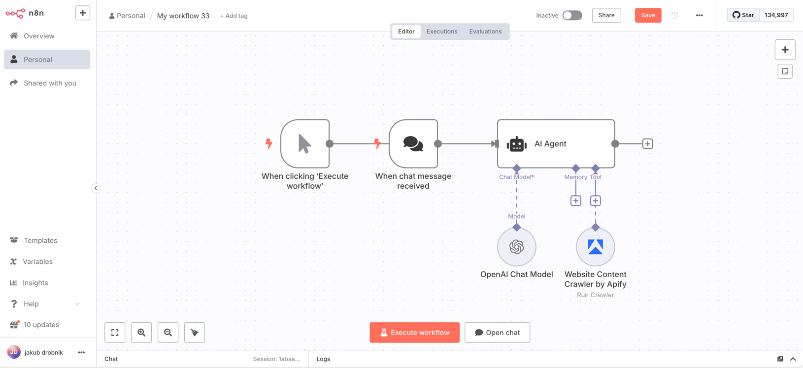

## Website Content Crawler By Apify

Website Content Crawler from [Apify](https://apify.com/apify/website-content-crawler) lets you extract text content from websites to feed AI models, LLM applications, vector databases, or Retrieval Augmented Generation (RAG) pipelines. It supports rich formatting using Markdown, cleans the HTML of irrelevant elements, downloads linked files, and integrates with AI ecosystems like LangChain, LlamaIndex, and other LLM frameworks.

To use these modules, you need an [API token](https://docs.apify.com/platform/integrations/api#api-token). You can find your token in the [Apify Console](https://console.apify.com/) under **Settings > Integrations**. After connecting, you can automate content extraction at scale and incorporate the results into your AI workflows.

## Prerequisites

Before you begin, make sure you have:

- An [Apify account](https://console.apify.com/)
- An [n8n instance](https://docs.n8n.io/getting-started/) (self‑hosted or cloud)

## Install the Apify Node (self-hosted)

If you're running a self-hosted n8n instance, you can install the Apify community node directly from the editor. This process adds the node to your available tools, enabling Apify operations in workflows.

1. Open your n8n instance.
1. Go to **Settings > Community Nodes**.
1. Select **Install**.
1. Enter the npm package name: `@apify/n8n-nodes-apify-content-crawler`  (for latest version). To install a specific [version](https://www.npmjs.com/package/@apify/n8n-nodes-apify-content-crawler?activeTab=versions) enter e.g `@apify/n8n-nodes-apify-content-crawler@0.0.1`.
1. Agree to the [risks](https://docs.n8n.io/integrations/community-nodes/risks/) of using community nodes and select **Install**.
1. You can now use the node in your workflows.


## Install the Website Content Crawler by Apify Node (n8n Cloud)

For n8n Cloud users, installation is even simpler and doesn't require manual package entry.  Just search and add the node from the canvas.

1. Go to the **Canvas** and open the **nodes panel**
1. Search for **Website Content Crawler by Apify** in the community node registry
1. Click **Install node** to add the Apify node to your instance


:::note Verified community nodes visibility

On n8n Cloud, instance owners can toggle visibility of verified community nodes in the Cloud Admin Panel. Ensure this setting is enabled to install the Website Content Crawler by Apify node.

:::

## Connect Website Content Crawler by Apify (self-hosted)

1. Create an account at [Apify](https://console.apify.com/). You can sign up using your email, Gmail, or GitHub account.

    

1. To connect your Apify account to n8n, you can use an OAuth connection (recommended) or an Apify API token. To get the Apify API token, navigate to **[Settings > API & Integrations](https://console.apify.com/settings/integrations)** in the Apify Console.

    

1. Find your token under **Personal API tokens** section. You can also create a new API token with multiple customizable permissions by clicking on **+ Create a new token**.
1. Click the **Copy** icon next to your API token to copy it to your clipboard. Then, return to your n8n workflow interface.

    

1. In n8n, click **Create new credential** of the chosen Apify Scraper module.
1. In the **API key** field, paste the API token you copied from Apify and click **Save**.


### OAuth2 (cloud instance only)

1. In n8n Cloud, select **Create Credential**.
1. Search for Apify OAuth2 API and select **Continue**.
1. Select **Connect my account** and authorize with your Apify account.
1. n8n automatically retrieves and stores the OAuth2 tokens.

  
  
:::note

For simplicity on n8n Cloud, use the API key method if you prefer manual control over credentials.

:::

With authentication set up, you can now create workflows that incorporate the Apify node.

## Website Content Crawler by Apify module

This module provides complete control over the content extraction process, allowing you to fine-tune every aspect of the crawling and transformation pipeline. This module is ideal for complex websites, JavaScript-heavy applications, or when you need precise control over content extraction.

#### Key features

- _Multiple Crawler Options_: Choose between headless browsers (Playwright) or faster HTTP clients (Cheerio)
- _Custom Content Selection_: Specify exactly which elements to keep or remove
- _Advanced Navigation Control_: Set crawling depth, scope, and URL patterns
- _Dynamic Content Handling_: Wait for JavaScript-rendered content to load
- _Interactive Element Support_: Click expandable sections to reveal hidden content
- _Multiple Output Formats_: Save content as Markdown, HTML, or plain text
- _Proxy Configuration_: Use proxies to handle geo-restrictions or avoid IP blocks
- _Content Transformation Options_: Multiple algorithms for optimal content extraction

#### How it works

The Advanced Settings module provides granular control over the entire crawling process. For _Crawler selection_, you can choose from Playwright (Firefox/Chrome) or Cheerio, depending on the complexity of the target website. _URL management_ allows you to define the crawling scope with include and exclude URL patterns. You can also exercise precise _DOM manipulation_ by controlling which HTML elements to keep or remove. To ensure the best results, you can apply specialized algorithms for _Content transformation_ and select from various _Output formatting_ options for better AI model compatibility.

#### Output data

For each crawled web page, you'll receive:

- _Page metadata_: URL, title, description, canonical URL
- _Cleaned text content_: The main article content with irrelevant elements removed
- _Markdown formatting_: Structured content with headers, lists, links, and other formatting preserved
- _Crawl information_: Loaded URL, referrer URL, timestamp, HTTP status
- _Optional file downloads_: PDFs, DOCs, and other linked documents
- _Multiple format options_: Content in Markdown, HTML, or plain text
- _Debug information_: Detailed extraction diagnostics and snapshots
- _HTML transformations_: Results from different content extraction algorithms
- _File storage options_: Flexible storage for HTML, screenshots, or downloaded files

```json title="Sample output (shortened)"
{
  "url": "https://docs.apify.com/academy/web-scraping-for-beginners",
  "crawl": {
    "loadedUrl": "https://docs.apify.com/academy/web-scraping-for-beginners",
    "loadedTime": "2025-04-22T14:33:20.514Z",
    "referrerUrl": "https://docs.apify.com/academy",
    "depth": 1,
    "httpStatusCode": 200
  },
  "metadata": {
    "canonicalUrl": "https://docs.apify.com/academy/web-scraping-for-beginners",
    "title": "Web scraping for beginners | Apify Documentation",
    "description": "Learn the basics of web scraping with a step-by-step tutorial and practical exercises.",
    "languageCode": "en",
    "markdown": "# Web scraping for beginners\n\nWelcome to our comprehensive web scraping tutorial for beginners. This guide will take you through the fundamentals of extracting data from websites, with practical examples and exercises.\n\n## What is web scraping?\n\nWeb scraping is the process of extracting data from websites. It involves making HTTP requests to web servers, downloading HTML pages, and parsing them to extract the desired information.\n\n## Why learn web scraping?\n\n- **Data collection**: Gather information for research, analysis, or business intelligence\n- **Automation**: Save time by automating repetitive data collection tasks\n- **Integration**: Connect web data with your applications or databases\n- **Monitoring**: Track changes on websites automatically\n\n## Getting started\n\nTo begin web scraping, you'll need to understand the basics of HTML, CSS selectors, and HTTP. This tutorial will guide you through these concepts step by step.\n\n...",
    "text": "Web scraping for beginners\n\nWelcome to our comprehensive web scraping tutorial for beginners. This guide will take you through the fundamentals of extracting data from websites, with practical examples and exercises.\n\nWhat is web scraping?\n\nWeb scraping is the process of extracting data from websites. It involves making HTTP requests to web servers, downloading HTML pages, and parsing them to extract the desired information.\n\nWhy learn web scraping?\n\n- Data collection: Gather information for research, analysis, or business intelligence\n- Automation: Save time by automating repetitive data collection tasks\n- Integration: Connect web data with your applications or databases\n- Monitoring: Track changes on websites automatically\n\nGetting started\n\nTo begin web scraping, you'll need to understand the basics of HTML, CSS selectors, and HTTP. This tutorial will guide you through these concepts step by step.\n\n..."
  }
}
```

You can access any of thousands of our scrapers on Apify Store by using the [general Apify app](https://n8n.io/integrations/apify).

#### Configuration options

You can select the _Crawler type_ by choosing the rendering engine (browser or HTTP client) and the _Content extraction algorithm_ from multiple HTML transformers. _Element selectors_ allow you to specify which elements to keep, remove, or click, while _URL patterns_ let you define inclusion and exclusion rules with glob syntax. You can also set _Crawling parameters_ like concurrency, depth, timeouts, and retries. For robust crawling, you can configure _Proxy configuration_ settings and select from various _Output options_ for content formats and storage.

## Usage as an AI Agent Tool

You can setup Apify's Scraper for AI Crawling node as a tool for your AI Agents.



### Dynamic URL crawling

In the Website Content Crawler module you can set the **Start URLs** to be filled in by your AI Agent dynamically. This allows the Agent to decide on which pages to scrape off the internet.

Two key parameters to configure for optimized AI Agent usage are **Max crawling depth** and **Max pages**. Remember that the scraping results are passed into the AI Agent’s context, so using smaller values helps stay within context limits.


### Example usage

Here, the agent was used to find information about Apify's latest blog post. It correctly filled in the URL for the blog and summarized its content.


