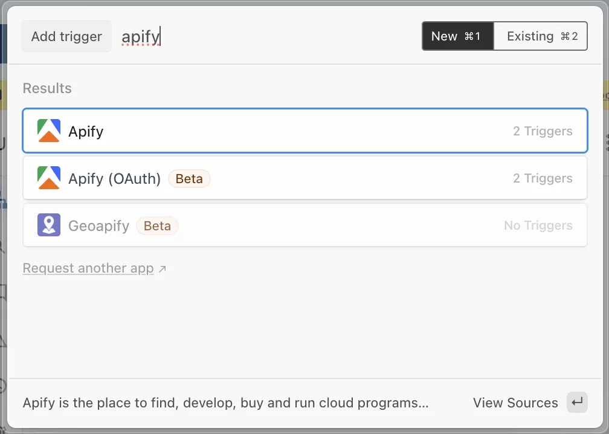
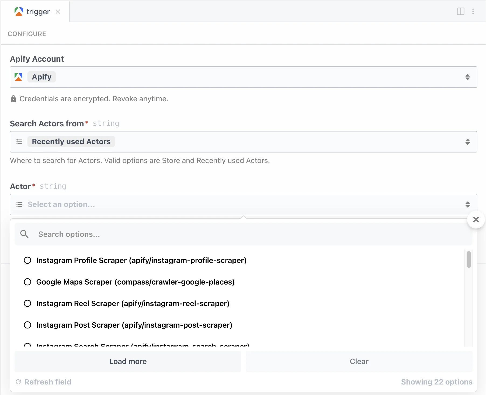
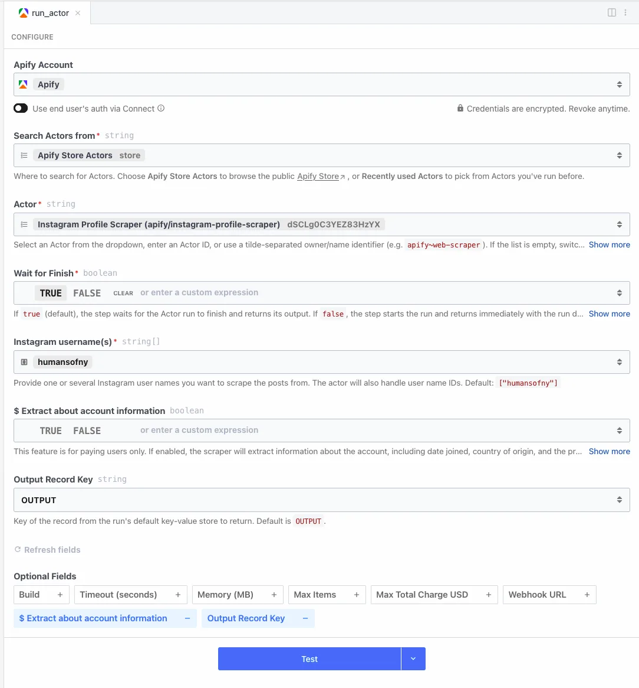

import ThirdPartyDisclaimer from '@site/sources/_partials/_third-party-integration.mdx';

[Pipedream](https://pipedream.com/) is a workflow automation platform for developers. With the [Apify integration for Pipedream](https://pipedream.com/apps/apify), you can run Actors, manage datasets and key-value stores, and trigger workflows when Actor or task runs finish.

<ThirdPartyDisclaimer />

## Prerequisites

Before you begin, make sure you have:

- An [Apify account](https://console.apify.com/)
- A [Pipedream account](https://pipedream.com/)

## Connect Apify with Pipedream

1. Log into your Pipedream account and [create a new workflow](https://pipedream.com/docs/workflows).
1. [Add an Apify step](https://pipedream.com/docs/workflows/building-workflows/steps) (trigger or action) to your workflow. Select one of two Apify apps:

    

    - **Apify** - Authenticate with your Apify API token. Find it in [Apify Console](https://console.apify.com/settings/integrations) under **Settings > Integrations**.
    - **Apify (OAuth)** - Authorize access to your Apify account via OAuth.
1. Follow the prompts to authenticate your account.

    See Pipedream's [connected accounts documentation](https://pipedream.com/docs/apps/connected-accounts).
1. After connecting, you can use any Apify trigger or action in your workflows.

## Use Apify as a trigger

[Triggers](https://pipedream.com/docs/workflows/building-workflows/triggers) start your Pipedream workflow automatically when an event occurs in Apify.

1. [Create a new workflow](https://pipedream.com/docs/workflows) in Pipedream.
1. Select **Add Trigger** and search for **Apify**.
1. Select the trigger you want to use, e.g. **New Finished Actor Run**.
1. Configure the trigger by selecting the Actor or task to monitor.

    
1. Add subsequent steps to process the output.

## Use Apify as an action

[Actions](https://pipedream.com/docs/workflows/building-workflows/actions) let you perform Apify operations as part of a workflow. For example, you can run an Actor and then retrieve its dataset items.

1. [Create a new workflow](https://pipedream.com/docs/workflows) in Pipedream with any trigger.
1. Click **+** to add a step and search for **Apify**.
1. Select the action you want to use, e.g. **Run Actor**.
1. Configure the action parameters:
    - Select the Actor from Apify Store or your recently used Actors
    - Fill in the Actor's input fields, which are generated from the Actor's input schema. Actors without an input schema accept raw JSON input.
    - Set optional parameters such as timeout (in seconds), memory (preset values from 128 MB to 32 GB), and build (a build tag or build number)
    - Use the **Wait for Finish** switch to wait for the run to complete and return its output, or return immediately after starting the run

    
1. Add another Apify step with **Get Dataset Items** to retrieve the Actor's output.
1. Add any subsequent steps to process or store the data.

:::caution Building workflows with AI

Pipedream's [Apify app page](https://pipedream.com/apps/apify) can generate a workflow for you with Pipedream's AI builder. Because the Apify connector is schema-driven, the AI builder can consume your Pipedream AI tokens quickly and might not configure required inputs reliably. For predictable results, add the Apify triggers and actions to your workflow directly, as described above.

:::

## Triggers

- **New finished Actor run (instant)** - Triggers when a selected Actor run finishes.
- **New finished task run (instant)** - Triggers when a selected task run finishes.

## Actions

- **Run Actor** - Runs a selected Actor with customizable input and configuration, and optionally waits for it to finish.
- **Run task** - Runs a selected Actor task and optionally waits for it to finish.
- **Scrape single URL** - Runs a scraper on a specified URL and returns its content as HTML. Use this for extracting content from a single page, e.g. in LLM workflows.
- **Get dataset items** - Retrieves items from a [dataset](/storage/dataset), specified by ID or name.
- **Get key-value store record** - Retrieves a record from a [key-value store](/storage/key-value-store).
- **Set key-value store record** - Creates or updates a record in a [key-value store](/storage/key-value-store).

## Use Apify with AI agents (MCP)

To use Apify Actors directly with AI agents and MCP-compatible clients, use the [Apify MCP server](/integrations/mcp).

Pipedream also hosts an [MCP server for Apify](https://mcp.pipedream.com/app/apify). Because Apify provides its own MCP server, use the Pipedream one only if you want Apify available alongside your other Pipedream apps in a single MCP client.

## Resources

- [Apify integration page on Pipedream](https://pipedream.com/apps/apify)
- [Pipedream documentation](https://pipedream.com/docs/)
- [Integration source code on GitHub](https://github.com/PipedreamHQ/pipedream/tree/master/components/apify)

If you have any questions or need help, reach out on the [Apify developer community on Discord](https://discord.com/invite/jyEM2PRvMU).
