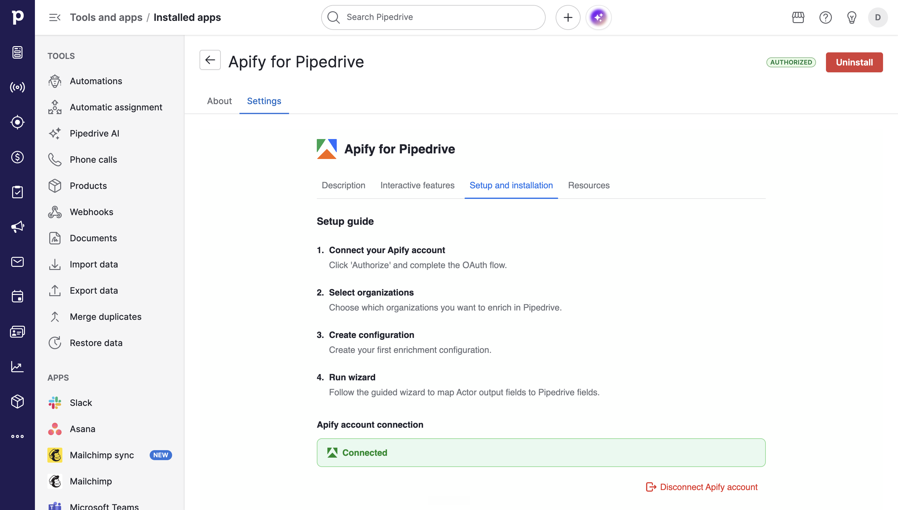
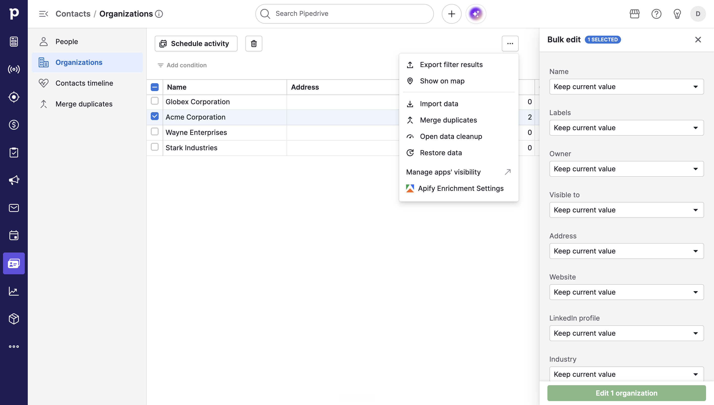
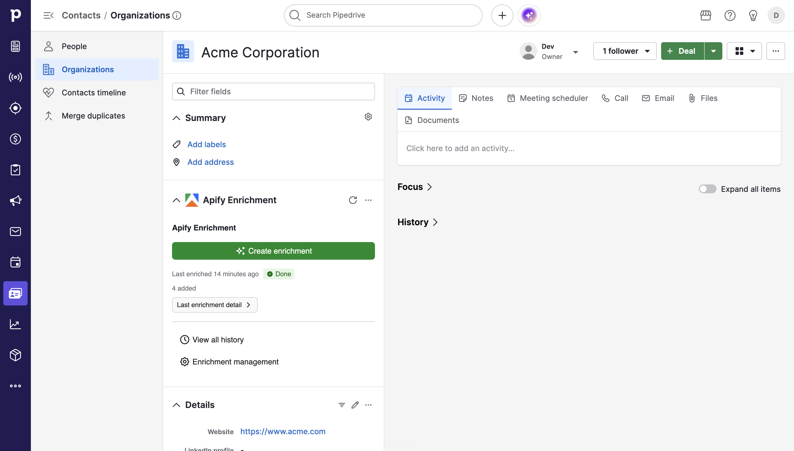
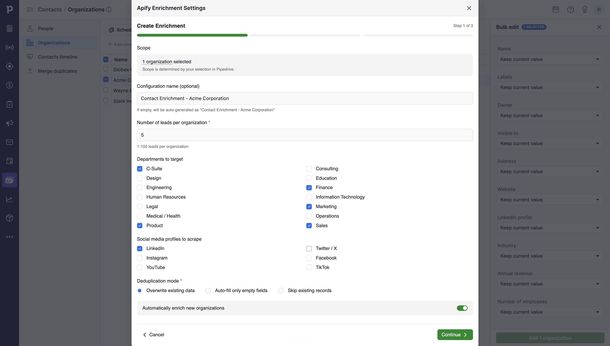
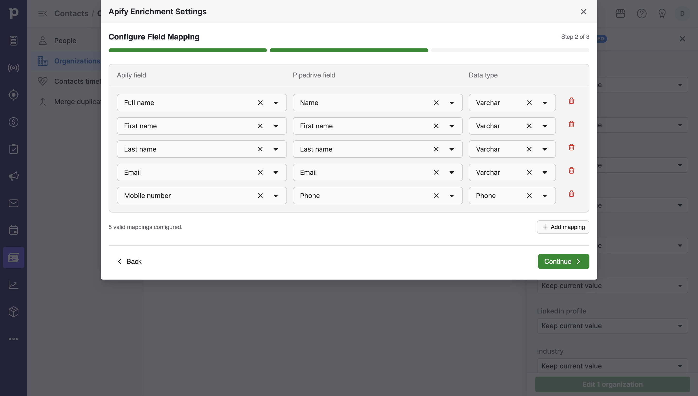
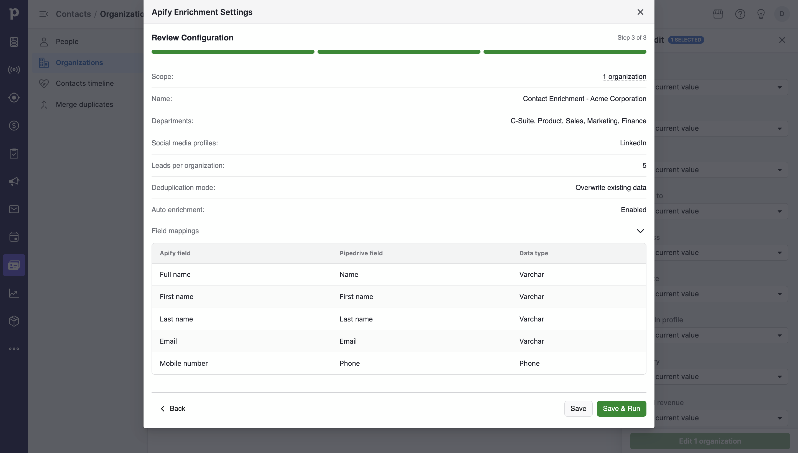
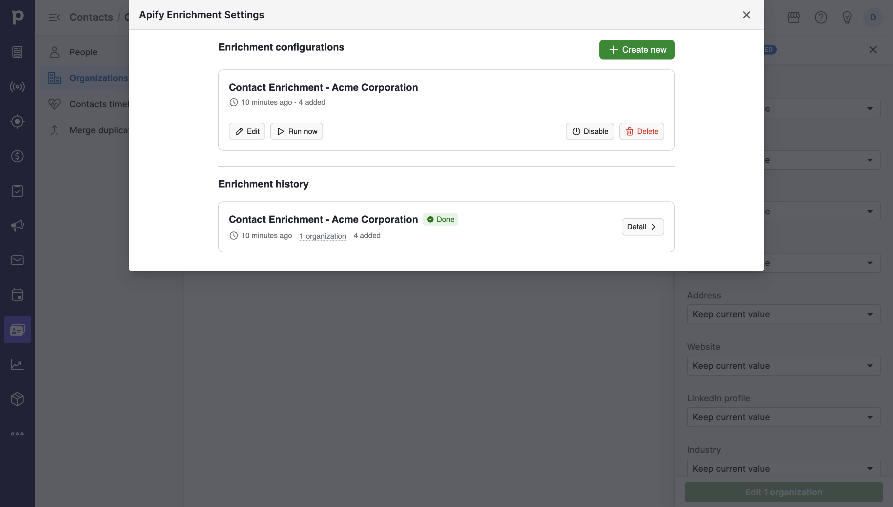

import ThirdPartyDisclaimer from '@site/sources/\_partials/\_third-party-integration.mdx';

[Pipedrive](https://www.pipedrive.com/) is a sales CRM that helps teams manage deals, organizations, and contacts. With the Apify integration, you can enrich your organizations and contacts with fresh data from the [Contact Details Scraper](https://apify.com/vdrmota/contact-info-scraper) Actor, map Actor output to Pipedrive fields, and run enrichments on demand or automatically - all without leaving Pipedrive.

<ThirdPartyDisclaimer />

## Prerequisites

To use the Apify integration with Pipedrive, you need:

- An [Apify account](https://console.apify.com/)
- A [Pipedrive account](https://www.pipedrive.com/) with permission to install Marketplace apps

## Install the app from the Pipedrive Marketplace

The integration is a Pipedrive Marketplace app that you install into your Pipedrive company. Connecting your Apify account is part of the installation.

1. In Pipedrive, open the **Marketplace**.
1. Search for **Apify**.
1. Open the **Apify for Pipedrive** listing and click **Authorize**.
1. Review the requested Pipedrive permissions and confirm.
1. Complete the Apify OAuth flow to connect your Apify account.

## Manage your Apify connection

Your Apify account is connected during installation, so the integration can run Actors and write results back to Pipedrive. To check the connection, reconnect, or disconnect, use the app settings page.

1. In Pipedrive, open the **Apify for Pipedrive** settings page.
1. Go to the **Setup and installation** tab.

The **Setup and installation** tab shows a **Connected** status when your Apify account is linked. If it isn't connected, click **Authorize** and complete the Apify OAuth flow. To revoke access, click **Disconnect Apify account**. Disconnecting stops all Apify-powered enrichments until you reconnect the account.

## Where to find the integration in Pipedrive

The app adds several surfaces inside Pipedrive where you manage and run enrichments:

- **Organization list**: open the three-dots menu on the organization list to manage enrichment configurations, launch the enrichment wizard, and view enrichment history.
- **Organization detail**: the Apify enrichment panel shows the latest enrichment status and lets you create or run an enrichment for that organization.
- **Settings page**: manage your Apify connection and browse the **Description**, **Interactive features**, **Setup and installation**, and **Resources** tabs.

## Create an enrichment configuration

An enrichment configuration defines the Actor settings, including the number of contacts to find per organization, and how Actor output maps to your Pipedrive fields. You build one through a guided wizard. A configuration is not tied to specific organizations, so you can reuse it with any organization.

### Step 1: Set up the enrichment

Configure what the enrichment collects:

- **Leads per organization**: how many contacts to find per organization, from 1 to 100.
- **Departments**: which departments to target, such as C-Suite, Sales, Marketing, Engineering, Finance, HR, IT, Legal, Operations, and Product.
- **Social media profiles**: which profiles to collect, such as LinkedIn, X/Twitter, Instagram, Facebook, YouTube, and TikTok.
- **Deduplication mode**: how existing Pipedrive values are handled. You have to choose one of:
    - **Overwrite existing data**
    - **Auto-fill only empty fields**
    - **Skip existing records**
- **Automatically enrich new organizations**: when enabled, the app automatically enriches newly added organizations using this configuration.

For more details you can read the [Contact Details Scraper](https://apify.com/vdrmota/contact-info-scraper) Actor documentation.

### Step 2: Map fields

Map the fields from the Actor output to your Pipedrive fields. Each mapping row pairs an Apify field with a Pipedrive field and its data type.

You need at least one fully configured mapping row to continue. Rows that are not fully filled are discarded.

### Step 3: Review and save

Review a summary of the configuration, then save it and optionally run the enrichment right away.

:::caution Organizations need a website

Contact enrichment starts from an organization's website URL. Organizations without a website are skipped, and the review step lists how many will be skipped.

:::

## Run enrichments

You can run a saved configuration in two ways:

- **On demand**: select the organizations you want to enrich in the organization list, then click **Run now** on a configuration and confirm the organization selection before running. You can also click **Create enrichment** from the Apify panel in an organization's detail view to enrich that organization.
- **Automatically**: enable **Automatically enrich new organizations** in a configuration. The app then runs enrichments using that configuration whenever a new organization is added to your Pipedrive account.

Enrichment runs are asynchronous. The run starts in the background, and the results appear in Pipedrive once it finishes.

## View enrichment results and history

Each run reports its status and a summary of what changed:

- **Statuses**: a run shows as **Processing** while it works, then **Done** or **Failed**.
- **Results summary**: contacts added, contacts updated, contacts skipped, organizations updated, organizations skipped, and errors.

You can review past runs in the enrichment history from the organization list modal, and open a single run to see its configuration, results, and enrichment data.

## Limitations

- Organizations without a website URL are skipped, because contact enrichment starts from the organization's website.
- The number of leads per organization must be between 1 and 100.
- A configuration needs at least one fully configured field mapping before you can save it.
- Enrichment runs asynchronously, so results are written back to Pipedrive only after the run finishes.
- You cannot currently choose any other Actor for running enrichments.

## Troubleshooting

- **Enrichments don't run**: check that your Apify account is connected. In the settings page, open **Setup and installation** and click **Authorize** if the status is not **Connected**.
- **Organizations are skipped**: confirm each organization has a website URL. Organizations without a website are skipped during contact enrichment.
- **A run stays in Processing**: enrichment runs in the background and can take a few minutes for larger scopes. Open the enrichment history to check the final status.

For questions or help, join the [Apify developer community on Discord](https://discord.com/invite/jyEM2PRvMU).
