**Learn how to integrate your Apify Actors with Microsoft Power Automate for automated workflows.**

---

[Microsoft Power Automate](https://powerautomate.microsoft.com/) is an automation platform where you can build flows, automated workflows that connect your apps with no-code connectors. With the [Apify connector](https://apify.com), you can run _Apify Actors_ inside your flows to launch web scraping and automation jobs, watch for run events, and further work with the results.

## Key capabilities

### Triggers

- **Actor run finished:** Start a flow when an Actor completes.
- **Actor task finished:** Start a flow when a task completes.

### Actions

- **Run Actor:** Execute any Apify Actor with custom inputs.
- **Run task:** Execute a saved Actor task.
- **Get dataset items:** Retrieve scraped data from datasets with dynamic schema support.
- **Get key-value store record:** Fetch stored data (e.g., screenshots, JSON state).
- **Scrape single URL:** Quick single-page scraping using the Web Scraper Actor.

## Get started

To use the Apify integration with Power Automate, you will need:

- An [Apify account](https://console.apify.com/)
- A [Power Automate account](https://powerautomate.microsoft.com/)

## Install the Apify connector

You can use the Apify connector directly within Microsoft Power Automate.

1. Log in to your Power Automate account.
1. Navigate to the **Connectors** tab on the sidebar to view the connector page.
   - If you don't see the **Connectors** tab, click **More** in the sidebar.
   - Find **Connectors** in the list and click the **Pin** icon to pin it to your sidebar for easy access.
   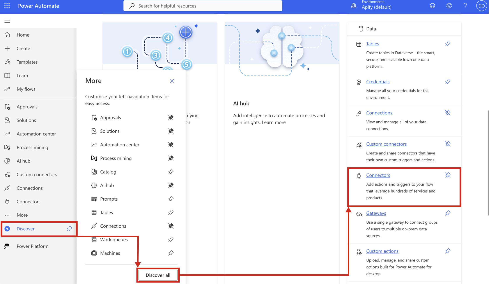
1. Open the **Connectors** tab and search for **Apify**.
1. Select the **Apify** connector from the search results.
1. A page with connector info will show up, displaying all available triggers and flows (actions) you can use right away for your automation projects.

## Connect your Apify account

Before using the Apify connector in flows, create a connection in Power Automate.

1. When you add an Apify action or trigger for the first time, you will be prompted to create a connection.
1. You can also manage connections under **Data > Connections**.

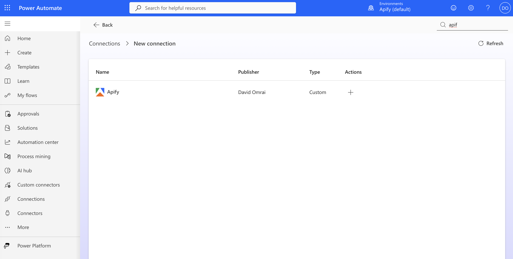

### Choose authentication type

The Apify connector supports **OAuth 2.0** authentication.

#### Authenticate with OAuth 2.0

1. Select **Sign in with Apify**.
1. You will be redirected to the Apify login page (if not already logged in).
1. Authorize the connector to access your account.
   - The connector requires the following scopes:
     - `profile`: To view account details.
     - `full_api_access`: To run Actors, tasks, access datasets, and manage webhooks.
     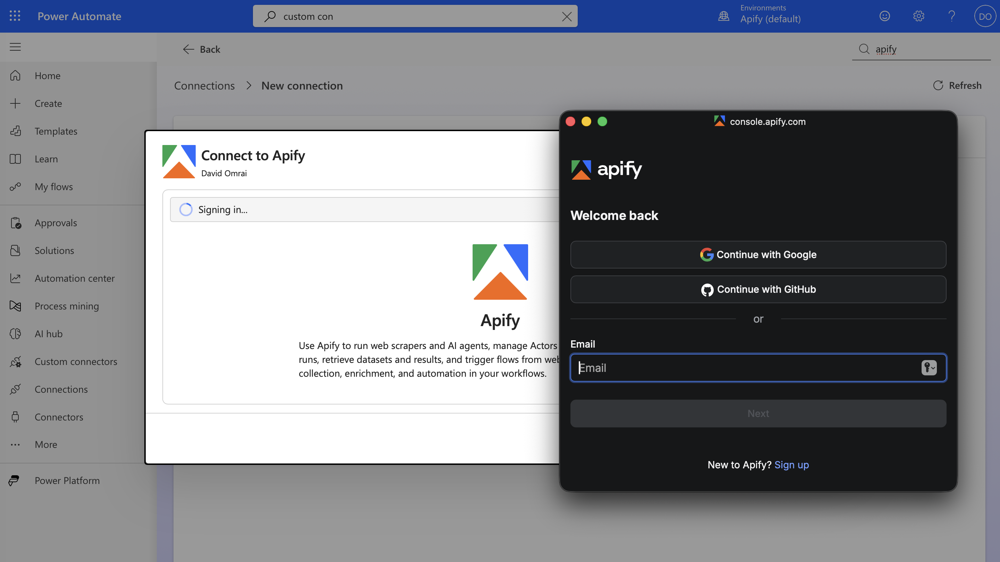
1. Once authorized, you will be redirected back to Power Automate, and the connection will be ready to use.
   

:::info Integration Platform Header

All requests made by the connector include the header `x-apify-integration-platform: microsoft-power-automate` to identify the integration platform.

:::

## Create your first flow

After connecting your Apify account, you can start creating flows that use Apify triggers and actions. A flow begins with a trigger (an event that starts the workflow) and includes one or more actions (operations to perform).

### Selection and input methods

The connector provides user-friendly ways to select resources and provide inputs.

### Pick lists and selection methods

Most actions allow you to select resources (Actors, tasks, datasets, etc.) from dynamic dropdown lists populated from your Apify account.

- **Recently used Actors**: Shows Actors you have used recently.
- **From store**: Allows you to select from popular Actors in the Apify store.
- **My tasks**: Lists your saved Actor tasks.

### Input types

When configuring an Actor or task run, you can provide input in JSON format.

- **Input Body**: For "Run Actor", provide the full JSON input object.
- **Input Override**: For "Run task", provide a JSON object to override specific fields in the task's saved input.

:::tip Copy the Actor/task input JSON

Open the Actor or task Input page in Apify Console, switch format to **JSON**, and copy the content.

:::

#### Where to find your IDs

When using manual input instead of pick lists, you'll need to provide the correct resource IDs. Here's how to find them in Apify Console:

- **Actor ID**: [Actor detail page](https://console.apify.com/actors) > API panel or URL.
  - Example URL: `https://console.apify.com/actors/<actorId>`
  - Actor name format: owner~name (for example, `apify~website-scraper`)
- **Task ID**: [Task detail page](https://console.apify.com/actors/tasks) > API panel or URL.
  - Example URL: `https://console.apify.com/actors/tasks/<taskId>`
- **Dataset ID**: [Storage > Datasets](https://console.apify.com/storage/datasets) > Dataset detail > API panel or URL.
  - Example URL: `https://console.apify.com/storage/datasets/<datasetId>`
  - Also available in the table on the `Storage > Datasets` page
- **Key-value store ID**: [Storage > Key-value stores](https://console.apify.com/storage/Key-value-stores) > Store detail > API panel or URL.
  - Example URL: `https://console.apify.com/storage/Key-value-stores/<storeId>`
  - Also available in the table on the `Storage > Key-value stores` page
- **Webhook ID**: [Actors](https://console.apify.com/actors) > Actor > Integrations.
  - Example URL: `https://console.apify.com/actors/<actor_id>/integrations/<webhook_id>`

## Triggers

> Triggers allow your flow to start automatically when an event occurs in Apify.

:::caution Manage your webhooks

Currently, when you set up these triggers, the Apify connector creates a webhook on your Apify account. If you turn off or delete a workflow in Power Automate, the webhook on Apify is **not automatically removed**.

To prevent unused webhooks from accumulating, please manually remove old webhooks from your [Apify Console](https://console.apify.com/) by navigating to the **Integrations** tab of the Actor used in your trigger.

:::

### Actor run finished

> Automatically execute your Power Automate flow when a specific Apify Actor run completes with a selected status.

- **Actor Scope**: Choose between _Recently used Actors_ or _From store_.
- **Actor**: Select the Actor from the dropdown.
- **Trigger On**: Select which run statuses should trigger the flow (e.g., `SUCCEEDED`, `FAILED`, `TIMED_OUT`, `ABORTED`).

**Output**: The trigger provides a webhook payload containing detailed information about the completed Actor run.

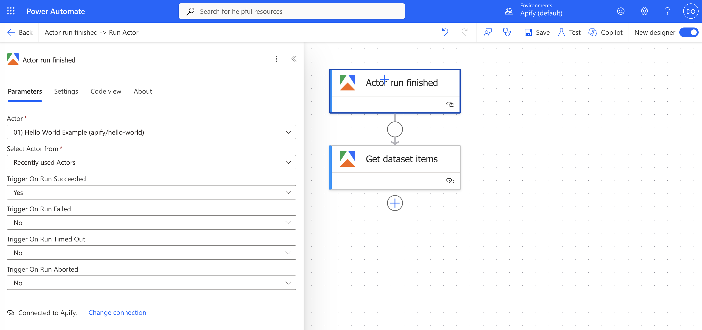

### Task run finished

> Automatically execute your Power Automate flow when a specific Apify Actor task run completes with a selected status.

- **Task**: Select the task from your account.
- **Trigger On**: Select which run statuses should trigger the flow (e.g., `SUCCEEDED`, `FAILED`).

**Output**: The trigger provides a webhook payload containing detailed information about the completed task run.

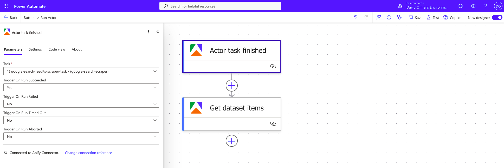

## Actions

> The Apify connector offers comprehensive actions to interact with the Apify platform.

### Run Actor

> Start an Apify Actor run with customizable execution parameters.

- **Actor Scope**: Choose _Recently used Actors_ or _From store_.
- **Input Body**: Provide the JSON input for the Actor.
- **Options**:
  - `Build`: Specify a build tag or ID.
  - `Timeout`: execution timeout in seconds.
  - `Memory`: Allocate memory (MB) for the run (options: 128, 256, 512, 1024, 2048, 4096, 8192, 16384, 32768).
  - `Wait for finish`: Specify seconds to wait (max 60s). Set to `0` for asynchronous execution.

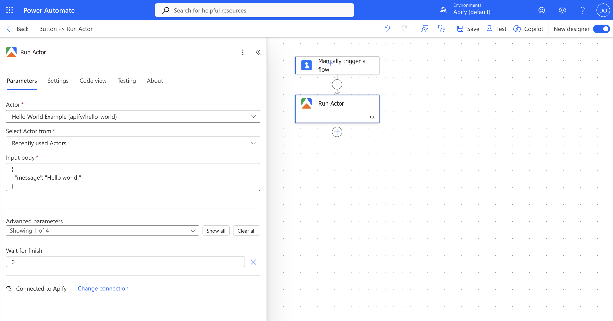

### Run task

> Start an Apify task run.

- **Task**: Select the task from your account.
- **Input Override**: Optional JSON to override the task's default input.
- **Options**:
  - `Timeout`: execution timeout in seconds.
  - `Memory`: Allocate memory (MB) (options: 128, 256, 512, 1024, 2048, 4096, 8192, 16384, 32768).
  - `Wait for finish`: Specify seconds to wait (max 60s). Set to `0` for asynchronous execution.

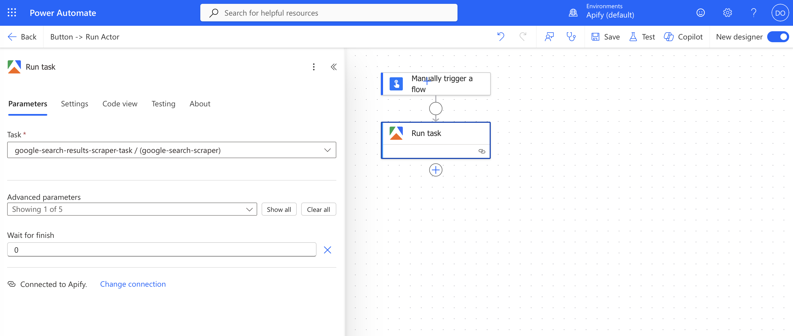

### Get dataset items

> Retrieve records from an Apify dataset.

- **Dataset**: Select a dataset from the dropdown.
- **Pagination**:
  - `Limit`: Number of items to return.
  - `Offset`: Number of items to skip.

**Output**: An array of dataset items. The connector attempts to infer the schema to provide dynamic fields in Power Automate.

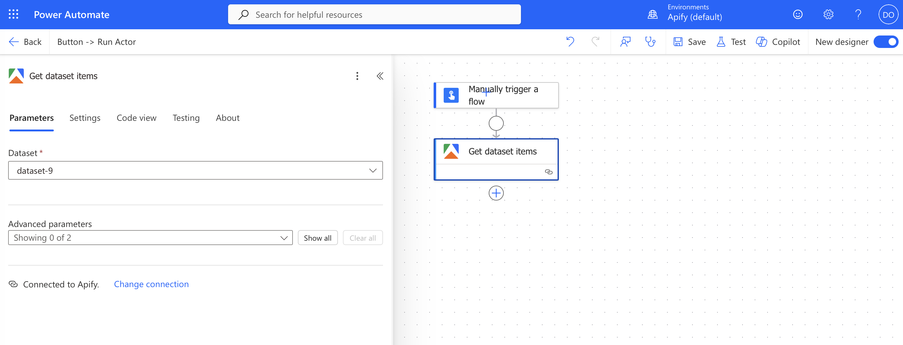

### Get key-value store record

> Retrieve a single record from a key-value store.

- **Store**: Select the store from the dropdown.
- **Record Key**: Select the key of the record to retrieve.

**Output**:

- **Body**: The raw record content (text/JSON).
- **Content-Type**: The MIME type of the record.

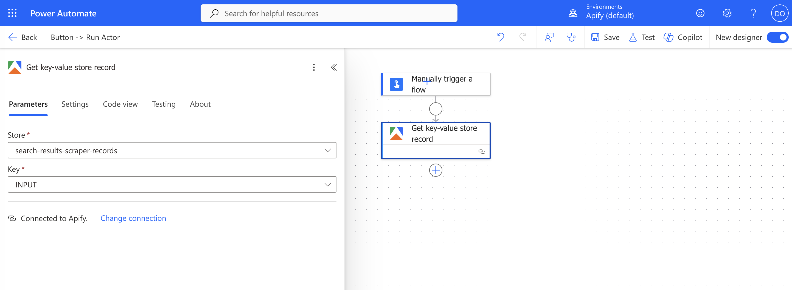

### Scrape single URL

> Scrape a single webpage using Apify's Web Scraper Actor.

- **URL**: The full URL to scrape.
- **Crawler Type**: Select the engine:
  - `playwright:adaptive` (Recommended)
  - `playwright:firefox`
  - `cheerio` (Fastest, raw HTTP)

**Note**: This action starts the Web Scraper Actor and returns the run details immediately. To process the scraped results, you can use the **Actor run finished** trigger or follow the [asynchronous pattern](#long-running-scrapes-and-async-pattern-in-power-automate) described below.

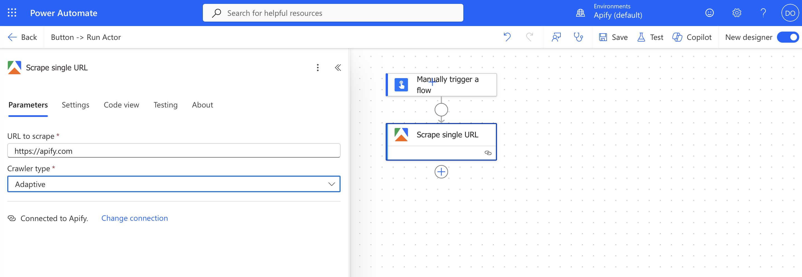

## Long‑running scrapes and async pattern in Power Automate

The **Wait for finish** parameter in "Run Actor" and "Run task" actions has a maximum limit of **60 seconds**. If your Actor run takes longer than this, the action will time out if you try to wait for it synchronously.

For long-running scrapes, use the asynchronous pattern to ensure your flows are reliable:

1. **Start the run**: Use the **Run Actor** or **Run task** action. Set **Wait for finish** to `0` to start the run asynchronously and move to the next step right away.

1. **Wait for completion**:

   - **Option A (Webhook)**: Create a separate flow using the **Actor run finished** or **Task run finished** trigger. This flow will automatically start when the run completes.

     _First, your flow starts the Actor asynchronously using the **Run Actor** action._

     _Next, set up a separate flow using the **Actor run finished** trigger. This trigger will automatically catch the completion event (such as success) and continue your processing steps._

   - **Option B (Polling)**: (Advanced) Implement a loop in your flow to periodically check the run status until it is finished.

1. **Start the Actor or task**: Trigger the run asynchronously by setting `Wait for finish` to `0`.
   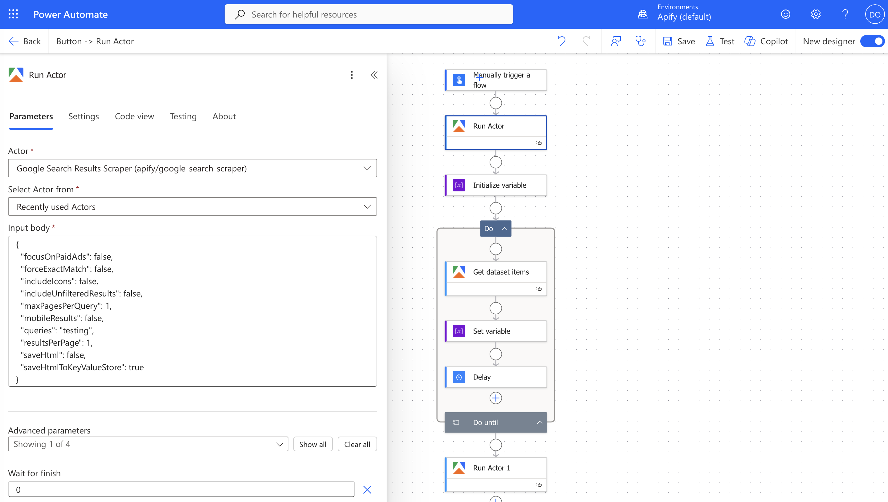
1. **Initialize result variable**: Create a variable to track the run status or store the result (initially empty).
   
1. **Loop until finished**: Add a 'Do until' loop that runs while the variable is empty.
   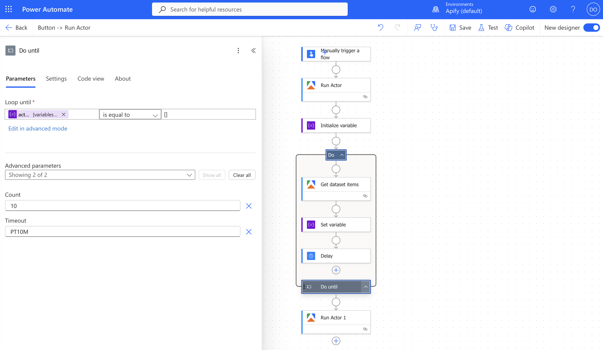
1. **Check run status**: Inside the loop, check if the run has finished or if the dataset is ready.
   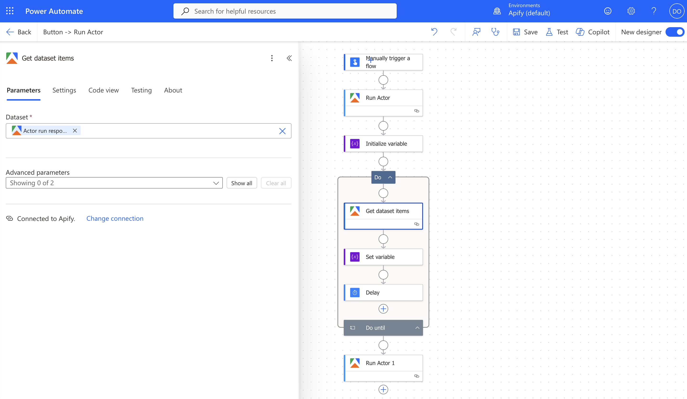
1. **Update variable**: If the run is complete, update the variable to exit the loop.
   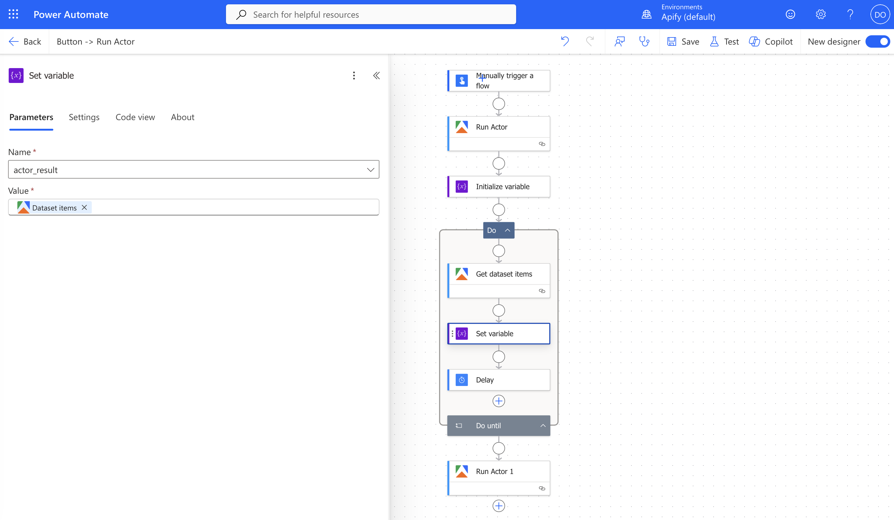
1. **Add delay**: Insert a 'Delay' action to wait a few seconds before the next check.
   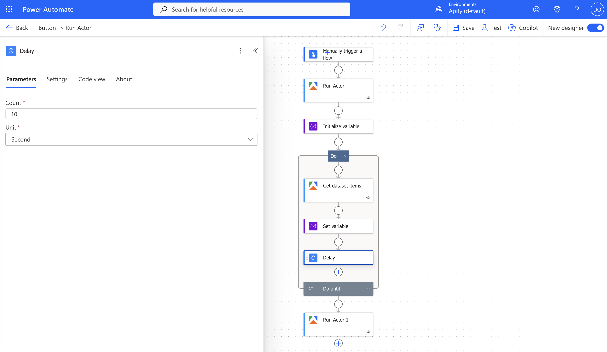
1. **Process results**: Once the loop finishes, use the result variable to proceed with your flow.
   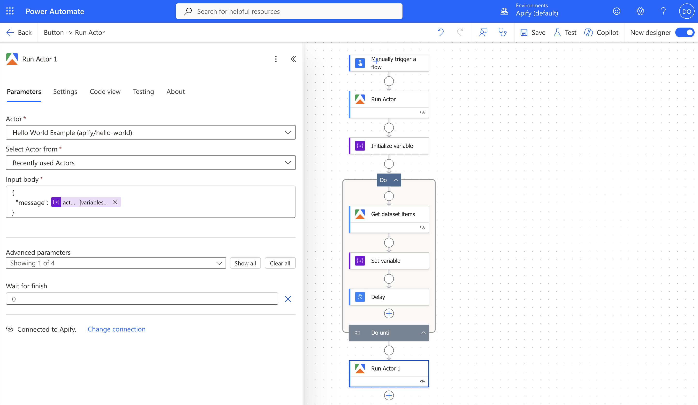

## Example use cases

### Integration ideas

- **Price drop alerts:** Run a price scraper on a schedule, then notify via Teams when prices drop.
- **CRM enrichment:** Scrape company websites and push the data to Dynamics 365 or SharePoint.
- **Competitor tracking:** Detect changes on competitor pages and log them to Excel.
- **Lead generation:** Scrape directories, filter results, and add leads to your CRM.

### Data mapping and workflow design

Power Automate allows you to map data from Apify actions to subsequent steps.

- Use **Get dataset items** output to iterate over scraped results.
- Map fields from the dataset item schema to columns in Excel, SharePoint lists, or database rows.

### Best practices

- **Async Execution:** Always use webhooks (Triggers) for Actors that run longer than a minute.
- **Pagination:** For large datasets, use the `limit` and `offset` parameters in "Get dataset items" to process data in chunks.
- **Memory:** Start with default memory settings and increase only if necessary.

## Troubleshooting

### Common issues

- _Timeout errors:_ If an action fails with a timeout, check if you are waiting for a long-running Actor. Switch to the async pattern (set `Wait for finish` to `0`).
- _Schema issues:_ Dataset schemas are inferred from sample data. If fields are missing in Power Automate dynamic content, you might need to parse the raw JSON output manually. Fields may not appear if they are absent in the initial sample records.
- _Orphaned Webhooks:_ If you delete a flow that used a trigger, remember to delete the corresponding webhook in the Apify Console. Currently, cleanup is not automatic.

## Frequently asked questions

### How much does it cost?

The Apify connector itself is free to use. Apify charges for compute resources (runtime, memory, and proxies) used by your Actors. Apify offers a free tier with monthly credits to get you started. For more details, visit the [pricing page](https://apify.com/pricing).

### Where can I get further help?

- **Apify Documentation:** [docs.apify.com](https://docs.apify.com)
- **API Reference:** [docs.apify.com/api/v2](https://docs.apify.com/api/v2)
- **Support:** [apify.com/contact](https://apify.com/contact)

If you have any questions or need help, feel free to reach out to us on our [Discord channel](https://discord.com/invite/jyEM2PRvMU) or visit the [Apify Community forum](https://community.apify.com).
