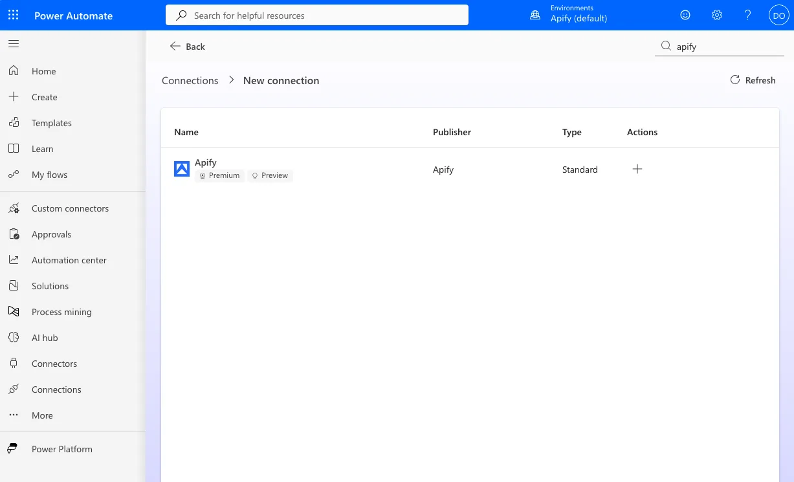
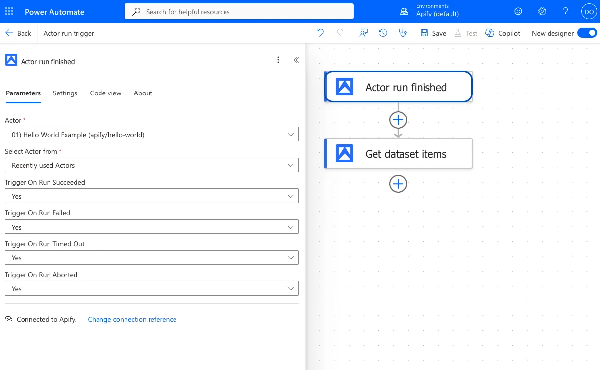
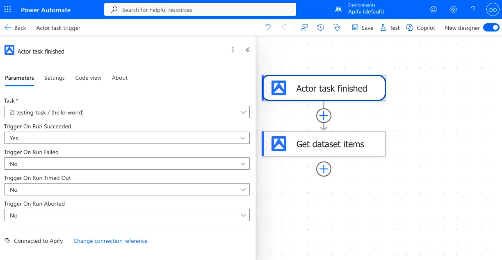
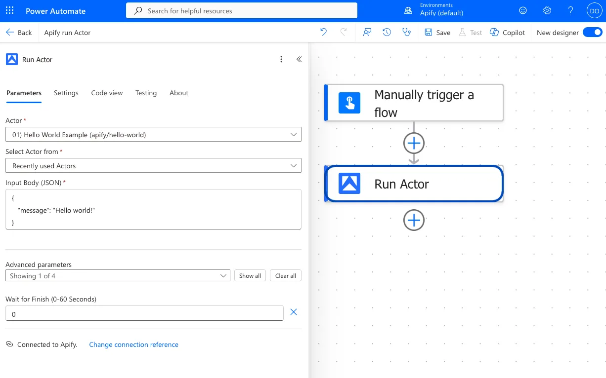
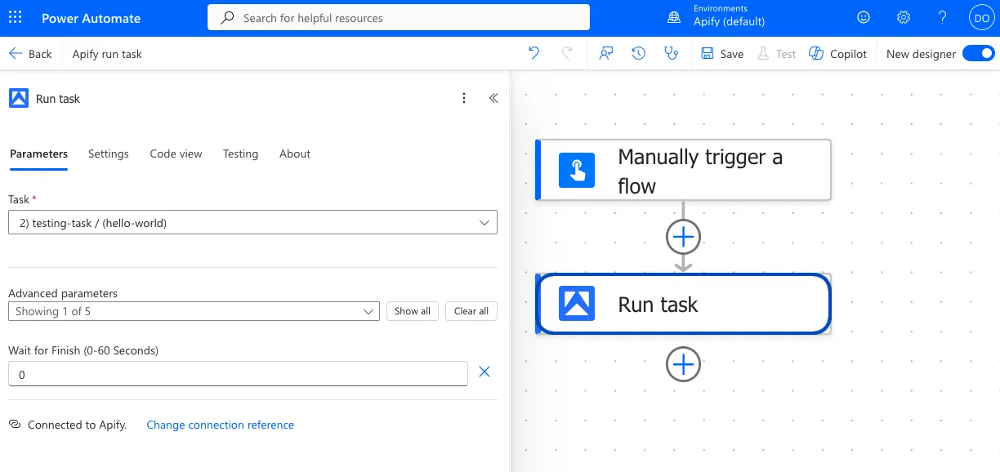
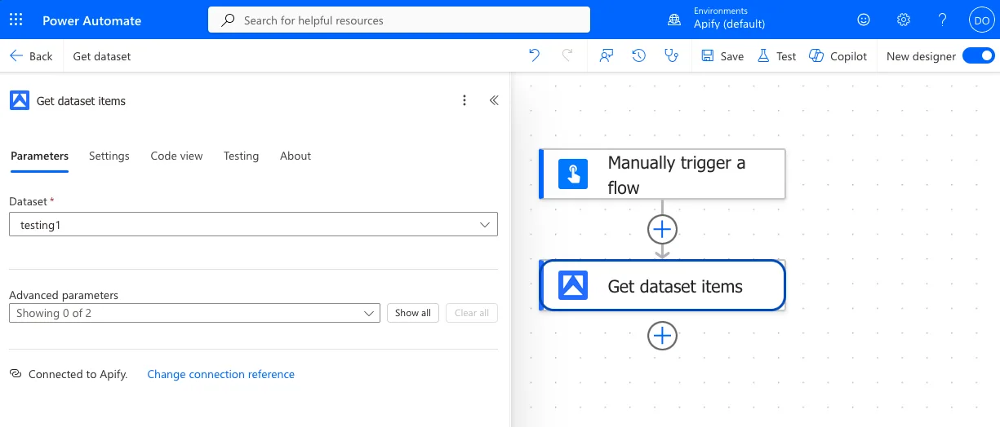
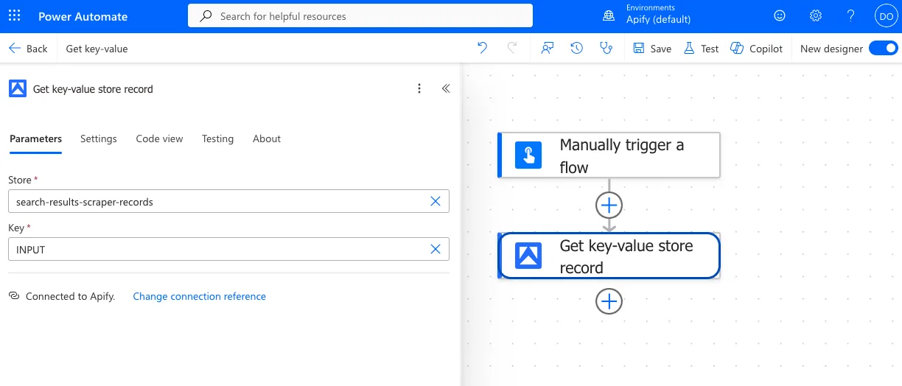
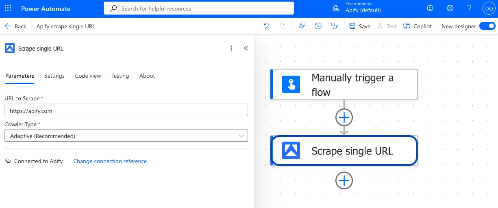
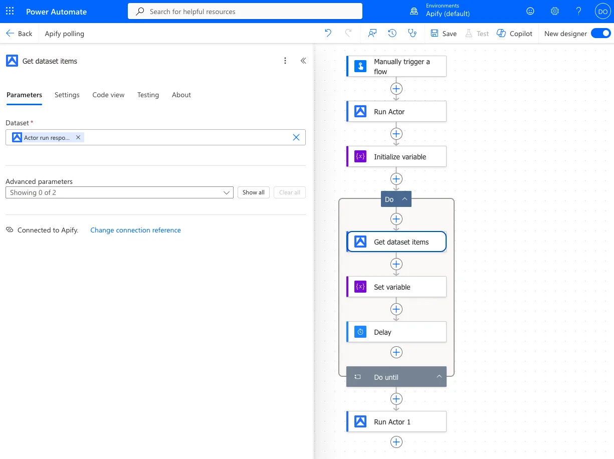

import ThirdPartyDisclaimer from '@site/sources/_partials/_third-party-integration.mdx';

[Microsoft Power Automate](https://powerautomate.microsoft.com/) is an automation platform where you build flows, automated workflows that connect your apps through no-code connectors. The Apify connector lets you run Apify Actors and tasks inside your flows. It can also start a flow when a run finishes and read the scraped results from Apify storage.

<ThirdPartyDisclaimer />

## Prerequisites

To use the Apify integration with Power Automate, you need:

- An [Apify account](https://console.apify.com/)
- A [Power Automate account](https://powerautomate.microsoft.com/) on a plan that includes premium connectors

## Find the Apify connector

The Apify connector is available in the Power Automate connector library, published by Apify.

:::note Premium connector in preview

Power Automate lists the Apify connector as a premium connector, so your plan must include premium connectors. The connector is currently labeled as preview.

:::

1. Sign in to Power Automate.
1. Open the **Connectors** page. If **Connectors** isn't in the navigation menu, select **More**, then **Discover all**, and find **Connectors** under **Data**.
1. Search for **Apify**.
1. Select the **Apify** connector to see the triggers and actions it provides.

## Connect your Apify account

Before you can use the Apify connector in a flow, create a connection that authorizes Power Automate to call the Apify API on your behalf.

Power Automate prompts you to create a connection the first time you add an Apify trigger or action. You can also create one ahead of time from the **Connections** page: select **New connection**, search for **Apify**, and select the Apify connector.

### Authenticate with OAuth 2.0

The Apify connector authenticates with OAuth 2.0. It doesn't accept an API token.

1. Select **Sign in**.
1. Sign in to Apify Console in the window that opens.
1. Authorize the connector. It requests two scopes:
   - `profile` to read your account details.
   - `full_api_access` to run Actors and tasks, read datasets and key-value stores, and manage webhooks.

After you authorize, Power Automate returns to the **Connections** page and the connection shows as **Connected**.

## Create your first flow

A flow starts with a trigger (an event that starts the flow) and continues with one or more actions (operations to perform). You can combine Apify triggers and actions with any other Power Automate connector.

### Select resources and provide input

Most Apify triggers and actions let you pick a resource from a dropdown populated from your Apify account. For the Actor-based operations, **Select Actor from** controls what the **Actor** dropdown lists:

- **Recently used Actors** lists Actors you have run recently.
- **Apify Store Actors** lists Actors from Apify Store.
- **Enter custom value** lets you type an Actor ID or name directly.

Actor and task input is JSON. **Run Actor** takes the full input object in **Input Body (JSON)**. **Run task** takes an optional JSON object that overrides fields in the task's saved input.

:::tip Copy the input JSON from Apify Console

Open the Actor or task **Input** page in Apify Console, switch the format to **JSON**, and copy the content. Replace the placeholder with your own ID:

- `https://console.apify.com/actors/<your-actor-id>/input`
- `https://console.apify.com/actors/tasks/<your-task-id>/input`

:::

#### Where to find resource identifiers

When you use **Enter custom value** instead of a dropdown, you need the resource's identifier. Actors and tasks accept either an ID or a name in `owner/name` form, for example `apify/website-content-crawler`. Type the name directly instead of looking up the ID. Find the other identifiers in Apify Console:

- **Actor**: [Actors](https://console.apify.com/actors) > Actor detail > **API** panel, or the URL `https://console.apify.com/actors/<actorId>`
- **Task**: [Tasks](https://console.apify.com/actors/tasks) > task detail > **API** panel, or the URL `https://console.apify.com/actors/tasks/<taskId>`
- **Dataset**: [Storage > Datasets](https://console.apify.com/storage/datasets) > dataset detail > **API** panel, or the table on the **Datasets** page
- **Key-value store**: [Storage > Key-value stores](https://console.apify.com/storage/key-value-stores) > store detail > **API** panel, or the table on the **Key-value stores** page

## Triggers

A trigger starts your flow when a run finishes in your Apify account. When you save a flow that uses an Apify trigger, the connector creates a [webhook](/platform/integrations/webhooks) on your Apify account.

Both triggers choose which run statuses fire the flow through four separate Yes/No fields: **Trigger On Run Succeeded**, **Trigger On Run Failed**, **Trigger On Run Timed Out**, and **Trigger On Run Aborted**. Set each to **Yes** for the statuses you want.

:::caution Delete unused webhooks

Turning off or deleting a flow doesn't remove the webhook it created on Apify. To stop unused webhooks from accumulating, open the Actor in [Apify Console](https://console.apify.com/), go to its **Integrations** tab, and delete the webhook whose URL points at the flow you removed.

:::

### Actor run finished

Starts the flow when a run of the selected Actor finishes with one of the statuses you enabled.

- **Actor**: the Actor to watch.
- **Select Actor from**: whether the **Actor** dropdown lists recently used Actors, Apify Store Actors, or a value you type.
- **Trigger On Run Succeeded**, **Trigger On Run Failed**, **Trigger On Run Timed Out**, **Trigger On Run Aborted**: the statuses that fire the flow.

The trigger passes the finished run's webhook payload to the next step, including the run ID and the IDs of its default dataset and key-value store.

### Actor task finished

Starts the flow when a run of the selected task finishes with one of the statuses you enabled.

- **Task**: the [task](/platform/actors/running/tasks) to watch.
- **Trigger On Run Succeeded**, **Trigger On Run Failed**, **Trigger On Run Timed Out**, **Trigger On Run Aborted**: the statuses that fire the flow.

Use this trigger for scheduled or recurring jobs, where the input is already saved in the task.

## Actions

The Apify connector provides the following actions.

### Run Actor

Starts a run of the selected Actor.

- **Actor**: the Actor to run.
- **Select Actor from**: whether the **Actor** dropdown lists recently used Actors, Apify Store Actors, or a value you type.
- **Input Body (JSON)**: the Actor's input as a JSON object.
- **Advanced parameters**: select **Show all** to reveal the run options.
  - **Wait for Finish**: seconds to wait for the run to finish, up to 60. Set it to `0` to start the run and continue immediately.
  - **Build**: a build tag or ID. Defaults to the Actor's `latest` build.
  - **Timeout**: the run timeout in seconds.
  - **Memory**: the memory allocated to the run, in MB.

### Run task

Starts a run of the selected task, optionally overriding its saved input.

- **Task**: the task to run.
- **Advanced parameters**: select **Show all** to reveal the input override and run options.
  - **Input Body (JSON)**: a JSON object that overrides fields in the task's saved input. Leave it empty to run the task as saved.
  - **Wait for Finish**: seconds to wait for the run to finish, up to 60. Set it to `0` to start the run and continue immediately.
  - **Build**: a build tag or ID.
  - **Timeout**: the run timeout in seconds.
  - **Memory**: the memory allocated to the run, in MB.

### Get dataset items

Retrieves items from a dataset.

- **Dataset**: the dataset to read.
- **Advanced parameters**: select **Show all** to reveal pagination.
  - **Limit**: the maximum number of items to return.
  - **Offset**: the number of items to skip.

The action returns an array of items. The connector samples the dataset to infer a schema, so the item fields appear as dynamic content in later steps.

### Get key-value store record

Retrieves a single record from a key-value store.

- **Store**: the key-value store to read.
- **Key**: the record's key. The dropdown lists the keys in the selected store.

The action returns the record's content along with its `Content-Type`, so it handles both text records and binary ones such as screenshots.

### Scrape single URL

Scrapes one page with the [Website Content Crawler](https://apify.com/apify/website-content-crawler) Actor, without you assembling the Actor input yourself.

- **URL to Scrape**: the full URL of the page.
- **Crawler Type**: the crawling engine.
  - **Adaptive (Recommended)** switches between a browser and raw HTTP.
  - **Firefox** renders JavaScript in a headless browser. Slower, but the most reliable on protected sites.
  - **Cheerio** uses a raw HTTP client. Fastest, but it doesn't run JavaScript.

:::note Results arrive asynchronously

This action starts the Actor and returns the run details right away, not the scraped page. To use the content, either react to the run in a second flow with the **Actor run finished** trigger, or poll for it as described in [Handle long-running scrapes](#handle-long-running-scrapes).

:::

## Handle long-running scrapes

**Wait for Finish** accepts at most 60 seconds, so a longer run won't have finished when the action returns. Start such runs asynchronously and collect the results separately: set **Wait for Finish** to `0` in **Run Actor** or **Run task**, then use one of the two patterns below.

### React to the finished run in a second flow

Build a second flow that starts with the **Actor run finished** or **Actor task finished** trigger, and add **Get dataset items** to it. Apify calls that flow when the run finishes, so nothing waits or polls. Prefer this pattern.

### Poll for the result in one flow

This keeps everything in a single flow, at the cost of more steps:

1. Add **Run Actor** and set **Wait for Finish** to `0`.
1. Add **Initialize variable** to hold the result, and leave it empty.
1. Add a **Do until** loop that runs while the variable is empty.
1. Inside the loop, add **Get dataset items** to check whether the results are ready.
1. Add **Set variable** to store the result, which ends the loop.
1. Add **Delay** so the loop waits a few seconds between checks.
1. After the loop, use the variable in the rest of the flow.

## Example use cases

- Run a price scraper on a schedule and post to Microsoft Teams when a price drops.
- Scrape company websites and write the results to a SharePoint list or to Dynamics 365.
- Watch competitor pages for changes and log them to Excel.
- Scrape a directory, filter the results, and create leads in your CRM.

## Tips and best practices

- Use a trigger rather than **Wait for Finish** for any Actor that runs longer than a minute.
- Map dataset item fields to Excel columns, SharePoint list fields, or database rows through Power Automate's dynamic content.
- Read large datasets in chunks with **Limit** and **Offset** instead of loading everything in one step.
- Start with the Actor's default memory and raise it only if the run needs it.
- Save a task for a scraping job you run repeatedly, then use **Run task** so the input lives in one place.

## Troubleshooting

If a flow doesn't behave as expected, check the following.

### The action times out waiting for a run

**Wait for Finish** caps at 60 seconds. Set it to `0` and collect the results with a trigger or a polling loop, as described in [Handle long-running scrapes](#handle-long-running-scrapes).

### An Actor or task is missing from the dropdown

**Recently used Actors** only lists Actors you have already run. Run the Actor once in Apify Console, or select **Enter custom value** and type the Actor's `owner/name`.

### Dataset fields are missing from dynamic content

The connector infers the dataset's schema from a sample of its items, so a field absent from the sampled items won't appear. Parse the raw JSON output instead, or make the Actor's output consistent across items.

### Apify still calls a flow you deleted

Deleting a flow doesn't delete the webhook it created. Open the Actor's **Integrations** tab in Apify Console and delete the webhook.

## Resources

- [Power Automate documentation](https://learn.microsoft.com/en-us/power-automate/)
- [Apify webhooks](/platform/integrations/webhooks)
- [Actor runs and builds](/platform/actors/running/runs-and-builds)
- [Actor tasks](/platform/actors/running/tasks)
- [Dataset](/platform/storage/dataset)

For questions or help, join the [Apify developer community on Discord](https://discord.com/invite/jyEM2PRvMU).
