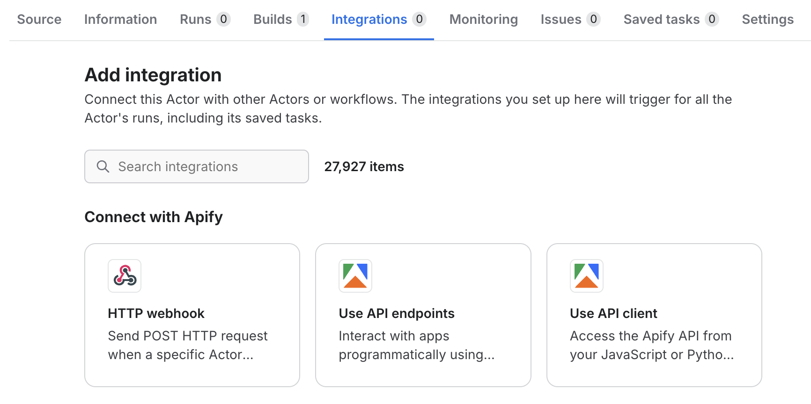
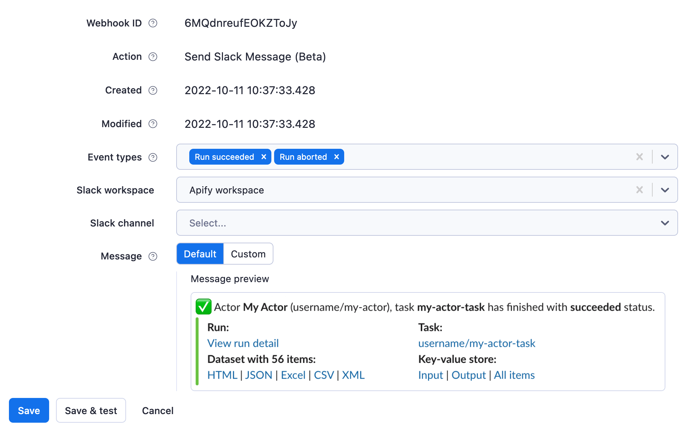
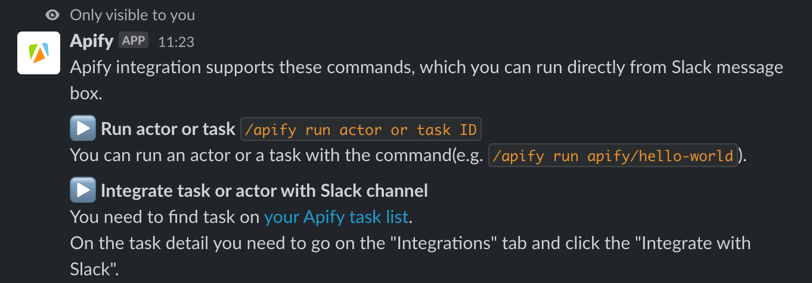

Run Apify Actors, get notified about run status, and receive scraped results straight in [Slack](https://slack.com/) - without leaving the app or opening a browser.

For a step-by-step walkthrough, see the [Apify integration for Slack tutorial](https://help.apify.com/en/articles/6454058-apify-integration-for-slack).

## Get started

To use the Apify integration for Slack, you need:

- An [Apify account](https://console.apify.com/).
- A Slack account (and workspace).

## Step 1: Set up the integration for Slack

You can find all integrations on an Actor's or task's **Integrations** tab. For example, you can try using [Google Shopping Scraper](https://console.apify.com/actors/aLTexEuCetoJNL9bL).

Find the integration for Slack, then click the **Configure** button. Log in with your Slack account when prompted, then select your workspace in the **Settings > API & Integrations** window.



Head back to your task to finish the setup. Select the events you want to receive notifications for (run created, run succeeded, run failed, and so on), your workspace, and the channel for the notifications. You can use an ad-hoc channel to test. In the **Message** field, preview the default notification or craft a custom one. See [Custom message format](#custom-message-format) for the template syntax and the full list of available variables.



Click the **Save** button.

## Step 2: Give the Apify integration a trial run

Click the **Start** button and head to the Slack channel you selected to see your first Apify integration notifications.

## Step 3: Start your run directly from Slack

You can now run the same Actor or task directly from Slack by typing `/apify call [Actor or task ID]` into the Slack message box.



When an Actor doesn't require you to fill in any input fields, you can run it by typing `/apify call [Actor or task ID]`.

You're all set! If you have questions or need help, reach out on the [Apify Discord channel](https://discord.com/invite/jyEM2PRvMU).

## Custom message format

The **Message** field on the Slack integration setup screen accepts a [Handlebars](https://handlebarsjs.com/) template. When the integration fires, Apify renders the template with data from the triggering event and posts the result to the configured channel.

The Slack integration uses Handlebars, so all built-in helpers (`{{#if}}`, `{{#each}}`, `{{#unless}}`, and so on) work in your template. [Webhook actions](/platform/integrations/webhooks/actions) use a separate JSON payload template engine; don't mix the two.

A few rules apply to every template:

- The template must be between 2 and 4000 characters long.
- The text supports [Slack's mrkdwn syntax](https://api.slack.com/reference/surfaces/formatting), which uses single-asterisk bold (`*bold*`) and `<url|label>` for links rather than the standard Markdown `[label](url)`.
- Apify automatically appends a "Sent by Apify" attribution line that links to apify.com, so you don't need to add one yourself.
- `TEST` events ignore the template and post a fixed test message. Use them to verify channel delivery.
- An empty template falls back to Apify's built-in run-status preset.

## Template variables

The following variables are available in every template. Reference nested fields with dot notation (for example, `{{resource.id}}`).

| Variable      | Type     | Description                                                                                                                |
|---------------|----------|----------------------------------------------------------------------------------------------------------------------------|
| `userId`      | string   | ID of the Apify user who owns the integration.                                                                             |
| `eventType`   | string   | Type of the trigger event. See [Webhook events](/platform/integrations/webhooks/events) for the full list.                 |
| `createdAt`   | string   | ISO 8601 timestamp of when the event was dispatched.                                                                       |
| `eventData`   | object   | Identifiers of the entities involved in the event.                                                                         |
| `resource`    | object   | Full snapshot of the triggering resource (an Actor run or an Actor build).                                                 |

### Event data

The `eventData` object identifies the entities involved in the trigger event.

| Path                       | Type            | When present                              |
|----------------------------|-----------------|-------------------------------------------|
| `eventData.actorId`        | string          | Always.                                   |
| `eventData.actorTaskId`    | string \| null  | When the run was started from a task.     |
| `eventData.actorRunId`     | string          | On `ACTOR.RUN.*` events.                  |
| `eventData.actorBuildId`   | string          | On `ACTOR.BUILD.*` events.                |

### Resource (Actor run)

For `ACTOR.RUN.*` events, `resource` is the run document - the same object returned by the [Get run](/api/v2/actor-run-get) API endpoint. Frequently used fields include:

| Path                                | Type            | Description                                                                       |
|-------------------------------------|-----------------|-----------------------------------------------------------------------------------|
| `resource.id`                       | string          | Run ID.                                                                           |
| `resource.actId`                    | string          | ID of the Actor that produced the run.                                            |
| `resource.actorTaskId`              | string \| null  | Source task, if the run was started from a task.                                  |
| `resource.userId`                   | string          | Owner of the run.                                                                 |
| `resource.status`                   | string          | Current status of the run. See [Status values](#status-values).                   |
| `resource.statusMessage`            | string          | Most recent status message reported by the run.                                   |
| `resource.startedAt`                | string          | ISO 8601 timestamp of when the run started.                                       |
| `resource.finishedAt`               | string \| null  | ISO 8601 timestamp of when the run finished, or `null` while still running.       |
| `resource.exitCode`                 | number          | Container exit code.                                                              |
| `resource.buildId`                  | string          | ID of the Actor build the run executed.                                           |
| `resource.buildNumber`              | string          | Semver build number.                                                              |
| `resource.defaultDatasetId`         | string          | Default dataset attached to the run.                                              |
| `resource.defaultKeyValueStoreId`   | string          | Default key-value store attached to the run.                                      |
| `resource.defaultRequestQueueId`    | string          | Default request queue attached to the run.                                        |
| `resource.options.memoryMbytes`     | number          | Memory allocated to the run, in megabytes.                                        |
| `resource.options.timeoutSecs`      | number          | Configured timeout, in seconds.                                                   |
| `resource.stats.runTimeSecs`        | number          | Total runtime, in seconds.                                                        |
| `resource.stats.computeUnits`       | number          | Compute units consumed by the run.                                                |
| `resource.meta.origin`              | string          | What triggered the run, such as `API`, `WEB`, or `SCHEDULER`.                     |

### Resource (Actor build)

For `ACTOR.BUILD.*` events, `resource` is the build document - the same object returned by the [Get build](/api/v2/actor-build-get) API endpoint. Frequently used fields include:

| Path                       | Type           | Description                                                                                  |
|----------------------------|----------------|----------------------------------------------------------------------------------------------|
| `resource.id`              | string         | Build ID.                                                                                    |
| `resource.actId`           | string         | ID of the Actor being built.                                                                 |
| `resource.status`          | string         | Current status of the build. See [Status values](#status-values).                            |
| `resource.startedAt`       | string         | ISO 8601 timestamp of when the build started.                                                |
| `resource.finishedAt`      | string \| null | ISO 8601 timestamp of when the build finished, or `null` while still running.                |
| `resource.buildNumber`     | string         | Semver number assigned to the build.                                                         |
| `resource.usageTotalUsd`   | number         | Build cost in USD.                                                                           |
| `resource.meta.origin`     | string         | What triggered the build.                                                                    |

### Status values

The `resource.status` field uses these values:

- Actor run: `READY`, `RUNNING`, `SUCCEEDED`, `FAILED`, `ABORTED`, `TIMED-OUT`, `ABORTING`.
- Actor build: `READY`, `RUNNING`, `SUCCEEDED`, `FAILED`, `ABORTED`, `TIMED-OUT`.

:::tip Full resource object

`resource` contains every field returned by the corresponding API endpoint, not just the fields listed above. Inspect a sample run or build with the API to discover additional values you can reference.

:::

## Message template examples

### Minimal run status notification

```handlebars
:rocket: Run *{{resource.id}}* of Actor `{{eventData.actorId}}` finished with status `{{resource.status}}`.
```

### Run summary with Apify Console links

```handlebars
*{{eventType}}*

• Actor: <https://console.apify.com/actors/{{eventData.actorId}}|{{eventData.actorId}}>
• Run: <https://console.apify.com/actors/runs/{{resource.id}}|{{resource.id}}>
• Status: `{{resource.status}}`
• Started: {{resource.startedAt}}
• Finished: {{resource.finishedAt}}
• Compute units: {{resource.stats.computeUnits}}
• Dataset: <https://console.apify.com/storage/datasets/{{resource.defaultDatasetId}}|open>
• Key-value store: <https://console.apify.com/storage/key-value-stores/{{resource.defaultKeyValueStoreId}}|open>
```

### Failure alert with conditional copy

```handlebars
:rotating_light: *Run failed*
Actor `{{eventData.actorId}}`{{#if eventData.actorTaskId}} (task `{{eventData.actorTaskId}}`){{/if}}
Run: <https://console.apify.com/actors/runs/{{resource.id}}|{{resource.id}}>
Status: `{{resource.status}}`
{{#if resource.statusMessage}}Reason: {{resource.statusMessage}}{{/if}}
Triggered at: {{createdAt}}
```

### Build notification

```handlebars
:hammer_and_wrench: Build *{{resource.buildNumber}}* of Actor `{{eventData.actorId}}` ended with `{{resource.status}}`.
Build ID: `{{eventData.actorBuildId}}`
```

:::tip Debug your template

Send a test event from the integration setup screen to verify the channel and workspace are wired correctly, then iterate on the template against a real run or build event.

:::
