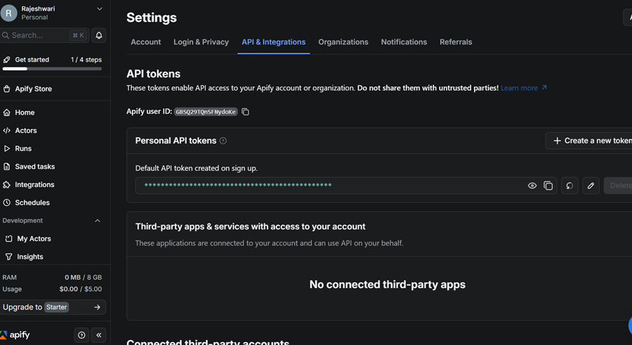
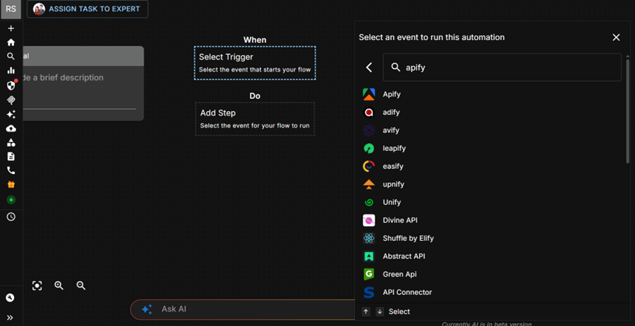
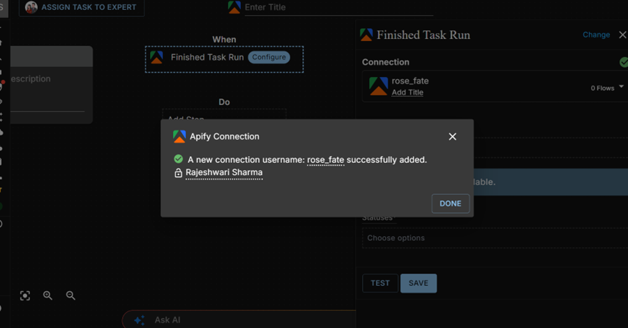
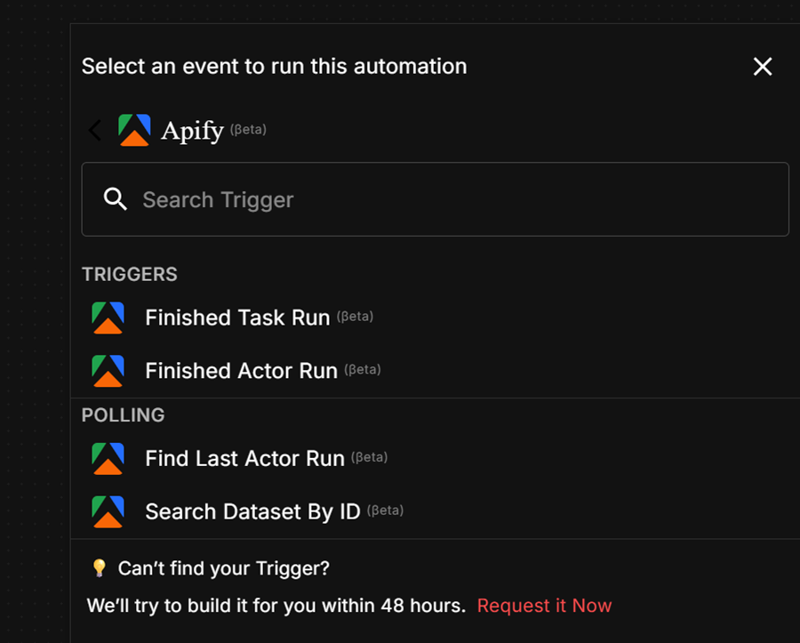
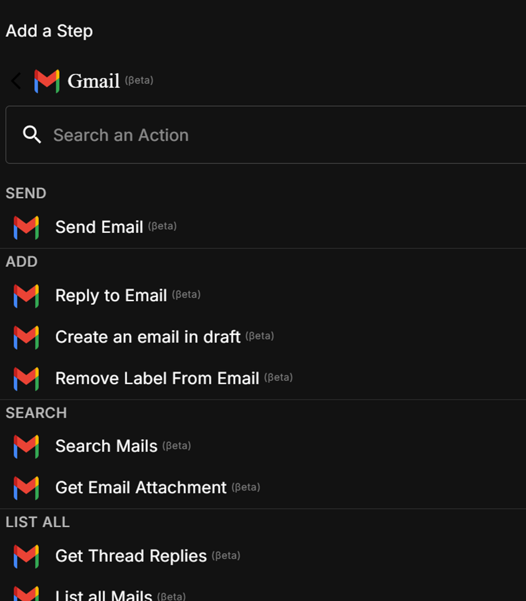
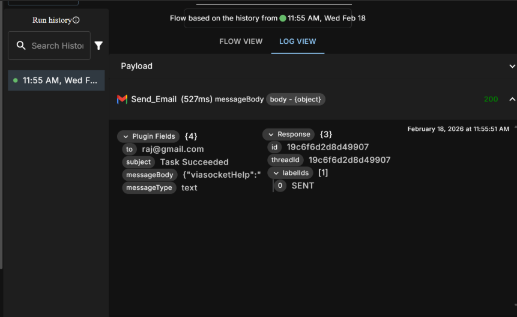

**Learn how to connect Apify with viaSocket, configure triggers, authenticate using API tokens, and create automation flows.**

---

[viaSocket](https://viasocket.com/) is a workflow automation platform that lets you connect apps and automate tasks without writing code. With the Apify integration, you can trigger Actor runs, retrieve results, and build end-to-end automation pipelines that react to events across your connected apps.

## Step 1: Generate an Apify API token

1. Log in to your [Apify account](https://console.apify.com/).
1. Go to **Settings > API & Integrations > API Tokens**.
1. Copy your personal API token.

:::caution Keep your token secure
Never share your API token publicly or commit it to version control.
:::

## Step 2: Create a new flow in viaSocket

1. Log in to your [viaSocket account](https://viasocket.com/) and click **Create New Flow**.
1. In the **Trigger** section, search for and select **Apify**.
1. Choose **Finished Task Run** or **Finished Actor Run** as the trigger event.

## Step 3: Connect your Apify account

1. Click **Connect to Apify**.
1. Paste your Apify API token into the connection dialog.
1. Click **Save** to establish the connection.
1. Confirm the connection is successfully added before continuing.

## Step 4: Configure the trigger

1. Provide the Actor or task ID manually or map it dynamically from a previous step.
1. Set **Status** to `Succeeded`.
1. Click **Test** to fetch sample data and verify the trigger works.
1. Save the trigger configuration.

## Step 5: Add an action

You can add any supported app as the next step in your flow. The example below uses Gmail to send an email when the trigger fires.

1. Click **Add Step**.
1. Select **Gmail** and choose the **Send Email** action.
1. Connect or select your Gmail account.
1. Map the following fields:
    - **To** - recipient email address
    - **Subject** - email subject line
    - **Message Body** - use the trigger `body` object as dynamic input
1. Click **Test** to run the action and confirm a `200` response status.

## Step 6: Go live and monitor

1. Click **Go Live** and confirm activation.
1. Use **Flow View** to inspect the flow structure and **Log View** to monitor individual executions.
1. Re-run a specific execution from **Run History** if needed.

If you have any questions or need help, feel free to reach out on the [Apify Discord community](https://discord.com/invite/jyEM2PRvMU).
