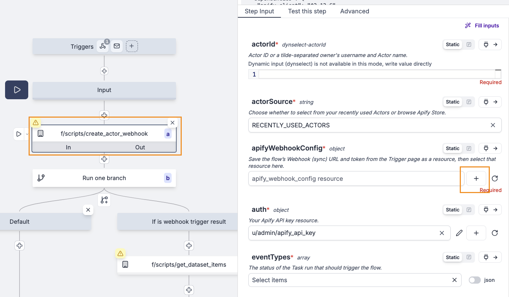

**Use Windmill to run Apify Actors and Tasks, react to Apify events via webhooks or polling, and move data between Apify and other services with Windmill scripts and flows.**

---

[Windmill](https://www.windmill.dev/) is an open-source automation platform for building scripts and flows that connect your tools and data. With the Apify integration for Windmill, you can run Actors and Tasks, scrape websites, extract data from storage, and trigger workflows based on Apify events.

This guide shows you how to install the Apify package, set up authentication, and create automated workflows that integrate with Apify.

## Prerequisites

Before you begin, make sure you have:

-   An [Apify account](https://console.apify.com/)
-   A [Windmill instance](https://www.windmill.dev/docs/getting_started/how_to_use_windmill) (self-hosted or cloud)

## Install the Apify integration

The Apify integration provides scripts, flows, and resources that will be available through the Windmill Hub.

<!-- SCREENSHOT: Windmill Hub showing available integrations including Apify alongside with other integrations -->

### Step 1: Import Apify scripts from Windmill Hub

You can import Apify integration scripts into your flows from the Windmill Hub, regardless of whether you're using Windmill Cloud or a self-hosted instance. The following components will be available:

**Scripts (Actions):**

-   Run Actor
-   Run Task
-   Scrape Single URL
-   Get Dataset Items
-   Get Key-Value Store

**Scripts (Triggers):**

-   Polling-based Actor Run Trigger
-   Polling-based Task Trigger

**Flows (Triggers):**

-   Webhook-based Actor Trigger
-   Webhook-based Task Trigger

**Resources:**

-   Apify Auth Resource (for storing your API token)
-   Webhook Config Resource (optional, for managing webhook-based triggers)

<!-- SCREENSHOT: Windmill Hub showing available integrations including Apify -->
<!-- SCREENSHOT: Importing Apify scripts from Windmill Hub -->

### Step 2: Authentication

You can provide the token to scripts via a **Windmill Resource**. Create it either in the **Resources** tab or directly from a script.

#### Option A — Create in the Resources tab

1. Open **Resources** → **New Resource**.
2. Select `apify_api_key` resource type.
3. Name it (e.g., `apify_token`) and paste your Apify API token.
4. Save, then reference this resource in your scripts/flows.

#### Option B — Create/bind from a script

1. Open the script in Windmill UI.
2. Add a secret input parameter (e.g., `apify_token`) .
3. Bind it to the resource you created (or create a new one inline).
4. Use the bound token inside the script to call Apify.

## Create your first workflow

Let's create a simple workflow that runs an Actor and fetches its results.

### Step 1: Create a new flow

1. In the Windmill UI, click **New Flow**.
2. Give your flow a descriptive name (e.g., "Run Actor and Get Results").

### Step 2: Add the Run Actor script

1. Click **Add Step** and search for "Run Actor".
2. Select the **Run Actor** script.
3. Configure the inputs:
    - **Apify Auth**: Select your `apify_token` resource
    - **Actor ID or Slug**: Enter the Actor you want to run
    - **Input**: JSON input for the Actor (optional)
    - **Wait for Finish**: Set to `true` to wait for completion
    - **Memory**: Memory allocation in MB (optional)
    - **Timeout**: Timeout in seconds (optional)

### Step 3: Add the Get Dataset Items script

1. Add another step and search for "Get Dataset Items".
2. Configure the inputs:
    - **Apify Auth**: Select your `apify_token` resource
    - **Dataset ID**: Use the `defaultDatasetId` from the previous step
    - **Limit**: Number of items to retrieve (optional)

### Step 4: Test and run

With the flow crated and scripts linked we can test and run it.

1. Click **Test** to run the flow with sample data.
2. Review the results and ensure both steps completed successfully.
3. Save and activate your flow.

<!-- SCREENSHOT: Flow execution results showing successful completion -->

## Use webhooks to trigger workflows

Windmill provides webhook-based triggers that can automatically start workflows when Apify events occur.

### Step 1: Fork the example flow

1. Fork the **Apify example flow with webhook trigger** from Windmill’s templates.
   
2. In the forked flow, add a trigger of type **Webhook**.
3. Create a **Webhook-specific Token**.
4. Copy both the **token** and the **webhook URL** to your clipboard.
   

<!-- SCREENSHOT: Webhook trigger configuration -->
<!-- SCREENSHOT: Webhook URL and token display -->

### Step 2: Configure the webhook creation script

1. In the flow, open the script that creates the Apify webhook.
2. Set the **Apify Auth resource** (`apify_token`).
3. Create a new **webhook config resource** with:

    - **Actor ID**: the Apify Actor you want to monitor
    - **Event Types**: the events that should trigger the flow
    - Other required values

    

4. **IMPORTANT**: Test-run this script to **create the webhook in Apify** for the Actor.

    

<!-- SCREENSHOT: Apify webhook creation script configuration -->

### Step 3: Adjust the flow logic

1. Replace the default logic in the flow with your desired actions:
    - Example: persist results into a Google Sheet.
2. If needed, use the provided **helper script** to “mold” the webhook payload into the correct shape for the Google Sheets operation.

    

<!-- SCREENSHOT: Flow logic customization -->
<!-- SCREENSHOT: Payload molding helper -->

### Step 4: Test the flow

1. Deploy the flow so it can be triggered by the webhook.
2. Run the Actor in Apify that the webhook is registered for.
3. Check the **flow runs** in Windmill to verify that the test run was registered and the logic executed.

<!-- SCREENSHOT: Flow execution triggered by webhook -->
<!-- SCREENSHOT: Execution logs showing webhook payload -->

### Deleting the webhook

1. Fork the **Apify's Delete Webhook** script from the Windmill Hub.
2. Set the **Apify Auth resource** (`apify_token`).
3. Set the **Webhook Config Resource** to the webhook you want to delete.
4. Run the script to **delete the webhook in Apify**.

<!-- SCREENSHOT: Apify webhook deletion script configuration -->

## Available operations

The Apify integration provides several operations you can use in your Windmill workflows.

### Actions (Scripts)

**Run Actor**

-   Starts an Actor with optional input and configuration
-   Can wait for completion or run asynchronously
-   Returns run metadata including dataset ID

**Run Task**

-   Executes a predefined Actor task
-   Similar to Run Actor but uses task configuration
-   Ideal for recurring operations

**Scrape Single URL**

-   Runs a lightweight scraper for a single webpage
-   Returns content as text, markdown, and HTML
-   Perfect for quick content extraction

**Get Dataset Items**

-   Retrieves items from a dataset
-   Can filter by dataset ID or last run
-   Supports pagination and item limits

**Get Key-Value Store**

-   Reads values from key-value stores
-   Can retrieve specific keys or list all keys
-   Useful for configuration and state management

### Triggers

**Webhook-based Triggers**

-   **Actor Webhook Trigger**: Responds to Actor run events
-   **Task Webhook Trigger**: Responds to task run events
-   Real-time event processing with full payload data

**Polling-based Triggers**

-   **Actor Run Polling Trigger**: Periodically checks for new Actor runs
-   **Task Run Polling Trigger**: Periodically checks for new task runs
-   Fallback option when webhooks aren't available

## Resources

-   [Windmill Documentation](https://www.windmill.dev/docs)
-   [Windmill Local Development](https://www.windmill.dev/docs/advanced/local_development)
-   [Apify API Documentation](https://docs.apify.com)
-   [Apify Webhooks](https://docs.apify.com/webhooks)
-   [Apify Actors & Tasks](https://docs.apify.com/actors)
