**Connect Apify Actors to Workato recipes to run web scraping and automation jobs, monitor run events, and process results.**

---

[Workato](https://www.workato.com/) is an automation platform where you can build recipes, automated workflows that connect your apps with no-code connectors. With the [Apify Connector](https://apify.com), you can run _Apify Actors_ inside your recipes to launch web scraping and automation jobs, watch for run events, and further work with the results.

## Get started

To use the Apify integration with Workato, you will need:

- An [Apify account](https://console.apify.com/)
- A [Workato account](https://www.workato.com/)

## Install the Apify Connector

The Apify Workato Connector is available in the Workato Community library. Here's how to install it:

1. In your Workato workspace, navigate to **Community library**.
1. Click on **Custom connectors**.
1. Search for **Apify**.
1. Click on the connector and then click **Install**.

After installation, the Apify connector appears in **Connector SDK** under the **Tools** tab. After you release the connector, you can use it in your projects.

## Connect your Apify account

Before using the Apify connector in recipes, create a connection inside a Workato project.

### Create a project (if you don't have one)

1. In Workato, go to **Workspace > Projects**.
1. Click **Create project**.
1. Choose either **Start from scratch** or **Build a workflow app**.
1. Name and create the project.

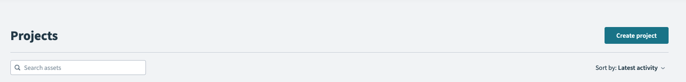

### Create a connection in your project

1. Open your project.
1. Click the **Create** button.
1. Select **Connection**.
1. Search for **Apify** and choose the Apify connector.
   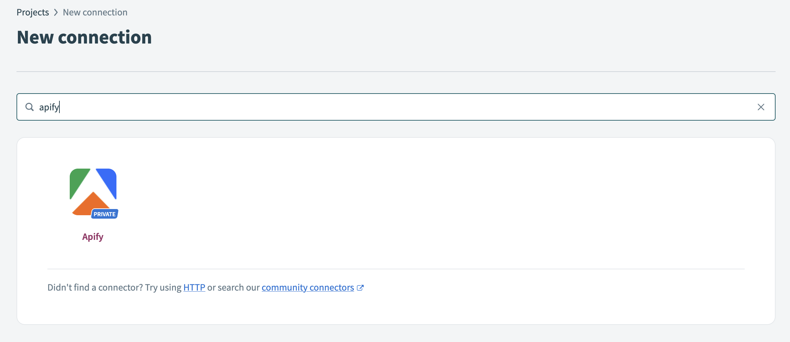
   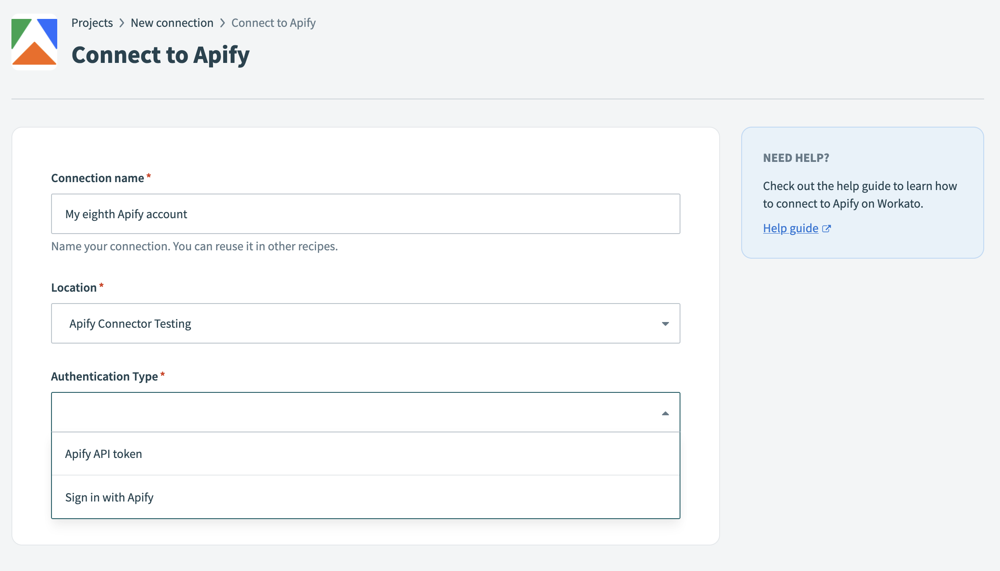
1. In the connection dialog, enter your **API Token**. In Apify Console, go to [**Settings > Integrations**](https://console.apify.com/account#/integrations) and copy your API token.
1. Click **Connect**. Workato tests the connection by making an authenticated call to verify your credentials.
   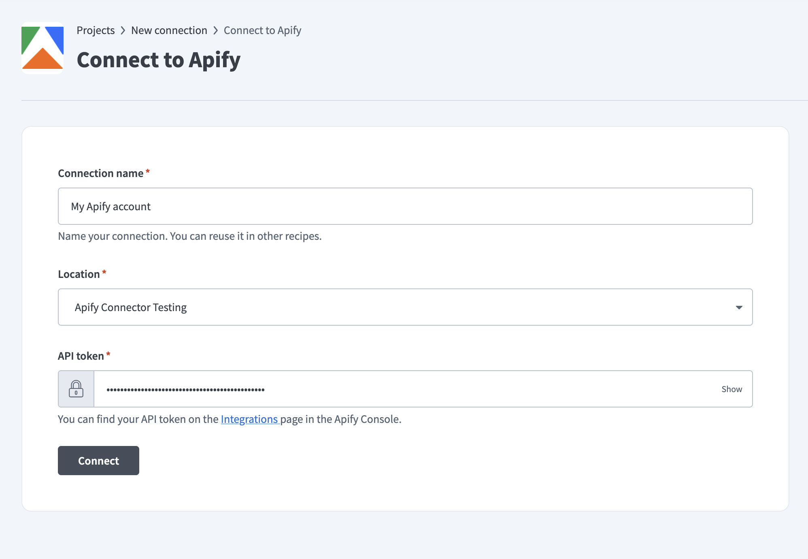
   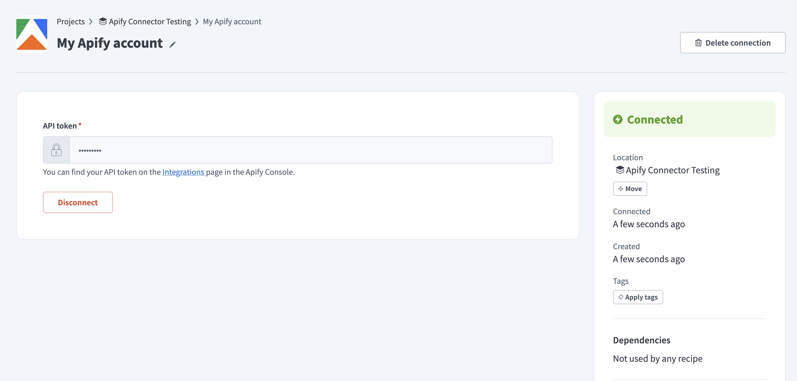

Once the connection is created and authenticated, you can use it in any recipe.

## Create your first recipe

After connecting your Apify account, you can start creating recipes that use Apify triggers and actions. A recipe begins with a trigger (an event that starts the workflow) and includes one or more actions (operations to perform).

### Selection and input methods

_The Apify connector provides dynamic dropdown lists (pick lists) and flexible input methods to make configuration easier._

### Pick lists and selection methods

- **Selection method (pick list vs. manual ID):** Choose from fetched lists or switch to manual and paste an ID. If an item doesn't appear, make sure it exists in your account and has been used at least once, or paste its ID manually.
- Available pick lists:
  - **Actors**: Lists your recently used Actors or Apify Store Actors, displaying the title and `owner/name`
  - **Tasks**: Lists your saved tasks, displaying the task title and Actor name
  - **Datasets**: Lists available datasets, sorted by most recent first
  - **Key-value stores**: Lists available stores, sorted by most recent first
  - **Store Keys**: Dynamically shows keys available in the selected store

### Input types

- **Input type (schema-based vs. JSON):** For Actor inputs, when you choose an Actor from the pick list, the connector fetches the input schema and renders dynamic fields based on the Actor's configuration. If schema fetching fails or you switch to manual input, a JSON input field appears where you can paste valid JSON instead. For task inputs, you can optionally provide an override input as JSON to modify the task's pre-configured settings.

:::tip Copy input JSON

Open the Actor or task input page in Apify Console, switch format to JSON, and copy the canonical structure:
`https://console.apify.com/actors/<actor_id>/input`
`https://console.apify.com/actors/tasks/<task_id>/input`

:::

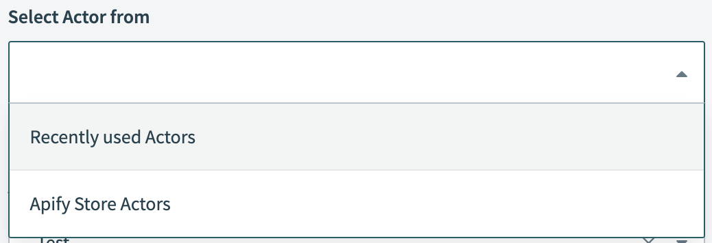

#### Where to find your IDs

When using manual input instead of pick lists, you'll need to provide the correct resource IDs. Here's how to find them in Apify Console:

- **Actor ID**: [Actor detail page](https://console.apify.com/actors) > API panel or URL.
  - Example URL: `https://console.apify.com/actors/<actorId>`
  - Actor name format: `apify/web-scraper` (slash) or `apify~web-scraper` (tilde). The connector accepts both formats and normalizes internally.
- **Task ID**: [Task detail page](https://console.apify.com/actors/tasks) > API panel or URL.
  - Example URL: `https://console.apify.com/actors/tasks/<taskId>`
- **Dataset ID**: [Storage > Datasets](https://console.apify.com/storage/datasets) > dataset detail > API panel or URL.
  - Example URL: `https://console.apify.com/storage/datasets/<datasetId>`
  - Also available in the table on the `Storage > Datasets` page
- **Key-value store ID**: [Storage > Key-value stores](https://console.apify.com/storage/Key-value-stores) > Store detail > API panel or URL.
  - Example URL: `https://console.apify.com/storage/Key-value-stores/<storeId>`
  - Also available in the table on the `Storage > Key-value stores` page
- **Webhook ID**: [Actors](https://console.apify.com/actors) > Actor > Integrations.
  - Example URL: `https://console.apify.com/actors/<actor_id>/integrations/<webhook_id>`

## Triggers

:::tip Inline documentation

Each connector trigger and action field in Workato includes inline help text describing the parameter and expected format.

:::

The Apify connector provides the following triggers that monitor your Apify account for task completions:

### Actor run finished

_Triggers when an Apify Actor run finishes (succeeds, fails, times out, or gets aborted)._

This trigger monitors a specific Apify Actor and starts the recipe when any run of that Actor reaches a terminal status. You can:

- Select the Actor from recently used Actors or Apify Store Actors
- Choose to trigger on specific statuses (`ACTOR.RUN.SUCCEEDED`, `ACTOR.RUN.FAILED`, `ACTOR.RUN.TIMED_OUT`, `ACTOR.RUN.ABORTED`)
- Access run details, status, and metadata in subsequent recipe steps

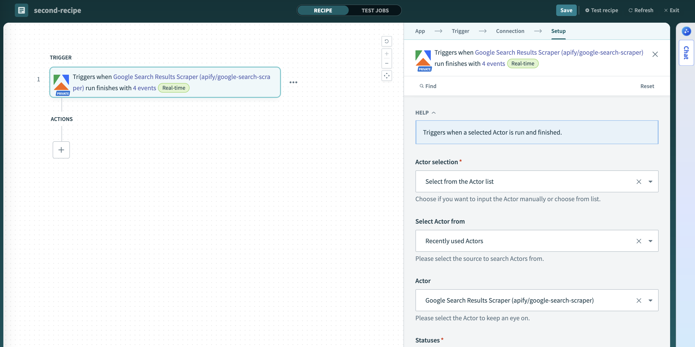

### Task run finished

_Triggers when an Apify task run finishes (succeeds, fails, times out, or gets aborted)._

This trigger creates a webhook in your Apify account that will notify Workato when the selected task run finishes with the specified statuses. This trigger watches a specific saved task (an Actor with preset inputs) and fires when that task's run completes with any terminal status. You can choose specific statuses to monitor (`ACTOR.RUN.SUCCEEDED`, `ACTOR.RUN.FAILED`, `ACTOR.RUN.TIMED_OUT`, `ACTOR.RUN.ABORTED`). This is particularly useful for:

- Monitoring scheduled or recurring tasks
- Building workflows dependent on specific data collection tasks
- Processing results from tasks with predefined configurations

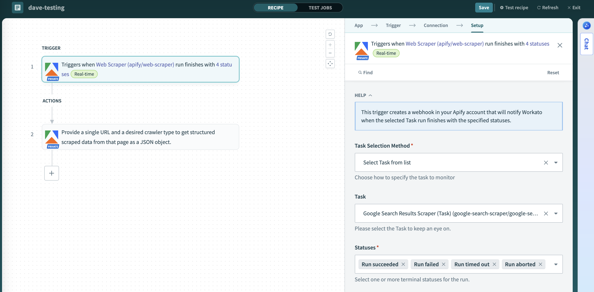

## Actions

_The Apify connector has the following actions for working with the Apify platform._

### Run Actor

_Run an Apify Actor with customizable execution parameters._

This action runs an Apify Actor with your specified input and execution parameters. You can choose to wait for completion or start the run asynchronously. Actors are reusable serverless programs that can scrape websites, process data, and automate workflows. You can:

- Select from your recently used Actors or Apify Store Actors
- Provide input using dynamic schema-based fields or raw JSON
- Configure run options: memory (128 MB to 32 GB), timeout, and build version (defaults to `latest`)
- Choose between synchronous (wait for completion) or asynchronous execution

URL input fields are validated before the run starts. The dataset item limit rejects zero or negative values; leave it empty for no limit.

:::tip Input field descriptions

Each input field includes helpful descriptions that guide you toward the correct format and expected values.

Default values for input fields will be displayed as placeholders, giving you a starting point for configuration.

:::

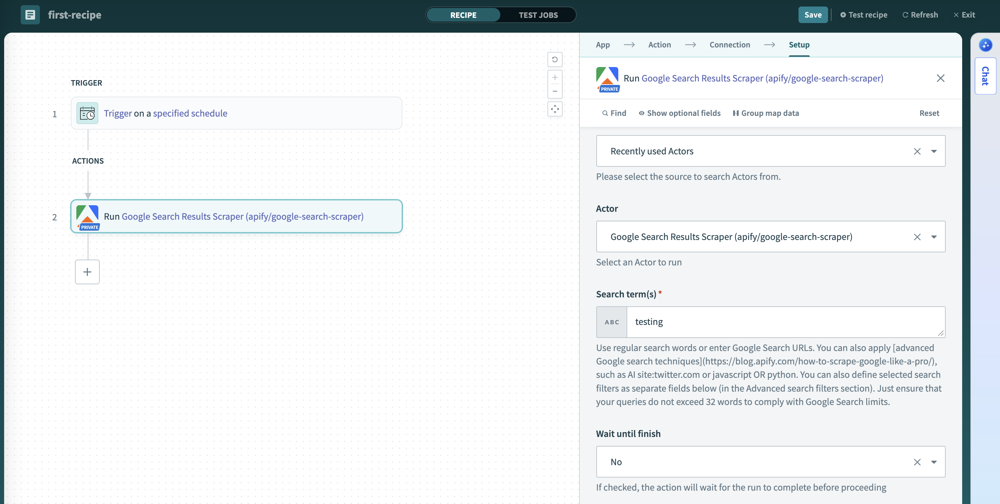

### Run task

_Run an Apify Actor task with optional input overrides._

This action runs an Apify task with optional input overrides and execution parameters. Tasks are pre-configured Actor runs with saved input, making them ideal for repeated executions. You can optionally override the task's configured input. You can:

- Select from your saved tasks or input a specific task ID
- Override the task's pre-configured input with new JSON if needed
- Configure task options: memory (128 MB to 32 GB), timeout, and build version (defaults to `latest`)

URL input fields are validated before the run starts. The dataset item limit rejects zero or negative values; leave it empty for no limit.

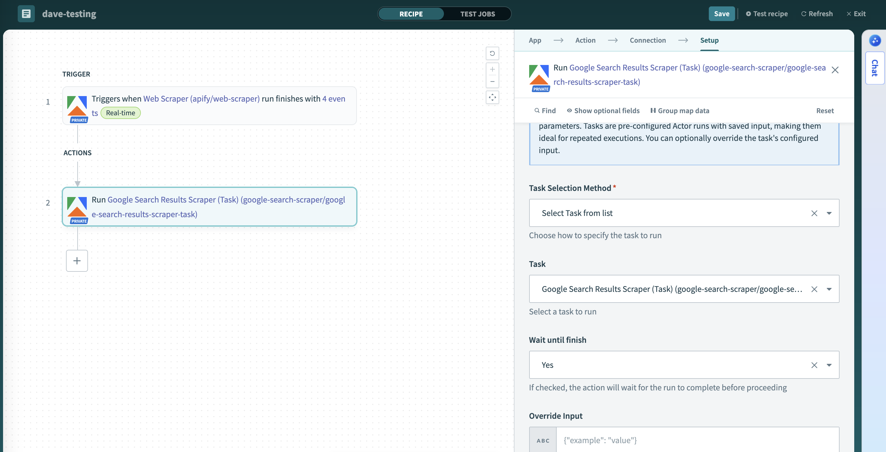

### Get dataset items

_Retrieves items from a dataset with dynamic field mapping._

Select a dataset to dynamically generate output fields and retrieve its items. This action automatically analyzes the dataset structure and creates appropriate output fields for your recipe. Key features:

- Automatically detects and creates output fields based on dataset structure
- Retrieves data records from specified datasets with pagination support
- Returns structured data ready for downstream recipe steps

#### Dynamic schema detection

The connector samples your dataset to create appropriate output fields:

- _Works best with consistent data_: When all items have the same field names and data types
- _May have limitations with mixed data_: If items have different structures or field types
- _Samples up to 25 items_: Fields that only appear after the first 25 items won't be detected

:::tip Best practice

For optimal results, use datasets where all items follow a consistent structure. Test with a small sample to verify field mappings work as expected.

:::

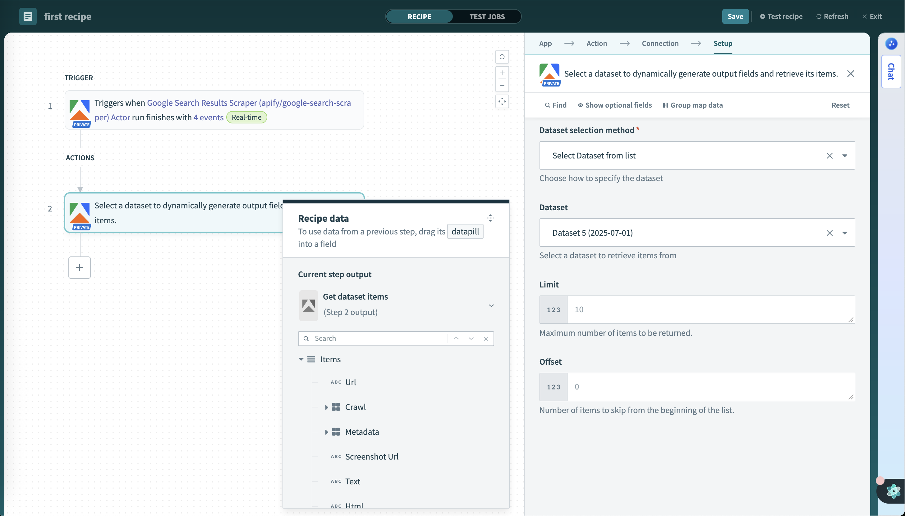

### Get key-value store record

_Retrieves a single record from a key-value store._

Select a key-value store and a key to retrieve the corresponding record as a text string or binary file. Key-value stores often contain metadata, logs, or files from Actor runs. This action:

- Fetches named entries by key from specified stores with dynamic key selection
- Accesses configuration data, screenshots, or custom outputs
- Supports both text and binary content types
- Enables flexible data retrieval for various use cases

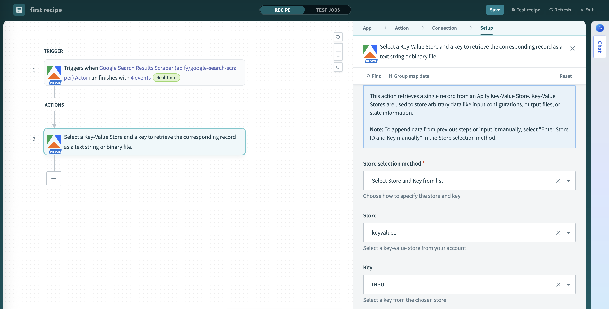

### Scrape single URL

_Scrapes a single URL using a selected Apify crawler._

Provide a single URL and a desired crawler type to get structured scraped data from that page as a JSON object. This action provides immediate, on-demand scraping capabilities:

- Scrapes content from a single specified URL
- Supports three crawler types: **Adaptive Crawler** (Website Content Crawler), **Firefox Headless Browser**, and **Cheerio** (fast, raw HTTP)
- Returns extracted content in structured format (text, markdown, HTML, and metadata)

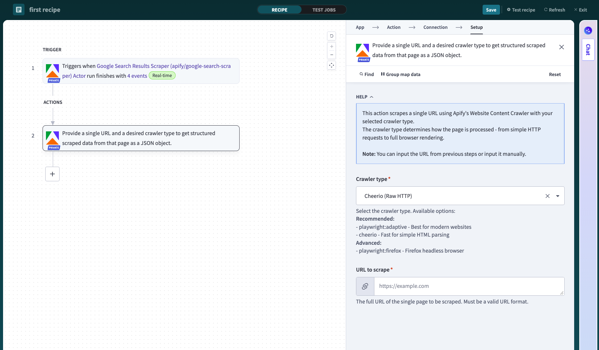

## Long-running scrapes and async pattern in Workato

Long-running scrapes can exceed typical step execution expectations. Use this asynchronous pattern to keep recipes reliable and scalable.

1. Start the run without waiting
   - In a recipe, add the **Run Actor** action and configure inputs as needed.
   - Run asynchronously (do not block downstream steps on completion).
   - 
1. Continue when the run finishes
   - Build a separate recipe with the **Actor Run Finished** trigger.
   - Filter for the specific Actor or task you started in step 1.
   - 
1. Fetch results and process
   - In the triggered recipe, add **Get Dataset Items** (use the dataset ID from the trigger payload) and continue processing.
   - 

## Example use cases

### Data mapping and workflow design

Workato's visual interface makes it easy to connect Apify data with other business applications:

- _Data pills:_ Use output fields from Apify triggers and actions as inputs for subsequent steps
- _Field mapping:_ Visually map scraped data fields to CRM, database, or spreadsheet columns
- _Conditional logic:_ Build workflows that respond differently based on Actor run status or data content
- _Data transformation:_ Apply filters, formatting, and calculations to scraped data before sending to target systems

### Best practices

- _Use tasks for recurring workflows:_ Create and use Apify tasks for consistent, repeatable scraping jobs
- _Handle async operations:_ For long-running Actors, use asynchronous execution and separate triggers to monitor completion
- _Error handling:_ Implement proper error handling for failed Actor runs using Workato's conditional logic
- _Rate limiting:_ Be mindful of API rate limits when designing high-frequency workflows
- _Data validation:_ Validate scraped data before sending to critical business systems

## Troubleshooting

- _Connection issues:_ Verify your API token has the necessary permissions and hasn't expired
- _Actor selection:_ If an Actor doesn't appear in dropdowns, ensure it has been run at least once
- _Timeout errors:_ For long-running Actors, use asynchronous execution rather than waiting for completion
- _Data format:_ Ensure JSON inputs are properly formatted and match expected Actor input schema
- _Validation errors:_ The connector validates URL fields and dataset item limits before running. Check that URLs include a valid protocol (`https://`) and that item limits are positive integers or empty.
- _Resource not found errors:_ Check that IDs are correct and case-sensitive
- _Dataset field mapping issues:_ If you experience incorrect data types or missing fields in the Get Dataset Items action data pill, this may be caused by non-homogeneous data in your dataset. The connector samples only the first 25 items to determine field types, so inconsistent data structures can lead to mapping problems. Try to ensure your dataset has consistent field names and data types across all items.

If you have questions or need help, reach out on the [Apify developer community on Discord](https://discord.com/invite/jyEM2PRvMU).
