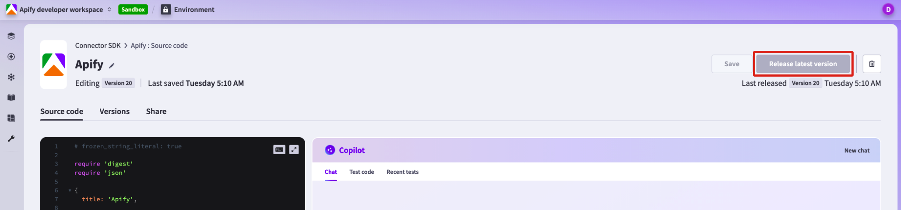
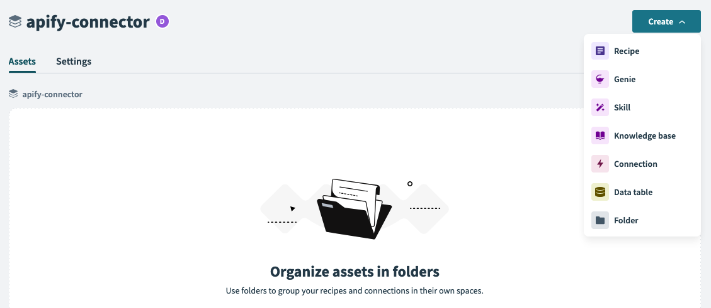

**Connect Apify Actors to Workato recipes to run web scraping and automation jobs, monitor run events, and process results.**

---

[Workato](https://www.workato.com/) is an automation platform where you can build recipes, automated workflows that connect your apps with no-code connectors. With the Apify connector, you can run Apify Actors inside your recipes to launch web scraping and automation jobs, watch for run events, and further work with the results.

<ThirdPartyDisclaimer />

## Get started

To use the Apify integration with Workato, you need:

- An [Apify account](https://console.apify.com/)
- A [Workato account](https://www.workato.com/)

## Install the Apify connector

The Apify Workato connector is available in the Workato Community library. Here's how to install it:

1. In your Workato workspace, navigate to **Community library**.
1. Click on **Custom connectors**.
1. Search for **Apify**.
1. Click on the connector and then click **Install**.

After installation, the Apify connector appears in **Connector SDK** under the **Tools** tab. To make it available in your projects, you need to release it:

1. Go to **Tools** > **Connector SDK** and select the Apify connector.
1. Click **Release latest version** in the top-right corner.

## Connect your Apify account

Before using the Apify connector in recipes, create a connection inside a Workato project.

### Create a project (if you don't have one)

1. In Workato, go to **Workspace > Projects**.
1. Click **Create project**.
1. Choose either **Start from scratch** or **Build a workflow app**.
1. Name and create the project.

### Create a connection in your project

1. Open your project.
1. Click the **Create** button.
1. Select **Connection**.
   
1. Search for **Apify** and choose the Apify connector.
   
1. In the connection dialog, enter your **API Token**. In [Apify Console](https://console.apify.com), go to [Settings > Integrations](https://console.apify.com/account#/integrations) and copy your API token.
   
1. Click **Connect**. Workato tests the connection by making an authenticated call to verify your credentials.
   

Once you create and authenticate the connection, you can use it in any recipe.

## Build recipes

A recipe begins with a trigger (an event that starts the workflow) and includes one or more actions (operations to perform). The sections below describe the triggers and actions available in the Apify connector.

## Triggers

:::tip Inline documentation

Each connector trigger and action field in Workato includes inline help text describing the parameter and expected format.

:::

The Apify connector provides the following triggers that monitor your Apify account for task completions:

### Actor run finished

Triggers when an Apify Actor run finishes (succeeds, fails, times out, or gets aborted).

This trigger monitors a specific Apify Actor and starts the recipe when any run of that Actor finishes, regardless of the outcome. You can:

- Select the Actor from recently used Actors or Apify Store Actors
- Choose to trigger on specific statuses (`ACTOR.RUN.SUCCEEDED`, `ACTOR.RUN.FAILED`, `ACTOR.RUN.TIMED_OUT`, `ACTOR.RUN.ABORTED`)
- Access run details, status, and metadata in subsequent recipe steps

### Task run finished

Triggers when an Apify task run finishes (succeeds, fails, times out, or gets aborted).

This trigger creates a webhook in your Apify account that notifies Workato when the selected task run finishes. It watches a specific saved task (an Actor with preset inputs) and you can choose which statuses to monitor (`ACTOR.RUN.SUCCEEDED`, `ACTOR.RUN.FAILED`, `ACTOR.RUN.TIMED_OUT`, `ACTOR.RUN.ABORTED`). This is particularly useful for:

- Monitoring scheduled or recurring tasks
- Building workflows dependent on specific data collection tasks
- Processing results from tasks with predefined configurations

## Actions

The Apify connector offers actions to interact with the Apify platform.

### Run Actor

Run an Apify Actor with customizable execution parameters.

This action runs an Apify Actor with your specified input and execution parameters, either synchronously (wait for completion) or asynchronously. You can:

- Select from your recently used Actors or Apify Store Actors
- Provide input using dynamic schema-based fields or raw JSON
- Configure run options: memory (128 MB to 32 GB), timeout, and build version (defaults to `latest`)
- Choose between synchronous (wait for completion) or asynchronous execution

URL input fields are validated before the run starts. The dataset item limit rejects zero or negative values; leave it empty for no limit.

:::tip Input field descriptions

Each input field includes helpful descriptions that guide you toward the correct format and expected values.

Default values for input fields will be displayed as placeholders, giving you a starting point for configuration.

:::

### Run task

Run an Apify Actor task with optional input overrides.

This action runs an Apify task with optional input overrides and execution parameters. Tasks are pre-configured Actor runs with saved input, making them ideal for repeated executions. You can:

- Select from your saved tasks or input a specific task ID
- Override the task's pre-configured input with new JSON if needed
- Configure task options: memory (128 MB to 32 GB), timeout, and build version (defaults to `latest`)

### Get dataset items

Retrieves items from a dataset with dynamic field mapping.

Select a dataset to dynamically generate output fields and retrieve its items. This action automatically analyzes the dataset structure and creates appropriate output fields for your recipe. Key features:

- Automatically detects and creates output fields based on dataset structure
- Retrieves data records from specified datasets with pagination support
- Returns structured data ready for downstream recipe steps

#### Dynamic schema detection

The connector samples your dataset to create appropriate output fields:

- Works best with consistent data - when all items have the same field names and data types
- May have limitations with mixed data - if items have different structures or field types
- Samples up to 25 items - fields that only appear after the first 25 items won't be detected

:::tip Best practice

For optimal results, use datasets where all items follow a consistent structure. Test with a small sample to verify field mappings work as expected.

:::

### Get key-value store record

Retrieves a single record from a key-value store.

Select a key-value store and a key to retrieve the corresponding record as a text string or binary file. Key-value stores often contain metadata, logs, or files from Actor runs. This action:

- Fetches named entries by key from specified stores with dynamic key selection
- Accesses configuration data, screenshots, or custom outputs
- Supports both text and binary content types
- Enables flexible data retrieval for various use cases

### Scrape single URL

Scrapes a single URL using a selected Apify crawler.

Provide a single URL and a desired crawler type to get structured scraped data from that page as a JSON object. This action provides immediate, on-demand scraping capabilities:

- Scrapes content from a single specified URL
- Supports three crawler types: **Adaptive Crawler** (Website Content Crawler), **Firefox Headless Browser**, and **Cheerio** (fast, raw HTTP)
- Returns extracted content in structured format (text, markdown, HTML, metadata)

## Configure connector inputs

When building recipes, the Apify connector provides several ways to select resources and configure inputs.

### Pick lists

The connector includes dynamic dropdown lists for selecting Apify resources. You can choose items from these lists or switch to manual input and paste an ID directly. If an item doesn't appear, make sure it exists in your account and has been run at least once, or paste its ID manually.

Available pick lists:

- **Actors** - Recently used Actors or Apify Store Actors, displaying the title and `owner/name`
- **Tasks** - Your saved tasks, displaying the task title and Actor name
- **Datasets** - Available datasets, sorted by most recent first
- **Key-value stores** - Available stores, sorted by most recent first
- **Store keys** - Keys available in the selected store

### Input types

When you choose an Actor from the pick list, the connector fetches its input schema and renders matching fields. If schema fetching fails or you switch to manual input, a JSON field appears where you can paste valid JSON. For task inputs, you can optionally provide override input as JSON to modify the task's preconfigured settings.

:::tip Copy the Actor or task input JSON

If you use manual input instead of the dynamic fields, copy the JSON structure from Apify Console. Open the Actor or task input page, switch the format to JSON, and copy it. Replace the placeholder with your Actor or task ID:

- `https://console.apify.com/actors/<your-actor-id>/input`
- `https://console.apify.com/actors/tasks/<your-task-id>/input`

When you use the pick list, the connector fetches input fields automatically - no manual JSON needed.

:::

### Where to find resource identifiers

When using manual input instead of pick lists, you need to provide a resource identifier. Actors and tasks accept either an ID or a slug (e.g. `owner/actor-name`), so you can type the name directly without looking up the ID. For other resources, find the ID in Apify Console:

- **Dataset**: [**Storage** > **Datasets**](https://console.apify.com/storage/datasets) > dataset detail > API panel or URL.
  - Also visible in the table on the **Storage** > **Datasets** page
- **Key-value store**: [**Storage** > **Key-value stores**](https://console.apify.com/storage/key-value-stores) > store detail > API panel or URL.
  - Also visible in the table on the **Storage** > **Key-value stores** page
- **Webhook**: [Actors](https://console.apify.com/actors) > Actor > **Integrations** tab.

## Handle long-running scrapes

If an Actor run takes more than a few minutes (for example, scraping thousands of pages), a synchronous recipe step may time out while waiting for results. Instead of waiting in a single step, split the work across two recipes using an asynchronous pattern:

1. Start the run without waiting
   - In a recipe, add the **Run Actor** action and configure inputs as needed.
   - Run asynchronously (do not block downstream steps on completion).
   - 
1. Continue when the run finishes
   - Build a separate recipe with the **Actor run finished** trigger.
   - Filter for the specific Actor or task you started in step 1.
   - 
1. Fetch results and process
   - In the triggered recipe, add **Get Dataset Items** (use the dataset ID from the trigger payload) and continue processing.
   - 

## Tips and best practices

- Use output fields from Apify triggers and actions (called *data pills* in Workato) as inputs for subsequent steps.
- Map scraped data fields to CRM, database, or spreadsheet columns using Workato's visual interface.
- Build workflows that respond differently based on Actor run status or data content.
- Create Apify tasks for consistent, repeatable scraping jobs.
- For long-running Actors, use asynchronous execution and a separate trigger to monitor completion.
- Implement error handling for failed Actor runs using Workato's conditional logic.
- Be mindful of API rate limits when designing high-frequency workflows.
- Validate scraped data before sending to target systems.

## Troubleshooting

- If the connection fails, verify your API token has the necessary permissions and hasn't expired.
- If an Actor doesn't appear in dropdowns, make sure it has been run at least once in your account.
- If a recipe times out waiting for results, use asynchronous execution and a separate trigger instead of waiting for completion.
- If JSON input is rejected, check that it's properly formatted and matches the expected Actor input schema.
- If URL or item limit validation fails, ensure URLs include a protocol (`https://`) and item limits are positive integers or empty.
- If a resource isn't found, check that IDs are correct and case-sensitive.
- If dataset items have missing or wrong fields, the connector may have sampled inconsistent data. It only checks the first 25 items to detect fields and types. Make sure your dataset has consistent field names and data types across all items.

For questions or help, join the [Apify developer community on Discord](https://discord.com/invite/jyEM2PRvMU).
