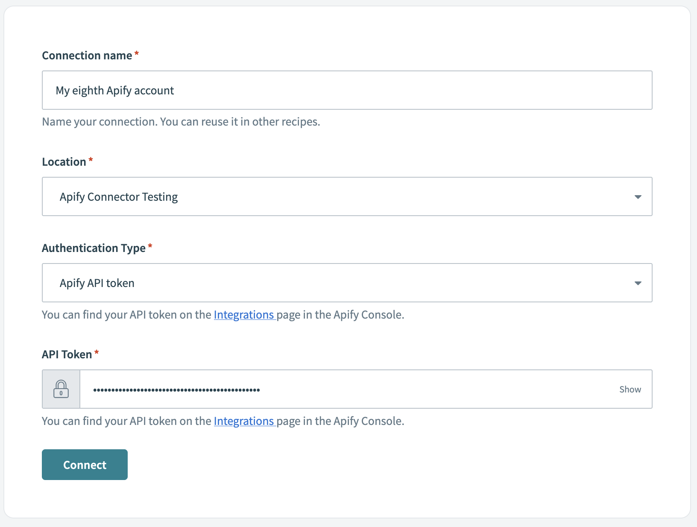
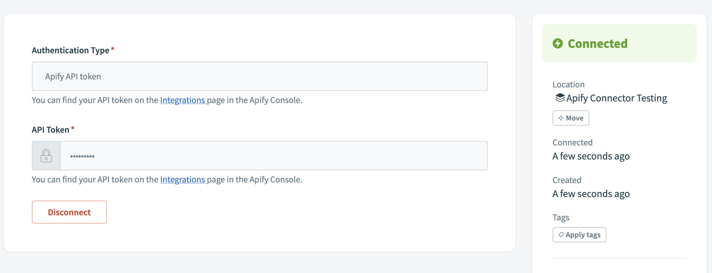
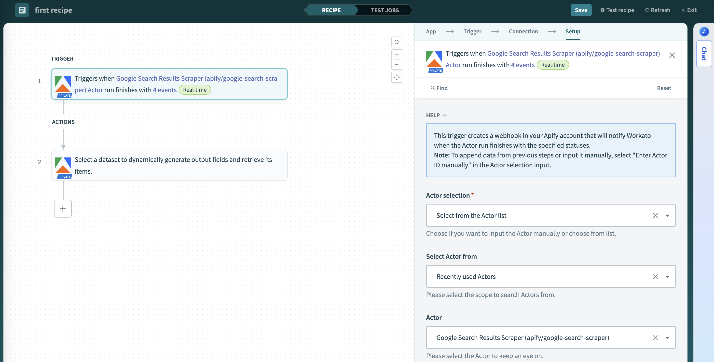
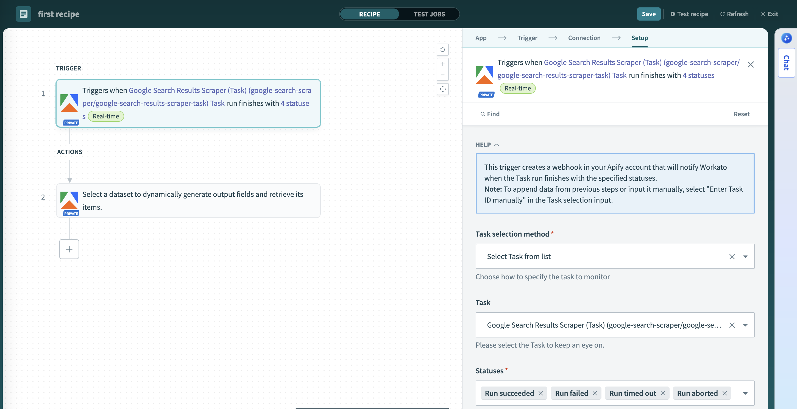

**Learn how to integrate your Apify Actors with Workato to build enterprise-grade automated workflows and connect with hundreds of business applications.**

---

[Workato](https://www.workato.com/) is an enterprise-grade integration and automation platform (iPaaS) that enables you to build automated workflows called **"recipes"** across applications using no-code or low-code connectors. With the [Apify Workato Connector](https://apify.com), you can seamlessly integrate web scraping and automation capabilities into your enterprise workflows.

Each Workato recipe begins with a **trigger** (an event in one app) and executes one or more **actions** (operations in other apps). The Apify connector provides Apify-specific triggers and actions, allowing you to start or monitor Apify tasks, retrieve scraped data, and incorporate web automation into your business processes.

You can use the Workato integration to trigger workflows when Apify Actors or tasks finish, start scraping jobs based on business events, or fetch and process scraped data across your tech stack.

## Get started

To use the Apify integration with Workato, you will need:

- An [Apify account](https://console.apify.com/)
- A [Workato account](https://www.workato.com/)

## Step 1: Install the Apify Connector

The Apify Workato Connector is available in the Workato Community Library. Here's how to install it:

1. In your Workato workspace, navigate to **Community Library**.
2. Click on **Custom Connectors**.
3. Search for **Apify**.
4. Click on the connector and then click **Install**.

After successful installation, the Apify connector will appear under **My Connectors** in your Workato workspace and will be available for use in your projects.

## Step 2: Connect your Apify account

Before using the Apify connector in recipes, create a connection inside a Workato project.

### Create a project (if you don’t have one)

1. In Workato, go to **Workspace → Projects**.
1. Click **Create project**.
1. Choose either **Start from scratch** or **Build a workflow app**.
1. Name and create the project.

### Create a connection in your project

1. Open your project.
1. Click the **Create** button.
1. Select **Connection**.
1. Search for **Apify** and choose the Apify connector.

### Choose authentication type

You can authenticate the connection using either:

- **API Key** (Apify API token)
- **OAuth 2.0**

#### Authenticate with API token

1. In the Apify connection dialog, select **API Key** as the authentication type.
2. Enter your **Apify API token**. In Apify Console, go to [**Settings → API & Integrations**](https://console.apify.com/settings/integrations) and copy your API token.
3. Click **Connect**. Workato will test the connection by making an authenticated call to verify your credentials.

#### Authenticate with OAuth 2.0

1. In the Apify connection dialog, select **OAuth 2.0** as the authentication type.
2. Click **Connect** to start the OAuth flow.
3. Sign in to Apify and authorize Workato to access your account.
4. After authorizing, you’ll be redirected back to Workato and the connection will be established.

Once the connection is created and authenticated, you can use it in any recipe.

## Step 3: Create your first recipe

After connecting your Apify account, you can start creating recipes that use Apify triggers and actions. A recipe begins with a trigger (an event that starts the workflow) and includes one or more actions (operations to perform).

## Selection and input methods

The Apify connector provides dynamic dropdown lists (pick lists) and flexible input methods to make configuration easier:

### Pick lists and selection methods

- **Selection method (pick list vs. manual ID):** Choose from fetched lists or switch to manual and paste an ID. If an item doesn't appear, make sure it exists in your account and has been used at least once, or paste its ID manually.
- **Available pick lists:**
  - **Actors**: Lists your Actors or store Actors, displaying the title and username/name
  - **Tasks**: Lists your saved tasks, displaying the task title and Actor name
  - **Datasets**: Lists available datasets, sorted by most recent first
  - **Key-Value Stores**: Lists available stores, sorted by most recent first
  - **Store Keys**: Dynamically shows keys available in the selected store

### Input types

- **Input type (schema‑based vs. JSON):** For Actor and Task inputs, when you choose an item from the pick list, the connector fetches the input schema and renders fields. In this case, the JSON field is not used. If schema fetching fails or you switch to manual input, the JSON field appears and you can paste valid JSON instead.

:::tip Copy the Actor/Task input JSON

Open the Actor or Task Input page in Apify Console, switch format to JSON, and copy the canonical structure:
`https://console.apify.com/actors/<actor_id>/input`
`https://console.apify.com/actors/tasks/<task_id>/input`

:::

## Where to find your IDs

When using manual input instead of pick lists, you'll need to provide the correct resource IDs. Here's how to find them in Apify Console:

- **Actor ID**: [Actor detail page](https://console.apify.com/actors) → API panel or URL.
  - Example URL: `https://console.apify.com/actors/<actorId>`
  - Actor name format: owner~name (for example, `apify~website-scraper`)
- **Task ID**: [Task detail page](https://console.apify.com/actors/tasks) → API panel or URL.
  - Example URL: `https://console.apify.com/actors/tasks/<taskId>`
- **Dataset ID**: [Storage → Datasets](https://console.apify.com/storage/datasets) → Dataset detail → API panel or URL.
  - Example URL: `https://console.apify.com/storage/datasets/<datasetId>`
  - Also available in the table on the `Storage → Datasets` page
- **Key-value store ID**: [Storage → Key-value stores](https://console.apify.com/storage/key-value-stores) → Store detail → API panel or URL.
  - Example URL: `https://console.apify.com/storage/key-value-stores/<storeId>`
  - Also available in the table on the `Storage → Key-value stores` page
- **Webhook ID**: [Actors](https://console.apify.com/actors) → Actor → Integrations.
  - Example URL: `https://console.apify.com/actors/<actor_id>/integrations/<webhook_id>`

## Triggers

:::tip Inline documentation

Each connector trigger and action field in Workato includes inline help text describing the parameter and expected format. If you're unsure, hover the field label or click the information icon in the Workato editor.

:::

The Apify connector provides the following triggers that monitor your Apify account for task completions:

### Actor Run Finished

**Triggers when a selected Actor run completes (succeeded, failed, timed out, or aborted).**

This trigger monitors a specific Apify Actor and starts the recipe when any run of that Actor reaches a terminal status. You can:

- Select the Actor from a dropdown populated by your available Actors (either your Actors or store Actors)
- Choose to trigger on specific event types (`ACTOR.RUN.SUCCEEDED`, `ACTOR.RUN.FAILED`, `ACTOR.RUN.TIMED_OUT`, `ACTOR.RUN.ABORTED`)
- Access run details, status, and metadata in subsequent recipe steps

### Task Run Finished  

**Triggers when a selected Actor task run completes.**

This trigger watches a specific saved task (an Actor with preset inputs) and fires when that task's run completes with any terminal status. You can choose specific event types to monitor (`ACTOR.RUN.SUCCEEDED`, `ACTOR.RUN.FAILED`, `ACTOR.RUN.TIMED_OUT`, `ACTOR.RUN.ABORTED`). This is particularly useful for:

- Monitoring scheduled or recurring tasks
- Building workflows dependent on specific data collection tasks
- Processing results from tasks with predefined configurations

## Actions

The Apify connector offers comprehensive actions to interact with the Apify platform:

### Run Actor

**Starts a run of any Apify Actor by its ID or name.**

This action initiates web scraping or automation tasks on-demand. You can:

- Select from your available Actors or specify an Actor ID
- Provide custom input JSON to override default settings
- Configure run options like memory allocation and timeout
- Choose between synchronous (wait for completion) or asynchronous execution

### Run Task

**Runs a saved Apify task (an Actor with pre-configured inputs).**

This action simplifies running recurring setups by executing tasks with predefined configurations. You can:

- Select from your saved tasks or input specific Task ID
- Override specific inputs with new JSON if needed
- Configure task options like memory, build ID or timeout

### Get Dataset Items

**Fetches results from an Apify Dataset created by a run.**

Datasets contain structured data (JSON, CSV, etc.) from your scrapers. This action:

- Retrieves data records from specified datasets
- Supports pagination with limit and offset parameters
- Returns structured data that can be passed to downstream recipe steps

### Get Key-Value Store Record

**Retrieves a specific record from an Apify Key-Value store.**

Key-Value stores often contain metadata, logs, or files from Actor runs. This action:

- Fetches named entries by key from specified stores
- Accesses configuration data, screenshots, or custom outputs
- Enables flexible data retrieval for various use cases

### Scrape Single URL

**Runs Apify's Website Content Crawler synchronously on one URL.**

This action provides immediate, on-demand scraping capabilities:

- Scrapes content from a single specified URL
- Offers multiple crawler types (headless browser, stealth browser, raw HTTP)
- Returns extracted content in structured format (text, markdown, HTML)
- Perfect for real-time data extraction triggered by recipes

## Example use cases

### Automated competitive monitoring

**Trigger:** Scheduled (daily)  
**Actions:** 
1. Run Actor (competitor price scraper)
1. Get Dataset Items (fetch price data)
1. Send to Google Sheets or Salesforce
1. Send Slack notification if significant price changes detected

### Lead generation from web data

**Trigger:** New opportunity created in CRM  
**Actions:**
1. Scrape Single URL (extract company data from website)
1. Update CRM record with enriched data
1. Trigger email sequence in marketing automation platform

## Using the integration

### Data mapping and workflow design

Workato's visual interface makes it easy to connect Apify data with other business applications:

- **Data pills:** Use output fields from Apify triggers and actions as inputs for subsequent steps
- **Field mapping:** Visually map scraped data fields to CRM, database, or spreadsheet columns  
- **Conditional logic:** Build workflows that respond differently based on Actor run status or data content
- **Data transformation:** Apply filters, formatting, and calculations to scraped data before sending to target systems

### Best practices

- **Use tasks for recurring workflows:** Create and use Apify tasks for consistent, repeatable scraping jobs
- **Handle async operations:** For long-running Actors, use asynchronous execution and separate triggers to monitor completion
- **Error handling:** Implement proper error handling for failed Actor runs using Workato's conditional logic
- **Rate limiting:** Be mindful of API rate limits when designing high-frequency workflows
- **Data validation:** Validate scraped data before sending to critical business systems

## Long‑running scrapes and async pattern in Workato

Long-running scrapes can exceed typical step execution expectations. Use this asynchronous pattern to keep recipes reliable and scalable.

1. Start the run without waiting
   - In a recipe, add the **Run Actor** action and configure inputs as needed.
   - Run asynchronously (do not block downstream steps on completion).
   - 
1. Continue when the run finishes
   - Build a separate recipe with the **Actor Run Finished** trigger.
   - Filter for the specific Actor or Task you started in Step 1.
   - 
1. Fetch results and process
   - In the triggered recipe, add **Get Dataset Items** (use the dataset ID from the trigger payload) and continue processing.
   - 

:::note Screenshot needed

Please add `../images/workato/async-flow.png` illustrating a two‑recipe setup: one recipe starting a run, and another recipe triggered on run completion.

:::

## Troubleshooting

- **Connection issues:** Verify your API token has the necessary permissions and hasn't expired
- **Actor selection:** If an Actor doesn't appear in dropdowns, ensure it has been run at least once
- **Timeout errors:** For long-running Actors, use asynchronous execution rather than waiting for completion
- **Data format:** Ensure JSON inputs are properly formatted and match expected Actor input schema
- (todo) **OAuth issues:** If using OAuth, make sure the redirect URI matches your Workato region (US or EU)
- **Resource not found errors:** Check that IDs are correct and case-sensitive

If you have any questions or need help, feel free to reach out to us on our [Discord channel](https://discord.com/invite/jyEM2PRvMU).
