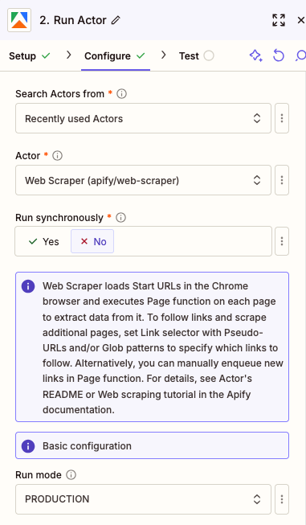
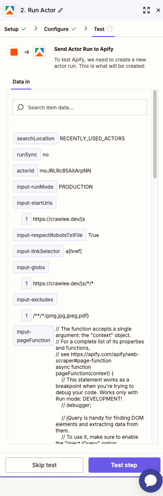

**Learn how to integrate your Apify Actors with Zapier.**

---

With [Apify integration for Zapier](https://zapier.com/apps/apify/integrations), you can connect your Apify Actors to Slack, Trello, Google Sheets, Dropbox, Salesforce, and loads more.

Your Zapier workflows can start Apify Actors or tasks, fetch items from a dataset, set and get records from key-value stores, or find Actor or task runs.

You can use the Zapier integration to trigger a workflow whenever an Actor or a task finishes.

## Connect Apify with Zapier

To use the Apify integration on Zapier, you will need to:

- Have an [Apify account](https://console.apify.com/).
- Have a [Zapier account](https://zapier.com/).

### Step 1: Create Zap and find Apify on Zapier

Once you have your Zapier account ready and you are successfully logged in, you can create your first Zap.

Go to the Zaps section and find the "Create Zap" button.

In the create Zap form, you can choose whether you want to use Apify as the trigger or action for the Zap.

Click on Trigger and find Apify using the search box.

Then select which trigger you want to use.

### Step 2: Create a connection to your Apify account

The next step is to connect your Apify account.

Click on the "Sign in" button next to the Connect to Apify title. Or you can select an account if you already have one connected.

The connection configuration options open in a new tab in your browser or in a modal window.

In connection configuration, you need to provide your Apify API Token. You can find the token in Apify Console by navigating to **Settings > Integrations**.

Copy the token and paste it into the configuration form and continue with the "Yes, Continue to Apify" button.

The connection is now created and the configuration form is closed. You can continue with the Zap configuration and select the Actor you want to use as trigger.

The last step is to test the connection. The "Test Trigger" button lets you test the trigger. The test should prefill data from existing Actor runs you have in Apify. If you don't have any runs, you can create one in Apify Console and then test the connection again.

After a successful test, you can continue with the Zap configuration and set up the action for the Zap.

### Step 3: Set up your Apify action in Zapier

You are able to use any action to follow your Apify trigger. For example, you can use Gmail to send an email about a finished Actor run.

In this guide we'll show you how to use Apify as an action to start an Actor run.

After you select Apify as an action, you need to select the action you want to use. Let's use the "Run Actor" action for this example.

You need to select the connection you want to use. If you don't have any connections, you can create a new one by clicking on the "Sign in" button and follow the steps in Step 2.

In the next step, you need to select the Actor you want to use. You can use the search box to find the Actor.

We will use the Web Scraper Actor in this example.

You need to fill the input for the Actor and use the "Continue" button to advance to the next step.

> You can choose to run Actor synchronously or asynchronously. If you choose to run Actor synchronously, the Zap will wait until the Actor finishes and the Actor output and data will be available in next steps.
> Beware that the hard timeout for the run is 30 seconds. If the Actor doesn't finish in 30 seconds, the run will be terminated and the Actor output will not be available in next steps.

In the next step, you can test the action and check if everything is using the "Test step" button.

This button runs the Actor run on Apify and you can see the data in Zapier.

Once you are happy with the test, you can publish the Zap. When it is turned on, it will run the Actor every time the trigger is fired.

## Triggers

### Finished Actor Run

> Triggers when a selected Actor run is finished.

### Finished Task Run

> Triggers when a selected Actor task run is finished.

## Actions

### Run Actor

> Runs a selected Actor.

### Run Task

> Runs a selected Actor task.

### Scrape Single URL

> Runs a scraper for the website and returns its content as text, markdown and HTML.
> This action is for getting content of a single page to use, for example, in LLM flows.

### Set Key-Value Store Record

> Sets a value to a [Key-value store](/platform/storage/key-value-store).

## Searches

### Fetch Dataset Items

> Retrieves items from a [dataset](/platform/storage/dataset).

### Find Last Actor Run

> Finds the most recent Actor run.

### Find Last Task Run

> Finds the most recent Actor task run.

### Get Key-Value Store Record

> Retrieves value from a [Key-value store](/platform/storage/key-value-store).

If you have any questions or need help, feel free to reach out to us on our [developer community on Discord](https://discord.com/invite/jyEM2PRvMU).
