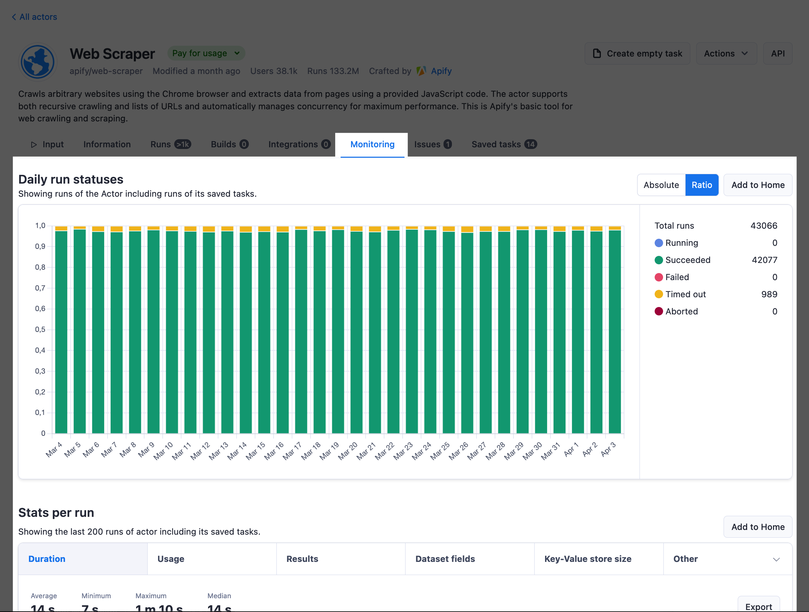
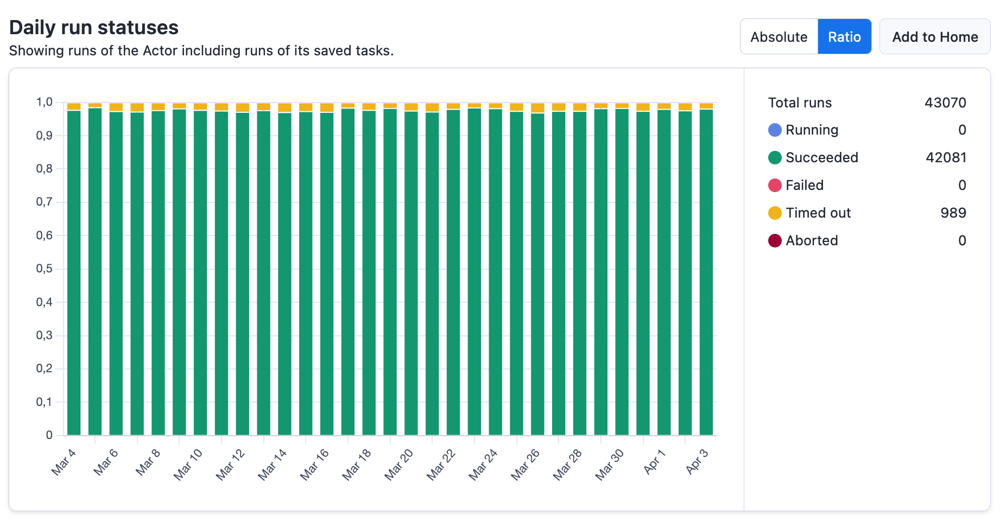
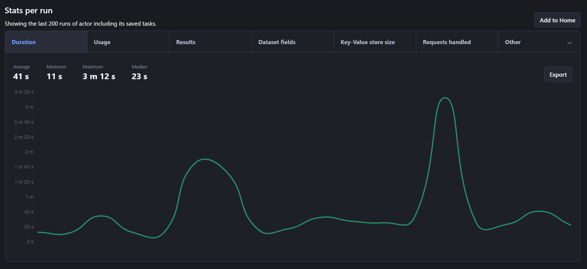
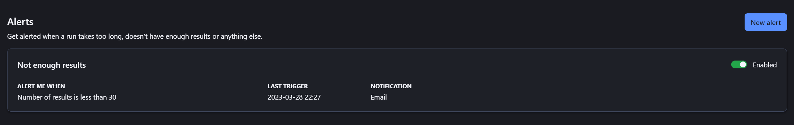
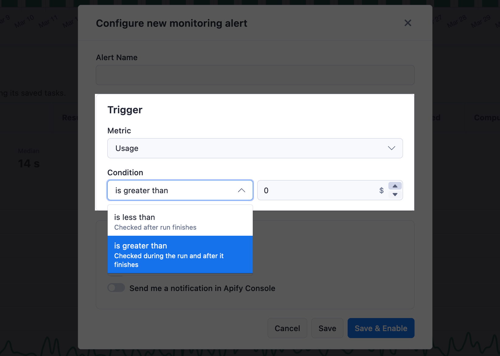
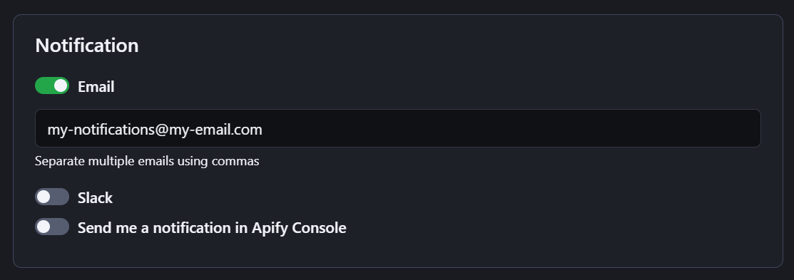
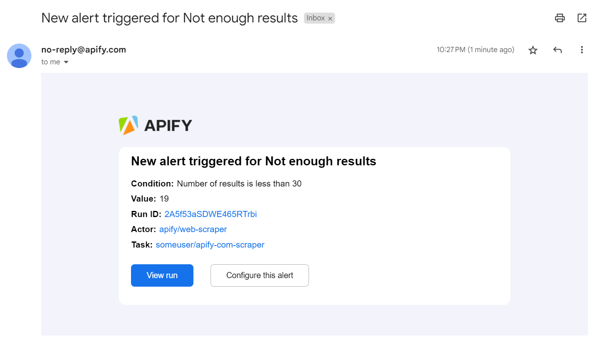

**Learn how to continuously make sure that your Actors and tasks perform as expected and retrieve correct results. Receive alerts when your jobs or their metrics are not as you expect.**

---

The web is continuously evolving, and so are the websites you interact with. If you implement Apify Actors or the data they provide into your daily workflows, you need to make sure that everything runs as expected.

> Monitoring allows you to track and observe how the software works. It enables you to measure and compare your programs' performance over time and to be notified when something goes wrong.

Also, you can use the data you gain from monitoring to optimize your software and maximize its potential.

## Built in monitoring

Monitoring is an option you can find on any Actor or saved task in Apify Console. It allows you to display metric statistics about your solution's runs and set up alerts for when your solution behaves differently than you expect.

The monitoring system is free for all users. You can use it to monitor as many Actors and tasks as you want, and it does not use any additional resources on top of your usage when running them.

### Features

Currently, the monitoring option offers the following features:

1. Chart showing **statuses** of runs of the actor or saved task over last 30 days.
    

2. Chart displaying **metrics** of the last 200 runs of the actor or saved task.
    

3. Option to set up **alerts** with notifications based on the run metrics.
    

> Both charts can also be added to your Apify Console home page so you can quickly see if there are any issues every time you open Apify Console.

### Alert configuration

When you set up an alert, you have two choices for how you want the metrics to be evaluated. And depending on your choices, the alerting system will behave differently:

1. **Alert, when the metric is lower than** - This type of alert is checked after the run finishes. If the metric is lower than the value you set, the alert will be triggered and you will receive a notification.

2. **Alert, when the metric is higher than** - This type of alert is checked both during the run and after the run finishes. During the run, we do periodic checks (approximately every 5 minutes) so that we can notify you as soon as possible if the metric is higher than the value you set. After the run finishes, we do a final check to make sure that the metric does not go over the limit in the last few minutes of the run.

You can get notified by email, Slack, or in Apify Console. If you use Slack, we suggest using Slack notifications instead of email because they are more reliable, and you can also get notified quicker.

1. **Email** - You can set up one or more emails to receive alert notifications. To do that, you just have to separate them by commas. You can also disable email notifications if you don't want to receive them.
2. **Slack** - To set up Slack notifications, you first need to connect your Slack workspace to Apify. To do that, go to your [account integration settings](https://console.apify.com/account/integrations) and click on the **+ Add workspace** button in the Slack section. Once you have your workspace connected, you can choose the workspace when setting up alert notifications and then pick a channel to which you want the notifications to be delivered.
3. **In Console** - You can also get notified in Apify Console. This is useful if you access Apify Console often, and you do not need to be notified as soon as possible.

### Alert notification

The email and Slack alert notifications both contain the same information. You will receive a notification with the following information:

1. **Alert name**
2. **Condition** - The condition that was violated.
3. **Value** - The value of the metric violating the condition and triggering the alert.
4. **Run ID** - The ID of the run that triggered the alert, which links directly to the run detail in Apify Console.
5. **Actor** - The full name of the actor that triggered the alert, which links to the Actor detail in Apify Console.
6. **Task** - If the monitoring alert was set up for a task, then this field will contain the name of the task which links to the task detail in Apify Console.

While the in-app notification will contain less information, it will point you directly to the Actor or task that triggered the alert:

 

## Other

### What should I monitor when scraping?

There are many metrics you might want to monitor when you are scraping the web. Here are some examples:

**Data quality**:

1. **Number of results** returned by your solution. This is useful if you are scraping a list of products, for example. You can set up an alert to notify you if the number of results is lower than expected. Which indicates that something changed on the website you are scraping.
2. **Number of fields** returned. This is something that indicates a change in the website. For example, the manufacturer name moved to another place.

**Performance**:

1. **Duration** of the run. If your solution is taking longer than usual to finish, you can set up an alert to notify you. This will help you prevent your solution from being stuck and from wasting resources.

**Usage and cost**:

1. **Usage cost** may change when the robot blocking solution gets implemented. An increase of the cost may indicate that many URLs are being retried.
2. **Proxy usage.** Seeing how your solution uses a proxy and if there are any changes can help you optimize your usage and prevent increased costs if your solution starts behaving differently than expected.

These are just a few examples of what you can monitor. It's always recommended to start small, iterate, and get more complex over time based on your experience.

### Alternative solutions

For more complex monitoring, you can use the [monitoring suite](https://apify.com/apify/monitoring), which is a collection of [Apify Actors](../actors/index.mdx) that allows you to automate the monitoring of jobs you have running on the [Apify platform](https://apify.com). The monitoring suite offers some features that are not **currently** available in Apify Console, such as:

1. Schema validation of the output
2. Duplicate checks in the output
3. Dashboards with data grouping
4. Daily/weekly/monthly monitoring instead of after every run

> Please note that this solution is more complex and requires more time to set up. Also, it uses schedules, Actors, tasks, and webhooks, so using it will increase your overall usage on the Apify platform.
