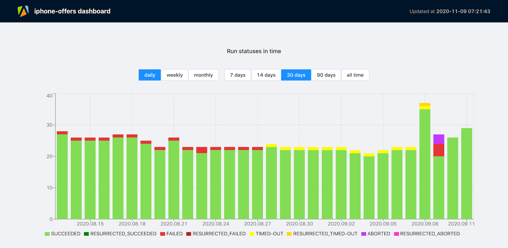
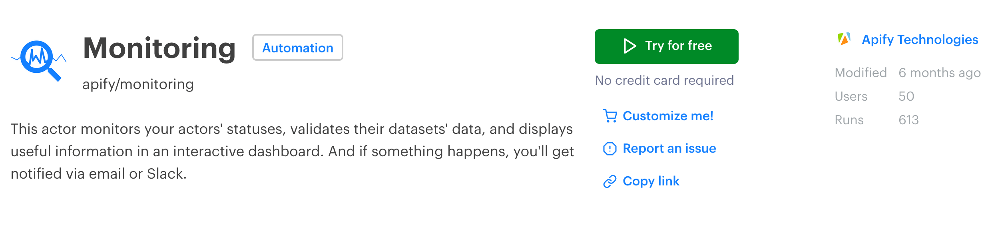
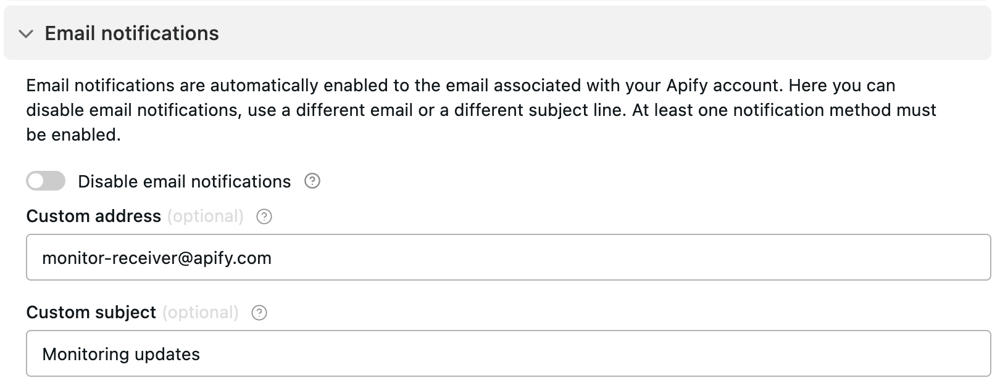
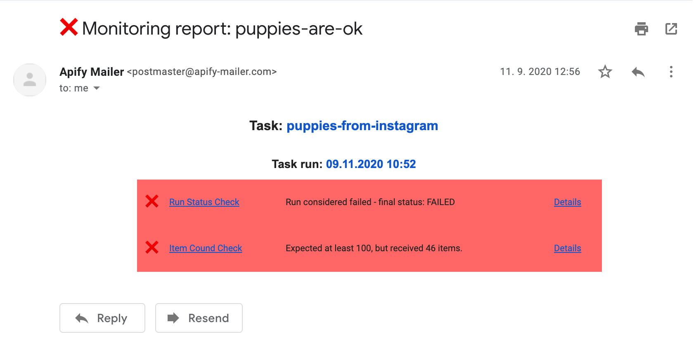

# What is monitoring? {#what-is-monitoring}

**Learn how to check the performance of your actors, tasks and storages. Validate your data and receive notifications when your jobs succeed or fail.**

---

Monitoring allows you to track and observe how software works. It enables you to measure and compare your programs' performance over time, and to be notified when something goes wrong.

You can use data you gain from monitoring to optimize your software and maximize its potential.

## What can I gain from monitoring? {#what-can-i-gain-from-monitoring}

In essence, monitoring gives you more time. It allows you to automate processes that are complicated or tedious if you have to do them manually.

If you are [scraping your competitor's website](https://www.youtube.com/watch?v=BsidLZKdYWQ) every day, you have already automated a part of the process. With monitoring, you can save even more time and ensure all your results are usable even before you need them.

And if the scraping job fails, you will receive a notification, so there will be no unpleasant surprises.

## What is the Apify monitoring suite? {#what-is-the-apify-monitoring-suite}

The [monitoring suite](https://apify.com/apify/monitoring) is a collection of [Apify actors](../actors/index.md) that allows you to automate the monitoring of jobs you have running on the [Apify platform](https://apify.com).

You can use it to monitor anything from a single actor to complex projects spanning multiple actors, [tasks](../actors/tasks.md) or [storages](../storage/index.md).

## How does it work? {#how-does-it-work}

The monitoring suite is made up of a system of actors: **checkers** and **reporters**. Based on your configuration, the suite will create [schedules](../schedules.md) and [webhooks](../integrations/webhooks/index.md) under your account and use those to run these actors.

As the names suggest, the checkers make sure your data is up to standard. Reporters create visualizations of how your actors perform over time and send [notifications](#notifications) about failed runs.

## How much does it cost? {#how-much-does-it-cost}

You can use the monitoring suite **free of charge**, but under the hood, it is a system of actors that consume [compute units](https://help.apify.com/en/articles/3490384-what-is-a-compute-unit) (CUs). We have tried our best to make it as efficient as possible.

* Medium projects (single monitoring configuration with 5-20 daily running monitored tasks or actors) should consume around **10 CUs per month**.
* Bigger projects (more monitoring configurations with more than 20 daily running tasks or actors) can exceed **50 CUs+ per month**.

## How can I set up monitoring? {#how-can-i-set-up-monitoring}

We currently have video tutorials for setting up monitoring and adding data validation.

* [Set up monitoring](https://www.youtube.com/watch?v=bLVk5dkFA7Y).

* [Add data validation](https://www.youtube.com/watch?v=Yha8X4cLtw8).

We also have written tutorials for the following use cases.

* [Monitor actor or task runs for failure](./actor_or_task_run_failure.md)

* [Checking product-based data for correct format and duplicates](./check_data_quality.md)

* [Monitoring shared datasets](./monitor_shared_datasets.md)

* [Monitoring multiple actors or tasks](./monitor_multiple_tasks.md)

## How do I turn it off or make changes? {#how-do-i-turn-it-off-or-make-changes}

To turn off a monitoring task, simply run it with the **Mode** (in the task's **Input** section) set to **Delete configuration**. It will clean up all its resources and turn off all monitoring activity. You will no longer receive [notifications](#notifications).

To make any changes to an existing configuration, choose the **Update configuration** mode in the task's **Input**, make your changes and run the monitoring suite task again.

### Add the monitoring suite to your account {#add-the-monitoring-suite-to-your-account}

On the monitoring suite's [page](https://apify.com/apify/monitoring) in [Apify Store](https://apify.com/store), click the **Try for free** button. This will take you to the [Apify Console](https://console.apify.com), add the suite to your [list of actors](https://console.apify.com/actors) and create a new [task](../actors/tasks.md).

## Notifications {#notifications}

The suite will send notifications to the [email address associated with your account](https://console.apify.com/account) by default.

You can disable email notifications or change the email address in a task **Input**'s **Email notifications** section.

If you use [Slack](https://slack.com/), we suggest using Slack notifications instead of email. More details and setup instructions [here](https://apify.com/apify/monitoring#notifications).

### Example of a failed run {#example-of-a-failed-run}

Below is an example of an email notification for a task run that did not return enough results.

To see what went wrong, click on the **time** next to **Actor run** to open your task's **Runs** dashboard. When you click on **Details**, you'll find a detailed monitoring report in JSON format.
