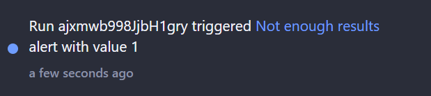

# What is monitoring? {#what-is-monitoring}

**Learn how to check the performance of your actors and tasks. Receive notifications when your jobs or their metrics are not as you expect.**

---

Monitoring allows you to track and observe how the software works. It enables you to measure and compare your programs' performance over time and to be notified when something goes wrong.

You can use the data you gain from monitoring to optimize your software and maximize its potential.

## What can I gain from monitoring? {#what-can-i-gain-from-monitoring}

In essence, monitoring gives you more time. It allows you to automate processes that are complicated or tedious if you have to do them manually.

If you are [scraping your competitor's website](https://www.youtube.com/watch?v=BsidLZKdYWQ) every day, you have already automated a part of the process. With monitoring, you can save even more time and ensure all of your solutions are running as you expect.

And if your solutions are not working as expected, you will receive a notification, so there will be no unpleasant surprises.

## What should I monitor when scraping? {#what-should-i-monitor}

There are many metrics you might want to monitor when you are scraping the web. Here are some examples:

1. The number of results returned by your solution. This is useful if you are scraping a list of products, for example. You can set up an alert to notify you if the number of results is lower than expected. Which indicates that something changed on the website you are scraping.
2. Duration of the run. If your solution is taking longer than usual to finish, you can set up an alert to notify you, this will help you prevent your solution from being stuck and from wasting resources.
3. Proxy usage. Seeing how your solution is using proxy and if there are any changes can help you optimize your usage and prevent increased costs if your solution starts behaving differently than you expect.

These are just a few examples of what you can monitor, there are many other things you might want to monitor when scraping and Apify Console can help you with that.

## What can Apify monitoring do for you? {#what-can-apify-monitoring-do}

The monitoring is a view that you can find on any actor or saved Task in the Apify Console. It allows you to display metric statistics about runs of your solution and set up alerts for when your solution behaves differently than you expect.

Currently, the monitoring view offers the following features:

1. Chart showing statuses of runs of the actor or saved task over last 30 days.

2. Chart displaying metrics of the last 200 runs of the actor or saved task.

3. Option to set up alerts with notifications based on the run metrics.

Both charts can also be added to your Apify Console home page so that you can quickly see if there are any issues every time you open the Apify Console.

## How much does it cost? {#how-much-does-it-cost}

The monitoring system is free for all users. You can use it to monitor as many actors and tasks as you want and it does not use any additional resources on top of your usage when running them.

## How do the alerts work? {#how-do-the-alerts-work}

When you set up an alert you have two choices of how you want the metrics to be evaluated. And depending on your choices the alerting system will behave differently:

1. **Alert, when the metric is lower than** - This type of alert is checked after the run finishes. If the metric is lower than the value you set, the alert will be triggered and you will receive a notification.

2. **Alert, when the metric is higher than** - This type of alert is checked both during the run, and after the run finishes. During the run we are doing periodic checks (approximately every 5 minutes) so that we can notify you as soon as possible if the metric is higher than the value you set. After the run finishes we are doing a final check to make sure that the metric did not change over the limit in the last few minutes of the run.

## How can I get notified? {#how-can-i-get-notified}

You can get notified by email, Slack, or in the Apify Console. If you use Slack, we suggest using Slack notifications instead of email, because they are more reliable and you can also get notified quicker.

1. **Email** - You can set up one or more emails to receive alert notifications, to do that you just have to separate them by commas. You can also disable email notifications if you don't want to receive them.
2. **Slack** - To set up Slack notifications you first need to connect your Slack workspace to Apify. To do that, go to your [account integration settings](https://console.apify.com/account/integrations) and click on the **+ Add workspace** button in the Slack section. Once you have your workspace connected, you can choose the workspace when setting up alert notifications and then pick a channel where you want the notifications to be delivered to.
3. **In app** - You can also get notified in the Apify Console. This is useful if you are using if you are accessing the Apify Console often and you do not need to be notified as soon as possible.

## What do the alert notifications look like? {#how-do-the-alert-notifications-look-like}

The email and Slack alert notifications both contain the same information. You will receive a notification with the following information:

1. **Alert name**
2. **Value** - The value of the metric when the alert was triggered.
3. **Run ID** - The ID of the run that triggered the alert which links directly to the run detail in Apify Console.
4. **Actor** - The full name of the actor that triggered the alert which links to the actor detail in Apify Console.
5. **Task** - If the monitoring alert was set up for a task, then this field will contain the name of the task which links to the task detail in Apify Console.

Both notification types also contain action buttons to quickly access the run which caused the alert and to open the configuration of the alert, in case it's misconfigured.

While the in app notification will contain less information, it will point you directly to the actor or task that triggered the alert:

## Other monitoring solutions? {#other-monitoring-solutions}

For more complex monitoring you can use the [monitoring suite](https://apify.com/apify/monitoring) which is a collection of [Apify actors](../actors/index.md) that allows you to automate the monitoring of jobs you have running on the [Apify platform](https://apify.com). Compared to the monitoring in the Apify Console, the monitoring suite offers some features that are not available in the Apify Console, such as:

1. Schema validation of the output
2. Duplicates check in the output
3. Dashboards with data grouping
4. Running the monitoring daily/weekly/monthly instead of after every run

But be warned that this solution is more complex and requires more time to set up. Also, it uses schedules, actors, tasks, and webhooks, so using it will increase your overall usage on the Apify platform.
