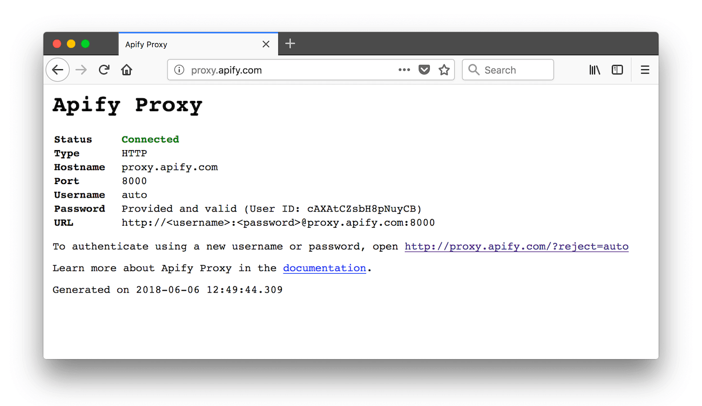

# Connection settings

**Learn how to connect your application to Apify Proxy. See the required parameters such as the correct username and password.**

---

Below are the HTTP proxy connection settings for Apify Proxy.

| Parameter           | Value / explanation                                                                                                                                                                                                                                                                                                                                        |
|---------------------|------------------------------------------------------------------------------------------------------------------------------------------------------------------------------------------------------------------------------------------------------------------------------------------------------------------------------------------------------------|
| Proxy type          | `HTTP`                                                                                                                                                                                                                                                                                                                                                     |
| Hostname            | `proxy.apify.com`                                                                                                                                                                                                                                                                                                                                          |
| Port                | `8000`                                                                                                                                                                                                                                                                                                                                                     |
| Username            | Specifies the proxy parameters such as groups, [session](./index.md) and location. <br/>See [username parameters](#username-parameters) below for details. <br/>**Note**: this is not your Apify username.                                                                                                                                |
| Password            | Proxy password. Your password is displayed on the [Proxy](https://console.apify.com/proxy) page in the Apify Console. <br/>In Apify [actors](../actors/index.md), it is passed as the `APIFY_PROXY_PASSWORD` <br/>environment variable.<br/>See the [environment variables docs](../actors/development/environment_variables.md) for more details. |
| Connection URL      | `http://<username>:<password>@proxy.apify.com:8000`                                                                                                                                                                                                                                                                                                        |
| Static IP Addresses | `18.208.102.16`, `35.171.134.41` Static IP addresses, <br/>that can be used as alternatives to `Hostname`.                                                                                                                                                                                                                                                 |


**WARNING:** All usage of Apify Proxy with your password is charged towards your account. Do not share the password with untrusted parties or use it from insecure networks – **the password is sent unencrypted** due to the HTTP protocol's [limitations](https://www.guru99.com/difference-http-vs-https.html).

## Username parameters

The `username` field enables you to pass parameters like **[groups](#proxy-groups)**, **[session](./index.md) ID** and **country** for your proxy connection.

For example, if you're using [datacenter proxies](./datacenter_proxy.md) and want to use the `new_job_123` session using the `SHADER` group, the username will be:

```text
groups-SHADER,session-new_job_123
```

The table below describes the available parameters.

<table class="table table-bordered table-condensed">
    <tbody>
    <tr>
        <th><code>groups</code></th>
        <td>
            Set proxied requests to use servers from the selected groups.
            <br/>Set to <code>groups-[group name]</code> or <code>auto</code> when using datacenter proxies.
            <br/>Set to <code>groups-RESIDENTIAL</code> when using residential proxies.
            <br/>Set to <code>groups-GOOGLE_SERP</code> when using Google SERP proxies.
        </td>
    </tr>
    <tr>
        <th><code>session</code></th>
        <td>
            If specified, all proxied requests with the same session identifier are routed
            <br/>through the same IP address. For example <code>session-new_job_123</code>.
            <br /><strong>This parameter is optional</strong>. By default, each proxied request
            is assigned a
            <br/>randomly picked least used IP address.
            <br /><strong>The session string can only contain numbers (0-9), letters (a-z or A-Z),
            dot (.),
            <br/>underscore (_), a tilde (~). The maximum length is 50 characters.</strong>
        </td>
    </tr>
    <tr>
        <th><code>country</code></th>
        <td>
            If specified, all proxied requests will use proxy servers from a selected country.
             <br/>Note that if there are no proxy servers
            <br/>from the specified country, the connection will fail.
             <br/>For example <code>groups-SHADER,country-US</code> uses proxies
             <br/> from the <code>SHADER</code> group located in the USA.
            <br /><strong>This parameter is optional</strong>.
            By default, the proxy uses all available
            <br/>proxy servers from all countries.
        </td>
    </tr>
    </tbody>
</table>

If you want to specify one parameter and not the others, just provide that parameter and omit the others. To use the default behavior (not specifying either `groups`, `session`, or `country`), set the username to **auto**. **auto** serves as a placeholder because the username can't be empty.

To learn more about [sessions](./index.md#sessions) and [IP address rotation](./index.md#ip-address-rotation), see the [proxy overview page](./index.md).

## Code examples

We have code examples for connecting to our proxy using the [Apify SDK](/sdk/js) and [Crawlee](https://crawlee.dev/) and other JavaScript libraries (**axios** and **got-scraping**), as well as examples in Python and PHP.

### Datacenter proxy

### Residential proxy

### Google SERP proxy

* [Datacenter proxy](./datacenter_proxy.md)
* [Residential proxy](./residential_proxy.md)
* [Google SERP proxy](./google_serp_proxy.md)

## Proxy groups

You can see which proxy groups you have access to on the [Proxy page](https://console.apify.com/proxy) in the Apify Console.

To use a specific proxy group (or multiple groups), specify it in the `username` parameter.

## Troubleshooting

To view your connection status to [Apify Proxy](https://apify.com/proxy), open the URL below in the browser using the proxy:

[http://proxy.apify.com/](http://proxy.apify.com/)

If the proxy connection is working, the page should look something like this:



To test that your requests are proxied and IP addresses are being [rotated](/academy/anti-scraping/techniques) correctly, open the following API endpoint via the proxy. It shows information about the client IP address.

[https://api.apify.com/v2/browser-info/](https://api.apify.com/v2/browser-info/)

### A different approach to `502 Bad Gateway`

There are times when the `502` status code is not comprehensive enough. Therefore, we have modified our server with `590-599` codes instead to provide more insight.

* `590 Non Successful`: upstream responded with non-200 status code.

* `591 RESERVED`: *this status code is reserved for further use.*

* `592 Status Code Out Of Range`: upstream responded with status code different than 100-999.

* `593 Not Found`: DNS lookup failed - [`EAI_NODATA`](https://github.com/libuv/libuv/blob/cdbba74d7a756587a696fb3545051f9a525b85ac/include/uv.h#L82) or [`EAI_NONAME`](https://github.com/libuv/libuv/blob/cdbba74d7a756587a696fb3545051f9a525b85ac/include/uv.h#L83).

* `594 Connection Refused`: upstream refused connection.

* `595 Connection Reset`: connection reset due to loss of connection or timeout.

* `596 Broken Pipe`: trying to write on a closed socket.

* `597 Auth Failed`: incorrect upstream credentials.

* `598 RESERVED`: *this status code is reserved for further use.*

* `599 Upstream Error`: generic upstream error.

`590` and `592` indicate an issue on the upstream side.<br/>
`593` indicates an incorrect `proxy-chain` configuration.<br/>
`594`, `595` and `596` may occur due to connection loss.<br/>
`597` indicates incorrect upstream credentials.<br/>
`599` is a generic error, where the above is not applicable.
