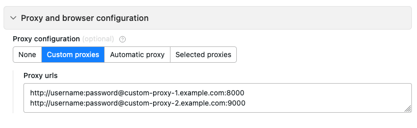

# Using your own proxies

In addition to our proxies, you can use your own both in Apify Console and SDK.

## Custom proxies in console {#console}

To use your own proxies with Apify Console, in your actor's **Input and options** tab, scroll down and open the **Proxy and browser configuration** section. Enter your proxy URLs, and you're good to go.

## Custom proxies in SDK {#SDK}

In the Apify SDK, use the `proxyConfiguration.newUrl(sessionId)` command to add your custom proxy URLs to the proxy configuration. See the [SDK docs](/sdk/js/api/apify/class/ProxyConfiguration#newUrl) for more details.
