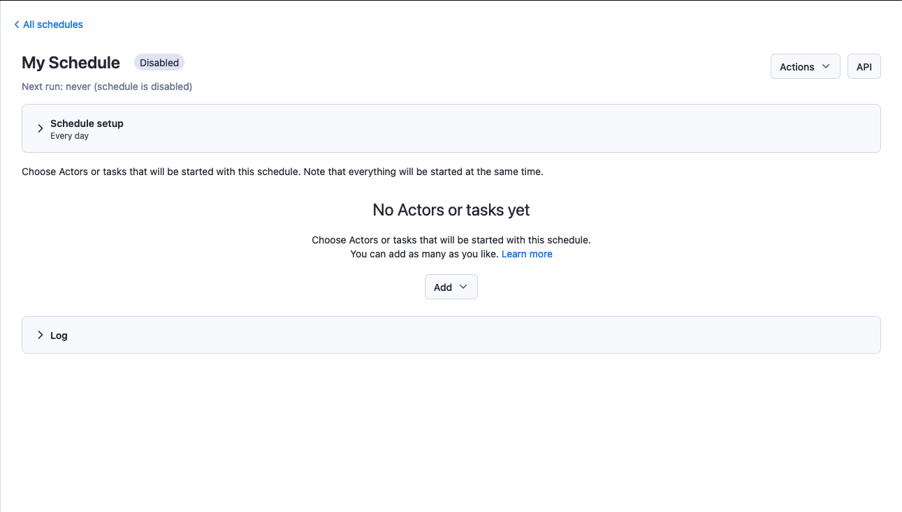
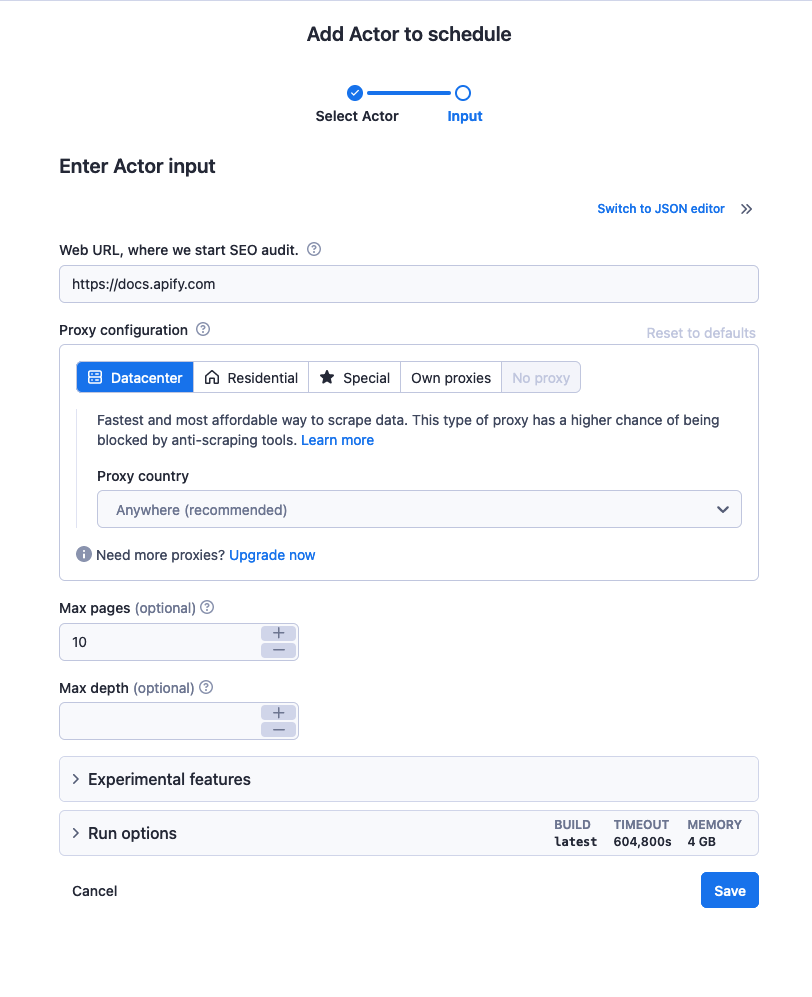
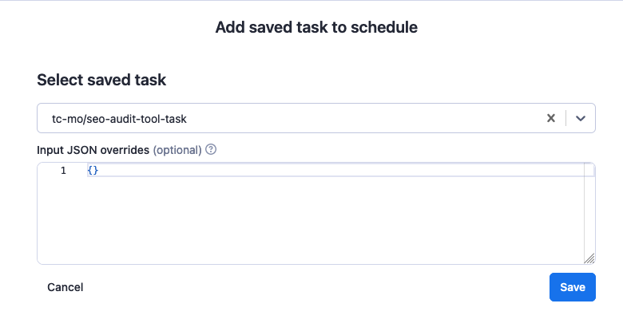
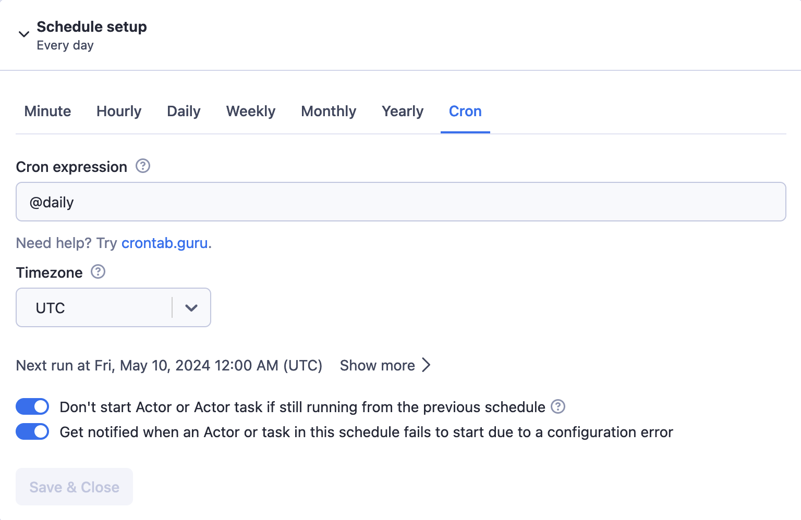
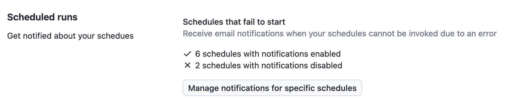

**Learn how to automatically start your Actor and task runs and the basics of cron expressions. Set up and manage your schedules from Apify Console or via API.**

---

Schedules allow you to run your Actors and tasks at specific times. You schedule the run frequency using [cron expressions](#cron-expressions).

:::note Timezone & Daylight Savings Time
Schedules allow timezone settings and support daylight saving time shifts (DST).
:::

You can set up and manage your Schedules using:

* [Apify Console](https://console.apify.com/schedules)
* [Apify API](https://docs.apify.com/api/v2#/reference/schedules)
* [JavaScript API client](https://docs.apify.com/api/client/js/reference/class/ScheduleClient)
* [Python API client](https://docs.apify.com/api/client/python/reference/class/ScheduleClient)

When scheduling a new Actor or task run, you can override its input settings using a JSON object similarly to when invoking an Actor or task using the [Apify REST API](/api/v2#/reference/schedules/).

:::note Events Startup Variability
In most cases, scheduled events are fired within one second of their scheduled time. <br/>
However, runs can be delayed because of a system overload or a server shutting down.
:::

Each schedule can be associated with a maximum of _10_ Actors and _10_ Actor tasks.

## Setting up a new schedule

Before setting up a new schedule, you should have the [Actor](./actors/index.mdx) or [task](./actors/running/tasks.md) you want to schedule prepared and tested.

To schedule an Actor, you need to have run it at least once before. To run the Actor, navigate to the Actor's page through [Apify Console](https://console.apify.com/store), where you can configure and initiate the Actor's run with your preferred settings by clicking the **Start** button. After this initial run, you can then use Schedules to automate future runs.

:::info Name Length
Your schedule's name should be 3–63 characters long.
:::

### Apify Console

In [Apify Console](https://console.apify.com/schedules), click on the **Schedules** in the navigation menu, then click the **Create new** button.

Click on the name (by default it is **My Schedule**), there you can change its name, add a description, as well as check its _Unique name_ or _ID_.

You can adjust how often your Actor or task runs using the [schedule setup tool](#schedule-setup). You can find it by clicking on the **Schedule setup** card.



Next, you'll need to give the schedule something to run. This is where the Actor or task you prepared earlier comes in. Click on the **Add** dropdown and select whether you want to schedule an Actor or task.

If you're scheduling an Actor run, you'll be able to specify the Actor's [input](./actors/running/input_and_output.md) and running options like [build](./actors/development/builds_and_runs/builds.md), timeout, [memory](./actors/running/usage_and_resources.md).
The **timeout** value is specified in seconds; a value of _0_ means there is no timeout, and the Actor runs until it finishes.

 If you don't provide an input, then the Actor's default input is used. If you provide an input with some fields missing, the missing fields are filled in with values from the default input. If input options are not provided, the default options values are used.



If you're scheduling a task, just select the task you prepared earlier using the drop-down. If you need to override the task's input, you can pass it as a JSON object in the **Input JSON overrides** field.



To add more Actors or tasks, just repeat the process.

Now, all you need to do is click **Save & activate** and let the scheduler take care of running your jobs on time.

For integrations, you can also add a [webhook](/platform/integrations/webhooks) to your tasks, which will notify you (or perform an action of your choice) every time the task runs.

### Apify API

To create a new [schedule](/api/v2#/reference/schedules) using the Apify API, send a `POST` request to the [create schedule](/api/v2#/reference/schedules/schedules-collection/create-schedule) endpoint.

You can find your [secret API token](./integrations/index.mdx) under the [Integrations](https://console.apify.com/account?tab=integrations) tab of your Apify account settings.

:::caution API authentication recommendations
When providing your API authentication token, we recommend using the request's `Authorization` header, rather than the URL ([more info](/api/v2#/introduction/authentication)).
:::

In the `POST` request's payload should be a JSON object specifying the schedule's name, your [user ID](https://console.apify.com/account#/integrations), and the schedule's _actions_.

The following JSON object creates a schedule which runs an SEO audit of the Apify domain once a month.

```json
{
    "name": "apify-domain-monthly-seo-audit",
    "userId": "7AxwNO4kCDZxsMHip",
    "isEnabled": true,
    "isExclusive": true,
    "cronExpression": "@monthly",
    "timezone": "UTC",
    "description": "A monthly audit of the Apify domain's SEO",
    "actions": [
        {
            "type": "RUN_ACTOR_TASK",
            "actorTaskId": "6rHoK2zjYJkmYhSug",
            "input": {
                "startUrl": "https://apify.com"
            }
        }
    ]
}
```

If the request is successful, you will receive a `201` [HTTP response code](https://developer.mozilla.org/en-US/docs/Web/HTTP/Status) and a JSON object in the response body containing the details of your new schedule. If you receive an error (`4**` code), you will need to check your API token, user ID, or `POST` request body.

You can add multiple Actor and task runs to a schedule with a single `POST` request. Simply add another object with the run's details to the **actions** array in your `POST` request's payload object.

For more information, refer to the [schedules](/api/v2#/reference/schedules/schedule-object/get-schedule) section in our API documentation.

## Schedule setup

The schedule setup tool uses [cron expressions](https://en.wikipedia.org/wiki/Cron#CRON_expression) to specify run times. If you're familiar with how to use them and need a specific run schedule, you can dive right in. If not, don't worry - the setup tool has a visual custom schedule builder that provides a similar level of control as cron expressions, though it's not quite as powerful.



The **Next runs** section shows when the next run will be, if you click on **Show more** button it will expand and show you the next five runs. You can use this live feedback to experiment until you find the correct configuration.

You can find more information and examples of cron expressions on [crontab.guru](https://crontab.guru/). For additional and non-standard characters, see [this](https://en.wikipedia.org/wiki/Cron#CRON_expression) Wikipedia article.

### Notifications

The schedule setup tool allows you to control the schedule's notifications. All schedules have notifications enabled by default. When one of the scheduled Actors or tasks fails to start due to being configured incorrectly, you will receive an email notification.

If you want to manage the notifications for your schedules in bulk, you can do this from the [Notifications](https://console.apify.com/settings/notifications) settings tab. As long as you have 15 schedules or less, you can manage their notifications all at once by clicking the **Manage notifications for specific schedules** button.



## Cron expressions

A cron expression has the following structure:

| Position | Field        | Values                         | Wildcards | Optional |
|:---------|:-------------|:-------------------------------|:----------|:---------|
| 1        | second       | 0 - 59                         | , - * /   | yes      |
| 2        | minute       | 0 - 59                         | , - * /   | no       |
| 3        | hour         | 0 - 23                         | , - * /   | no       |
| 4        | day of month | 1 - 31                         | , - * /   | no       |
| 5        | month        | 1 - 12                         | , - * /   | no       |
| 6        | day of week  | 0 - 7 <br/> (0 or 7 is Sunday) | , - * /   | no       |

For example, the expression `30 5 16 * * 1` will start an Actor at 16:05:30 every Monday.

The minimum interval between runs is 10 seconds; if your next run is scheduled sooner than 10 seconds after the previous run, the next run will be skipped.

### Examples of cron expressions

* `0 8 * * *`  -  every day at 8 AM.
* `0 0 * * 0` - every 7 days (at 00:00 on Sunday).
* `*/3 * * * *` - every 3rd minute.
* `0 0 1 */2 *` - every other month (at 00:00 on the first day of month, every 2nd month).

Additionally, you can use the following shortcut expressions:

* `@yearly` = `0 0 1 1 *` - once a year, on Jan 1st at midnight.
* `@monthly` = `0 0 1 * *` - once a month, on the 1st at midnight.
* `@weekly` = `0 0 * * 0` - once a week, on Sunday at midnight.
* `@daily` = `0 0 * * *` - run once a day, at midnight.
* `@hourly` = `0 * * * *` - on the hour, every hour.
