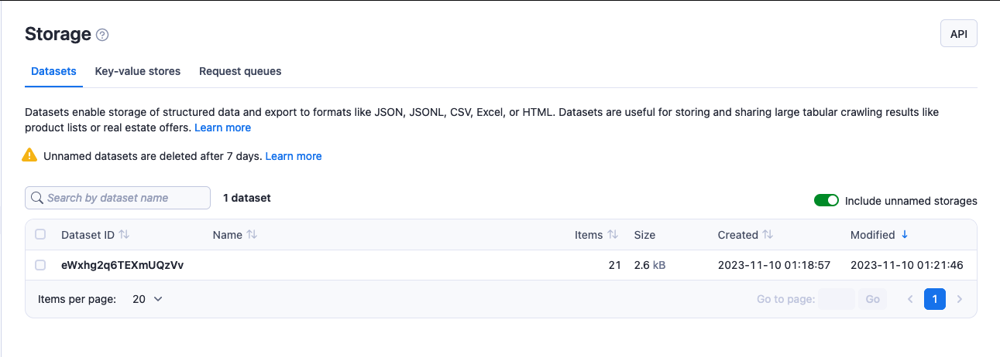
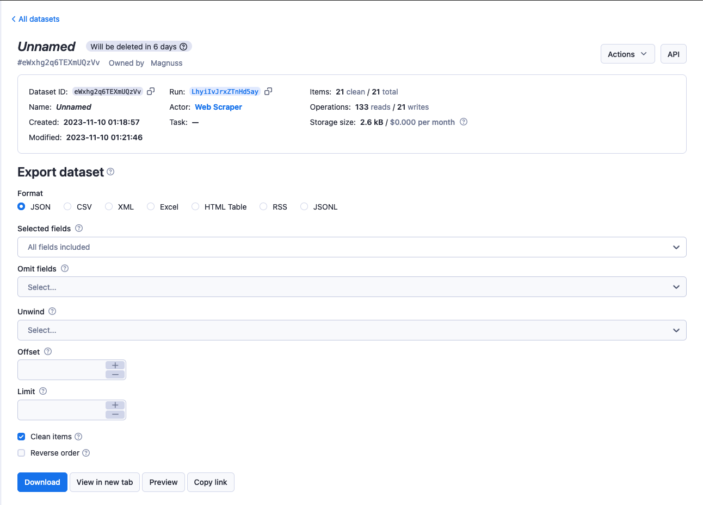

# Dataset {#dataset}

**Store and export web scraping, crawling or data processing job results. Learn how to access and manage datasets in Apify Console or via API.**

---

Dataset storage enables you to sequentially save and retrieve data. Each actor run is assigned its own dataset, which is created when the first item is stored to it.

Datasets usually contain results from web scraping, crawling or data processing jobs. The data can be visualized as a table where each object is a row and its attributes are the columns. The data can be exported in JSON, CSV, XML, RSS, Excel or HTML formats.

> Named datasets are retained indefinitely. <br/>
> Unnamed datasets expire after 7 days unless otherwise specified. <br/>
> [Learn about named and unnamed datasets.](./index.md)

Dataset storage is **append-only** - data can only be added and cannot be changed or deleted.

## Basic usage {#basic-usage}

There are five ways to access your datasets:

* [Apify Console](https://console.apify.com/storage?tab=datasets) - provides an easy-to-understand interface [[details](#apify-console)].
* [Apify SDK](/sdk/js/docs/guides/result-storage#dataset) - when building your own Apify actor [[details](#apify-sdk)].
* [JavaScript API client](/api/client/js/reference/class/DatasetClient) - to access your datasets from any Node.js application [[details](#javascript-api-client)].
* [Python API client](/api/client/python/reference/class/DatasetClient) - to access your datasets from any Python application [[details](#python-api-client)].
* [Apify API](/api/v2#/reference/datasets) - for accessing your datasets programmatically [[details](#apify-api)].

### Apify Console {#apify-console}

In [Apify Console](https://console.apify.com), you can view your datasets in the [Storage](https://console.apify.com/storage) section under the [Datasets](https://console.apify.com/storage?tab=datasets) tab.

Only named datasets are displayed by default. Select the **Include unnamed datasets** checkbox to display all of your datasets.



To view or download a dataset in the above-mentioned formats, click on its **Dataset ID**. Under the **Settings** tab, you can update the dataset's name (and, in turn, its [retention period](./index.md)) and
[access rights](../access_rights/index.md). Click on the `API` button to view and test the dataset's [API endpoints](/api/v2#/reference/datasets).



### Apify SDK {#apify-sdk}

If you are building an [Apify actor](../actors/index.md), you will be using the [Apify SDK](/sdk/js).
In the [Apify SDK](/sdk/js/docs/guides/result-storage#dataset), the dataset is represented by the
[`Dataset`](/sdk/js/api/apify/class/Dataset) class.

You can use the `Dataset` class to specify whether your data is stored locally or in the Apify cloud, push data to datasets of your choice using the [`pushData()`](/sdk/js/api/apify/class/Dataset#pushData) method. You could also use other methods such as [`getData()`](/sdk/js/api/apify/class/Dataset#getData), [`map()`](/sdk/js/api/apify/class/Dataset#map) and [`reduce()`](/sdk/js/api/apify/class/Dataset#reduce), see [example](/sdk/js/docs/examples/map-and-reduce).

If you have chosen to store your dataset locally, you can find it in the location below.

```text
{APIFY_LOCAL_STORAGE_DIR}/datasets/{DATASET_ID}/{INDEX}.json
```

**DATASET_ID** refers to the dataset's **name** or **ID**. The default dataset will be stored in the **default** directory.

To add data to the default dataset, you can use the example below:

```js
// Import the Apify SDK into your project
import { Actor } from 'apify';

await Actor.init();
// ...

// Add one item to the default dataset
await Actor.pushData({ foo: 'bar' });

// Add multiple items to the default dataset
await Actor.pushData([{ foo: 'hotel' }, { foo: 'cafe' }]);

// ...
await Actor.exit();
```

> Make sure to use the `await` keyword when calling `pushData()`, otherwise the actor process might finish before the data are stored.

If you want to use something other than the default dataset, e.g. a dataset that you share between actors or between actor runs, you can use the [Actor.openDataset()](/sdk/js/api/apify/class/Actor#openDataset) method.

```js
import { Actor } from 'apify';

await Actor.init();
// ...

// Save a named dataset to a variable
const dataset = await Actor.openDataset('some-name');

// Add data to the named dataset
await dataset.pushData({ foo: 'bar' });

// ...
await Actor.exit();
```

When using the [`getData()`](/sdk/js/api/apify/class/Dataset#getData) method, you can specify the data you retrieve using the `fields` option. It should be an array of field names (strings) that will be included in the results. To include all the results, exclude the `fields` parameter.

```js
import { Actor } from 'apify';

await Actor.init();
// ...

const dataset = await Actor.openDataset();

// Only get the 'hotel' and 'cafe' fields
const hotelAndCafeData = await dataset.getData({
    fields: ['hotel', 'cafe'],
});

// ...
await Actor.exit();
```

See the [SDK documentation](/sdk/js/docs/guides/result-storage#dataset) and the `Dataset` class's [API reference](/sdk/js/api/apify/class/Dataset) for details on managing datasets with the Apify SDK.

### JavaScript API client {#javascript-api-client}

Apify's [JavaScript API client](/api/client/js/reference/class/DatasetClient) (`apify-client`) allows you to access your datasets from any Node.js application, whether it is running on the Apify platform or elsewhere.

After importing and initiating the client, you can save each dataset to a variable for easier access.

```js
const myDatasetClient = apifyClient.dataset('jane-doe/my-dataset');
```

You can then use that variable to [access the dataset's items and manage it](/api/client/js/reference/class/DatasetClient).

> When using the [`.listItems()`](/api/client/js/reference/class/DatasetClient#listItems) method, if you mention the same field name in the `field` and `omit` parameters, the `omit` parameter will prevail and the field will not be returned.

See the [JavaScript API client documentation](/api/client/js/reference/class/DatasetClient) for [help with setup](/api/client/js/docs) and more details.

### Python API client {#python-api-client}

Apify's [Python API client](/api/client/python/reference/class/DatasetClient) (`apify-client`) allows you to access your datasets from any Python application, whether it is running on the Apify platform or elsewhere.

After importing and initiating the client, you can save each dataset to a variable for easier access.

```python
my_dataset_client = apify_client.dataset('jane-doe/my-dataset')
```

You can then use that variable to [access the dataset's items and manage it](/api/client/python/reference/class/DatasetClient).

> When using the [`.list_items()`](/api/client/python/reference/class/DatasetClient#list_items) method, if you mention the same field name in the `field` and `omit` parameters, the `omit` parameter will prevail and the field will not be returned.

See the [Python API client documentation](/api/client/python/reference/class/DatasetClient) for [help with setup](/api/client/python/docs/quick-start) and more details.

### Apify API {#apify-api}

The [Apify API](/api/v2#/reference/datasets) allows you to access your datasets programmatically using [HTTP requests](https://developer.mozilla.org/en-US/docs/Web/HTTP/Methods) and easily share your crawling results.

If you are accessing your datasets using the **username~store-name** [store ID format](./index.md), you will need to use your [secret API token](../integrations/index.md#api-token). You can find the token (and your user ID) on the [Integrations](https://console.apify.com/account#/integrations) page of your Apify account.

> When providing your API authentication token, we recommend using the request's `Authorization` header, rather than the URL. ([More info](#introduction/authentication)).

To **get a list of your datasets**, send a GET request to the [Get list of datasets](/api/v2#/reference/datasets/get-list-of-datasets) endpoint.

```text
https://api.apify.com/v2/datasets
```

To **get information about a dataset** such as its creation time and **item count**, send a GET request to the [Get dataset](/api/v2#/reference/datasets/dataset/get-dataset) endpoint.

```text
https://api.apify.com/v2/datasets/{DATASET_ID}
```

To **view a dataset's data**, send a GET request to the
[Get dataset items](/api/v2#/reference/datasets/item-collection/get-items) Apify API endpoint.

```text
https://api.apify.com/v2/datasets/{DATASET_ID}/items
```

You can **specify which data are exported** by adding a comma-separated list of fields to the **fields** query parameter. Likewise, you can also omit certain fields using the **omit** parameter.

**If you both specify and omit the same field in a request, the**omit**parameter will prevail and the field will not be returned.**

In addition, you can set the format in which you retrieve the data using the **?format=** parameter. The available formats are **json**, **jsonl**, **csv**, **html**, **xlsx**, **xml** and **rss**. The default value is **json**.

To retrieve the **hotel** and **cafe** fields, you would send your GET request to the URL below.

```text
https://api.apify.com/v2/datasets/{DATASET_ID}/items?format=json&fields=hotel%2Ccafe
```

> Instead of commas, you will need to use the `%2C` code, which represents `,` in URL encoding.<br/>
> Learn more about URL encoding [here](https://www.url-encode-decode.com).

To **add data to a dataset**, send a POST request, with a JSON object containing the data you want to add as the payload to the [Put items](/api/v2#/reference/datasets/item-collection/put-items) endpoint.

```text
https://api.apify.com/v2/datasets/{DATASET_ID}/items
```

> Pushing data to dataset via API is limited to **200** requests per second to prevent our servers from being overloaded.

Example payload:

```json
[
    {
        "foo": "bar"
    },
    {
        "foo": "hotel"
    },
    {
        "foo": "cafe"
    }
]
```

See the [API documentation](/api/v2#/reference/datasets) for a detailed breakdown of each API endpoint.

## Hidden fields {#hidden-fields}

Top-level fields starting with the `#` character are considered hidden.
These fields may be easily omitted when downloading the data from a dataset by providing the **skipHidden=1** or **clean=1** query parameters. This provides a convenient way to store debug information that should not appear in the final dataset.

Below is an example of a dataset record containing hidden fields with an HTTP response and error.

```json
{
    "url": "https://example.com",
    "title": "Example page",
    "data": {
        "foo": "bar"
    },
    "#error": null,
    "#response": {
        "statusCode": 201
    }
}
```

Data without hidden fields are called "clean" and can be downloaded from [Apify Console](https://console.apify.com/storage?tab=datasets) using the "Clean items" link or via API using the **clean=true** or **clean=1** [URL parameters](/api/v2#/reference/datasets/item-collection/get-items).

## XML format extension {#xml-format-extension}

When you export results to XML or RSS formats, object property names become XML tags, while the corresponding values become the tags' children.

For example, the JavaScript object:

```json
{
    name: "Rashida Jones",
    address: [
        {
            type: "home",
            street: "21st",
            city: "Chicago",
        },
        {
            type: "office",
            street: null,
            city: null,
        }
    ]
}
```

becomes the following XML snippet:

```xml
<name>Rashida Jones</name>
<address>
    <type>home</type>
    <street>21st</street>
    <city>Chicago</city>
</address>
<address>
    <type>office</type>
    <street/>
    <city/>
</address>
```

If the JavaScript object contains a property named `@`, its sub-properties are exported as attributes of the parent XML element. If the parent XML element does not have any child elements, its value is taken from a JavaScript object property named `#`.

For example, the following JavaScript object:

```json
{
    "address": [{
        "@": {
            "type": "home",
        },
        "street": "21st",
        "city": "Chicago",
    },
    {
        "@": {
            "type": "office",
        },
        "#": "unknown",
    }]
}
```

will be transformed to the following XML snippet:

```xml
<address type="home">
    <street>21st</street>
    <city>Chicago</city>
</address>
<address type="office">unknown</address>
```

This feature is also useful when customizing your RSS feeds generated for various websites.

By default, the whole result is wrapped in an `<items/>` element, while each page object is contained in an `<item/>` element. You can change this using the `xmlRoot` and `xmlRow` URL parameters when GETting your data.

## Sharing {#sharing}

You can invite other Apify users to view or modify your datasets using the [access rights](../access_rights/index.md) system. See the [full list of permissions](../access_rights/list_of_permissions.md).

### Sharing datasets between runs {#sharing-datasets-between-runs}

You can access a dataset from any [Actor](../actors/index.md) or [task](../actors/running/tasks.md) run as long as you know its **name** or **ID**.

To access a dataset from another run using the Apify SDK, open it using the [`Actor.openDataset(datasetIdOrName)`](/sdk/js/api/apify/class/Actor#openDataset) method like you would do with any other dataset.

```js
const otherDataset = await Actor.openDataset('old-dataset');
```

In the [JavaScript API client](/api/client/js), you can access a dataset using [its client](/api/client/js/reference/class/DatasetClient). Once you've opened the dataset, read its contents and add new data like you would do with a dataset from your current run.

```js
const otherDatasetClient = apifyClient.dataset('jane-doe/old-dataset');
```

Likewise, in the [Python API client](/api/client/python), you can access a dataset using [its client](/api/client/python/reference/class/DatasetClient).

```python
other_dataset_client = apify_client.dataset('jane-doe/old-dataset')
```

The same applies for the [Apify API](#apify-api) - you can use [the same endpoints](#apify-api) as you would normally do.

See the [Storage overview](/platform/storage#sharing-storages-between-runs) for details on sharing storages between runs.

## Limits {#limits}

* Tabulated data storage formats (the ones that display the data in columns), such as HTML, CSV, and EXCEL, have a maximum limit of **3000** columns. All data that do not fit into this limit will not be retrieved.

* When using the `pushData()` method, the size of the data is limited by the receiving API. Therefore, `pushData()` will only allow objects whose JSON representation is smaller than **9MB**. When an array is passed, none of the included objects may be larger than 9MB, however the array itself may be of any size.

* Dataset names can be up to 63 characters long.

### Rate limiting {#rate-limiting}

When pushing data to a dataset via [API](/api/v2#/reference/datasets/item-collection/put-items), the request rate is limited to **200** per second per dataset. This helps protect Apify servers from being overloaded.

All other dataset API [endpoints](/api/v2#/reference/datasets) are limited to **30** requests per second per dataset.

See the [API documentation](/api/v2#/introduction/rate-limiting) for details and to learn what to do if you exceed the rate limit.
