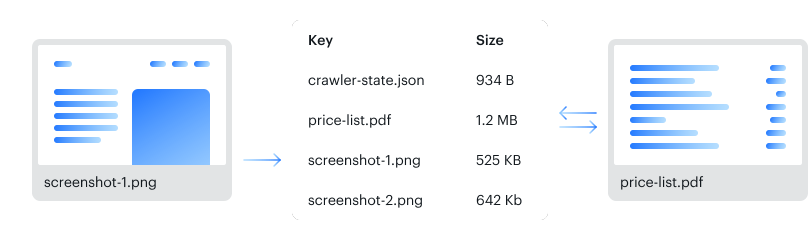
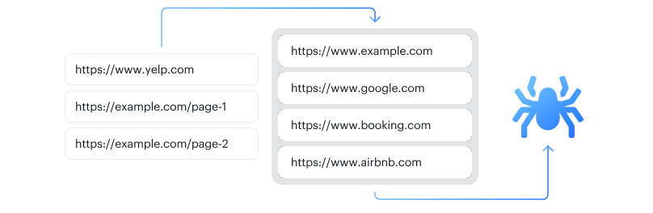
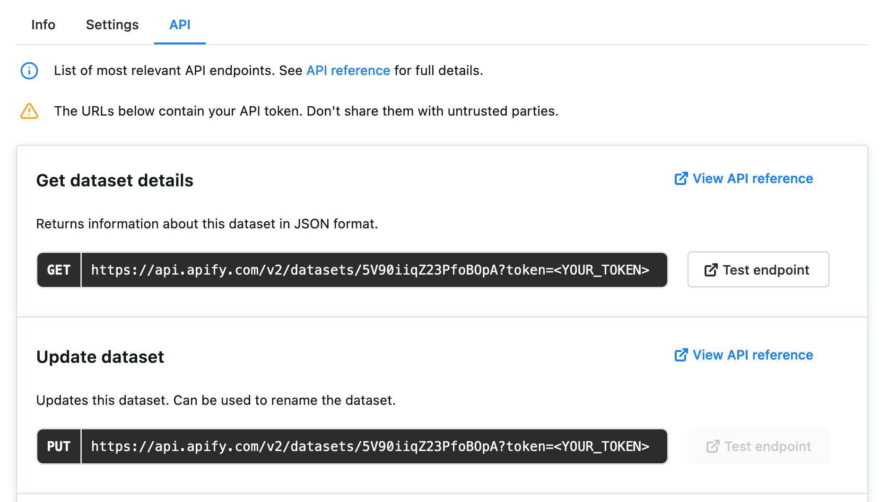
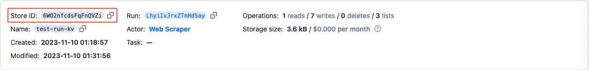

# Storage {#storage}

**Store anything from images and key-value pairs to structured output data. Learn how to access and manage your stored data from the Apify platform or via API.**

---

The Apify platform includes three types of storage you can use both in your [actors](../actors/index.md) and outside the Apify platform via [API](/api/v2#/), the [Apify SDK](/sdk/js) and Apify's [JavaScript API client](/api/client/js) and [Python API client](/api/client/python).

This page contains a brief introduction of the three types of Apify Storage.

* [Dataset](#dataset) - storage for data objects such as scraping output.
* [Key-value store](#key-value-store) - storage for arbitrary data records such as files, images, and strings.
* [Request queue](#request-queue) - a queue of URLs for your actors to visit.

You will then find [basic usage](#basic-usage) information relating to all three types of storage. For example, how to manage your storages in [Apify Console](#apify-console), the basics of setting up the [Apify SDK](#apify-sdk-and-crawlee),
the [JavaScript API client](#javascript-api-client) and the [Python API client](/api/client/python),
and general information for using storages with the [Apify API](#apify-api).

## Dataset {#dataset}

[Dataset](./dataset.md) storage allows you to store a series of data objects such as results from web scraping, crawling or data processing jobs. You can export your datasets in JSON, CSV, XML, RSS, Excel or HTML formats.


The easiest way to access your datasets is via [Apify Console](https://console.apify.com/storage?tab=datasets), which provides a user-friendly interface for viewing or downloading the data and editing your datasets' properties.

To manage your datasets, you can use the
[Apify SDK](/sdk/js/api/apify/class/Dataset),
[JavaScript API client](/api/client/js/reference/class/DatasetClient),
[Python API client](/api/client/python#datasetclient),
or the [Apify API](/api/v2#/reference/datasets).

[See the dataset documentation](./dataset.md) for details.

## Key-value store {#key-value-store}

The [key-value store](./key_value_store.md) is ideal for saving data records such as files, screenshots of web pages, and PDFs or for persisting your actors' state. The records are accessible under a unique name and can be written and read quickly.



The easiest way to access your key-value stores is via
[Apify Console](https://console.apify.com/storage?tab=keyValueStores), which provides a user-friendly interface for viewing or downloading the data and editing your key-value stores' properties.

To manage your key-value stores, you can use the
[Apify SDK](/sdk/js/api/apify/class/KeyValueStore),
[JavaScript API client](/api/client/js/reference/class/KeyValueStoreClient),
[Python API client](/api/client/python/reference/class/KeyValueStoreClient),
or the [Apify API](/api/v2#/reference/key-value-stores).

[See the key-value store documentation](./key_value_store.md) for details.

## Request queue {#request-queue}

[Request queues](./request_queue.md) allow you to dynamically maintain a queue of URLs of web pages. You can use this when recursively crawling websites: you start from initial URLs and add new links as they are found while skipping duplicates.



The easiest way to access your request queues is via
[Apify Console](https://console.apify.com/storage?tab=requestQueues), which provides a user-friendly interface for viewing your request queues and editing your queues' properties.

To manage your request queues, you can use the
[Apify SDK](/sdk/js/api/apify/class/RequestQueue),
[JavaScript API client](/api/client/js/reference/class/RequestQueueClient),
[Python API client](/api/client/python/reference/class/RequestQueueClient),
or the [Apify API](/api/v2#/reference/request-queues).

[See the request queue documentation](./request_queue.md) for details.

## Basic usage {#basic-usage}

There are five ways to access your storage:

* [Apify Console](https://console.apify.com/storage) - provides an easy-to-use interface [[details](#apify-console)].
* Apify SDK - [Request](/sdk/js/docs/guides/request-storage)/[Result](/sdk/js/docs/guides/result-storage) storage - when building your own Apify actor [[details](#apify-sdk-and-crawlee)].
* [JavaScript API client](/api/client/js) - to access your storages from any Node.js application [[details](#javascript-api-client)].
* [Python API client](/api/client/python) - to access your storages from any Python application [[details](#python-api-client)].
* [Apify API](/api/v2#/reference/key-value-stores) - for accessing your storages programmatically [[details](#apify-api)].

### Apify Console {#apify-console}

To access your storages from Apify Console, go to the [**Storage** section](https://console.apify.com/storage) in the left-side menu. From there, you can click through the tabs to view your key-value stores, datasets, request queues and related API endpoints. To view a storage, click its **ID**.


> Only named storages are displayed by default. Select the **Include unnamed store** checkbox to display all of your storages.

You can edit your stores' names by clicking their caption (ID or name) on their detail page.

Under the **Settings** tab of their detail page, you can grant [access rights](../access_rights/index.md) to other Apify users.

You can quickly share your storages' contents and details by sharing the URLs you find under the **API** tab in a store's detail page.



These URLs provide links to API **endpoints**–the places where your data are stored. Endpoints that allow you to **read** stored information do not require an [authentication token](/api/v2#/introduction/authentication). The calls are authenticated using a hard-to-guess ID, so they can be shared freely. Operations such as **update** or **delete**, however, will need the authentication token.

> Never share a URL containing your authentication token, as this will compromise your account's security. <br/>
> If the data you want to share requires a token, first download the data, then share it as a file.

### Apify SDK and Crawlee {#apify-sdk-and-crawlee}

The [Apify SDK](/sdk/js) is a JavaScript/Node.js library providing tools to build your own actors. [Crawlee](https://crawlee.dev/) is a JavaScript/Node.js library which allows you to build your own web scraping and automation solutions (formerly was a part of Apify SDK). Both libraries require [Node.js](https://nodejs.org/en/) 16 or later.

See [Crawlee documentation](https://crawlee.dev/docs/quick-start) for setup instructions and to learn how to build your own crawlers and run them on the [Apify platform](https://crawlee.dev/docs/guides/apify-platform).

### JavaScript API client {#javascript-api-client}

Apify's [JavaScript API client](/api/client/js) (`apify-client`) allows you to access your datasets from any Node.js application, whether it is running on the Apify platform or elsewhere.

See the [client's documentation](/api/client/js/docs) for help with setup.

### Python API client {#python-api-client}

Apify's [Python API client](/api/client/python) (`apify-client`) allows you to access your datasets from any Python application, whether it is running on the Apify platform or elsewhere.

See the [client's documentation](/api/client/python/docs/quick-start) for help with setup.

### Apify API {#apify-api}

The [Apify API](/api/v2#/reference/key-value-stores) allows you to access your storages programmatically using [HTTP requests](https://developer.mozilla.org/en-US/docs/Web/HTTP/Methods) and easily share your crawling results.

In most cases, when accessing your storages via API, you will need to provide a **store ID**, which you can do in the following formats:

* **WkzbQMuFYuamGv3YF** - the store's alphanumerical ID if the store is unnamed.
* **username~store-name** - your username and the store's name separated by a tilde (`~`) character (e.g. **janedoe~ecommerce-scraping-results**) if the store is named.

For read (GET) requests, it is enough to use a store's alphanumerical ID, since the ID is hard to guess and effectively serves as an authentication key.

With other request types and when using the **username~store-name**, however, you will need to provide your secret API token in your request's [`Authorization`](/api/v2#/introduction/authentication) header or as a query parameter. You can find your token on the [Integrations](https://console.apify.com/account?tab=integrations) page of your Apify account.

See the [API documentation](/api/v2#/reference/datasets) for details and a breakdown of each storage API endpoint.

## Rate limiting {#rate-limiting}

All API endpoints limit their rate of requests to protect Apify servers from overloading. The default rate limit is **30** requests per second per storage object, with a few exceptions, which are limited to **200** requests per second per storage object:

* [Push items](/api/v2#/reference/datasets/item-collection/put-items) to dataset.
* CRUD ([add](/api/v2#/reference/request-queues/request-collection/add-request),
[get](/api/v2#/reference/request-queues/request-collection/get-request),
[update](/api/v2#/reference/request-queues/request-collection/update-request),
[delete](/api/v2#/reference/request-queues/request-collection/delete-request))
operations of **request queue** requests.

If a client sends too many requests, the API endpoints respond with the HTTP status code `429 Too Many Requests` and the following body:

```json
{
    "error": {
        "type": "rate-limit-exceeded",
        "message": "You have exceeded the rate limit of ... requests per second"
    }
}
```

See the [API documentation](/api/v2#/introduction/rate-limiting) for details and to learn what to do if you exceed the rate limit.

## Data retention {#data-retention}

Unnamed storages expire after 7 days unless otherwise specified. Named storages are retained indefinitely.

### Preserving your storages {#preserving-storages}

To preserve your storages indefinitely, give them a name. You can do this in Apify Console or using our API. First, you'll need your store's ID. You can find it in the details of the run that created it. In Apify Console, head over to your run's details and select the **Dataset**, **Key-value store**, or **Request queue** tab as appropriate. Check that store's details, and you will find its ID among them.



Then, head over to the **Storage** menu, select the appropriate tab, and tick the **Include unnamed \[storages\]** box. Find and open your storage using the ID you just found, select the Settings tab, and enter its new name in the field. Your storage will now be preserved indefinitely.

To name your storage via API, get its ID from the run that generated it using the [Get run](/api/v2#/reference/actor-runs/run-object-and-its-storages/get-run) endpoint. You can then give it a new name using the **Update \[storage\]** endpoint. For example, [Update dataset](/api/v2#/reference/datasets/dataset/update-dataset).

The [Apify SDK](/sdk/js), [Crawlee](https://crawlee.dev/), the [JavaScript](/api/client/js/) and [Python](/api/client/python/) clients have their own ways of naming storages - check their docs for details.


## Named and unnamed storages {#named-and-unnamed-storages}

The default storages for an actor run are created without a name (with only an **ID**). This allows them to expire after 7 days (on the free plan, longer on paid plans) and not take up your storage space. If you want to preserve a storage, simply [give it a name](#preserving-storages), and it will be retained indefinitely.

> Storages' names can be up to 63 characters long.

Named and unnamed storages are the same in all regards except their retention period. The only difference is that named storages make it easier to verify you are using the correct store.

For example, the storage names **janedoe~my-storage-1** and **janedoe~web-scrape-results** are easier to tell apart than the alphanumerical IDs **cAbcYOfuXemTPwnIB** and **CAbcsuZbp7JHzkw1B**.

## Sharing {#sharing}

You can invite other Apify users to view or modify your storages using the [access rights](../access_rights/index.md) system. See the [full list of permissions](../access_rights/list_of_permissions.md).

### Sharing storages between runs {#sharing-storages-between-runs}

Any storage can be accessed from any [actor](../actors/index.md) or [task](../actors/tasks.md) run as long as you know its **name** or **ID**. You can access and manage storages from other runs using the same methods or endpoints as with storages from your current run.

[Datasets](./dataset.md) and [key-value stores](./key_value_store.md) can be used concurrently by multiple actors. This means that multiple actors or tasks running at the same time can **write** data to a single dataset or key-value store. The same applies for reading data – multiple runs can **read** data from datasets and key-value stores concurrently.

[Request queues](./request_queue.md), on the other hand, only allow multiple runs to **add new data**. A request queue can only be processed by one actor or task run at any one time.

> When multiple runs try to write data to a storage at the same time, it isn't possible to control the order in which the data will be written. It will be written whenever the request is processed. <br/>
> In key-value stores and request queues, the same applies for deleting records: if a request to delete a record is made shortly before a request to read that same record, the second request will fail.

## Deleting storages {#deleting-storages}

Named storages are only removed when you request it. You can delete storages in the following ways.

* [Apify Console](https://console.apify.com/storage) - using the **Actions** button in the store's detail page.
* [Apify SDK](/sdk/js) - using the `.drop()` method of the
  [Dataset](/sdk/js/api/apify/class/Dataset#drop),
  [Key-value store](/sdk/js/api/apify/class/KeyValueStore#drop),
  or [Request queue](/sdk/js/api/apify/class/RequestQueue#drop) class.
* [JavaScript API client](/api/client/js) - using the `.delete()` method in the
[dataset](/api/client/js/reference/class/DatasetClient),
[key-value store](/api/client/js/reference/class/KeyValueStoreClient),
or [request queue](/api/client/js/reference/class/RequestQueueClient) clients.
* [Python API client](/api/client/python) - using the `.delete()` method in the
[dataset](/api/client/python#datasetclient),
[key-value store](/api/client/python/reference/class/KeyValueStoreClient),
or [request queue](/api/client/python/reference/class/RequestQueueClient) clients.
* [API](/api/v2#/reference/key-value-stores/store-object/delete-store) using the - **Delete [store]** endpoint, where **[store]** is the type of storage you want to delete.

